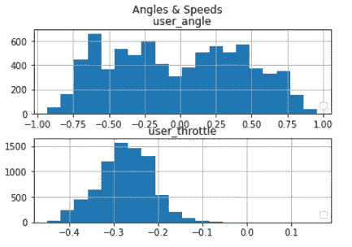
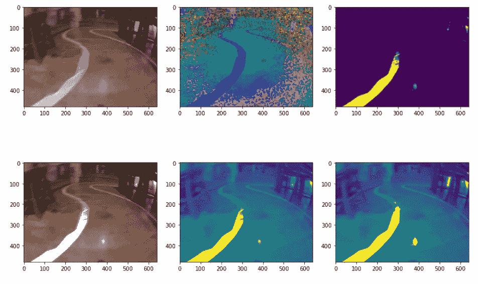
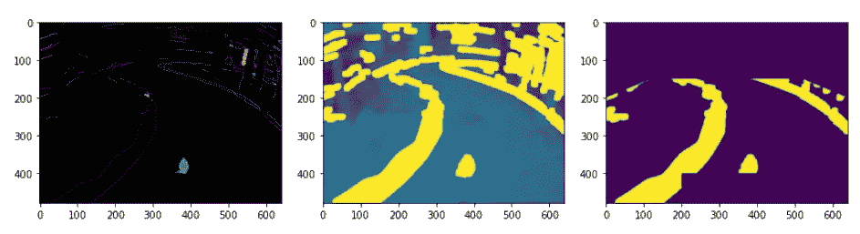
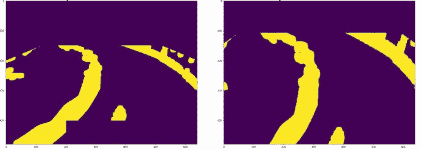
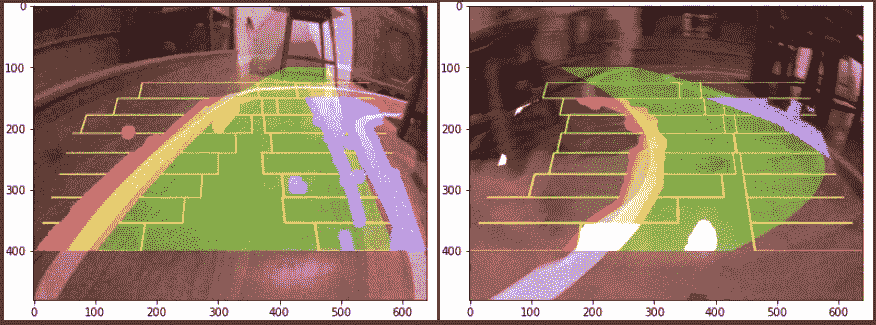
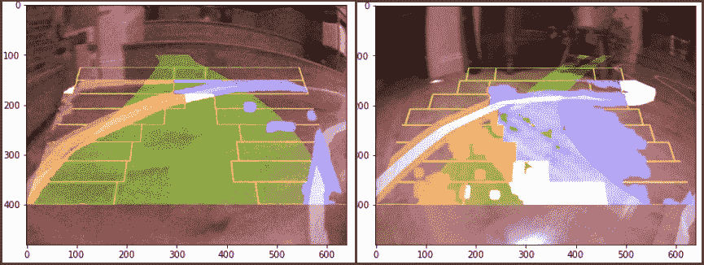
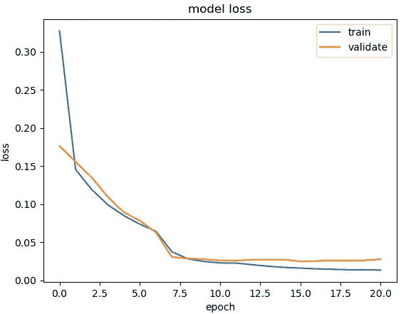

# 我是如何建造一辆自动驾驶模型车的

> 原文：<https://medium.com/geekculture/how-i-built-a-self-driving-model-car-b5277dee57e2?source=collection_archive---------65----------------------->

## 第 3 部分—尝试让它行驶

这个系列以前的文章可以在这里找到。

# 利用 OpenCV 进行图像预处理

我有点失望——我读过的其他博客似乎都是即插即用的。诚然，我在这里有更多的自定义代码，但我认为它应该做得更好。

在对行驶直方图进行一些检查后:

一切似乎都很好，所以我的下一个想法是，在其他视频中，人们有更大的房间和更清晰的道路。我的路是一些遮蔽胶带，贴在反光的木地板上，在一个有很多家具的小空间里。也许模型变得混乱，所以我想一些图像预处理会有所帮助。

## HSV 图像和边缘检测

色调、饱和度、值图像空间对于提取特定颜色是有用的。在我的例子中，我想要道路边缘的白线。OpenCV 为此提供了许多有用的功能，但我的问题是，在我的设置中，有时道路边缘太暗。这是一组图像，我首先转换到 HSV 色彩空间，提取“白色”，模糊它，并掩盖它，使边缘变亮。

不幸的是，它不能提取右侧边缘，但边缘检测可以。在这里，我使用了一个精明的边缘检测器，然后找到轮廓并试图填充任何较小的间隙，然后将感兴趣的区域限制在离汽车更近的道路上:

## 车道寻找

我们可以从中获得更多的乐趣，并尝试找到实际车道的平面区域。我们首先通过使用 *getPerspectiveTransform* 和 *warpPerspective* 函数投影图像来移除透视。

如果我们的道路边缘足够强，我们可以使用图像中沿着靠近汽车的 x 轴的强度直方图来找到每个边缘的起点。然后通过在盒子内探索并向上移动图像，我们可以沿着边缘并在每一行存储中心边缘点。然后可以对每一条曲线进行拟合和填充。

The yellow boxes are the areas where we look for the road edges, starting at the bottom and moving up the image. The red and blue indicate prospective road edges. From these we fit polygons and fill to produce the lane.

一旦我们有了这些，我们就可以采用反向透视，将车道叠加到原始图像上。这有时工作得相当好，但是在这种环境下是脆弱的。

鉴于急转弯，这可能会失败的壮观！

## 用预处理的图像进行训练

我原本认为我可以使用车道搜索来“着色”实际道路，从而为机器学习获得更强的特征，但这不够一致，所以我放弃了它，但保留了图像处理。我通过预处理管道运行所有记录的图像，并保存它们用于训练，这导致了更好的损失。

# 疯狂的

但是车还是开不动！这是我开始认为其他地方出了问题，并着手调试 DonkeyCar 代码的时候。在查看了驱动循环的时间后，我发现推理循环花费了大约 200 毫秒，这对于汽车自动驾驶来说根本不够快。在问了东奇卡话语频道之后，似乎有一个问题[https://github.com/autorope/donkeycar/pull/861](https://github.com/autorope/donkeycar/pull/861)

应用这些变化使推理循环缩短到 25-30 毫秒，汽车能够自动驾驶！

# 下次

在下一篇文章中，我将介绍一种更大更快的汽车，它也有自己的问题！我们将利用 TensorFlow Lite、最大性能模式、RC 控制器，最终得到一辆可以在户外行驶的汽车。