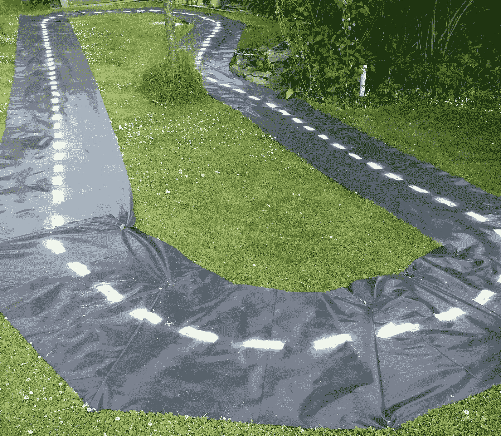
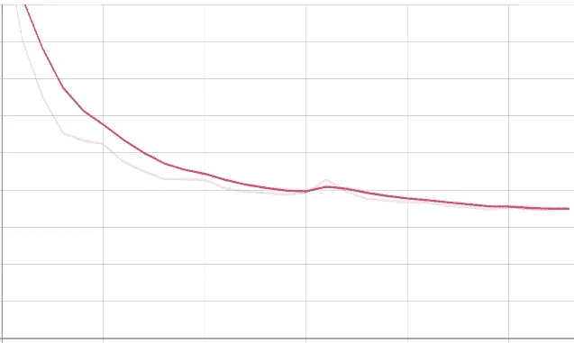
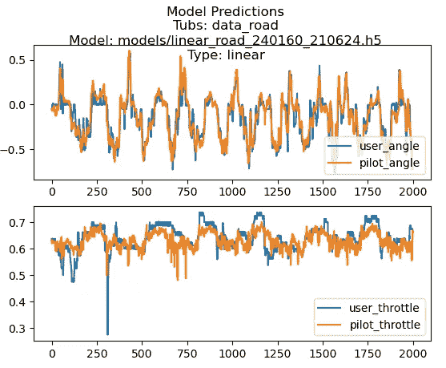

# 我是如何建造一辆自动驾驶模型车的

> 原文：<https://medium.com/geekculture/how-i-built-a-self-driving-model-car-b8cc7566a28b?source=collection_archive---------53----------------------->

## 第 4 部分—更上一层楼。

这个系列以前的文章可以在这里找到。

# 妖怪

终于让我的“测试”车工作了，是时候尝试一些更刺激的东西了。我有一辆 FTX Bugsta，这是一辆速度很快的车——使用 3 号硅脂能达到 37 英里/小时！

我不打算接近那个速度，但是我对在外面工作感兴趣。我的第一次尝试是一场灾难，因为我根本无法用蓝牙控制器控制汽车——范围很糟糕，精确度也很糟糕。我想使用我的 RC 控制器，但不幸的是，Jetson 不能读取 pwm 信号，因此需要 arduino hack 来测量 pwm 并转换它，然后通过 pyserial 和 USB 连接器发送到 Jetson。你可以在这里和阅读更多关于这个[的信息。更简单的解决方案是使用 Raspberry Pi 4，它可以直接做到这一点。](http://blog.rareschool.com/2019/05/five-steps-to-connect-jetson-nano-and.html)

# 第一次尝试

我的渠道是:

1.  使用 Raspberry Pi 4 和 RC 控制器记录训练数据。
2.  用 gpu 把数据传到桌面，学习模型。我尝试了不同的图像分辨率，但最终选择了较小的 160x120，以允许 pi 以足够高的帧速率运行其推理代码。
3.  将模型传输回 Pi，让汽车行驶。

我的第一条室外赛道使用了一些“粉红丝带”，绑在花园的棍子上:

但是可以看到，即使在图像处理和尝试不同的模型后，这也不起作用！我仔细观察了显著性图，这些图显示了神经网络挑选出的图像区域对产生输出信号很重要。我认为没有足够的信息让它学习。它需要一条更好的道路，并且可能使用杰特森进行更快的推断。

# 第二次尝试

我有一卷旧的黑色 dpm 膜，用它和一些帐篷挂钩和一些白色油漆来创建一条“pro road”。不过，我对这种表面的一个问题是它的反射性很强，我在阴天和晴天驾驶汽车都有问题——哑光表面会好得多，可以在更多样的照明条件下驾驶。

训练看起来很好，在将模型转换为 tflite 后，汽车能够自己驾驶。耶！

这是一个线性 CNN 模型的张量板损耗图，该模型由 5 个卷积层和两个具有相同压差的密集层组成，卷积层之间的压差为 0.2。其他参数为:Adam、LR 在平台期降低和早期停止。

在这里，我们可以看到在转向和油门训练数据的前 2000 帧中，橙色的模型预测与我的控制。

尽管我在 raspberry pi ( <10/s) the car was still able to drive itself. Here is the result !

# Behavioural Driving Modes

The last thing I wanted to try was to get the car to change it’s driving behaviour according to some external signal. I decided to go with object recognition which allowed me to do an ‘emergency stop’ if an small teddy bear was detected in the road.

For this it was essential to use the Jetson Nano and I made use of Nvidia’s native TensorRT format for the object recognition module. I made use of this great [博客](https://github.com/jkjung-avt/tensorrt_demos#googlenet)上没有获得很好的帧速率，该博客描述了如何在 Nano 上使用 TensorRT 运行 GoogLeNet。GoogLeNet 是 inception 网络的 22 层变体，使用 ImageNet 1000 类输出场景中识别的对象的预测。然后，我选择了“泰迪”标签来寻找，如果检测到，设置油门为 0。

然后我修改了它，使其作为一个模块在车上运行，我的图像尺寸为 240x160，物体识别大约需要 35 毫秒。将这与 tflite 推理一起运行，使我获得了 67 毫秒或 15 帧/秒的总驾驶循环时间，这使汽车能够检测到泰迪并及时停止！

# 结论

看到一辆模型车独自在你的花园里行驶，避开极其重要的玩具，这绝对是一件很酷的事情！

虽然花了很长时间，但还是很有趣。)做了很多实验和尝试，解决了很多问题，但我对最终结果很满意！

我(再次)认识到，这一切都与数据有关，如果没有高质量的输入，你就不会得到一个令人满意的系统，而且工程(数据或物理)需要时间。

为了更进一步，需要一些哑光漆或无反射路面，以消除道路上的反射。下一步可能是使用其他传感器，如 IMU 以及神经网络中的传感器融合。为了更有冒险精神，我可以尝试视觉里程计，通过使用类似 [DF-VO](https://df-vo.readthedocs.io/en/latest/) 的东西来学习道路的内部表示。这将使汽车知道它在内部地图上的位置，它可以用它来预测所需的转向和油门。

希望你喜欢这个，你可能会发现一些有用的提示，以帮助你建立自己的自动驾驶汽车！