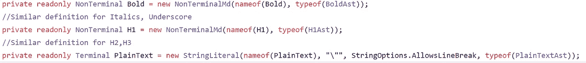
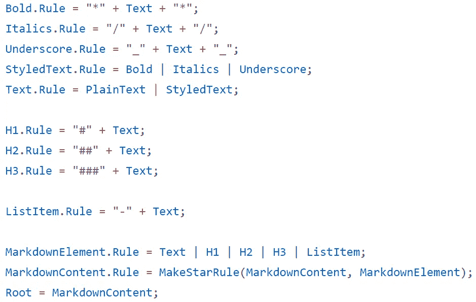
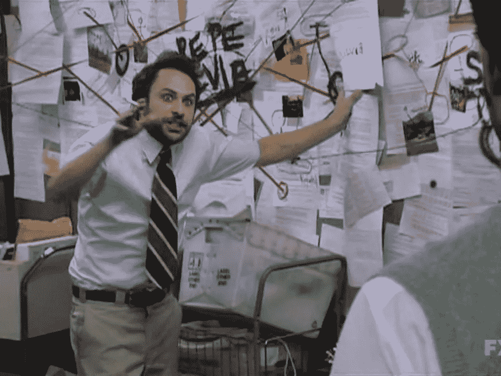
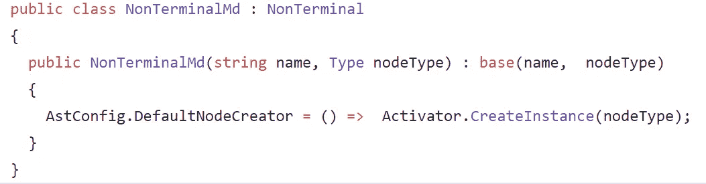
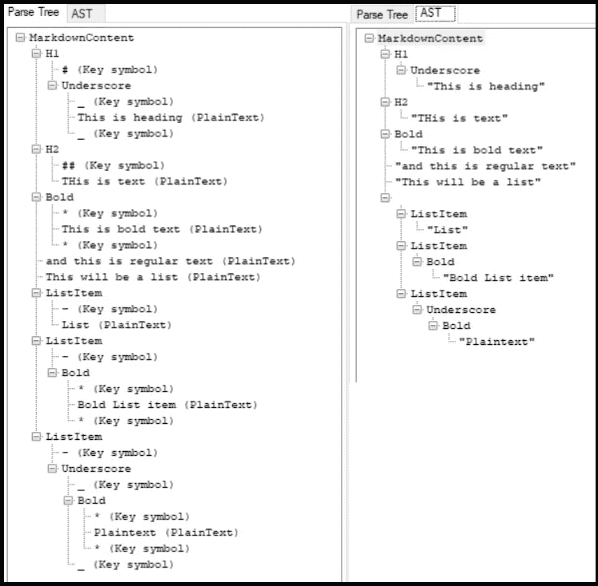
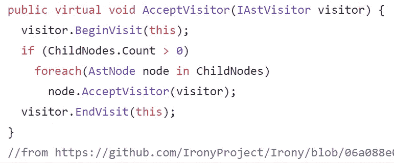
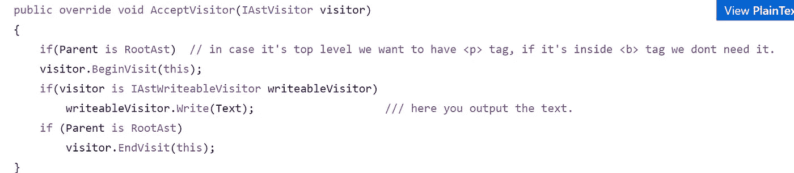
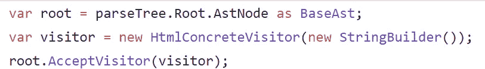

# 我如何构建一个简单的编译器——Markdown to HTML

> 原文：<https://medium.com/geekculture/how-i-built-a-simple-compiler-markdown-to-html-4da63dc79a94?source=collection_archive---------1----------------------->


# 灵感

我的一个同事，碰巧是我在̶b̶o̶s̶s̶ ̶的领导，写了一个非常酷的编译器。它不是一个很酷的 CRUD 应用程序或复杂的动画。

这是一个编译器。用于生产环境。而且也不是靠一个社区或者一个大公司做后盾。

我认为这很酷…我想编码酷的东西...所以我决定我要写一个编译器！

**所以我做了…** 因为我可以做以下事情

*   了解更多关于编译器的神奇之处
*   学习新的 JavaScript 框架之外的东西
*   实现我的一个目标。
*   编写不同的代码。
*   更深入地了解代码库

# 怎么会？

我的编译器的基础是建立在[讽刺](https://github.com/IronyProject/Irony)之上的。这是一个. NET 语言实现工具包。不幸的是，网上没有太多的信息或教程。即使只有少量的在线文档，我也能够定义语言语法，所以我可以解析输入。

我使用 Irony 的*非终结符*和*终结符*类来定义我的减价。



[https://gist.github.com/jozefchmelar/ee42ea031d9b04edeb039ecee200d997#file-nonterminaldef-cs](https://gist.github.com/jozefchmelar/ee42ea031d9b04edeb039ecee200d997#file-nonterminaldef-cs)

## 语法

现在是时候定义语法规则了。使用[巴科斯诺尔形式](https://en.wikipedia.org/wiki/Backus%E2%80%93Naur_form)定义语法。反语重载了 C#操作符，使得定义语法变得非常容易。



[https://gist.github.com/jozefchmelar/8c638b52517363e6093f35ab3d5eca46](https://gist.github.com/jozefchmelar/8c638b52517363e6093f35ab3d5eca46)

读起来太容易了。让我们开始吧。

粗体文本必须以*星号** 开头，后跟以*星号*结尾的*文本*。文本*可以是 *StyledText* 或*明文。*但是*样式文本*可以*加粗*、*斜体*或者 U͟n͟d͟e͟r͟s͟c͟o͟r͟e͟ *。你看到那个小黑客了吗？现在*粗体*文本也可以是下划线*斜体*！与*割台*相同。下划线标题？没问题，因为它符合我们的语法规则。*



It’s not THAT complicated.

如果您注意到非终端和终端的定义，您会看到第二个参数是 Ast 节点的一种类型。这样我就可以把我的解析树映射到 AST。实现这一点真的很痛苦。我搜索了 StackOverflow，谷歌结果的第二页…没有运气。我的解决方案可能不是世界上最好的，但它是有效的。它是一个函数，创建一个你提供给它的类型的实例。



[https://gist.github.com/jozefchmelar/f0c184066ab4824bb6b821a8e974c6cd](https://gist.github.com/jozefchmelar/f0c184066ab4824bb6b821a8e974c6cd)

使用 AST 比解析树容易得多:)这就是你为什么这么做的原因。



# 从抽象语法树到 HTML

语法有定义，AST 看起来不错。现在我不得不做一件我已经成功避免了 5 年的事情。我不得不学习 [**访客模式**](https://en.wikipedia.org/wiki/Visitor_pattern) **。现在比几年前在大学里有意义多了。**

Accurate description of visitor pattern

这就是反语在遍历树时接受访问者的方式。



[https://gist.github.com/jozefchmelar/2e3b70a0e84d1fa4fc938556a7743491](https://gist.github.com/jozefchmelar/2e3b70a0e84d1fa4fc938556a7743491)

这就是我如何编写我的 HTML 访问者。在你访问一个节点之前写下你的标签，之后他会访问每一个孩子。


当遇到 *PlainTextAst* 时，输出我们解析的文本



[https://gist.github.com/jozefchmelar/a9f907207ed43043d478ce7dccba6e66](https://gist.github.com/jozefchmelar/a9f907207ed43043d478ce7dccba6e66)

现在只要访问根



[https://gist.github.com/jozefchmelar/59677f63ae6cec240fbd9c95bac243ab](https://gist.github.com/jozefchmelar/59677f63ae6cec240fbd9c95bac243ab)

# 瞧啊。

从这个

```
#"H1 Heading"
#_"H1 undescore heading"_
##"H2 Heading"
*"This is bold text"* "and this is regular text"
"Following three items should be in a list, this is plaintext"
- "Plaintext list item"
- *"Bold List item"*
- _*"Underscore bold list item"*_
- _"Underscore  list item"_
#"This is heading again"
```

对此

```
<div>
  <h1>H1 Heading</h1>
  <h1>
    <u>H1 undescore heading</u>
  </h1>
  <h2>H2 Heading</h2>
  <b>This is bold text</b>
  <p>and this is regular text</p>
  <p>Following three items should be in a list, this is plaintext</p>
  <ul>
    <li>Plaintext list item</li>
    <li>
      <b>Bold List item</b>
    </li>
    <li>
      <u>
        <b>Underscore bold list item</b>
      </u>
    </li>
    <li>
      <u>Underscore  list item</u>
    </li>
  </ul>
  <h1>This is heading again</h1>
</div>
```

**管用！**

# 结论

我想写一个从我的 markdown 到 HTML 的编译器。我挑选了很棒的可用工具来实现它，并且**做到了**。你不必从汇编开始写你自己的解析器，编译器，语言，操作系统…

试试看。动手吧。解决它。

[](https://github.com/jozefchmelar/MarkdownCompiler) [## jozefchmelar/MarkdownCompiler

### 这是我自己的也是我的第一个编译器，它采用了我的非常差的支持# header # # header 2 # # # #的 markdown 版本…

github.com](https://github.com/jozefchmelar/MarkdownCompiler) [](https://www.buymeacoffee.com/jozefchmelar)

I’m just ❤️really curious