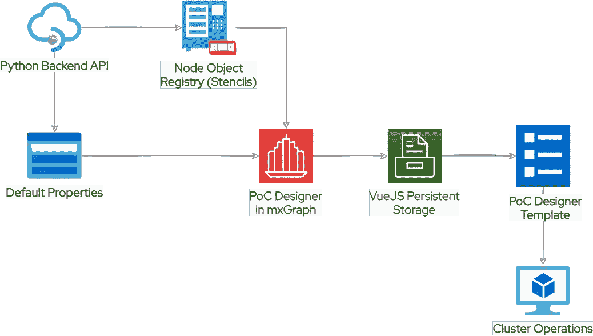
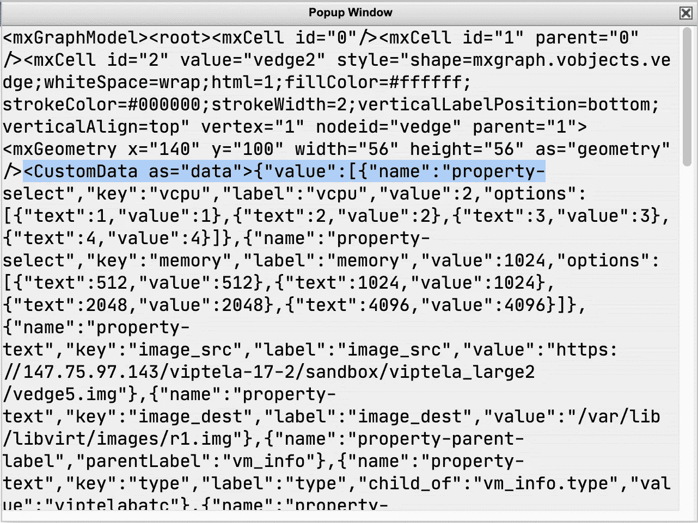
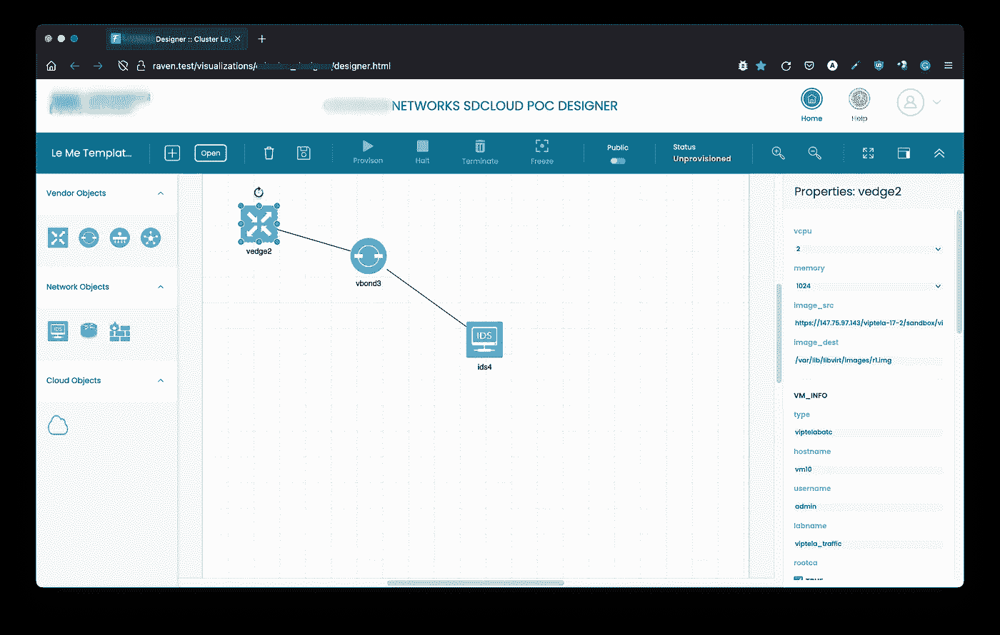

# 我如何使用 mxGraph & VueJS 构建高级 SDN 概念验证设计器

> 原文：<https://medium.com/geekculture/how-i-built-advanced-sdn-poc-designer-with-mxgraph-vuejs-887cbc40bbbf?source=collection_archive---------15----------------------->


**SDN PoC Designer (Attribution GreekMythology.com)**

这是我在危险的网络可视化世界中的第三篇后续文章，这是又一次带有刺激味道的不懈研究。如果你从未听说过[**mxGraph**](https://jgraph.github.io/mxgraph/)——那么它已经过时了，被千年行话埋没了。

衍生自[***JGraph***](https://github.com/jgraph)(Java)[***mxGraph***](https://github.com/jgraph/mxgraph)基于 JavaScript，其大部分代码库的灵感来源于 ***JGraph*** 。从血统的角度来看，它大约开始于 2005 年末，并在 2020 年后停产，正如 Github 注释所述:

```
NOTE 09.11.2020 : Development on mxGraph has now stopped, this repo is effectively end of life.
```

你仍然可以在 [**JGraph**](https://github.com/jgraph) aka 中找到它。[**Diagrams.net**](https://www.diagrams.net/)，在桌面和 web 上都可以用。这个库的一个有趣的部分是它的基于 XML 的文件格式，它可以完美地处理 2005 年创建的图表文件。

# mxGraph 是什么？🤨

简而言之，它是一个 JavaScript 开发人员库，旨在提供即插即用组件来绘制、移动上下文图或具有属性的图形元素，并与之交互。它是用纯 JavaScript 编写的，没有转换程序或 NPM 依赖。一个普通的 mxGraph 编辑器看起来像:


[**mxGrpah Editor**](https://jgraph.github.io/mxgraph/javascript/examples/grapheditor/www/index.html)

最左边是一个模板(形状)库或可以放置、交互和连接的节点对象，中间是一个画图画布，最右边是画图画布或选定节点对象的属性面板。布局画布上放置和连接的节点被渲染为 SVG，但在后台以 ***XML*** 文件格式粘合。

# 了解 mxGraph 库结构🧐

在迈出一大步之前，了解这个库的确切结构是至关重要的。画布编辑器、模板(形状)库、交互、输入/输出(IO)、实用程序的几个目录和文件，以及它们在画布上的显示方式。总结一下`tree`输出:

```
.
├── editor
├── handler
├── io
├── layout
├── model
├── shape
├── util
├── view
└── **mxClient.js**11 directories, 143 files
```

***mxGraph*** 的初始化由`mxClient.js`文件完成，该文件包括所有需要的工厂设置、模板(形状)、交互、事件监听器、菜单项、工具栏和布局画布。通过搜索数百个文件，我对这个架构有了更深入的了解。大量组件基于 JavaScript 原型对象*，可以被继承或覆盖*。外观上的改变很大程度上取决于如何在不影响核心的情况下覆盖。

# mxGraph 与 VueJS🤦🏻

当读到 PoC 设计者的需求时,“脸谱化”非常符合我的第一反应。客户端运行一个 Python (Django)应用程序，用于管理/供应通过供应商、网络和云对象注册表维护的集群。整个工作流程可以浓缩在下图中(用 diagram.io 制作)



**SDN PoC Designer Workflow**

虽然 PoC designer 充当可视化 SDN 构建器工具，但它仍然需要使用节点对象(模板)、它们的默认属性以及在 Python API (JSON)中提供、暂停、终止和冻结实例的集群操作。一旦集群设计准备好了持久属性和可以是动态的连接器，就可以使用另一个 Python API 以 XML 格式(base64 编码)保存模板。

一系列*艰巨的工作*摆在面前——为具有持久性的属性创建动态控件、事件绑定、流畅的知识传递和可持续的代码库只是其中的一部分。 ***VueJS*** 在可读代码、即插即用架构、会话持久性(通过模型进行数据绑定)等方面实现了正确的对称——没有捆绑器依赖性。

# 解耦 MX graph——第一次艰难的劳动💪🏻

分而治之！演绎的科学不可能出错，检验这个假设。在上帝模式下工作🤞🏻我决定先解耦 ***mxGraph*** 布局。用小心的切口把它分开，把它分解成布局画布。切口位于`EditorUI.js`和`Editor.js`文件中(还有更多):

注释去掉了菜单、工具栏和侧边栏。在这里，如何包含、初始化和覆盖是最重要的。我的包含层次结构如下所示:

注意第 97 行和第 98 行，这差不多做到了😊。随后的步骤变得更加清晰，我所要做的就是在`mxClient.js`之后覆盖和包含文件，最多只是克隆和/或修改它们以进行翻新。

> 专业建议:不要篡改原唱，即使是 80-90 年代的歌曲！

说这是一种黑客，但正确的是有效的。后来使用 ***VueJS*** `x-template`语法糖为**模板**和**属性**引入了微小的添加。多控件组件模板:

这给了我用基于模板的语法构建动态属性的能力，而且它允许用 Python API (JSON)进行动态绑定:


**SDN NAT Rules**

我能够用 Python API 拼凑整个模板(形状)库、动态节点/连接器属性。默认模具库和节点/连接器对象属性需要预先初始化:

# 用 VueJS 改装 mxGraph 第二项艰巨的工作💪🏻

既然所有的细节都准备好了，是时候铺开红地毯了。mxGraph 编辑器的大多数部分需要修饰性的更改(自定义模板和属性侧栏面板),这意味着:

在 GIS 领域中，非空间属性指的是扩展的地理位置数据，相同的自定义属性保存在一个`<CustomData>` XML 标记中(作为 JSON)，这是 ***mxGraph*** 的一个简洁特性。图形源 XML 看起来像这样:



**SDN Diagram XML Source**

这个`<CustomData>`也用于 VueJS 模型绑定。XML 和 JSON 对象之间的转换是通过编解码器进行的。`CustomData(value)`编解码器的定义:

当你点击一个节点对象/连接器时，它通过 codec 被解析，返回 ***VueJS*** 模型的所有属性绑定对象。属性绑定部分在`Properties.js`文件中定义为:

# 综上所述——第三项艰巨的劳动💪🏻

很多建筑学的想法都发挥了作用——这不是软球、曲线球或硬球，这是一个接一个的 Atlas 石头，只有强壮的人才能生存。将一个普通的图组件库变成一个成熟的 ***SDN PoC 设计师*** 将午夜马拉松带到了最后的前沿:



**SDN PoC Designer**

三个月的不懈追求，很少有管理火花与伤亡——是的，我已经学会低调😉。只要客户高兴，我可以接受。无论如何，这一直是我的开发者之旅。

# 参考

*   [https://github.com/jgraph](https://github.com/jgraph)
*   [https://www.diagrams.net](https://www.diagrams.net/)
*   [https://github.com/jgraph/mxgraph](https://github.com/jgraph/mxgraph)
*   [https://jgraph . github . io/mxgraph/JavaScript/examples/graphe editor/www/index . html](https://jgraph.github.io/mxgraph/javascript/examples/grapheditor/www/index.html)
*   [https://jgraph . github . io/MX graph/docs/js-API/files/index-txt . html](https://jgraph.github.io/mxgraph/docs/js-api/files/index-txt.html)
*   [https://www . Greek mythology . com/Myths/Heroes/赫拉克剌斯/heracles.html](https://www.greekmythology.com/Myths/Heroes/Heracles/heracles.html)

如需在线直播演示，请联系:[anithegregorian@gmail.com](mailto:anithegregorian@gmail.com)