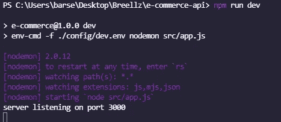

# 我如何用 NodeJs、Express 和 MongoDB 构建电子商务 API(第 1 部分)

> 原文：<https://medium.com/geekculture/how-i-built-an-e-commerce-api-with-nodejs-express-and-mongodb-7b42b5253ffb?source=collection_archive---------0----------------------->

# **简介**

最近，我很幸运地被埃努古 Genesys 技术中心接受为实习生，作为我们软件工程开发的一部分，我们应该有一个充满激情的项目，除了在团队中工作时构建产品之外，我们还可以单独工作。

我选择构建一个电子商务 API，这就是我的做法。如果你按照本教程中的步骤操作，你也可以做到。

基本上这是一个简单的 API。它不具备现代电子商务 web 应用程序的所有花哨功能，但它确实具备开始工作的所有基本功能。你当然可以添加更多的特性来使它变得更好。

# 先决条件

*   对 javascript 的基本理解
*   Nodejs、MongoDB、Mongoose 和 Express 的基础知识

这个 API 的基本特性是:

*   注册、登录和注销用户
*   使用 JSON Web 令牌进行身份验证(JWT)。
*   添加、编辑、查看和删除商店中所有产品的选项。
*   从购物车中添加或删除商品的选项。
*   为每个用户创建购物车，从购物车中添加和删除项目，并计算账单。

我将使用 Express on NodeJs 作为服务器，使用 MongoDB 将数据存储为 JSON 格式的文档，使用 Mongoose 进行建模。

创建一个新文件夹，我将其命名为 mine *e-commerce-api* ，启动 VSCode 或您喜欢的代码编辑器，打开终端并在终端中键入命令以启动一个新的节点项目

`npm init`

您将被引导通过一系列步骤来为您的项目创建 package.json 文件，或者您可以只使用`-y`标志来跳过定制并使用默认值，因此该命令变成

`npm init -y`

接下来，我们安装依赖项。

顾名思义，依赖是我们的项目作为一个整体运作所依赖的模块。我们将安装相当多的程序，但是在我们安装之前，我会先对每个程序做一个测试。

*   **bcryptjs** —我们将在应用程序中对用户进行身份验证。他们需要密码才能登录，我们会将该密码存储在我们的数据库中。将密码存储为纯文本是不可取的，因为这会使我们的应用程序易受攻击，所以 bcrypt 就派上了用场。Bcrypt 为我们提供了一个密码散列函数，我们可以在将这些密码保存到数据库之前使用它。
*   **Express** —用于构建 web 应用程序和 API 的节点框架
*   **jsonwebtoken** —生成验证令牌来验证用户
*   **mongose**—mongose 是 MongoDB 和 Node.js 的对象数据建模(ODM)库，它管理数据之间的关系，提供模式验证，并用于在代码中的对象和 MongoDB 中这些对象的表示之间进行转换。
*   **验证器** —一个字符串验证器库。我们将用它来验证用户的电子邮件。
*   **env-cmd** —我们将使用它从外部文件加载环境变量。
*   **nodemon** —它通过在我们的文件中检测到更改时重启服务器来保持我们的服务器运行。

我添加了一些脚本来使开发更容易，它们是

*   dev —它通过调用 env-cmd 加载环境变量来启动开发服务器，然后调用 nodemon 来启动服务器。稍后我会解释这是怎么回事。所以请暂时容忍我。
*   启动—这将在生产服务器上启动。这是 heroku 在尝试启动我们的应用程序时将运行的命令。
    `"start":”node src/app.js”`

这是我的 *package.json* 事后的样子。

我建议您安装相同版本的 dependences，以避免一路上遇到问题。

现在，让我们开始建造。

1.  **设置环境变量和猫鼬**

在你的根目录下创建一个名为 *config* 的文件夹，在这个文件夹下用*创建一个名为 dev 的新文件。env* 作为其扩展。这个文件将保存我们的环境变量。

复制并保存在文件中

`JWT_SECRET=ecommercewebapi
PORT=3000
MONGODB_URL=mongodb://127.0.0.1:27017`

这将我带回我们的开发脚本
`"dev":"env-cmd -f ./config/dev.env nodemon src/app.js"`

`-f`标志用于指定我们的 env 文件保存在机器上的什么位置，在调用 nodemon 之后，我们指定服务器文件的路径。

接下来，我们用 mongoose 建立到数据库的连接。

在你的根目录下创建一个名为 *db* 的文件夹，在这个文件夹下创建一个名为*mongose 的新文件，扩展名为 js。*

将这段代码复制并粘贴到这个文件中

`const mongoose = require(‘mongoose’);
mongoose.connect(process.env.MONGODB_URL, {
useNewUrlParser: true,
})`

在这里，我们加载 mongoose 并连接 env 文件中指定的 MONGODB URL。

保存文件，让我们继续创建我们的 app.js 文件。

2.**创建服务器**

在根目录下创建一个新文件。

我们把那个*命名为 app.js*

首先，我们导入所有依赖项

`const express = require(‘express’)
require(‘./db/mongoose’)`

然后，我们将调用我们的快速应用程序，并设置它的使用

`const app = express()
app.use(express.json())`

接下来，我们指定希望服务器监听的端口。请记住，我们已经在 env 文件中定义了这一点。所以，

`const port = process.env.PORT`

现在是时候倾听连接了
T1

启动 mongoDB，并使用 *npm run dev 启动服务器。*

如果一切顺利，您应该会在您的控制台上看到这个

这是我们完成时 app.js 文件的样子。

本教程系列的第一部分到此结束。

在接下来的部分中，我们将处理我们的模型、路线和认证。

点击这个链接进入下一篇文章，在那里我们建立模型

 [## 我如何用 NodeJs、Express 和 MongoDB 构建电子商务 API(第 2 部分)

### 第 2 部分:构建模型

medium.com](/geekculture/how-i-built-an-e-commerce-api-with-nodejs-express-and-mongodb-part-2-c729b1e74336)