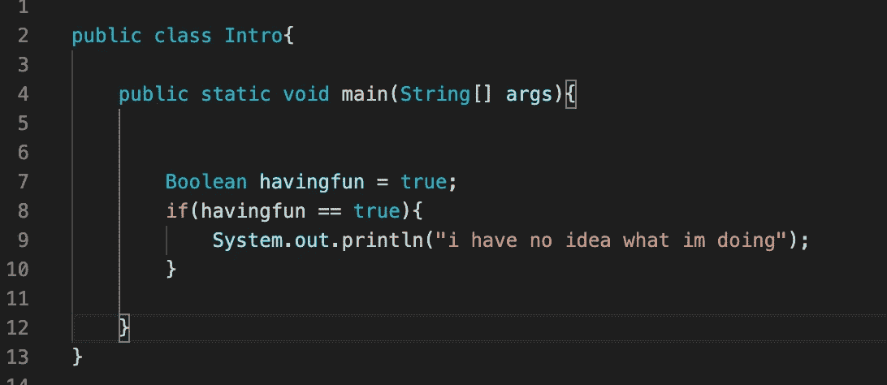
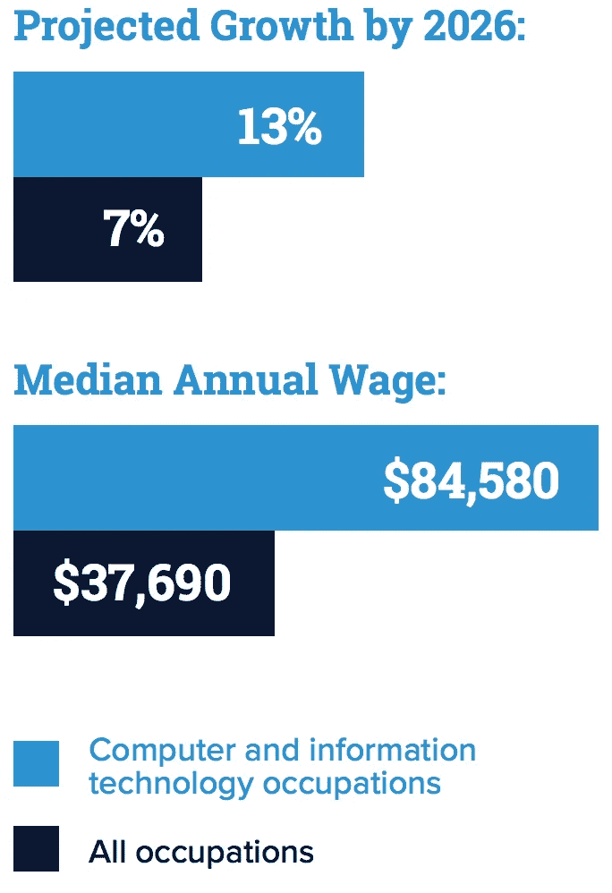
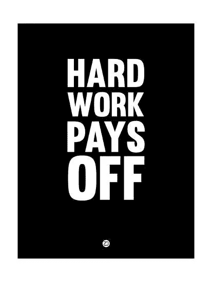

# 我如何选择我的大学专业——计算机科学适合你吗？

> 原文：<https://medium.com/geekculture/how-i-chose-my-college-major-is-computer-science-right-for-you-74ddcd0dff35?source=collection_archive---------22----------------------->

谁真正知道他们高中一毕业就想做什么？有很多选择，比如上大学，参军，创业，自学技能，或者直接进入工业界。在高中，我知道我擅长数学和科学，但在我想了想之后，我不想在大学里花四年(或者可能更多)去解决无数的数学、化学或物理问题。我已经厌倦了。我想尝试一些新的东西。我总是听说编码，并认为你必须是一个超级天才或魔术师才能编码。但是这个新挑战的想法对我来说很有吸引力。

I was confused when I first started, but I was having fun!

我决定进入大学，选择一个我以前从未做过的专业，这非常可怕，但我很高兴我做到了。很快，我了解到计算机科学带走了数学和科学中我最喜欢的部分，即解决问题，并允许我使用这些技能来制作真正的生活应用程序，从而改变人们的日常生活。

对我来说，选择专业是一种淘汰的过程。知道我喜欢什么，我擅长什么，以及什么会给我的教育投资带来最大的回报，使这个决定变得更加清晰，而不是盲目。老实说，科技行业的薪水最终比大多数其他行业都要高，所以对我来说尝试一下是有意义的。也就是说，我认为人们不应该仅仅为了钱而进入计算机科学领域，因为这将成为一种压力和繁重的经历。

Photo by [https://www.tellermate.com/us/news-and-resources/just-take-my-money/](https://www.tellermate.com/us/news-and-resources/just-take-my-money/)

我在大学学习编程的头几个星期给了我一个机会。被更有经验的学生居高临下地谈论真的让我患上了冒名顶替综合症，让我觉得编码不适合我。我注意到这种把关意识在专业内，甚至在行业内。然而，在排除了其他人的意见，只专注于我的感受后，我意识到我真的很喜欢提出逻辑(或算法)来解决问题；我只是不擅长把它们转化成代码——这没关系。*计算机科学的本质不在于编码，而在于你逻辑思考、解决问题和提出有效算法的能力。这是我希望有人在我刚开始工作时告诉我的事情。*

现在我已经解释了我的经历和我为什么进入计算机科学，让我们看看它是否适合你。请记住，虽然我说的是在大学选择计算机科学作为专业，但你可以通过许多不同的方式在任何年龄开始学习编码。

# **你喜欢:**

1.  解决问题？如果是这样，这绝对是你可能要考虑的一条路。没有一天我不需要用这种或那种方法解决问题。
2.  通过项目学习？计算机科学专业的主要部分是做大量的编码项目，而不是一次又一次地参加考试。通过项目获得宝贵的经验是学习编码的最好方法。即使在申请实习或全职职位时，你的平均绩点所占的比重会更小，而实践经验所占的比重会更大，这对我来说是一大优势。它消除了需要获得接近完美的 GPA 的压力，这在许多其他领域都有经验，并允许我完全专注于学习。
3.  小组工作？很多上层课程，还有公司，都要求你和别人一起做项目。我个人喜欢与周围志同道合的人合作和学习。尽管计算机科学看起来是孤立的，但实际上它是合作的。与你的同事交换意见有时会以最有效的方式解决问题。

# **如果你不喜欢:**

1.  整天在电脑上，这个专业可能不是最适合的。我一天的大部分时间都花在了编码上，或者做其他学校的工作，比如写论文。然而，在许多公司，研究生毕业后在哪里工作有很大的自由。继疫情之后，许多科技公司已经允许他们的员工在他们喜欢的任何地方工作。
2.  学习新技术，当你被告知为了编写程序而学习新的语言和软件时，你不会感到兴奋。虽然我不认为这是一个完全的交易破坏者，因为大多数时候，在你有一些编程知识之后，学习一项新技术的基础是相当简单的。例如，我开始使用 Java，到了学习 C 的时候，我花了整整两周的时间才完全熟悉 C，因为我已经知道了基本知识。
3.  有创意的话，这个专业会难管理很多。与许多其他主题不同，在大多数情况下，你不能仅仅按照一个给定的公式得出正确的答案。你必须想出创新的新方法，做出最有效的解决方案。这对我来说是一个很好的例子，因为我从来不喜欢背公式，只是为了在考试后马上忘记它们。计算机科学摆脱了这一点，因为重点不在于遵循已经完成的东西，而在于用新的想法创造新的程序。

Photo by [https://online.csp.edu/blog/technology/computer-science-vs-information-technology-guide/](https://online.csp.edu/blog/technology/computer-science-vs-information-technology-guide/)

# **让我们回顾一下利弊**

## **优点**

学习如何编码有很多有益的好处。第一个主要优势是大学毕业后一旦你能找到工作，起薪。再说一次，这不应该是你进入计算机科学的唯一原因，但这是一个很好的额外津贴。第二是这个领域一直在发展。技术是未来。如果你坚持实践和创新，你将真的有能力在你的指尖改变世界。大多数公司都在寻找这类有创新精神和才华的软件工程师。这使我进入了我的下一个职业，那就是你将能够在任何你感兴趣的领域工作。例如，我一直对金融和经济感兴趣，所以我能够在世界上最大的投资银行之一获得技术分析师的实习机会。通过这种方式，我能够在从事技术工作的同时了解日常的金融知识。

## **缺点**

对我来说，最大的缺点是学习曲线有多陡。在最初的几个星期里，我感觉好像在学习一门真正不同的语言。没有人告诉我，我必须在课外多花多少时间。然而，由于我对这个领域越来越感兴趣，这是我能够做到的事情。不仅如此，我还没有准备好这个专业的所有把关工作。尤其是作为一名有色人种女性，我的一些同行不希望看到我获得成功。最后，我明白了这不是我能控制的，我觉得把精力用在改善自己上比娱乐那些想看我失败的人要好得多。我能想到的最后一个骗局就是花很多时间在电脑前。虽然我喜欢学习新技术，但这个专业确实对我的眼睛造成了损害，导致我的眼疲劳非常严重。解决这个问题的一个简单办法是买一副漂亮的蓝光眼镜，这样我就不会认为这是一个太大的骗局。

Photo by [https://www.allposters.com/-sp/Hard-Work-Pays-Off-1-Posters_i13093225_.htm](https://www.allposters.com/-sp/Hard-Work-Pays-Off-1-Posters_i13093225_.htm)

总而言之，我很高兴我尝试了编码并坚持了下来。我终于看到我所有的努力都得到了回报，我真诚地爱上了我每天所做的事情，不管有时日子有多长。如你所见，编码并不适合每个人，我不会强迫那些对这个话题不感兴趣的人。然而，如果你想尝试一下，网上有很多很好的资源可以很好的介绍编码是什么样子的。如果你已经主修计算机科学或相关领域，并且想知道作为一名大学生如何获得行业经验，请查看我的实习指南“[我作为一名大学二年级学生如何获得三份实习工作](/codex/how-i-landed-three-internships-in-tech-as-a-second-year-college-student-1a5c0ba140f7)”。无论你选择什么专业，我认为你个人的兴趣和专业的实用性是最重要的。不要让外界的意见左右你太多，因为最终这是你的生活，所以你必须做让你开心的事！