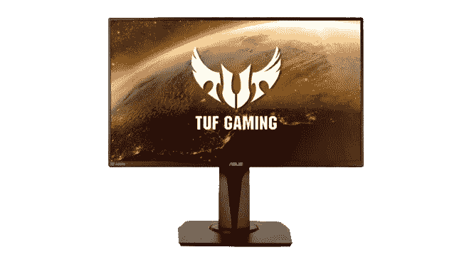
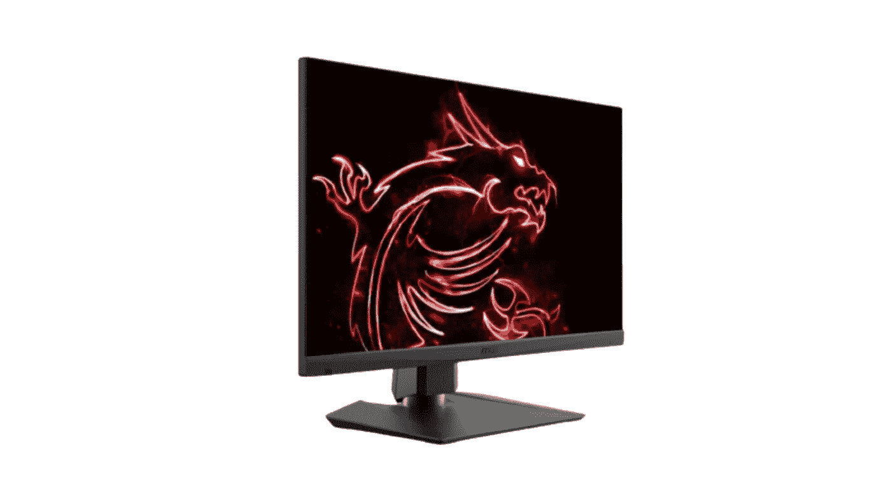
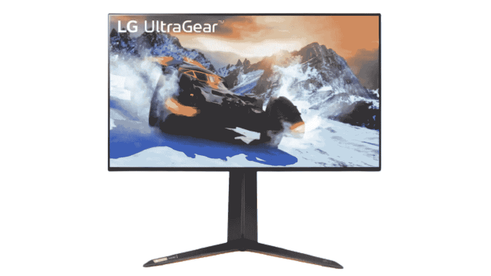

# 我如何选择完美的显示器

> 原文：<https://medium.com/geekculture/how-i-chose-the-perfect-monitor-92be735d641e?source=collection_archive---------11----------------------->

尽管有数十亿种选择，但在决定为您的设置购买哪种显示器时，我发现了 3 种显示器，它们在各自的类别中占了上风(1080p、1440p 和 4k)。这些显示器在游戏和对色彩要求严格的工作中表现出色，而且价格也相当合理。值得注意的是，有更好的显示器，价格要高得多。我选择了我觉得性价比相当好的显示器。我们开始吧！

# 如何为您的系统选择最完美的显示器

为您的系统选择显示器时，您需要考虑几个问题。

*   您打算使用显示器进行对色彩要求很高的工作吗？
*   你打算用显示器玩游戏吗？
*   你的预算是多少？
*   PPI 对你重要吗？

要选择完美的显示器，您需要回答这三个问题。这三个问题将决定你需要哪种显示器。

如果你对第一个问题的回答是肯定的，那么你将需要一台 IPS 或 OLED 面板的显示器，以及具有宽色域的显示器。

如果您对第二个问题的回答是肯定的，那么您需要一台响应时间小于 5 毫秒、刷新率至少为 144 赫兹的显示器。

如果你的预算是 150-300 美元，那么向下滚动到 1080 便士选项。如果你的预算是 300-600 美元，那么向下滚动到 1440 便士选项。如果你的预算是 600-1000 美元，那么选择 4k。

PPI 是每平方英寸的像素。PPI 越高，图像越清晰。我选择了高 PPI 的显示器，而不是大屏幕低 PPI 的显示器。我觉得图像清晰度比屏幕尺寸更重要。

# 1080p 选项

Asus TUF Gaming VG259QR

华硕 TUF 游戏 VG259QR 是一款出色的 1080p 165hz 游戏显示器。这是一款非常均衡的显示器，配有 IPS 面板和 1 毫秒的响应时间。它有一个 24.5 英寸的屏幕，兼容 G-sync。如果您尝试使用此显示器进行照片编辑等对色彩要求严格的工作，只需升级到 1440p 即可。这要多花几百美元，但非常值得。

查看亚马逊了解最新价格和供货情况。

# 1440p 选项

MSI Optix MAG274QRF-QD

MSI Optix MAG274QRF-QD 是一款出色的 27 英寸 1440p 游戏显示器。它的刷新率为 165 Hz，响应时间为 1 ms。它的 IPS 面板可以显示非常宽的色域，尽管有时颜色会出现过饱和。它兼容 FreeSync 和 G-Sync。它使用量子点技术来提供清晰的显示。如果您想玩游戏，这是最适合您的显示器。

查看[亚马逊](https://amzn.to/3OsiVQm)了解最新价格和供货情况。

# 4k 选项

LG 27GP950-B

LG 27GP950-B 是一款出色的游戏显示器。凭借快速的 160 Hz 刷新率和 1 毫秒的响应时间，这款显示器非常棒。这是一个 27 英寸的屏幕，带有 IPS 面板。它不仅兼容 Free-Sync 和 G-Sync，还为 PS5 或 Xbox Series X 提供了 HDMI 2.1 端口，虽然它不是我们见过的最大的色域，但它的色域非常好。

查看亚马逊了解最新价格和供货情况。

# 4k 替代

# 结论

如果你读到这里，恭喜你。你比大多数人坚持的时间都长，现在是少数人中的一员。列出的显示器是我会为我的设置选择的*显示器。它们不一定是同类产品中最好的，但它们平衡了价格，表现相当不错。*

我相信你已经注意到，我没有涉及办公室显示器或专用于对色彩要求严格的工作的显示器(尽管所有这些显示器对于对色彩要求严格的工作来说都相当不错)。我更关注游戏，因为这是大多数人最感兴趣的，但如果你希望看到与游戏无关的其他选项，请在评论中告诉我(我阅读了它们:)。

就我个人而言，我最喜欢的显示器是 MSI Optix MAG274QRF-QD。这是将在我的设置中占据一席之地的显示器。作为一个 27 英寸的显示器，它有一个非常好的 PPI(更多的在后面的帖子里。)

# 即将发布的帖子

我的下一篇文章是关于显示器的分辨率无关紧要。它可能会在下周的某个时候发布，但愿如此。

关于我下一步该写什么，我愿意听取建议。

已签名，

萨姆·米申

我所用文章的链接:

*   [https://hungrygeeks . com . ph/ASUS-tuf-VG 259 QR-review-feature-filled-165hz-gaming-monitor/](https://hungrygeeks.com.ph/asus-tuf-vg259qr-review-feature-filled-165hz-gaming-monitor/)
*   [https://www . rtings . com/monitor/reviews/MSI/optix-mag 274 qrf-qd](https://www.rtings.com/monitor/reviews/msi/optix-mag274qrf-qd)
*   [https://www.rtings.com/monitor/reviews/lg/27gp950-b](https://www.rtings.com/monitor/reviews/lg/27gp950-b)

注意:这篇文章中的链接是附属链接。