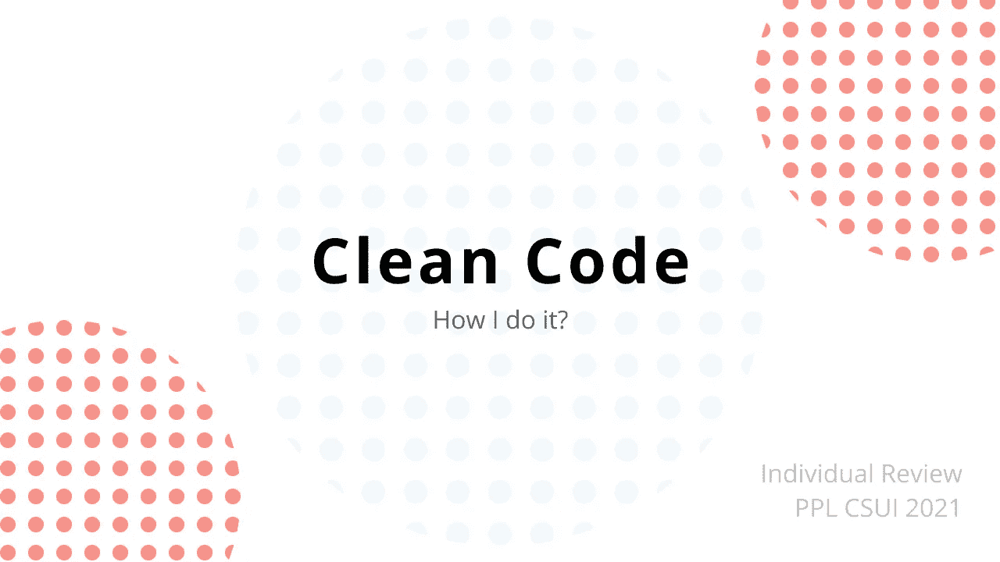

# 我如何清理我的代码

> 原文：<https://medium.com/geekculture/how-i-clean-my-code-90d1f0ea0175?source=collection_archive---------9----------------------->



> 本文是为 PPL CSUI 2021 撰写的个人评论的一部分

在过去的三年里，我写了很多代码来追逐我的学位。有一天，我试图再次阅读我过去写的代码。由此，我意识到随着时间的推移，我的代码更容易阅读。我们举个例子。

## 从这个(旧的)

```
def base_n_to_dec(numb_in_str,base):
    val = 0
    power = 0
    # Change base 2-10 to base 10
    if base != 16:
        for i in range (len(numb_in_str)):
            index = len(numb_in_str) - i - 1
            number = int(numb_in_str[index])            
            val += number * base ** power
            power += 1

    # Change base 16 to 10
    elif base == 16:
        for i in range (len(numb_in_str)):
            index = len(numb_in_str) - i - 1
            number = numb_in_str[index]
            if number == 'a' or number == 'A':
                number = 10
            elif number == 'b' or number == 'B':
                number = 11
            elif number == 'c' or number == 'C':
                number = 12
            elif number == 'd' or number == 'D':
                number = 13
            elif number == 'e' or number == 'E':
                number = 14
            elif number == 'f' or number == 'F':
                number = 15
            else:
                number = int(number) 
            val += number * base ** power
            power += 1              
    return val
```

## 到此(“已清理”)

```
def base_n_to_dec(numb_in_str,base):
    numb_in_str = numb_in_str.upper()
    dec_eq = [
        "0","1","2","3","4","5","6","7",
        "8","9","A","B","C","D","E","F"
    ]
    sum = 0
    for index in range(len(numb_in_str)):
        digit = dec_eq.index(numb_in_str[index])
        power = (len(numb_in_str)-index-1)
        sum +=  digit * (base ** power)
    return sum
```

这段代码是我在大学第一年写的，我试图“清理”它。该代码尝试将基数为 2–10 和 16 的数字转换为基数为 10 的数字。在我的旧代码中，它做得很好。但是，两年后我很难理解。在我的“干净”版本代码中，我尝试扩展功能，将基数为 2–16 的数字转换为基数为 10 的数字，并增加代码的可读性。

# 创建“干净”代码时我所关心的事情

## 有意义的名字—

让我们看一个例子

```
def x(a, b):
    return a * b
```

看了上面的代码之后，你知道代码试图做什么吗？我很确定你还是做对了。但是，是吗？

```
def rectangle_area(length, width):
    return length * width
```

跨变量、方法甚至类创建有意义的名称有助于更容易理解代码。

## 删除不明确的代码—

看一下这段代码

```
if dosen_type == 1:
    #do something
```

在代码上，我们不知道第一类是什么讲师。我们可以用下面的代码来改善这一点

```
if dosen_type == DOSEN_KONTRAK:
    #do something
```

上面的代码试图将“1”保存到一个名为 DOSEN_KONTRAK 的变量中，这样我们可以更容易地阅读它。

## 如有必要，添加注释—

添加注释可以帮助您理解代码。但是，如果你的代码已经可读，有必要添加吗？

我们可以从“有意义的名字”一节举个例子

```
# Compute area of a rectangle
def rectangle_area(length, width):
    return length * width
```

上面例子中的函数已经很清楚了，所以**我们不应该**在上面添加更多的注释。

## 使用编码标准—

当我用一种新语言写代码时，我会直接去谷歌搜索，输入“T2 的编码标准”。这有助于您在编写代码时保持一致。

你可以从 [PEP 8 python](https://www.python.org/dev/peps/pep-0008/#:~:text=Use%20the%20function%20naming%20rules,invoke%20Python's%20name%20mangling%20rules.) 获取示例编码标准

## 减少冗余—

有时候，你需要多次做同样的事情。功能可能是你的生活救星。这里是我的 PPL 项目 SISIDANG 的一些代码片段。

```
ADMIN_CRED = ['admin', 'tes']
MAHASISWA_CRED = ['mahasiswa', 'tes']

def login_helper(self, data):
    username = data[0]
    password = data[1]
    session = self.client.session
    session["kodeidentitas"] = kode_id
    session.save()

def test_admin_can_access_generate_penilaian(self):
    self.login_helper(self.ADMIN_CRED)
    response = self.client.get("/generate-nilai/?pk={}".format(self.sidang.pk))
    self.assertEqual(response.status_code, 200)

def test_mahasiswa_cant_access_generate_penilaian(self):
    self.login_helper(self.MAHASISWA_CRED)
    response = self.client.get("/generate-nilai/?pk={}".format(self.sidang.pk))
    self.assertEqual(response.status_code, 302)
```

上面的代码是我在项目中做的单元测试的代码片段。正如你所看到的，我写的每个测试都需要登录到 SISIDANG，所以我写了一个函数来帮助我(login_helper)

## 删除未使用的代码—

我经常将我的代码作为注释，作为开发代码的备份。这种未使用的代码称为死代码，我将在生产环境(代码准备发布的环境)中删除它

# 通过保持代码整洁，我得到了什么

## 首先—简单

这有助于我阅读我过去的项目代码，也有助于其他人理解它。通过这样做，我在编写代码时变得更有效率，并产生高质量的代码

## 第二，更容易找到 Bug

有了干净的代码，我的代码中出现的错误就显而易见了。帮助我摆脱那些 bug，产生工作代码:)。它还帮助我创建单元测试来保持项目正常运行。

## **第三——成本节约**

正如我在第一点中提到的，我生产代码的效率变得更高了。在开发项目时，它节省了我的时间*(也节省了我买食物陪我编码的钱)*

# 结论

干净的代码是软件工程师必须做的事情。这不是一件容易的事。需要练习来保持你的代码干净。通过编写干净的代码，您将节省时间并更容易开发项目。

# 参考:

1.  [https://dzone . com/articles/clean-code-explain-benefits-amp-examples #:~:text = By % 20 building % 20 clean % 20 code % 2C % 20 automated，the % 20 number % 20 of % 20 software % 20 defects](https://dzone.com/articles/clean-code-explanation-benefits-amp-examples#:~:text=By%20building%20clean%20code%2C%20automated,the%20number%20of%20software%20defects)。