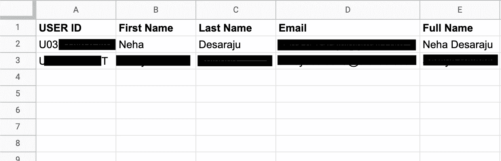
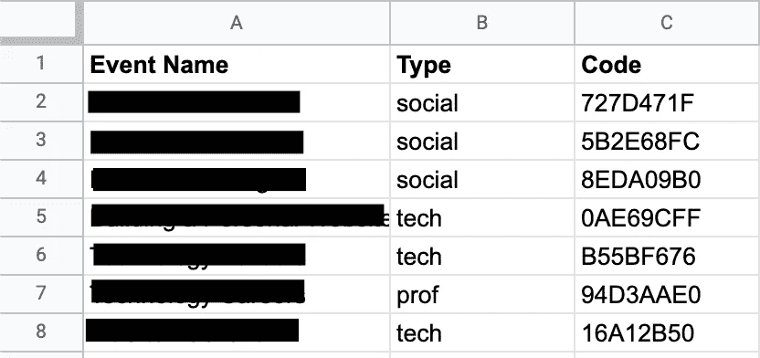
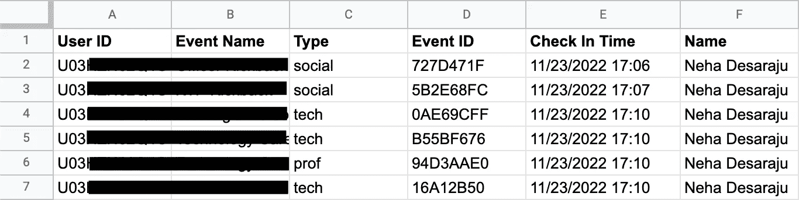
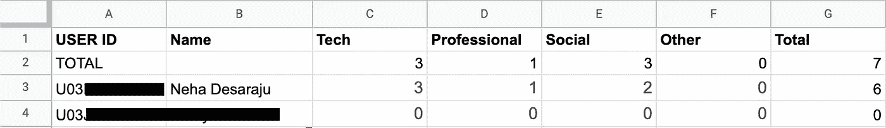
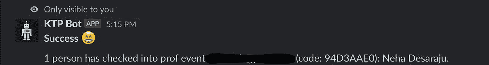
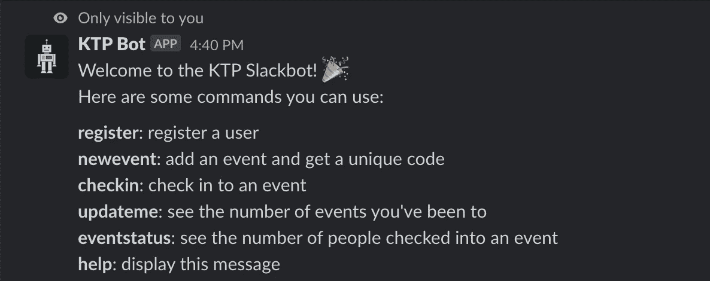

# 我如何为我的学生组织创建一个 Slack bot

> 原文：<https://medium.com/geekculture/how-i-created-a-slack-bot-for-my-student-org-db9212bb857d?source=collection_archive---------7----------------------->

## 使用 Slack Events API 和 Google Sheets 编写自己的 Slack bot 的分步指南


Photo by [Stephen Phillips - Hostreviews.co.uk](https://unsplash.com/@hostreviews?utm_source=medium&utm_medium=referral) on [Unsplash](https://unsplash.com?utm_source=medium&utm_medium=referral)

我是大学校园里一个技术专业兄弟会的技术开发副总裁。我们主办了许多活动，其中许多活动旨在帮助组织成员发展他们的专业和技术技能，我们希望为我们的成员提供一定水平的活动。

我们希望能够更好地跟踪这一点(仍然在谷歌表单中，所以很容易查看)，并有一个简化的流程来确保每个参加特定活动的人都被记录下来。我们还希望会员能够总结自己这一学期的参与情况，鼓励会员更积极地参加规定数量的活动。因为我们已经有了 Slack 中的每个成员，所以我们开发一个可以做上述所有事情的 Slack 机器人是很自然的。

我从我们校园里的另一个科技组织[德克萨斯产品工程组织](https://txproduct.org)那里得到了指点，以及他们[考勤机器人](https://github.com/tpeo/attendance-slack-bot)的代码。虽然它没有我需要的所有东西，但代码为我指出了正确的入门方向，我引用了很多他们的异步 Google Sheets 代码。

# 设置时差事件 API

Slack Events API 和无服务器函数是最简单的方法。Slack 可以为您订阅的事件(例如，频道提及或任何新用户添加到工作区的时候)自动向您指定的 URL 发送 POST 请求。这对我们来说很有用，因为我们希望在用户管理机器人时得到通知。

我还使用了 GCP 云函数，首先在本地使用它们的`functions-framework`进行测试，这是一个 Python 模块，你可以安装它来在你的本地机器或你选择的任何其他服务器上复制云函数的功能。为了测试的目的，我在将我的最终代码上传到 GCP 之前，使用了 [ngrok](https://ngrok.com/) 将我的服务器的本地主机版本暴露在互联网上。

按照说明[创建一个新的 Slack 应用](https://api.slack.com/apps)后，转到左侧栏的*事件订阅*选项卡，打开事件订阅。它会要求一个网址来验证。

## 验证您的 URL

出于隐私的目的，Slack 可以确保您直接控制它通知事件的服务器，Slack 有一个过程来验证您给它的 URL。注意，如果您更改了 URL，您将不得不再次经历验证过程，所以如果您决定在本地测试，然后转移到生产服务器，请记住这一点。

为此，只要您粘贴了 URL(在我的例子中，我粘贴了 ngrok URL)，Slack 就会向它发送一个简单的 POST 请求，其中包含一个`challenge`值。您的工作只是及时返回它提供的`challenge`值。(他们在返回类型和格式上非常灵活。)我是这样做的:

```
def parse_request(event):
    r = event.get_data().decode("utf-8")
    r = json.loads(r)
    return f"HTTP 200 OK\nContent-type: application/x-www-form-urlencoded\nchallenge={r['challenge']}"
```

其中`parse_request`是我进入无服务器功能的入口点(即当服务器收到 POST 请求时，它将调用什么)。你只需要验证一个 URL 一次，所以你可以在 Slack 验证之后删除这段代码。

现在您已经验证了服务器的所有权，您应该添加必要的事件订阅。我使用了 *message.im* ，它告诉 Slack 在每次机器人收到消息内容时发送一个 POST 请求。(确保选中 **App Home** > Messages 选项卡下的复选标记，以允许向 bot 发送消息(如果这是您正在使用的范围)。)

在你把你的机器人安装到一个可以测试的工作空间之后(通过你的应用仪表板)，你就可以开始编码你的机器人了！

# 可选:使用 Google Sheets API

我创建的机器人对谷歌表单进行了大量的读取和写入，因为这是管理员也可以管理应用程序中的数据并快速查看成员摘要的最佳方式。你需要一个有效的谷歌云平台账户，从那里你可以[启用谷歌表单应用编程接口](https://console.cloud.google.com/apis/library/sheets.googleapis.com)。在页面顶部，会出现一个横幅，提示您创建凭据；这将引导您创建一个服务帐户，因为这是我们用来访问表单本身的。创建完成后，点击[服务帐户](https://console.cloud.google.com/iam-admin/serviceaccounts)页面中的电子邮件“管理密钥”，然后添加一个新的 JSON 密钥。大多数 GCP SDK 都需要这个密钥，包括我们使用的那个(`aiogoogle`)。

不要忘记与服务帐户电子邮件共享该表(具有编辑者访问权限)，以便服务帐户可以读取和写入该表。

# 开发机器人

在您的`parse_request`函数中，我包含了一些代码来检查 POST 请求是否真的来自 Slack。Slack 让[很容易](https://api.slack.com/authentication/verifying-requests-from-slack)做到这一点:Slack 发送给你一个散列代码和事件细节，如果你使用 HMAC ( `pip install hmac`)散列请求体使用秘密 bot 令牌(你可以从应用仪表板得到)，这两个代码应该匹配。我是这样做的:

```
def verifySlackRequest(event):
    headers = event.headers
    request_body = event.get_data().decode("utf-8")
    timestamp = headers.get('X-Slack-Request-Timestamp', None)
    # if the request came from more than 5 mins ago, could be an attack
    if timestamp is None or abs(time.time() - int(timestamp)) > 60 * 5:
        return False
    sig_basestring = 'v0:' + timestamp + ':' + str(request_body)
    my_signature = 'v0=' + hmac.new(
            slack_secrets.slack_signing_secret,
            sig_basestring.encode(),
            hashlib.sha256
        ).hexdigest()
    slack_signature = headers['X-Slack-Signature']
    return hmac.compare_digest(my_signature, slack_signature)
```

如果这是真的，我将数据发送到一个路由器(在一个并发进程中),它可以计算出如何处理该消息。使用 Python 中内置的`multiprocessing`库，我可以在实际处理事件数据之前向 Slack *发送一个快速的 200 响应。响应时间必须少于 3 秒，否则 Slack 将不断重试(并最终由于太多不成功的返回而禁用 Events API ),并且随着服务器加速运行，等待代码的其余部分完成运行将花费略多于 3 秒的时间。看起来是这样的:*

```
from multiprocessing import Process

def parse_request(event):
    # verify that the request came from Slack
    if not verifySlackRequest(event):
        resp = flask.Response("Unauthorized")
        return resp, 401

    # route the request to the appropriate handler in a new thread
    data = event.get_json()
    user_id = data['event']['user']
    process = Process(target=router, args=(data, user_id))
    process.start()

    return "Success", 200
```

请注意，我们启动了一个进程，这样我们就不必在返回值之前等待代码运行完毕，GCP 会稍微多等一会儿，直到我们的代码完全执行完毕，然后再关闭服务器。

这里是`router`函数。

```
# route the request to the appropriate gsheets handler
def router(data, user_id):
    text = data['event']['text']
    channel_id = data['event']['channel']
    if 'register' in text.lower():
        info = gsheets_handler.register_user_handler(user_id, text)
        msg = create_message(info['header'], info['body'], error=True if "Error" in info['header'] else False)
        send_message(msg, channel_id, user_id)
        return {
            'statusCode': 200,
            'body': 'OK'
        }
    # more elifs here...
    else:
        send_message(help, channel_id, user_id)
        return {
            'statusCode': 200,
            'body': 'OK'
        }
```

让我们先来看看`if`街区。

## 注册用户

我希望能够记录下用户唯一的 Slack ID，并在谷歌用户表中记下他们的姓名和电子邮件。下面是`register_user_handler`函数的作用:

```
# register a user in the database
def register_user_handler(user_id, text):
    info = text.split(" ")
    if len(info) != 4:
        return {
            "body": "Please use the following format: `register Firstname Lastname email`",
            "header": "Error registering user: Invalid format"
        }
    return asyncio.run(register_user(user_id, info[1], info[2], info[3]))

async def register_user(user_id, first_name, last_name, email):
    async with Aiogoogle(service_account_creds=service_account_creds) as google:
        sheets_api = await google.discover("sheets", "v4")
        name_match = await find_all_column(google, sheets_api, 'Users', 'A', user_id)
        if name_match:
            return {
                'body': "You are already registered in the attendance system. Please notify an admin if you think this is a mistake.", 
                'header': "Error: User already exists"
            }
        else:
            email = email.split("|")[1][:-1]
            await insert_row(google, sheets_api, 'Users', [user_id, first_name, last_name, email])
            return {
                'body': f"Registered {first_name} into attendance system. You can now check into events.",
                'header': "Success"
            }
```

首先，处理程序做一些错误处理。如果消息的格式不正确，机器人应该告诉用户。(注意，对于所有这些函数，我只返回一个简单的 JSON，因为路由器实际上负责创建消息并从 JSON 发送一个新的 Slack 消息。)

然后它调用一个新的异步函数。Slack 要求请求在 3 秒内得到响应，而异步函数只需花费足够的时间在时限内发送响应。我们使用了`aoigoogle`，这是一个 Python 库，负责调用 Google APIs 的异步函数。

我们有几个助手函数:`find_all`、`find_all_column`和`insert_row`，它们负责实际获取数据或将数据发送到 Google Sheet 数据库。稍后您可以在完整代码中看到这些函数。

既然我们已经编写了生成正确消息的代码，现在我们必须以正确的格式发送它。下面是`create_message`函数，它只接受一个带有“header”和“body”的 JSON(仅用于格式化目的)并生成一个格式化的字符串。

```
def create_message(header="", body="", error=False):
    slack_emojis = ["partying_face", "white_check_mark", "tada", "rocket", "money_mouth_face", "champagne", "confetti_ball", "guitar", "bulb", "ok", "checkered_flag", "smile"]
    message = ""
    if header != "":
        message += f"*{header}*"
        decorator = "bangbang" if error else random.choice(slack_emojis)
        message += f" :{decorator}:\n\n"
    message += body
    return message
```

这里是`send_message`的函数定义，它实际上负责向 Slack API 发出 POST 请求。

```
def send_message(msg, cid, uid):
    data = {
        "Content-Type": "application/json",
        "token": slack_secrets.slack_bot_token,
        "channel": cid,
        "user": uid,
        "text": msg
    }
    r = requests.post("https://slack.com/api/chat.postEphemeral", data=data)
    print(r.text)
    return r
```

注意，要发送消息，您需要通道 ID，并且要发送短暂的消息(只有选定的接收者可以看到消息；也就是说，您将在邮件上方看到“仅对您可见”的提示。您还需要接收邮件的用户 ID。我们希望在 DMs 中发送临时消息的原因是，我们不希望每次 bot 在通道中发送消息时，Slack Events API 都向我们的服务器发送另一个通知。您可以在 Slack 发送的原始事件对象中找到通道 ID。

最后，`functions-framework`要求函数总是发送某种返回。我总是用状态码 200 返回一个简单的“成功”，因为实际的返回对 Slack 来说无关紧要(只是状态码，它必须是 2xx，否则 Slack 会再试一次)。

为了测试，DM 这个 bot，“注册 <first_name><last_name><email>”。</email></last_name></first_name>



What the test data looks like in the ‘Users’ sheet. The ‘Full Name’ column is generated via the CONCAT Google Sheet formula on the first and last names.

## 其他功能

以下是我选择纳入的所有功能:

**newevent** :管理员(由同一文档中“admins”表中的单个用户 ID 列表指定)可以通过指定标题和类型(从四种给定的类型中)并接收唯一的代码返回(由 UUID 对象中的前几个字符生成)来创建新事件



The “Events” tab in the Google Sheet. Each time an admin creates a new event, they receive a message with the unique code and the code is placed here.

**签到**:用户可以使用活动组织者提供的唯一活动代码进行签到，这将记录他们参加该活动的情况



The “Attendance” tab in the Google Sheet. If a user is not already registered for an event, they can register for an event, and the time and event information is logged here along with their User ID. (The “Name” information comes from a VLOOKUP function on the “Users” tab, so that another call to the Sheets API does not have to be made.)

**updateme** :如果注册的话，用户可以按类型查看他们参加过的活动的总数



The “Summary” tab, entirely generated by formulas. USER ID comes from IMPORTRANGE on the “Users” tab (and Name from VLOOKUP, as usual), while the rest of the columns are COUNTIFS on the “Attendance” tab by user and type of event. This doubles as a simple dashboard overview for admins to check member activity.


The user summary from the bot.

**eventstatus** :管理员可以指定一个事件代码，并接收已登记其事件的用户列表



The event summary from the bot with the command “eventstatus <eventcode>.”

这里可以看到完整的代码！

# 在云函数上托管您的代码

在你的 GCP 账户中，在**产品**下查找*云功能*，按照提示激活。一旦完成(并且您已经选中了*允许所有流量*；您也可以在**编辑功能** > *运行时、构建、连接和安全设置>连接*下找到它。您需要再添加一个权限，以便公众可以访问它。转到**权限**，点击**授予访问权限**添加一个新的权限。在*下输入“allUsers”，添加“Cloud Functions Invoker”角色的委托人*

现在，您可以编辑源代码(通过行内编辑器或上传. zip 文件)以包含您的所有信息。云函数还允许你保守秘密(通过**编辑函数**)，所以如果你想保守你的秘密，比如 bot 令牌或工作表 ID，你可以去那里。

请注意，当您使用云功能时，它也会生成自己的“服务帐户”，因此您也可以使用原生云应用程序帐户来访问 Google Sheets API，作为服务帐户和服务帐户凭据的替代方法。

一旦部署了该函数，记得用 Slack Events API 重新验证它(您可能需要再次部署以将代码从验证切换到实际解析事件请求)。就是这样！



The help message displayed by the bot anytime a user gives an invalid or unrecognized command.

Neha Desaraju 是德克萨斯大学奥斯汀分校学习计算机科学的学生。你可以在网上的[**estau dere . github . io**](https://estaudere.github.io/)**找到她。**