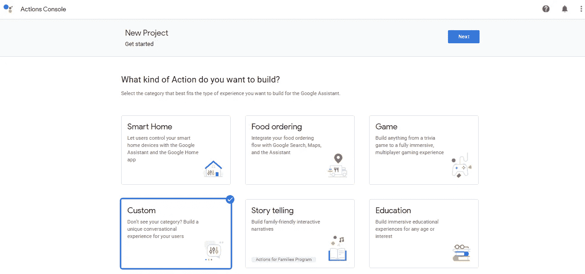
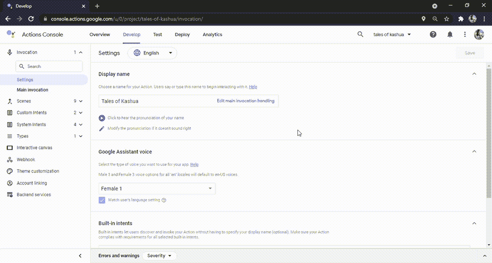
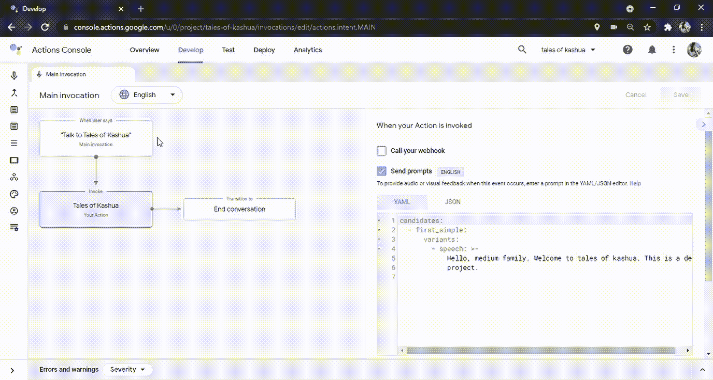
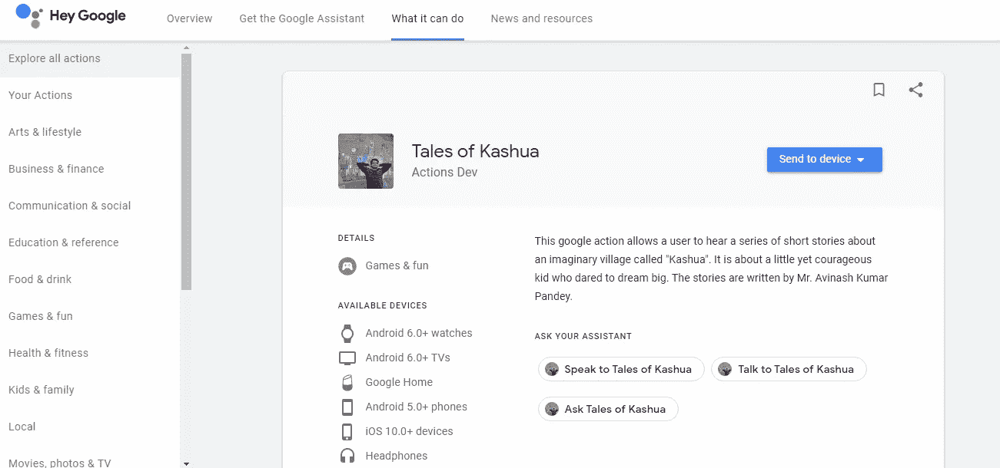

# 在一天之内创建你的第一个谷歌行动

> 原文：<https://medium.com/geekculture/how-i-designed-my-first-google-action-within-a-day-54cfe8964ffd?source=collection_archive---------35----------------------->

Image by [Bence Boros](https://unsplash.com/@benceboros) from [Unsplash](https://unsplash.com/)

作为一名软件工程师，我喜欢开发新的东西，开始使用 Google Action 开发一直是我的工作清单。在这篇博客中，我向你展示了一个创建你的第一个谷歌行动的非常干净漂亮的方法。

**谷歌助手**是谷歌开发的人工智能虚拟助手，主要用于移动和智能家居设备。创建 Google Actions 允许你开发和分发*你的*功能，并将它们与 Google Assistant 的能力和范围相结合。从你今天的第一个动作开始吧。

## 先决条件

没有制定此类行动的要求。开发的 action 可以在任何支持 Google Assistant 的设备上测试，比如你的手机、Google Home，甚至 Action 的控制台页面本身！

## 在控制台上创建 Google 行动项目

1.  转到 Google Action [控制台](https://console.actions.google.com/u/1/)，使用您想要在所有支持助手的设备上用于开发和测试的电子邮件 Id 登录。
2.  点击“新项目”选项。试着给你的项目起一个好名字，这个名字将反映你的行动将会做什么。
3.  接下来，系统会提示您输入想要构建的动作类型。作为初学者，推荐你选择“自定义”->“空白项目”。这将允许你从头开始创建任何你选择的东西。但是，您可以选择包含启动项目的其他选项。
4.  点击“开始建造”,瞧！您刚刚创建了您的第一个 Google 动作控制台项目。

Figure 1: Creating a New Google Action Console Project

## 祈祷

您的操作应该指定如何调用任务。比如 *Ok Google，跟<对话显示名称>*。请参见下面的 GIF 1，了解如何调用您的操作。

GIF 1: Adding a ‘Unique’ Display Name to the Project

## 主调用

为了使您的第一个动作更容易，假设您只希望在调用它时该动作向您致意。这是您的操作项目唯一需要的调用。用户说一句类似于*“好的，Google，跟<显示名称>”*的话来匹配这个意图，你通常用一条欢迎消息来问候用户。

下面的 GIF 展示了如何创建一个问候调用。

GIF 2: Writing the Main Invocation

## 测试动作

这也许是最重要的部分。我过去常常在每次按下保存按钮时测试我的动作。您应该确保您所做的更改是否被反映出来。要测试，请看下面的 GIF。

GIF 3: Testing the Google Action on the Console.

看看测试你的动作有多简单。您也可以在启用了谷歌助手的情况下使用手机。请确保使用与项目使用的电子邮件 id 相同的电子邮件 id 登录您的移动助手。

## 释放操作

每当您准备好释放您的操作时，只需遵循以下步骤:

1.  转到“*部署*选项卡。
2.  输入必要的详细信息，如描述，图像，联系方式，隐私和同意，调用短语。
3.  当你继续添加图片时，请注意，在屏幕的左侧，你将能够看到你的操作页面的外观。我的看起来有点像图。
4.  填写完所有必要的详细信息后，从左侧窗格导航至“*发布*”选项。
5.  点击*“开始新发布”*。您将被要求选择发布类型。谷歌行动可以在不同阶段进行测试，即 *Alpha* 、 *Beta* 和*生产*。如果你构建一个动作只是为了理解动作是如何工作的，你可以跳过 alpha 和 beta 版本。但是，您可以尝试将您的家人或朋友添加为 alpha 测试人员，让他们使用一段时间来发现一些潜在的错误，然后再向世界其他地方发布。
6.  假设你点击“*制作*”作为发布渠道。将提供一份清单。我强烈建议你检查一下，以确保你的行为没有违反谷歌的任何政策。
7.  最后，点击提交按钮，你刚刚提交了你的第一个谷歌行动批准！为你干杯，干得好。

## 下一步是什么？

一旦您提交行动进行审核，您将收到一封确认电子邮件。如果你的行动非常简单明了，不太复杂，不需要超过 3 天的时间就能得到评估。如果你的行动第一次没有被批准，不要担心。这也发生在我身上。

> 我个人喜欢谷歌行动审核过程的一点是，行动审核者会为你提供一份行动未获批准的详细说明。它们不会留下任何混淆的范围，您可以轻松地跟踪问题，纠正它们，并重新提交行动进行审查。

## 警告

1.  谷歌动作控制台不断更新。因此，当您创建操作时，此博客的内容可能与门户不匹配。不过不要担心，它们不会做出很大的改变。
2.  请务必提交设置为“对所有人可见”的政策 pdf 或 doc 文件。如果用户看不到您的隐私政策文档，您的操作将被拒绝
3.  此外，该文件应提及您如何收集或存储用户数据。如果你不是，就提同样的问题。确保隐私文档尽可能透明。
4.  请使用关键字提供示例调用短语，如: *"* ***与*** *<通话显示名称>"，* ***与*** *<通话显示名称>* "或****询问*** *<显示名称>"。您的示例调用应该有适当的结构。**
5.  *确保该操作不会在不使用媒体响应的情况下连续播放非流媒体或向用户回读文本超过 240 秒。*

## *结论*

*在这篇博客中，我们学习了如何构建一个非常基本的谷歌动作。我们还详细讨论了行动的测试、发布和审查过程。如果你想在*动作*中看到我的动作，去你的谷歌助手启用的设备，只需说*[*好的谷歌，跟卡舒亚的故事*](https://assistant.google.com/services/a/uid/0000008a6e1b1e90?hl=en) *。*那么，今天就开始尝试建筑行动吧，请**在评论区分享你的行动链接。我会非常高兴看到那个**。**

****

**Figure 2: My First Published Google Action, ‘Tales of Kashua’**

## **承认**

**作者要感谢 Avinash Kumar Pandey 先生允许在制作这部电影时使用他的故事。他是一个狂热的作家，卡舒亚的故事是他的想象和个人经历的产物，被写成了一系列完美的故事。**

**还有，你可以在 [Twitter](https://twitter.com/SwatiRajwal) 和 [LinkedIn](https://www.linkedin.com/in/swati-r-84682b12b/) 上问我一个问题！**

## **参考**

**[1]构建调用模型|对话操作| Google 开发者。(2021).检索于 2021 年 6 月 16 日，来自[https://developers . Google . com/assistant/conversatile/build/invocation](https://developers.google.com/assistant/conversational/build/invocation)**

**[2]发布您的操作|操作控制台| Google 开发者。(2021).检索于 2021 年 6 月 16 日，来自[https://developers . Google . com/assistant/console/publish # prepare](https://developers.google.com/assistant/console/publish#prepare)**