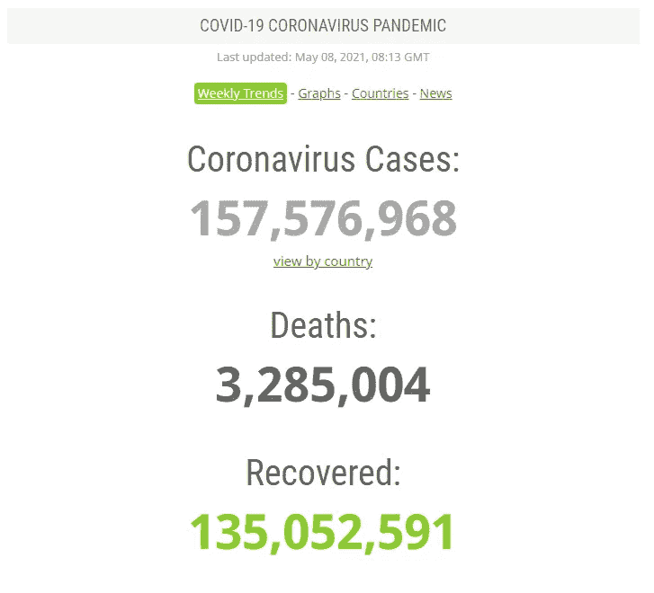
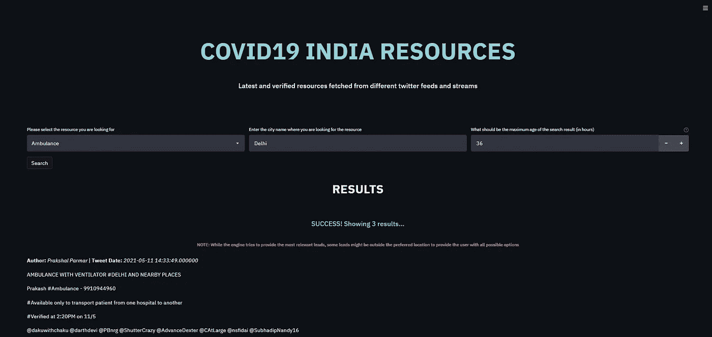

# 我如何开发一个全功能的 COVID19 资源搜索引擎

> 原文：<https://medium.com/geekculture/how-i-developed-a-fully-functional-covid19-resources-search-engine-9f9a757eb3f0?source=collection_archive---------22----------------------->

## 我创建快速、全面且可用的 COVID19 资源搜索引擎的旅程

我最近失去了一个亲近的人。他不是血亲，但我从小就认识他。他是我认识最有趣的叔叔。是的，知道。他死于冠状病毒。

自去年以来，冠状病毒或 COVID19 就像一场世界末日的噩梦一样笼罩着我们。死亡人数超过 300 万，这是现代史上最大的一次生物灾难。



A grim picture of Coronavirus [https://www.worldometers.info/coronavirus/](https://www.worldometers.info/coronavirus/)

随着世界慢慢地从它的魔爪中解脱出来，我的国家——印度突然成为致命的第二次浪潮的牺牲品。数千人在几周内死亡，许多人生命垂危。但是，这仅仅是因为病毒吗？不，这是因为与工作量相比，资源严重不足。随着每一天的过去，随着病例的增加，可用资源的数量正在减少，现在它已经成为一个困扰市民的寻宝游戏，为他们处于困境中的亲人获得必要的物品。

一些最稀缺的资源是氧气、基本药物、医院病床、生命支持服务等等。虽然许多人能够得到一些，但并不是所有人都足够幸运。据观察，由于缺乏线索，许多人无法获得资源。他们不知道应该向谁寻求帮助，也不知道应该追寻哪条线索。

我的那个叔叔也发生过类似的事情。如果我们找到一些线索，也许他会活下来。但是，我们没有。从这么近的地方看着它，点燃了我内心的某些东西。我必须做点什么。在这次疫情中，我至少要尽自己的一份力量

> *所以，我为 covid 资源创建了一个搜索引擎。要访问它，请访问:*
> 
> [***covid 19***](https://india-covid-resource-finder.herokuapp.com)

为了便于阅读，我将这篇文章分成以下几个部分:

*   如何使用发动机
*   它是如何工作的
*   履行
*   上诉

# 如何使用发动机

***注:我在做了视频之后稍微改动了一下 UI。功能保持不变***

使用该应用程序很简单:

*   从下拉列表中选择资源
*   输入您正在搜索资源的地方的名称
*   输入推文的最大年龄
*   搜索！

我附上了一个无声的视频，强调了搜索资源的步骤。该引擎还允许您转到原始推文来验证线索。

# **工作原理**

现在，我们来谈谈它是如何工作的。这个搜索引擎的来源是 Twitter。我注意到很多好心人在 Twitter 上发布他们的线索供人们使用。然而，并不是每个有需要的人都有推特账号。此外，浏览巨大的 Twitter feed 来寻找特定资源的线索可能很麻烦。因此，这个搜索引擎被设计来做这个繁重的工作。

我耐着性子浏览了许多推文，观察其中是否有任何可辨别的模式。确实有。看完之后，我观察到了以下模式:

*   大多数情况下，领导者在他们的推文中使用#已验证标签
*   大多数推文都是针对特定资源发布的。然而，每当发布一条线索时，就会发布一个与该资源相关的特定标签。例如，许多等离子导线中含有#plasma。所有的氧气导管都有#氧气#氧气瓶
*   很少有线索提供了位置。但是，有趣的是，或者我应该说幸运的是，他们中的许多人有一个基于位置的标签。例如，#bangalore 代表班加罗尔的潜在客户
*   出现了很多转发，这些必须被删除

使用上面的简单观察，我决定运行一些特别的查询。结果很有收获。有了正确的标签组合，许多有用的线索开始出现在搜索中。所以，我决定在我的引擎中使用这种搜索技术

# **实施**

首先，在我们开始之前，您可以从这里克隆或派生实现:

> [https://github . com/abhikchakraborty 92/India-covid-resource-finder . git](https://github.com/abhikchakraborty92/india-covid-resource-finder.git)

现在，在实现时，挑战是以尽可能简单的方式实现上述搜索机制，并以最少的麻烦将结果提供给公众，不管有没有 Twitter 帐户。我将我的实现分为两个部分——后端和前端

## ***后端***

为了实现搜索，我使用了 Twitter API。Twitter 提供了很好的 API 来使用我们在网站中使用的搜索查询来搜索推文。以下是我遵循的步骤:

*   首先，我创建了一个开发者帐户。同去[https://developer.twitter.com](https://developer.twitter.com/en/apply-for-access)。步骤很简单。一旦获得批准，您就可以开始工作了！
*   之后，我创建了一个开发人员应用程序，它允许我获取用于 Oauth2 身份验证的 API 密钥和秘密。要了解更多，请访问这里:[https://developer.twitter.com/en/docs/apps/overview](https://developer.twitter.com/en/docs/apps/overview)
*   完成后，我还创建了一个开发者项目。一个项目允许在一个月内搜索 50 万条推文。此外，还需要使用新的 Twitter 2.0 APIs。更多信息请点击这里:[https://developer.twitter.com/en/docs/projects/overview](https://developer.twitter.com/en/docs/projects/overview)
*   为了搜索，我使用了 Twitter 2.0 最近推文搜索 API。API 需要一个强制查询字符串来搜索推文，并且可以搜索最近 7 天的推文。它还有其他可以使用的参数。更多信息请点击这里:[https://developer . Twitter . com/en/docs/Twitter-API/tweets/search/API-reference/get-tweets-search-recent](https://developer.twitter.com/en/docs/twitter-api/tweets/search/api-reference/get-tweets-search-recent)
*   现在，为了搜索推文，我创建了一个相关的函数，接受用户输入并将其转换为标签。之后，这些 hashtags 被连接在一起，形成 API 的查询字符串。典型的查询字符串如下所示:

```
#plasma and #verified and #kolkata and -is:retweet
```

上面的人会在加尔各答寻找与血浆有关的线索。添加 **-is: retweet** 是为了过滤掉结果中的任何 retweet。

TwitterAPI fetch script

现在，我们来谈谈 twitterapi 代码。上面已经提供了同样的内容。

twitterdata 类负责使用 **generatetoken** 函数生成 Oauth 访问令牌

主函数是 **gettweets** 函数，它获取查询、自最早的 tweet 发布以来的小时数、一次最多的结果以及分页的下一个页面标记。

该函数中的**小时**参数有助于确定自使用 **generatestarttime** 函数获取推文以来的最早日期。

**generateheader** 和 **generateparam** 是**getweets**的辅助函数。在 generateparams 函数中，query 用于定义搜索 *query* 和 *tweet.fields* 用于定义从 API 获取什么数据。

最后， **parsetweets** 函数用于生成包含 tweets 和相关细节的字典。它使用一个名为 **generateuserid** 的函数，该函数根据从 tweets 中获取的 **author_id** 生成用户详细信息

## ***前端***

这是整个项目中最简单的部分，这要感谢我最近开始使用的这个名为 **streamlit** 的超棒的库。更多关于这个库及其用途的信息可以在这里找到:[http://streamlit.io/](http://streamlit.com/)



UI of the implementation

现在，为了创建界面，我想到了最小化。因为我没有收集任何用户信息的意图，所以这是一件容易的事情。以下是步骤:

*   我创建了一个用户界面，要求用户输入 3 个值——他们想要的资源、他们想要的位置和推文的最长时间(以小时为单位),因为 Twitter API 最多返回 7 天的数据
*   接下来，我添加了一个名为“搜索”的按钮，它基本上触发了一个名为 **searchresources** 的集成函数，该函数将用户数据转换为搜索查询，并将输入的数据发送给 twitterapi 函数 **gettweets** 以获得结果
*   然后，同一个集成函数清理作为字典获得的 tweets 数据，消除重复，并创建一个熊猫数据框架
*   最后，UI 以搜索结果的形式呈现该数据框架中的数据

作为参考，以下是必需的代码片段:

**UI.py**

**积分功能**

我没有包括任何部署应用程序的部分，因为现在我正在使用免费的 heroku 服务器来分享这个。你可以在这里获得更多关于 heroku 部署的信息:[https://dev center . heroku . com/articles/getting-started-with-python](https://devcenter.heroku.com/articles/getting-started-with-python)

此外，这是一个在 heroku 上部署 streamlit 应用程序的精彩视频

# **上诉**

现在，我们已经到了这篇文章的结尾，我想向我所有的读者发出一个小小的呼吁:

*我知道这不是一个完美的实施。我现在正致力于通过提高搜索效率、速度、定制域名和增加新资源来改善体验。然而，这一实施背后的驱动力和主要原因是我失去了一个亲近的人。*

如果我能用这个工具帮助和拯救哪怕一个人，我会认为这个实现是一个巨大的成功。因此，我请求阅读本文的读者考虑与任何需要 COVID19 资源帮助的人共享此工具。如果我们对足够多的人说足够多的次数，我们就有越来越大的机会一起拯救他人

感谢您的阅读和分享。让我们一起战斗吧。干杯！