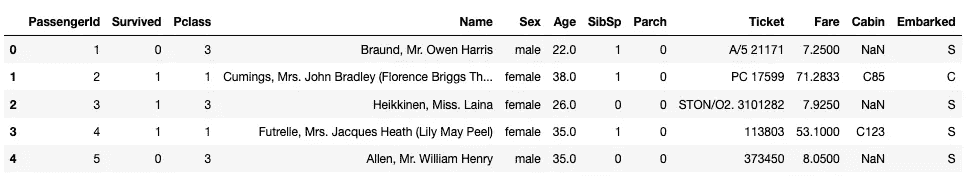
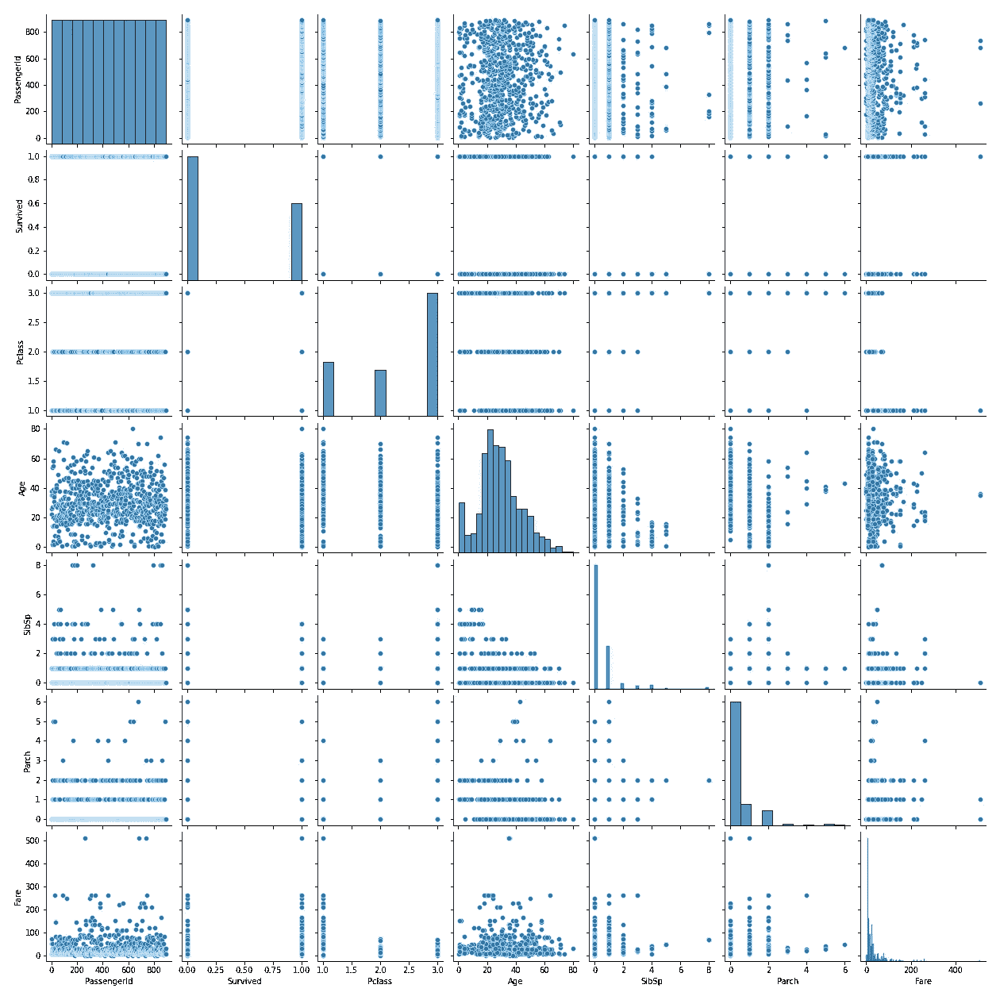
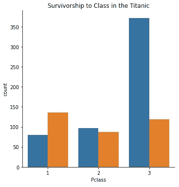
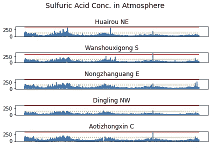
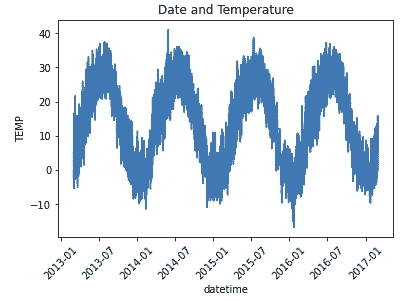

# 数据可视化最简单的方法

> 原文：<https://medium.com/geekculture/how-i-do-my-visualizations-in-python-6a430d843ab9?source=collection_archive---------17----------------------->


Photo by [Francesca Saraco](https://unsplash.com/@fransaraco?utm_source=medium&utm_medium=referral) on [Unsplash](https://unsplash.com?utm_source=medium&utm_medium=referral)

探索性数据分析的数据可视化是数据科学过程中最关键的步骤之一。它发生在我们清理数据之后，但在我们进行机器学习之前。这一重要步骤允许我们通过提取只有可视化才能提供的关系和模式来洞察我们的数据。他们可以告诉我们哪些特性在我们的模型中是重要的。它可以揭示只有 EDA 和可视化才能揭示的故事。我意识到颜色、字体和风格是制作有效图表的重要组成部分。有很多在线教程和 API 可以解决这个问题。然而，我想把重点放在制作显示关系和模式的图表上。我们下次再看。

因此，让我们导入泰坦尼克号数据集来说明我的观点。我今天要讲的情节是关于海伯恩的配对情节、猫情节、支线情节和总情节。Seaborn 和 Matplotlib 都是很棒的库。对于许多初学者来说，使用这两个库的组合来构建可视化节省了时间和麻烦，因为一些特性在每个平台上都更容易操作。

让我们导入:

```
#necessary libraries
import pandas as pd
import matplotlib.pyplot as plt
%matplotlib inline
import seaborn as sns
```

加载我们的泰坦尼克号数据集。

```
#reading csv
df=pd.read_csv('train.csv')
df.head()
```



## 配对图

作为对这个数据集的第一次检查，可以从一个 pairplot 开始。pairplot 将我们数据集的每个要素绘制成图表，以显示每个变量之间的 x/y 关系。代码的实现非常简单

```
#the pairplot
sns.pairplot(data=df)
```

这产生了:



Pairplot of Titanic Dataset

在这种情况下，它有一点点用处，因为有很多分类变量，但不应该作为 EDA 过程的主要部分而被忽略。

## 猫图

我要讨论的下一个情节是猫情节。catplot 绘制不同类别的计数，因此得名。泰坦尼克号数据集的 catplot 的一个非常有用的实现是乘客等级与生存关系。这是 Seaborn 上的一个简单代码。我首先用以下方法分离出所需的数据

```
#separating the relevant data in our graph
df=df[['Pclass', 'Survived']]
fig=plt.figure()
sns.catplot(x='Pclass', data=df, kind='count', hue= 'Survived')
plt.show()
```



PClass = 1 (highest) 3 (lowest), Orange = Survived, Blue = Perished

## 陪衬情节

在 catplot 之后，我发现有时我想在一个图中显示许多图表来说明一个主要思想或关系。这就是支线剧情出现的时候。它可以通过多种方式完成，但本质上，支线剧情是以行和列排列的迷你剧情。让我来告诉你形成支线剧情的最快方法。

为了更好地说明我的观点，我切换到另一个数据集。这个数据集是北京空气质量数据集，可以在这里下载。

[](https://www.kaggle.com/sid321axn/beijing-multisite-airquality-data-set) [## 北京多站点空气质量数据集

### 北京市 6 种主要空气污染物的多点测量

www.kaggle.com](https://www.kaggle.com/sid321axn/beijing-multisite-airquality-data-set) 

这个子情节的代码是:

```
#identifying the number of subplots in fig
fig, axs = plt.subplots(5)
fig.suptitle('Sulfuric Acid Conc. in Atmosphere', fontsize=14, va= 'baseline')#giving axs numbers according to subplot
axs[0].plot(df5.datetime, df5.SO2)
axs[1].plot(df.datetime, df.SO2)
axs[2].plot(df4.datetime, df4.SO2)
axs[3].plot(df9.datetime, df9.SO2)
axs[4].plot(df11.datetime, df11.SO2)axs[0].title.set_text('Huairou NE')
axs[1].title.set_text('Wanshouxigong S')
axs[2].title.set_text('Nongzhanguang E')
axs[3].title.set_text('Dingling NW')
axs[4].title.set_text('Aotizhongxin C')
for axs in axs:
    axs.set_xticks([])
    axs.hlines(y=125, xmin='2013-03-01', xmax='2017-02-28', color='orange', label='mean/day', linestyles='dotted')
    axs.hlines(y=350, xmin='2013-03-01', xmax='2017-02-28', color='red', label='hour/day')
plt.xticks(rotation = 45)
plt.tight_layout()
fig.subplots_adjust(top=.85)
plt.show()
```

请注意，第一行代码告诉我们要创建的子情节的数量，下一部分代码告诉我们要绘制哪个用 axs 表示的图形。图表变成:



Sulfuric Acid Concentrations in 5 areas of Beijing

## 一般情节

我将介绍的最后一种图并不真正被称为通用图，但它是我在获得正常 x/y 数据时在 Seaborn 上使用的基本通用图。在这个图上要知道的最重要的事情是有许多图表类型供你选择，所以要明智地选择。不同的图表类型有线形图、条形图、直方图、箱线图、紫线图、散点图等等。我不会去探究他们每个人擅长展示什么，只要知道总有一个图表适合这项工作。

对于这些基本的图表类型，我的一般策略是绘制 x 轴，然后 y 轴，检查你的刻度标签，设置图例和标题，看，一个基本的通用图表来说明你的观点。

```
#lineplot with the x and y axis data
sns.lineplot(x=df4.datetime, y=df4.TEMP)
plt.title('Date and Temperature')
plt.xticks(rotation=45)
```



我已经看完了配对图，猫图，支线图，以及可供你使用的不同基本图形的基本图。在我强调的案例中，我选择它们是因为它们在 EDA 过程中被证明是有用的。我希望你读这篇文章的时候和我写这篇文章的时候一样开心。视觉化让世界变得更美好。他们总结、简化并揭示我们数据中推动洞察力的模式。利用它们成为你的优势。