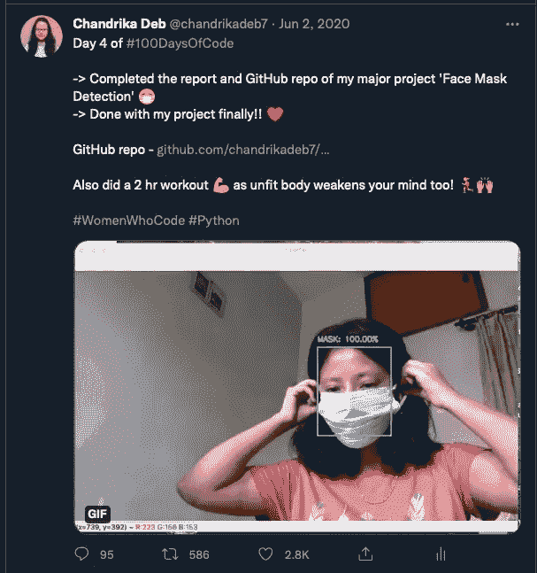
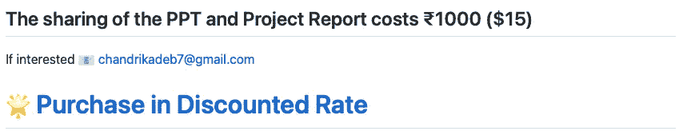
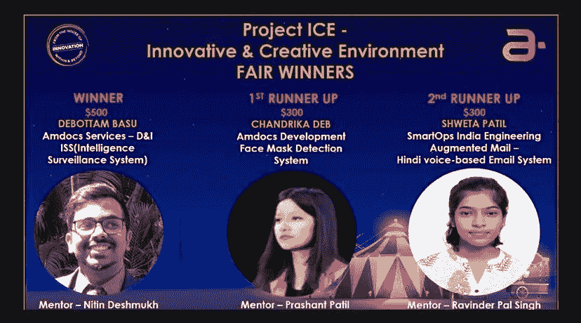
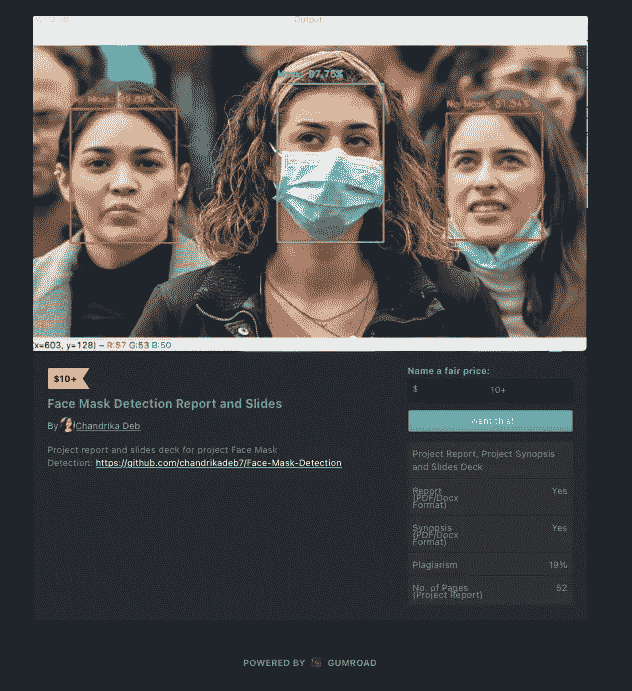

# 我是如何从兼职项目中赚到 1000 多美元的？

> 原文：<https://medium.com/geekculture/how-i-earned-more-than-1000-from-a-side-project-7b2475ff9f62?source=collection_archive---------5----------------------->

## 0%吹牛，50%赚钱的想法，50%动力🚀

Photo by [Tech Daily](https://unsplash.com/@techdailyca?utm_source=medium&utm_medium=referral) on [Unsplash](https://unsplash.com?utm_source=medium&utm_medium=referral)

# 放弃

这个故事不是为了吹嘘我的兼职收入，而是为了给你一些如何将你的项目货币化和品牌化的想法，这将使你长期受益！

# 怎么开始的？

这一切都始于推特上一条疯传的帖子。是啊！一条推文…🌈

去年的疫情真的很有挑战性，我的清单上有很多待办事项。从上学期的项目到我的全职开发人员角色的持续培训，在 Twitter 上有这个 **#100DaysOfCode** 挑战趋势(直到今天)。

这个演示 gif 在一周内为我赢得了数千个印象，数百个 GitHub repo 上的星和叉，以及数十封要求项目交付和安装指南的邮件。

几个月后，我提交了我的项目并毕业了👩‍🎓但是这种创新一直伴随着我，在我的脑海和心中！❤️

# 六个月后

我决定将我的项目报告和幻灯片套现，并在我的 **GitHub 库自述文件**中更新。

## 但是我们能做到吗？有风险吗？

尽管是一个开源项目，项目报告和幻灯片并没有公开。因此，我可以为我没有剽窃的努力工作标价，没有法律禁止我这样做！

## 成本怎么定？

我建议将你的产品分成三个主要部分

*   代码的页数/幻灯片数/行数
*   每月需求
*   相同产品的近似市场价格

列出这些方面肯定能帮助你为你的项目可交付成果凑出一个数字。

# 传播消息！

建立网上形象可以在很多方面帮助你。感谢我的 Twitter、GitHub 和 LinkedIn reach。

在一个月内分享多篇关于你能提供什么的帖子。让你的读者相信，你所交付的产品会给他们的学习路线图增加一些价值和知识。

了解你的目标受众，付出额外的努力去接触他们。使用相关的标签和平台来传播你的话。

我分享了多个帖子，每周都有相同的推文吸引了大量的流量。也可以写博客或者拍视频差不多！

 [## LinkedIn 上的 chand rika Deb:# github # project # face mask | 17 条评论

### 🎉庆祝小小的个人成就！🎉去年，我提交了面具检测的项目😷作为我的…

www.linkedin.com](https://www.linkedin.com/posts/chandrika-deb_github-project-facemask-activity-6804421971158335488-QS6T)  [## LinkedIn 上的 Chandrika Deb:口罩检测报告和幻灯片

### "你的大学期末专题至关重要"为什么？让我们把它挖出来👇🏻 📌对…的最佳投资

www.linkedin.com](https://www.linkedin.com/posts/chandrika-deb_face-mask-detection-report-and-slides-activity-6821508104455274496-WWwY)  [## LinkedIn 上的 chandrika Deb:chandrikadeb 7/Face-Mask-Detection | 29 条评论

### 在 Github 上庆祝 500 颗星！我非常荣幸地宣布我的 Github“面具”库…

www.linkedin.com](https://www.linkedin.com/posts/chandrika-deb_chandrikadeb7face-mask-detection-activity-6735794355791028224-UYz_) 

# 贡献和认可

我非常感谢 GitHub 上 30 多个贡献者对这个项目的贡献，以及创建的几个拉请求。

谈一谈识别，这个项目已经成为许多开源项目的一部分，并且是创新黑客马拉松的获胜者。

参见[项目自述](https://github.com/chandrikadeb7/Face-Mask-Detection)了解更多。🦄

# 现在

项目可交付成果以及项目可交付成果的详细信息现已发布在 [Gumroad](https://medium.com/u/4e3295cc7a0b?source=post_page-----7b2475ff9f62--------------------------------) 上。

要了解更多关于我的项目→ [请访问 GitHub](https://github.com/chandrikadeb7/Face-Mask-Detection)

要购买项目交付成果→ [请访问 Gumroad](http://gum.co/getfacemask)

## *感谢阅读到最后！希望有帮助…👩‍💻*

*如有任何疑问或只是打个招呼，请随时与我联系！👇*

 [## 软件工程师

### Chandrika Deb 是 Amdocs 的一名软件工程师，她喜欢学习新事物和帮助技术初学者。

chandrikadeb7.github.io](https://chandrikadeb7.github.io)