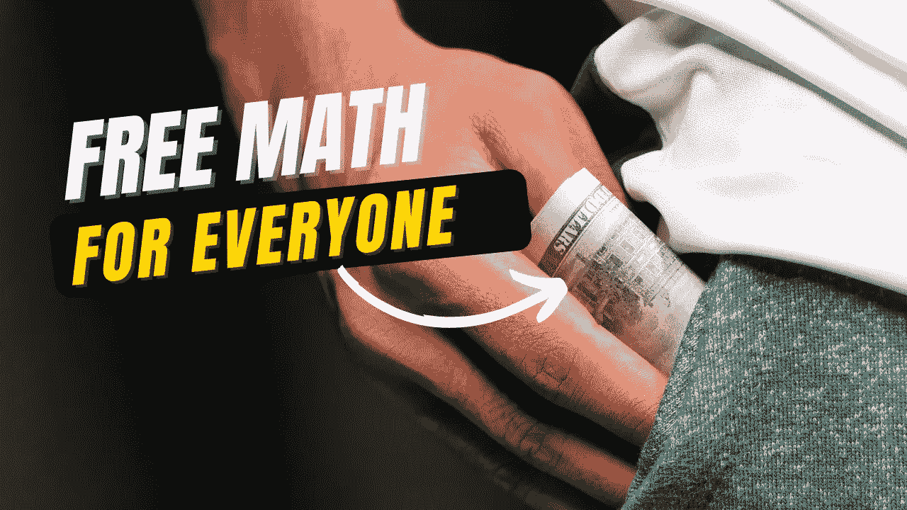

# 我是如何免费得到 25000 道数学题的——理解网络抓取

> 原文：<https://medium.com/geekculture/how-i-ended-up-having-25-000-math-problems-for-free-f460dbb5e193?source=collection_archive---------6----------------------->

## 深潜

## 如果你跟着读，你也能得到它们！



Image from [Canva](https://www.canva.com/) edited by the [author](http://dwiuzila.medium.com/membership)

```
**Table of Contents**[🧮 Problem Scoping](#5053)
[🌐 Web Scraping](#58b6)
   ∘ [Scraping One Contest](#975d)
   ∘ [Scraping Tags of One Contest](#9281)
   ∘ [Scraping One Contest and Its Tags](#de65)
   ∘ [Scraping All Olympiad Contests](#40c2)
[🧹 A](#4519)…
```