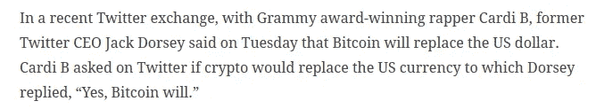

# 我如何使用加密货币兑换脚本来节省我的 51，000 美元

> 原文：<https://medium.com/geekculture/how-i-figured-out-to-save-my-51k-using-a-cryptocurrency-exchange-script-6a11102b37a1?source=collection_archive---------12----------------------->

Cryptocurrencies

在今天的金融市场上，期货正蓬勃发展。加密货币是一种使用加密算法创建的数字货币。除了股票和债券，这些数字货币几乎参与了所有的股票经纪业务。为什么密码成为金融市场的热点？仅仅是因为其良好的利润率。此外，人们选择加密货币是因为它们的实用性和安全性。由于其利润范围，许多人已经寻找进入加密业务一段时间了..

随着加密技术的发展，人们应该了解加密交换和加密交换脚本。金融领域技术的广泛发展使得数字金融市场蓬勃发展。这个新兴的数字市场是每个人的最佳领域，尤其是对数字金融市场感兴趣的企业家和数字交易者，以把握可能的成功机会。

# 加密交换脚本概述

Cryptocurrency exchange

> 许多投资者和企业家将 cryptos 视为一项潜在的投资。由于密码是一种数字货币，它需要一个数字平台来购买、出售和交易它们。帮助用法定货币购买加密货币的平台被称为加密货币交易所。这些交换是使用脚本构建的。 [**加密货币兑换脚本**](https://www.appdupe.com/cryptocurrency-exchange-script) 是一个预先构建的源代码，帮助您创建一个像比特币、莱特币、以太(ETH)、Ripple 等数字资产的交易平台。

# 为什么要选择加密交换克隆脚本？

从头开始开发加密交换软件是一项耗时的工作，并且需要大量的资金。这就是为什么大多数企业和个人转向加密交换克隆脚本，因为它们节省时间，并有自己的好处。从头开始创建 exchange 脚本时，需要更多的资源来保持项目的稳定。所需的资金量几乎不可能通过所有现有平台获得，潜在投资者对投资新项目的兴趣很低。

Source: Indian Express

企业主对加密交换克隆脚本更感兴趣，而不是从头开始开发它们。当你知道它的好处时，最好选择加密交换克隆脚本。 [**加密货币交易所克隆脚本**](https://www.appdupe.com/cryptocurrency-exchange-script) 提供的好处是省时、可定制、成本低、工作量减少、可扩展性、品牌识别快、成功几率高。

## 一些顶级的加密交换克隆脚本是

*   币安克隆脚本
*   本地比特币克隆脚本
*   Paxful 克隆脚本
*   Uniswap 克隆脚本
*   Pancakeswap 克隆脚本
*   雷米塔诺克隆脚本
*   库科恩克隆脚本
*   火币克隆脚本

# 有几种类型的加密交换:

Crypto trading

## 集中式交换开发

在 [**集中式交换**](https://en.wikipedia.org/wiki/Cryptocurrency_exchange) 的开发中，加密交换平台是通过某种权威或治理来协调的。当只有公司监管所有交易，规则和费用由公司发布时，就称之为集权。一些集中的交易所平台有**币安**、**比特币基地** (pro)、Bitfinex、北海巨妖、火币环球、Kucoin、Bithumb、Bitstamp 等。

## 分散式交易所发展

促进交易者在没有任何中介的情况下以非托管方式进行密码交易的平台被称为分散式交易所。它是一个点对点的平台，用户可以在没有任何中介的情况下进行交易。一些分散的交换平台有 DeFi swap、Uniswap、Pancakeswap、Curve、1inch 等。

## 点对点交流开发

P2P 密码交换开发是用户可以在交易者之间直接交换密码。一些 P2P 加密交换平台有币安 P2P、Paxful、ByBit P2P、火币 P2P、Bisq 等。

## 混合密码交换发展

混合加密交换致力于消除分散交换中的可扩展性问题。它允许用户使用他们的私人密钥，而且不收手续费或汽油费。混合加密交换的一个例子是“Joyso”和“TROY Joyso”

> 这些是加密交换的主要类型。还有其他交易所，如白标加密交易所、加密货币交易所法律解决方案和交易所上市服务。

# 如何获得您的加密交换脚本？

人们可以从加密交换软件提供商那里开发他们的交换脚本。当你想建立自己的交换平台时，它应该是独特的，不应该与现有的相似。有了独特的功能和用户界面/UX 设计，这个平台将更容易获得成功，并获得广泛的潜在受众。在 [**开发您的加密交易平台**](https://www.appdupe.com/cryptocurrency-exchange-script) 之前，您应该向加密货币交易软件提供商提出您对交易平台的想法以及您希望您的平台的设计。

人们不应该忘记加密交换平台中的必要特征。加密交易平台的一些功能包括用户授权和验证、用户界面、钱包、API、交易引擎、管理控制台、分析以及推送通知和警报。

## 最后的想法

许多 crypto space 软件提供商提供 Crypotexchange 克隆脚本服务。加密货币正在改变数字金融市场。人们投资它们是明智的。对于企业家和企业主来说，加密交换平台也是一个好主意。在 exchange 克隆脚本出现之前，从头开始开发加密交换平台很累，而且需要更多资金。现在，在加密货币交换软件提供商的帮助下，我们可以使用加密交换克隆脚本定制自己的交换平台。提出你对平台的想法，尤其是你对 UI/UX 设计和特性的想法，是很重要的。一旦开发人员知道您想要什么，以及您希望您的交换平台是什么样的，他们就很容易根据它来定制脚本。通常，部署一个从头开发的加密交换平台需要几个月的时间。但是使用 exchange 克隆脚本，平台将在几周内开发、测试并准备好部署。