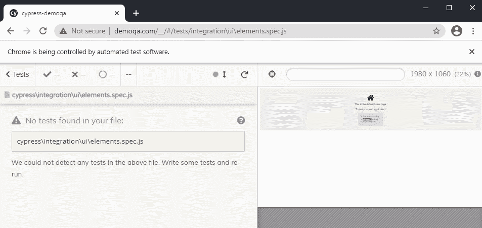
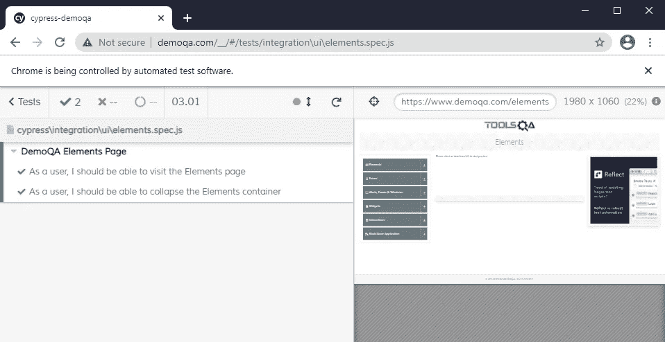
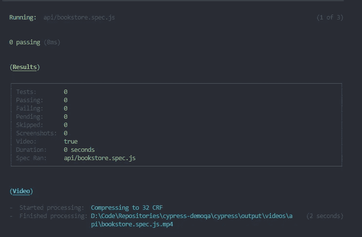
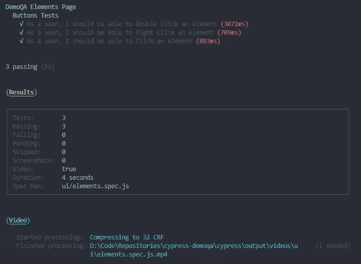

# 我如何用 Cypress.io 过滤测试

> 原文：<https://medium.com/geekculture/how-i-filtered-tests-with-cypress-io-9c7a85460a1d?source=collection_archive---------1----------------------->

## 了解如何使用 Cypress 测试框架通过标签过滤测试。


Photo by [Wade Austin Ellis](https://unsplash.com/@wadeaustinellis?utm_source=medium&utm_medium=referral) on [Unsplash](https://unsplash.com?utm_source=medium&utm_medium=referral)

测试自动化领域的一个常见实践是基于一组标准来过滤运行，无论是单独运行 UI 测试还是 API 测试。测试过滤有助于减少运行，从而使它们的范围适合手头的工作。

Cypress 不提供原生过滤测试运行的能力，这是一个自 2018 年以来一直存在的问题。相反，工程师必须编写他们自己的过滤方法来使用 Cypress。

我在北卡罗来纳州罗利的一家初创企业工作时遇到了这个问题。该商店有数百个用 Ruby 和 Python 编写的测试，但没有一个是用 JavaScript 编写的。有了丰富的 Python 和 Pytest 经验，我选择模仿我最喜欢的框架，**标记**。

Pytest 标记类似于标记，因为它们允许在完整运行期间确定测试范围。我可以选择一个目标(或者更多，如果我想的话)来运行，而不是运行整个套件。Pytest 会自动选择所有带有特定标记的测试并加载它们。所有其他测试都将被取消选择，因此不会在测试运行中进行处理。

在本教程中，我将教您如何为 Cypress 测试构建您自己的过滤器，它将基于一个(或多个)测试标签进行加载。

# 入门指南

对于任何新的 JavaScript 项目，我们必须使用 NPM 进行初始化。一旦我们有了`package.json`，现在我们可以开始装载柏树。

```
npm install --save-dev cypress
```

一旦安装了 Cypress，用 NPM 运行它，这样它就可以完成安装。

```
npx cypress open
```

当一个`cypress`目录被创建后，Cypress 就完成了安装。您还可以通过运行`npx cypress --version`来验证安装是否正确。

# 构建更好的过滤器

在谷歌上快速搜索“cypress 测试标签”会返回两个很好的结果:

1.  Marie Drake 的“使用标签过滤 Cypress 测试”
2.  TestersDock 的“如何将标签应用到 Cypress 测试中”

第一篇文章是我的解决方案的基础。第二篇文章使用了我不太喜欢的 GREP 解决方案。实际上，我最终为一家使用 TestersDock 提出的 GREP 解决方案的公司工作，结果喜忧参半。我们发现 GREP 会引入不属于它的测试，仅仅因为在测试描述中写了一个词。例如，包含单词“API”的测试将被拉入 API 套件。

我最终选择删除 GREP 解决方案，支持修改 Marie Drake 的原始提案。

我首先用函数`filterTests`在我的`support`目录中构建了一个`filterTests.js`模块。

The beginning of our filterTests method.

按照玛丽·德雷克的大纲，我添加了两个参数— `definedTags`和`runTest`。`definedTags`参数是一个字符串数组。`runTest`是包含一个模块内所有测试的函数。在这里，我创建了一个名为`tags`的 Cypress 环境变量。我选择使用`tags`而不是 Marie Drake 的“TEST_TAGS ”,因为 Cypress 环境变量是小写的，而不是大写和小写。

The addition of our environment variable, “tags”.

现在，我可以通过运行以下命令，使用 tags 环境变量打开 Cypress:

```
npx cypress open --env tags=api
```

我们需要一个条件来检查标签是否存在，以便对我们的标签采取类似于 Marie Drake 实现的行动。主要的区别是，我们不是在逗号上拆分，而是在斜杠上拆分。一旦找到，调用`runTest`方法来运行测试。

Conditional code for if “tags” is true.

# 运行不带标签的测试

上面的过滤器(以及 Marie Drake 提出的过滤器)将在所有情况下工作，除了那些没有提供环境标签的情况。尝试使用`npx cypress open`运行测试将会失败，因为我们没有默认运行测试的第二个条件。这是一个错误，因为在很多情况下需要运行整个套件。

简单地添加一个包含`runTest()`的`else`子句就可以了。

# 成品

您可以复制下面的要点，并将其粘贴到您的`support`目录下的`filterTests.js`模块中。继续阅读，了解如何在测试规范中使用过滤器。

Our finished filtering method.

# 过滤测试

我们可以通过将新建的过滤器导入到测试文件中来使用它，然后在第一个`describe`块之前添加一个方法调用。这样，规范文件中的所有测试都将被过滤。

An incomplete use of the filterTests method.

因为我们正在使用 Cypress 自动化 UI，所以我们可以向`filterTests`方法添加两个标签，“all”和“UI”。我已经写出了两个测试来演示过滤器的要点如下。

A properly filtered series of tests.

我们可以通过使用以下代码启动 Cypress UI 来测试我们的过滤方法:

```
npx cypress open --env tags=api
```

选择`elements.spec.js`并运行。



The result of using an “api” tag on a UI repository.

结果是没有找到测试，因为标签`api`与`filterTests`方法中的`definedTags`不匹配。为了在规范文件中运行测试，我们必须包含“all”或“ui”。



A properly filtered run using the “ui” tag.

# 使用 Cypress 模块 API 运行测试

通过创建包含 Cypress 运行参数的 JavaScript 文件，可以通过 Cypress 模块 API 过滤测试。例如，我们将创建一个在元素页面模块中运行所有测试的模块。

创建后，您可以在终端中运行以下内容:

```
node .\run-elements-tests.js
```

这将启动一个带有环境标签“elements”的自动化运行，它不应该加载任何不包含该标签的模块。



An unloaded test module.

跳过的测试将在所有区域显示零，因为 Cypress runner 中没有加载测试。



A loaded test module.

加载的测试模块将按预期运行。

# 项目目录

完成本教程后，您的目录应该如下所示:

```
cypress
    |__ integration
        |__ elements.spec.js
    |__ plugins
        |__ index.js
    |__ support
        |__ filterTests.js
        |__ index.js.gitignore
cypress.json
package-lock.json
package.json
README.md
```

# 摘要

一旦构建了一个定制的方法，用 Cypress 过滤测试就很容易了。使用环境变量，我们可以将测试标签传递给 Cypress，然后过滤掉超出我们运行范围的测试。如果我们选择不使用标签运行，我们可以有效地运行我们的存储库，不会有任何问题。

# 资源

1.  "要运行的过滤器或 Grep 特定测试(如 Mocha Grep 模式)问题#1865 Cypress-Io/Cypress . " *GitHub* ，hannah06，【github.com/cypress-io/cypress/issues/1865】T2。
2.  德雷克玛丽。"使用标签来过滤你的 Cypress 测试."*玛丽·德雷克*，玛丽·德雷克，2019 年 12 月 15 日，[www . Marie Drake . com/post/using-tags-to-filter-your-cypress-tests。](http://www.mariedrake.com/post/using-tags-to-filter-your-cypress-tests.)
3.  "如何应用标签到你的柏树测试，如烟雾，E2E . "*测试者码头*，2020 年 10 月 29 日，[testersdock.com/cypress-test-tags/](http://testersdock.com/cypress-test-tags/)。

**Jonathan Thompson** 是 Pendo.io 的高级质量工程师，专攻测试自动化。他目前和妻子以及一只名叫温斯顿的金毛猩猩住在北卡罗来纳州的罗利。你可以在 [LinkedIn](https://www.linkedin.com/in/jonathanmnthompson/) 上联系他，或者在 [Twitter](https://twitter.com/jacks_elsewhere) 或 [Github](http://github.com/ThompsonJonM) 上关注他。