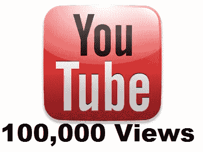
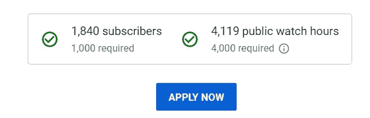
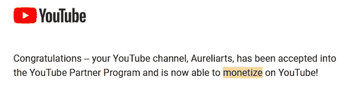

# 我是如何在 YouTube 上获得 100，000+的浏览量的！

> 原文：<https://medium.com/geekculture/how-i-got-100k-views-for-one-video-on-youtube-f59f3a2654ab?source=collection_archive---------18----------------------->

作为一个小 YouTube，一个视频在 YouTube 上跨越 10 万+的浏览量是一个巨大的进步。

我有一个 YouTube 频道，主要关注 [DIY 工艺品](https://www.youtube.com/c/Aureliarts)。做了很多不同 DIY 工艺的视频，一个视频就有十几万的浏览量。那个视频帮我跨越了 4000 小时和 1000 订户。这帮助我加入了 YouTube 合作伙伴计划(YPP)。

正如我们所知，我们必须在过去 12 个月内获得至少 4000 小时的观看时间和 1000 多名订户才能加入 YouTube 合作伙伴计划。

在制作这个视频之前，我只有不到 1000 名订阅者，我无法完成 4000 小时的观看时间。

但是，有一个视频帮助我进入了 YPP。

Minimum Eligibility Requirements for YPP

YouTube Partner Program

***保持阅读..你会看到视频:)***

在你制作视频之前，你必须考虑以下事情。

1.  ***视频的小众—*** 我的情况是选择 DIY/ How 工艺视频作为我的小众。当然，我的频道上还有子类别。您可以观看纸质工艺品、毛毡工艺品、管道清洁器工艺品、绘画、装饰品等视频。
2.  ***视频时间线—*** 这个点击量超过 100+k 的视频是在斯里兰卡卫塞节期间创作的。卫塞节是斯里兰卡的一个宗教节日，许多佛教徒都会庆祝。那是 2019 年，另一方面，因为科维德·疫情，这里被封锁了。人们不能出去。因此，他们在家做了卫塞节灯笼。这类视频在那段时间获得了更多的流量。

现在你制作了视频。那么你在上传视频到 YouTube 的时候就不得不考虑以下事实了。

1.  ***视频编辑—*** 如果能使用 **iMovie、Final Cut Pro、Adobe Premiere Pro CC** 等视频编辑软件编辑视频就更好了。但作为初学者，你甚至可以用手机编辑视频。
2.  ***引人注目的缩略图—*** 这是上传视频到 YouTube 的重要事实之一。缩略图应该引人注目。当人们搜索视频时，在标题之后，他们首先会注意到的是视频的缩略图。
3.  ***视频标题—*** 标题是必须的，是很重要的东西。写一个好的标题将有助于你的视频被正确的人找到。标题是可以使用关键字的关键字段。
4.  ***视频描述—*** 你可以在描述里告诉观众你的视频。这是对视频的总结。描述是可以使用关键字的关键字段。
5.  ***谨慎使用标签/关键词—*** 正确的关键词/标签可以增加视频的可及性。但是，标签在帮助观众找到您的视频方面所起的作用微乎其微。(YouTube 是这么说的^_^)

Tags

How to make a Vesak Lantern | How to make Paper Lanterns

再说一次，我不像其他 DIY YouTubers 那样是一个“大”的内容创作者。但是，我仍在努力拓展我的渠道。[学习与成长:]

我根据自己的经历写了这篇文章，我希望这能帮助像我一样的其他小 YouTubers 用户增加他们的观众。

我会写更多关于如何扩大你的 YouTube 频道的细节。

看看我的频道-

 [## Aureliarts

### 嗨！欢迎来到奥雷利亚斯频道。我制作关于简单绘画、手工艺和其他 DIY 项目的视频。不要…

www.youtube.com](https://www.youtube.com/c/Aureliarts) 

所以，我的小 YouTubers 们，和我分享一下你们的想法吧。非常感谢您的评论。

谢谢:)