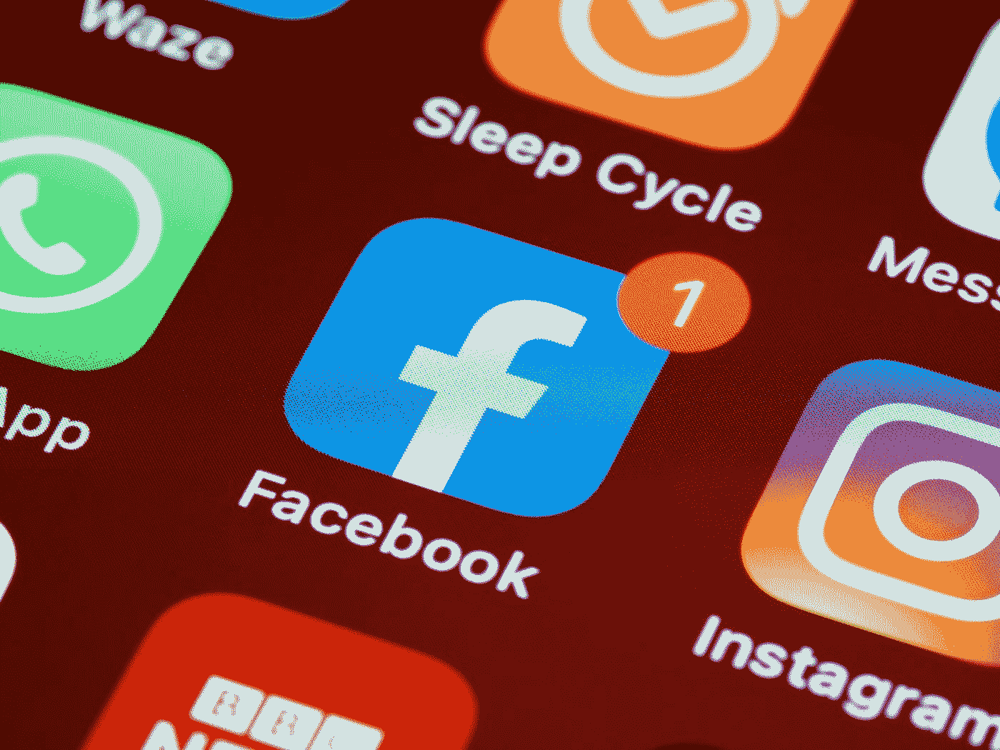

# 我是如何在一天之内获得 65，000 名粉丝的…

> 原文：<https://medium.com/geekculture/how-i-got-65k-followers-in-one-day-9c227fa3ebe9?source=collection_archive---------20----------------------->

## …以及为什么网络安全如此重要。

Photo by [Brett Jordan](https://unsplash.com/@brett_jordan?utm_source=medium&utm_medium=referral) on [Unsplash](https://unsplash.com?utm_source=medium&utm_medium=referral)

几乎所有的社交网络在开始时都会犯同样的错误，主要是关注路线图而没有特别关注安全性，因为…当我几乎没有任何用户时，谁会想要攻击我或利用我呢？

正是由于这个原因，新的社交网络成为新的目标…