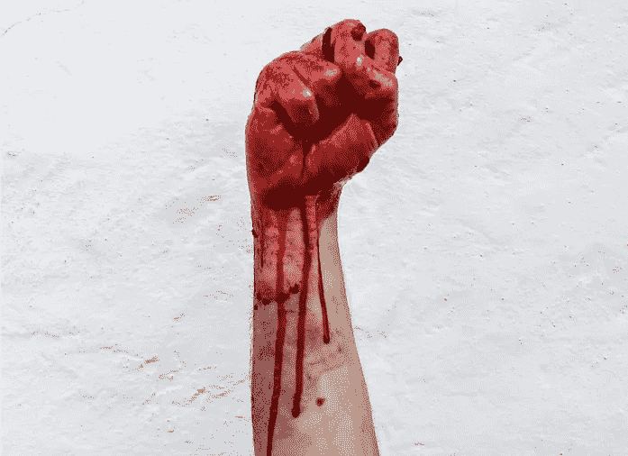

# 我如何黑了一个著名的黑客

> 原文：<https://medium.com/geekculture/how-i-hacked-a-reputed-hacker-6e6b31818d12?source=collection_archive---------7----------------------->

## 永远实践你所宣扬的

Photo by Valentin Salja on Unsplash

## 扇子，梦

每个黑客/程序员都曾经是粉丝。我记得我尊敬两个人，认为他们分别是编程和黑客领域的佼佼者。观察和阅读这些人是我进入黑客和编程的原因。一晃几年过去了，我正在制作“*头条新闻*”…