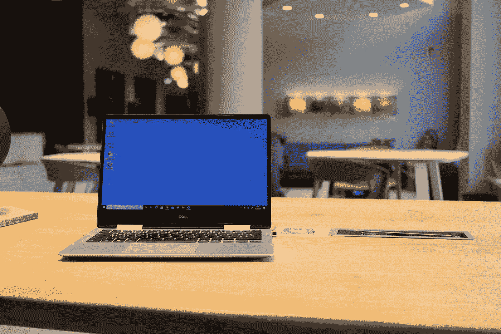
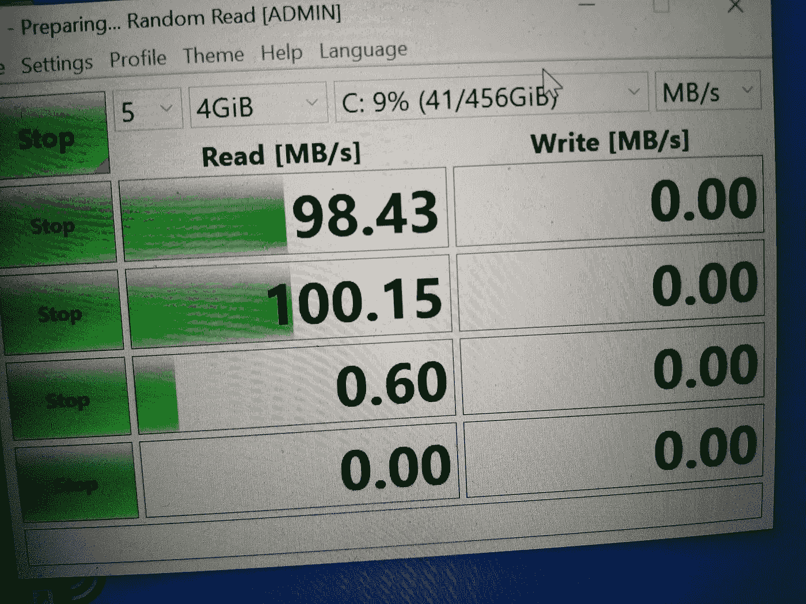
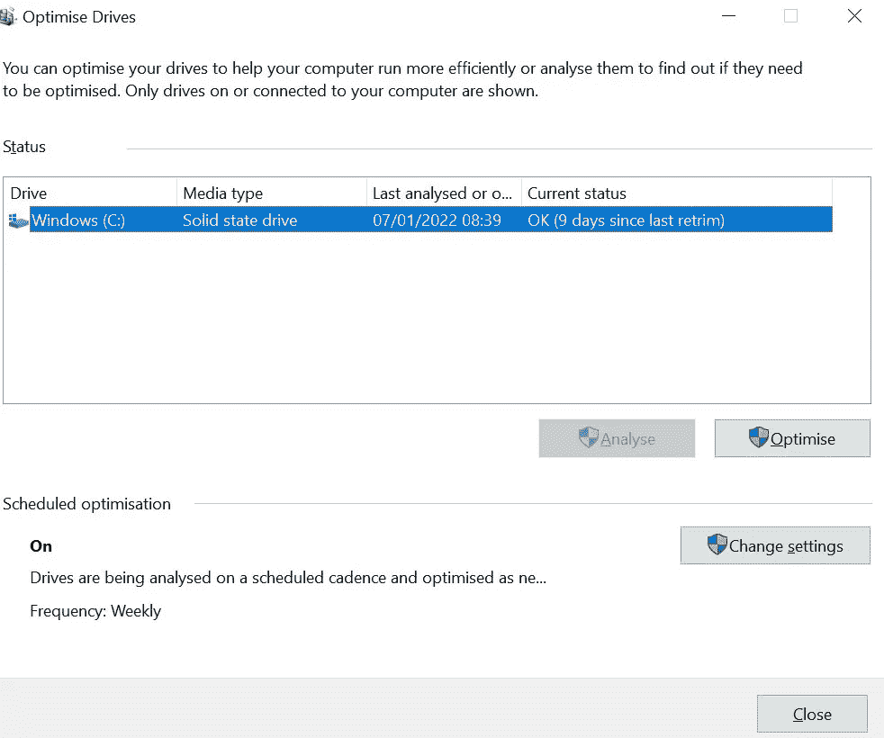
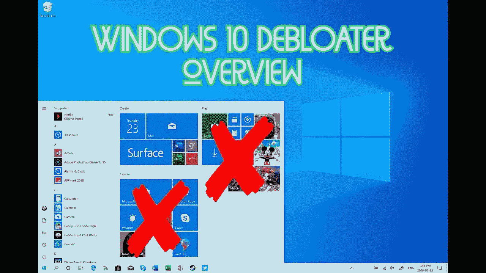
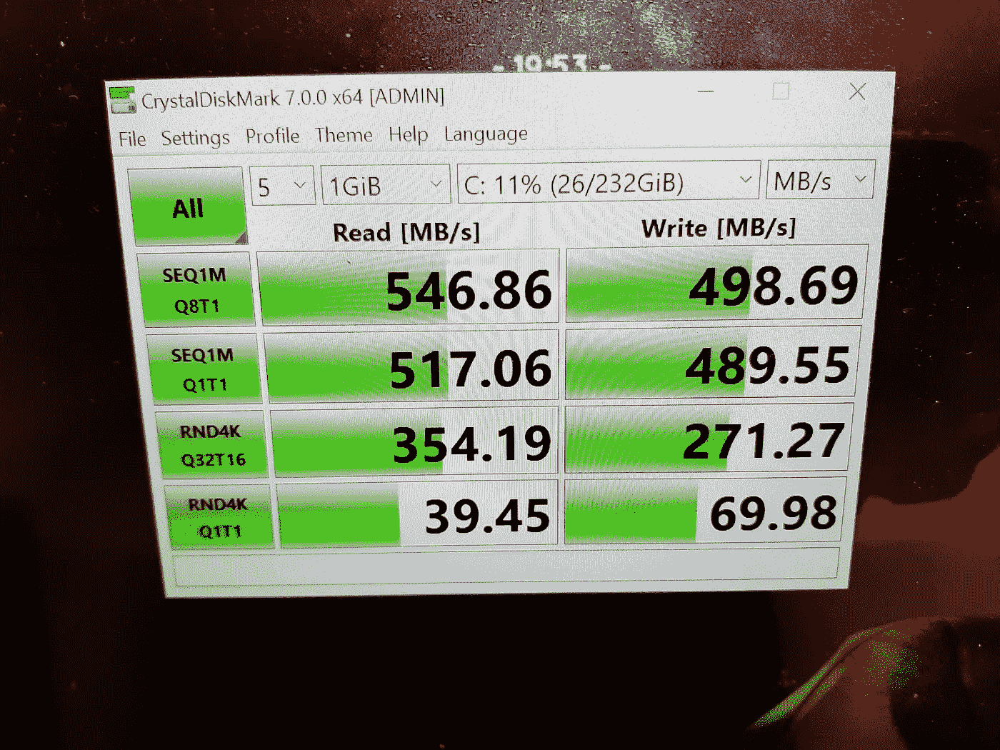
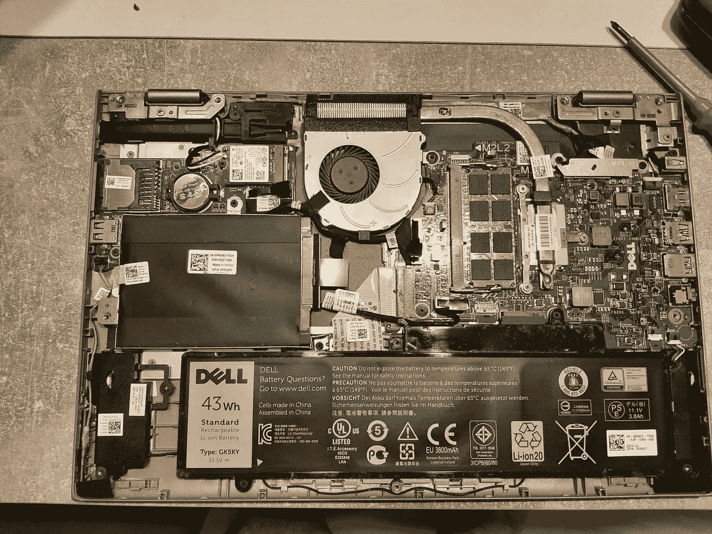
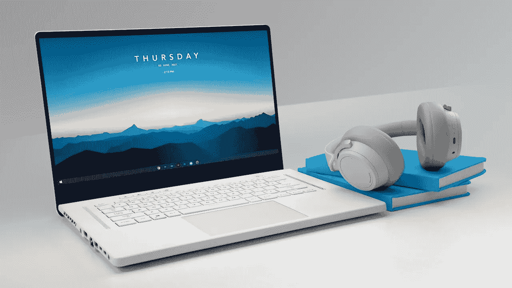

# 我如何通过 3 个步骤提高我的旧 Windows 10 笔记本电脑的性能

> 原文：<https://medium.com/geekculture/how-i-improved-my-old-windows-10-laptops-performance-in-3-steps-7dfb88a265e0?source=collection_archive---------6----------------------->

## 我如何针对数据工程和 Python 编程任务优化我的旧笔记本电脑

Photo by [Piero Nigro](https://unsplash.com/@pieronigro?utm_source=medium&utm_medium=referral) on [Unsplash](https://unsplash.com?utm_source=medium&utm_medium=referral)

当我在 2015 年得到我的笔记本电脑时，它非常适合我当时的需求。随着它开始用于更重的工作负荷，并开始磨损，我知道我落后了。我也接触到了 MacBook 在那个时候可以做什么，我听到了“当你去 Mac，你永远不会回去”。这里面有很多道理。

无论如何，我决定开始攒钱买一台高端笔记本电脑，但作为一名 Windows 粉丝，我很好奇是否能在这方面改进我的老歌。

## 我的旧笔记本电脑规格

*   2015 戴尔 Inspiron 灵越 13 二合一笔记本电脑(带触摸屏)
*   512 GB
*   8GB 内存
*   英特尔酷睿 i7 处理器(2.6Ghz)

# **开始之前**

**遵循本指南，风险自负！我只是记录我采取的对我有效的步骤。**

*   运行基准测试来比较升级前后的速度。你可以使用[水晶圆盘](https://crystalmark.info/en/software/crystaldiskmark/)

Benchmark score before laptop upgrade. See below for ‘after’ scores — Image by author

*   卸载应用程序并尝试降低硬盘的容量利用率。当硬盘总容量的 70%以上被使用时，电脑速度往往会变慢。
*   如果你打算升级你的硬盘，观看[这个视频](https://www.youtube.com/watch?v=nbGkPYtXtmA)看看如何在闪存上安装 Windows 10。此外，请确保将数据备份到外置硬盘。

# 三步流程

## 1.激活驱动器碎片整理

通过确保“碎片整理”在您的电脑上处于活动状态来优化您的驱动器。如果您的设备使用传统旋转盘片的旧硬件，组织数据可以提高机器的响应能力。如果你(像我一样)有一个带旋转部件的旧硬盘，这一步特别有用。(即使你有 SSD 存储，这一步还是有帮助的)。

Optimise Drives Screenshot — Image from author

要激活磁盘碎片整理，打开搜索栏，输入“碎片整理”。选择第一个选项，您应该会在这里看到屏幕截图。然后确保您要优化的驱动器突出显示，然后单击“优化”按钮。

请注意，根据驱动器上存储的数据量，此过程可能需要很长时间。如果您有一个包含大量数据的旧系统，最好让这个过程整夜运行。

## 2.从 Windows 10 中移除膨胀软件

Windows 预装了许多不常用的应用程序、服务和后台遥测功能，从而降低了电脑的性能。

你可以使用这个免费的工具从 Windows10 中删除这些臃肿的软件:[https://github.com/Sycnex/Windows10Debloater](https://github.com/Sycnex/Windows10Debloater)。这个工具删除不必要的预装 Windows 应用程序，停止一些遥测功能，停止 Cortana 被用作您的搜索索引，禁用不必要的计划任务，等等…

Windows Start Menu — Image [source](https://www.youtube.com/watch?v=SpauzQBwmuA&ab_channel=IansTech)

> 观看[关于如何使用这个工具的教程](https://www.youtube.com/watch?v=7SdtxrsZN8k&ab_channel=GEEKrar)

我的电脑性能有了非常明显的提升！我注意到我的笔记本电脑开始更快地响应任务，并且能够更方便地在应用程序之间切换。它并不完美，但在注意到这些改进后，我知道我想要更多…

## **3。将硬盘升级到固态硬盘**

大多数老式笔记本电脑都装有硬盘。硬盘和固态硬盘的主要区别在于数据的存储和检索方式。

> 硬盘驱动器(HDD)是一种传统的存储设备，它使用机械盘片和移动的读/写磁头来访问数据。固态硬盘(SSD)是一种更新、更快的设备，它将数据存储在可立即访问的内存芯片上。— [Avast](https://www.avast.com/c-ssd-vs-hdd)

在了解了这些差异之后，我决定将我的硬盘升级到固态硬盘。这是我老爸的游戏改变者！它大大提高了装载速度和一般速度。我的笔记本电脑只需要几秒钟就能重启，而旧的硬盘需要 2 到 4 分钟。应用程序打开速度超快，我的笔记本电脑上的其他一切都运行得很快！

以下是我安装 SSD 后的基准测试成绩。

Benchmark scores after upgrade — Image by author

这些分数明显高于升级前，我可以注意到这一点。

如果你打算按照这一步，找出你的电脑的确切型号和什么固态硬盘将兼容它。下面是我拿到的 SSD 的链接: [*链接亚马逊 SSD*](https://www.idealo.de/preisvergleich/OffersOfProduct/201032817_-870-evo-500gb-samsung.html) *。*

Laptop internals — Image by author

> 要自己拆卸笔记本电脑，请观看这段视频，学习如何拆卸笔记本电脑:[https://www.youtube.com/watch?v=t0rq0MoKtDA](https://www.youtube.com/watch?v=t0rq0MoKtDA)

在这最后一步之后，我确保我再次遵循了上面的步骤 1 和 2，以确保我的系统得到了很好的优化。

# 临时演员

*   **设置一个干净的 Windows 10 桌面**。这个视频对我来说真的是锦上添花，因为我安装了一个全新的操作系统，加上一个非常干净简约的桌面界面。我鼓励你去看看戴夫·2D 的视频[。](https://www.youtube.com/watch?v=_e7JTaPMf7Q&t=236s&ab_channel=Dave2D)

Image from [Dave 2D](https://www.youtube.com/watch?v=_e7JTaPMf7Q&ab_channel=Dave2D)

*   **升级你的电池。**随着时间的推移，我的电池电量下降了 55%。由于我自己安装了 SSD 后感到很有信心，我决定也升级我的电池。

## 结论

我最初的笔记本电脑规格并没有那么糟糕。我注意到的主要问题是臃肿的软件和我仍在使用硬盘的事实。升级笔记本电脑帮助我更好地了解了 PC 的内部工作原理以及 Windows 10 中运行的许多底层服务。希望这能帮助别人给你的电脑一个战斗的机会。

> 你可以[成为中等会员](/@tobisam/membership)享受更多这样的故事。

## 参考

*   [https://www . windows central . com/tips-tricks-increase-PC-performance-windows-10](https://www.windowscentral.com/tips-tricks-increase-pc-performance-windows-10)
*   [https://www.avast.com/c-ssd-vs-hdd](https://www.avast.com/c-ssd-vs-hdd)