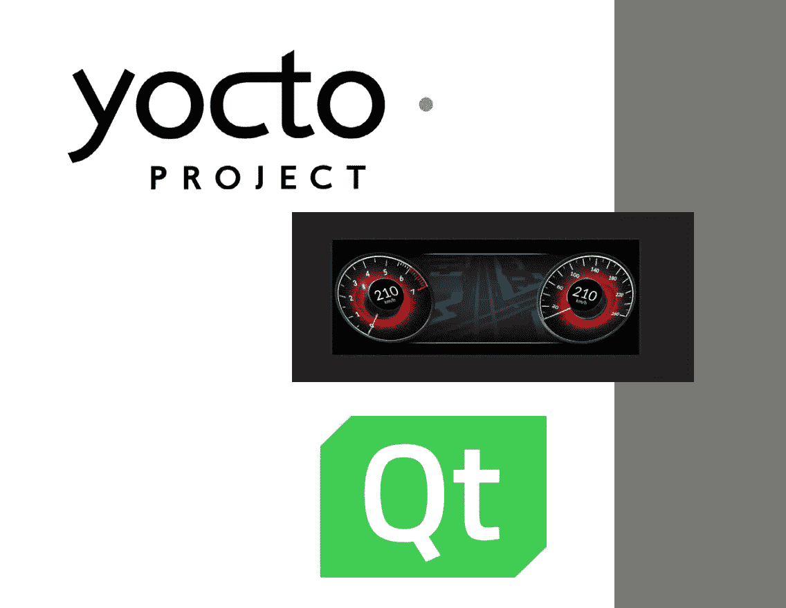

# 我是如何学习 Yocto Project、Qt 的，为什么你也会这样做

> 原文：<https://medium.com/geekculture/how-i-learned-yocto-project-and-qt-and-why-you-would-do-the-same-b030528e11f6?source=collection_archive---------5----------------------->

向您介绍 Yocto 项目和 Qt 的指南。这些知识允许您将 Qt 制作的应用程序部署到运行 Poky distributions/Yocto 项目的嵌入式设备上

# 介绍性注释

如果您在这里，很可能您愿意将您的(Qt 制作的)作品部署到一个定制的 Linux 发行版(由 Yocto…