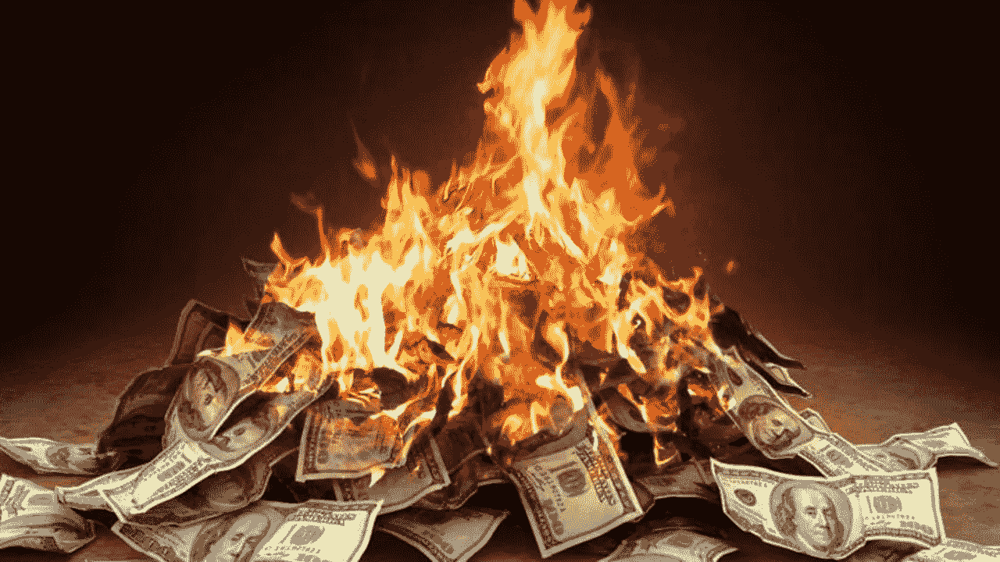
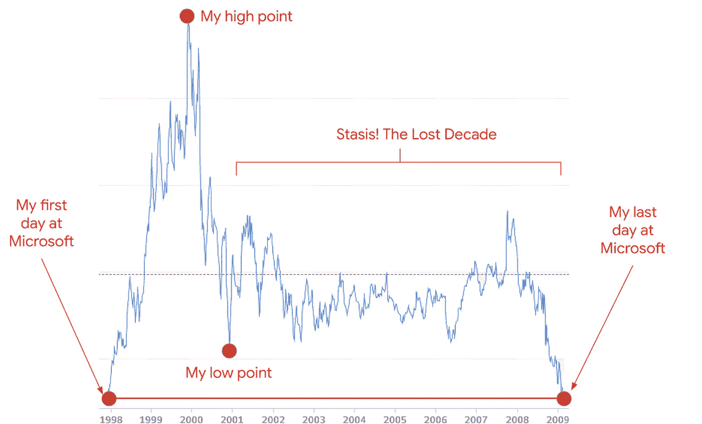
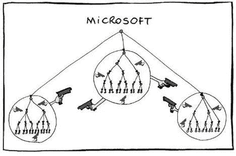
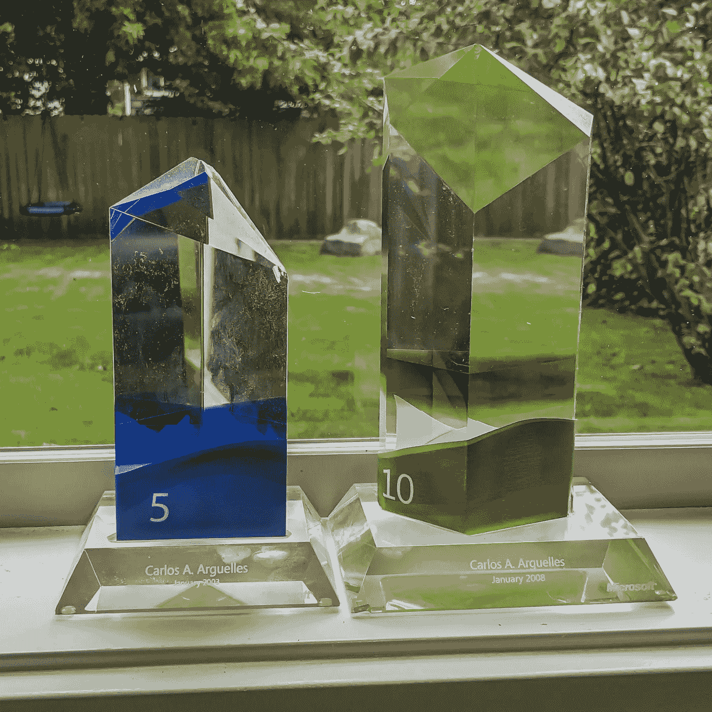

# 在我 25 岁生日之前，我是如何在微软赚到和失去一百万美元的

> 原文：<https://medium.com/geekculture/how-i-made-and-lost-a-million-dollars-before-my-25th-birthday-at-microsoft-9c0c6dd8bf58?source=collection_archive---------2----------------------->

## 股票期权的消亡改变了公司

我屏住呼吸，点击刷新，获取最新的 MSFT 股票价格。$21.88.我畏缩了。这是官方的。我刚刚目睹了 100 万美元的微软股票期权在几个月内蒸发。在另一个浏览器选项卡中，新闻。关于反恐战争、反垄断案以及今天又一家热门软件创业公司倒闭的冷酷文章。2001 年是一个时代的终结。 [**一万名微软员工在九十年代成为百万富翁**](https://www.washingtonpost.com/archive/politics/2003/08/03/microsoft-millionaires-still-pondering-wealth/f9a55664-e695-45a5-94d5-46f4a5cefb5d/) **。我去得够早，感觉到了那件事的结尾。**

当我 1997 年被聘用时，微软是一个充满活力的地方，到处都是世界上最聪明的软件工程师。能量无处不在。我们每周工作 60-80 个小时，并且乐在其中。我经常睡在办公室。Windows 和 Office 曾是世界之巅。我在博客中写了几个怀旧的故事，讲述了在微软的美好时光，比如“90 年代在微软工作的回忆”、“为比尔·盖茨熬通宵的那个晚上”和“兔子和蜜蜂，在微软申请专利”

我还是个孩子，刚出校门，只是个入门级工程师(59 级)。我没什么特别的。然而，在我进入微软的前 18 个月，我看到我的初始股票期权增加了 100 多万美元，股票分割了两次(1998 年和 1999 年)，让我稍微尝到了上一代微软人的甜头。令人陶醉。我一生都生活在贫困线以下。然而，在我 23 岁生日之前，我突然变成了纸面上的百万富翁。见鬼，理论上我们都是 T21 的百万富翁——任何在 1998 年之前被雇佣的人到 2000 年都是百万富翁了。这使得微笑着紧张工作变得非常容易。我用现金给自己买了一辆新的敞篷保时捷，深蓝色，棕色内饰，开得很快，还收到了很多超速罚单。快线生活。

当我在 90 年代加入微软的时候，有一个基本的建议我可以使用。不幸的是，这条建议直到十年后我才想起，在亚马逊公司的一次会议上，我会听到[杰夫·贝索斯说](https://www.cnbc.com/2018/09/14/jeff-bezos-says-he-doesnt-think-about-amazons-stock-price.html)，*“看，当股票在一个月内上涨 30%时，不要觉得自己聪明了 30%。因为当股价在一个月内下跌 30%时，感觉自己变笨 30%的感觉不会太好。”*我们本可以在 90 年代的微软使用这种指导，因为我们都让股价冲昏了头脑。

*接连发生的三件事改变了一切。*

首先，[微软被政府起诉垄断](https://en.wikipedia.org/wiki/United_States_v._Microsoft_Corp.)。这场审判漫长而痛苦，既损害了公司的声誉，也损害了我们作为其中一员的自豪感。我们跟着每一个尴尬的证词畏缩。2000 年，法院下令解散微软。(然而，在那之后，2001 年，DOJ 撤销了诉讼，所以整个磨难相当于一记耳光)。但这种不确定性严重打击了股票(和士气)。第二，互联网泡沫破裂导致微软勒紧裤腰带，股价再次遭受重创。突然间，我们周围的科技公司纷纷倒闭，投资者也变得紧张不安。第三，2001 年 9 月 11 日的袭击给整个世界带来了更多的不确定性。2001 年是严峻的一年。

对微软来说，这三件事的结合意味着股价的完全停滞——这将持续十年。

我惊恐地看着 100 多万美元的股票在几个月内蒸发。在反垄断案、网络泡沫破裂和 911 事件之间，股票最终回到了我上班第一天的价格。这些[不是限制性股票单位，而是股票期权](https://www.equityeffect.com/blog/stock-options-vs-restricted-stock-units/)。所以一旦他们回到执行价，他们就一文不值了。

在三年的时间里，我“赚”了一百万美元，又“赔”了一百万美元。

*Microsoft stock price, 1998–2009… almost the same start and end price*

我还剩下基本工资。上世纪 90 年代，微软在基本薪酬上出奇的吝啬。因为他们的股票期权，他们可以逃脱惩罚。在 59 级的时候，我的基数是 5 万美元/年，根据通货膨胀调整后，相当于今天的 8.5 万美元/年。根据 [levels.fyi，微软支付 11 万美元/年的基础费用到现在的 59 级](https://www.levels.fyi/company/Microsoft/salaries/Software-Engineer/SDE/),所以他们显然提高了他们的游戏(加上他们的年度奖金是他们在 90 年代的两倍)。但是在那个时候，股票期权是如此的荣耀，以至于没有人关心他们的薪水是多少。当我收到微软的邀请时，我没有谈薪水，我谈的是股票。基本工资支付食物和房租，但有股票期权，这样你可以在 30 多岁退休。九十年代的软件业是一个疯狂的世界。

在 2001 年失宠后，在接下来的十年里，该股将在每股 20 美元左右波动，没有收益。突然之间，当你的收入只有一年前的一小部分时，你对每周工作 80 小时的兴奋感就会有所减弱。你意志消沉。在雷德蒙的走廊里，能量水平显著下降。 ***物以稀为贵引发战争。*** 展品 A:在 2020 年疫情奥运会开始的时候，出于一些奇怪的原因，守法的美国人为了卫生纸在超市里大打出手。证据 2001 年，在微软，新的稀缺意味着你发现自己与你的同行无情地竞争，只为多几千美元的年度奖金。预算有限，如果一个同事失败了，你会有更多的钱。这种态度造成了地盘之争、领地之争，以及希望你的隔壁邻居失败的文化，有时会积极破坏他们的工作。我曾经让坐在我隔壁第三个房间的家伙告诉我，“你和我是同一水平，在表演时间，你是我的竞争对手，我不想和你合作，因为我需要打败你”。他是一个可怕的人，但他不是唯一有这种感觉的人。

Credit for this masterpiece to [Manu Cornet](https://www.amazon.com/Goomics-Googles-corporate-revealed-internal/dp/1952629004/ref=sr_1_2?crid=3QHR2SXP5ECDW&dchild=1&keywords=manu+cornet&qid=1630735156&sprefix=manu+corne%2Caps%2C210&sr=8-2)

平心而论，这种行为在微软早期一直存在。但我认为它处于休眠状态(或者我只是更天真)，股票期权的消亡是一个触发器，让它在日常生活中浮出水面。

许多明星工程师意识到他们可以在其他地方赚更多的钱，他们开始成群结队地离开。微软做了几件事来阻止人才流失。有一天，他们一下子提高了每个人的基本工资(我想是 20%？).他们调整了许多潜在期权的执行价格。最终，他们从股票期权转向了限制性股票单位。这些事情都没有产生重大影响。微软股票期权的疯狂时代已经一去不复返了。

我继续和非常聪明和敬业的人一起工作。但是动机和能量是不一样的。这种文化一天比一天有毒(这不仅仅是我说的，就连微软现任 CEO 萨提亚也在他的书中广泛地谈到了这一点[)。这也表现在那个时期出现的产品的平庸。Windows Vista 是一个暴行。巨人微软完全错过了被小大卫谷歌抓住的搜索革命。](https://www.amazon.com/Hit-Refresh-Rediscover-Microsofts-Everyone-ebook/dp/B01HOT5SQA)

我在微软一直呆到 2009 年。[我*怎么和为什么最后*离开是另外一个故事。](https://carloarg02.medium.com/the-day-i-lost-my-job-at-microsoft-anatomy-of-stasis-f0e2cd653e3a)

Microsoft gave you a giant glass award for your 5-yr and 10-yr anniversaries

我从未在微软成为真正的百万富翁。我 45 岁了，还在(愉快地)工作(但现在在谷歌)，离“三十岁退休”还差得远我在微软的 11 年确实学到了很多:我学会了如何成为一名高效的软件工程师，以及如何在大型专业环境中工作。我运送数百万人使用的产品。我也在微软遇到了我的妻子。所以，我感谢我在那里的时光。

2009 年 3 月，我作为微软员工的最后一天，我做了最后一次反抗:我卖掉了我持有的每一股微软股票，作为对史蒂夫·鲍尔默的不信任票。那天微软的股票是 20 美元，和我 1997 年被雇佣时的价格完全一样。

微软的股票现在是 300 美元(十年增长了 15 倍)。微软是世界上最有价值的公司之一，市值为 2.25 万亿美元。在买卖股票的时候，显然不要征求我的意见。

我必须说，我很高兴看到塞特亚·纳德拉如何扭转了微软的局面。我认为那是不可能的。我不认为任何人，更不用说内部人士，能够扭转公司的局面。然而，今天的微软是一家极具活力、不断进步的公司，拥有令人耳目一新的创新。萨提亚实现了看似不可能的事情。

2009 年离开微软后，我继续在亚马逊工作，直到 2020 年，并热爱它。2020 年，当我[决定离开亚马逊](https://link.medium.com/801Ot5nlqib)的时候，我确实把简历投给了微软，我经历了一个完整的循环(甚至拿到了 offer！).我不得不承认促使我申请的是病态的好奇心。在我的脑海中，微软仍然是我在 2009 年离开时那个功能失调的地方。但我至少要试一试，因为我喜欢 90 年代的微软——有很多美好的回忆。相反，当我在 2020 年 1 月来到雷德蒙进行现场考察时，我发现了一种完全不同的文化。*不是比尔的微软。不是史蒂夫的微软。萨提亚的微软。*

我来到微软校园大约两个小时前，我的现场。这是 2020 年一月的一个寒冷的早晨。我抓起一个双高拿铁温暖我，走在老地方。我在那里度过了 11 年…我有很多回忆。1997 年我开始冒险的 9 号楼不见了。我的冒险在 2009 年结束的 4 号楼也是如此。微软正在建造更高的大楼，以取代 80 年代简陋的两层大楼，我曾多次亲眼目睹比尔·盖茨的直升机在那里降落，或是停放他的保时捷。停车场不像 90 年代那样满是法拉利和兰博基尼，但他们确实有一些漂亮的宝马和奔驰。我在 16 号楼面试，我在这栋楼里工作了多年。不得不佩戴游客徽章感觉很奇怪。那天早上，我百感交集。

我很开明，那天我有一个令人惊讶的积极的面试循环。我交谈过的人都很棒。我可以想象自己和他们一起工作。这真的感觉像一个完全不同的世界。我非常感兴趣，于是订购了塞特亚·纳德拉的书，《点击刷新:重新发现微软灵魂的探索》(你可能已经注意到，我今天以一个我点击*刷新按钮*的轶事开始我的故事；这是对萨提亚的书的一个有趣的小秘密点头。我从头到尾狼吞虎咽。改变一家有 45 年历史、拥有数十万员工的公司的文化，这是一项多么大的成就，我怎么强调都不为过。我最终确实得到了一份工作，我也认真考虑过，但在谷歌工作太令人兴奋了，我不能错过，所以这就是我去的方向。

2020 年 1 月那个寒冷的早晨，当我漫步在微软园区，小口喝着滚烫的拿铁咖啡取暖时，***我开始怀念一个我知道不再存在的世界。*** 我感谢微软在很多方面将我塑造成今天的我。我花了很长时间认真思考公司是如何随着时间变化的，以及导致文化转变的事件，无论大小。微软有一个黄金时代，一个黑暗时代，一次重生。没有什么是一成不变的，但你如何进化很重要。