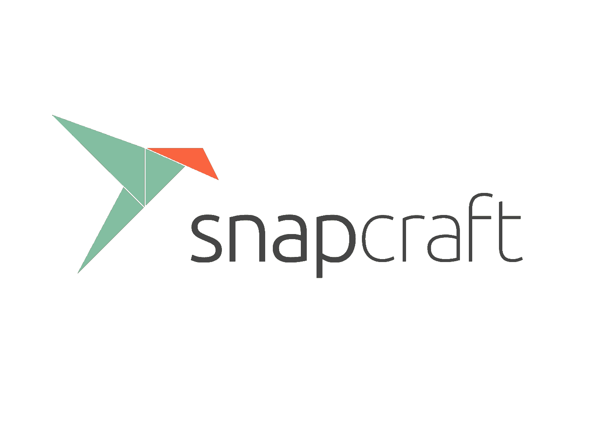
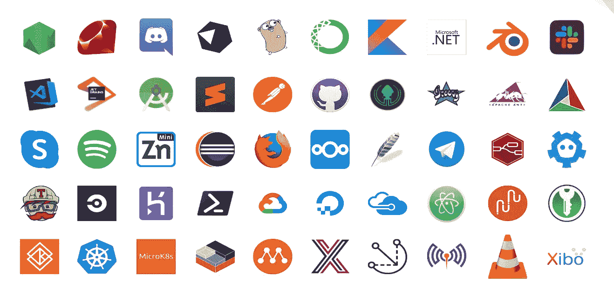
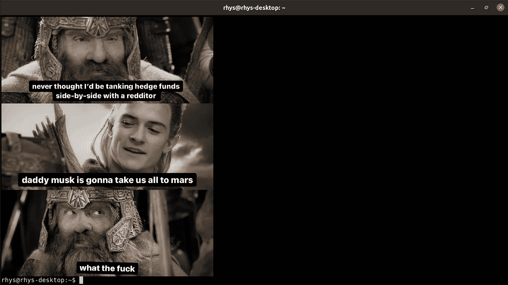
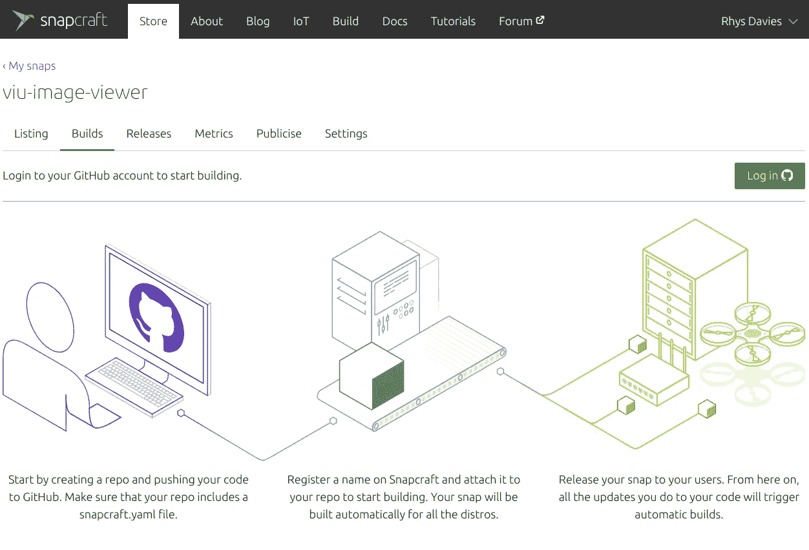
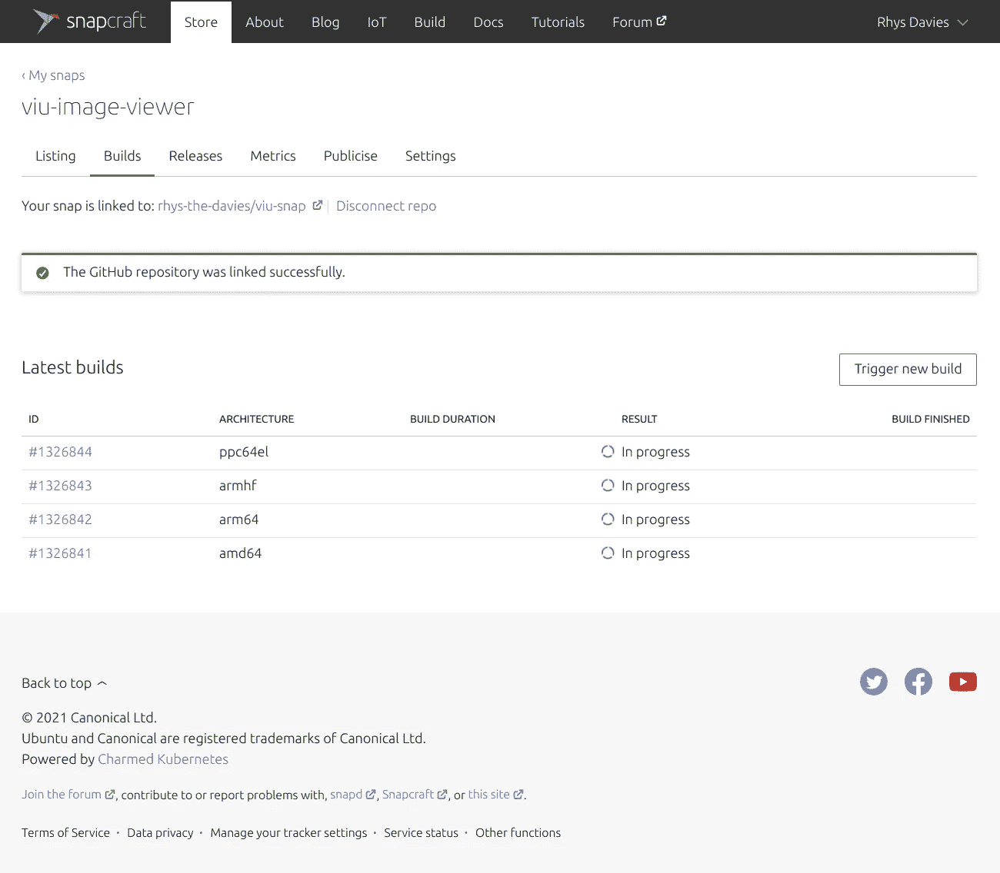

# 我是如何拍摄第一张快照的

> 原文：<https://medium.com/geekculture/how-i-made-my-first-snap-470d22eb621a?source=collection_archive---------7----------------------->

快照是一种打包软件的方式，因此很容易在 Linux 上安装。我想，作为 Canonical 倡导团队的新成员，我最好开始拍照。我通过使用 [snapcraft 文档](https://snapcraft.io/docs)，以及艾伦·波普(popey) 的几篇[博客](https://popey.com/blog/2020/12/snap-along-with-me/) [帖子](https://popey.com/blog/2021/02/lets-go-snapping/)学会了如何做到这一点。如果你通读了标题为[“我们去抢购”](https://popey.com/blog/2021/02/lets-go-snapping/)的那篇，我就是他提到的新同事。这些都是学习如何创建快照的更简洁的方法。这篇文章就是我的全部故事，包括我做了什么，怎么做的，为什么做。希望这能引起一些人的兴趣，尤其是第一次。我推荐的其他资源是一个 [Rust 应用示例](https://snapcraft.io/blog/building-a-rust-snap-by-example)和一个[更高级的 C 示例](https://snapcraft.io/blog/building-a-c-snap-by-example) …



# 何必呢？

在我进入“如何”之前，我想讨论一下为什么。我个人这样做有两个原因。首先，因为我想学习如何去做。我是一个新的 Ubuntu 拥护者，需要对快照的工作原理和如何快照有更深的理解。在业余时间，作为工作的一部分，我喜欢学习一系列新技能，这似乎是一个不错的起点。其次因为有人告诉我。出于同样的原因。

让我们简单地谈谈为什么你可能想把你的应用程序打包成一个快照。如果你不关心*为什么*，那就直接跳过。Linux 发行版的变化几乎和应用程序开发的速度一样快。无论你运行的是最新的 Fedora 版本还是多年前的 Ubuntu 版本，你都应该能够将你最喜欢的应用程序放在手边，并且应该能够在发布日试用最新最棒的软件。同样，你的用户对 Linux 发行版的选择不应该成为你想让多少人拥有你的软件的障碍。软件打包和分发可能是复杂和令人厌倦的。

这是快照地址的最大问题。快照可以很容易地安装在任何使用 systemd 的 Linux 发行版上——大多数都是这样——开发者可以将打包快照与他们自己的 CI/CD 管道集成在一起。您可以将 [snapcraft 扩展](https://snapcraft.io/docs/supported-extensions)用于特定种类的中间件，并且知道 snaps 支持编写您的应用程序的大多数语言[。一旦一个应用程序被“捕获”,它就可以在几分钟之内在几乎所有的 Linux 发行版上使用，并有一种内置的方式来保持它们的最新、维护和向用户推广。](https://snapcraft.io/docs/supported-plugins)

无论您是想拍摄自己的应用程序，还是想为现有的应用程序生态系统做出贡献，在某些情况下，拍摄应用程序都是值得的…


Photo by [Emily Morter](https://unsplash.com/@emilymorter?utm_source=unsplash&utm_medium=referral&utm_content=creditCopyText) on [Unsplash](https://unsplash.com/s/photos/why?utm_source=unsplash&utm_medium=referral&utm_content=creditCopyText)

# 从哪里开始？

我在软件开发方面的经验非常有限，所以我没有从抓取自己的应用程序开始。相反，我去找了一个我喜欢的、还没有被抓拍的应用程序，并抓拍了它。我开始在 [GitHub 趋势](https://github.com/trending)上搜索。这是一个很好的应用程序和项目列表，显然是活跃的，所以可能需要贡献，但你真的可以选择任何东西。当然，如果应用程序是你自己的，或者你是一个狂热的用户，这确实有帮助，这样你可能会付出更多。

## 什么是有意义的快照？

关于 snaps 最常见的误解之一是 Canonical 试图取代其他打包软件的方式，即使体验更差。这根本不是真的。在很多情况下，将软件打包毫无意义。Snaps 不是 debs 的替代品，也不是 docker containers 的竞争对手，尽管使用了集装箱技术。它们被设计用来解决在别处无法解决的不同问题。这些[解决方案和差异](https://snapcraft.io/blog/8-ways-snaps-are-different)、[在其他地方](https://snapcraft.io/blog/a-technical-comparison-between-snaps-and-debs)有记录，但这里有一些避免抓拍不需要抓拍的东西的提示:

1.查看 Ubuntu 档案库——如果一个 Linux 应用程序相对来说不太出名或者不太受欢迎，但是你对它感兴趣，你应该拍一张快照。如果它已经作为一个 deb 存在于 Ubuntu 的档案中，并且有很多用户并且很开心，就没有必要去抓拍它。

> 补充说明:如果你使用的是 Ubuntu，你可以在没有安装的情况下，通过在 CLI 中运行它来检查这个应用是否已经在存档中。如果它在存档中，系统会提示您将其安装为 apt 包。

2.库(libs)不容易抓取。快照是打包应用程序的一种方式，除非有特殊情况，否则不应该用来打包库。

3.现代语言——我的第一个快照是用 Rust 编写的应用程序。还有许多其他用其他语言编写的[应用程序快照的例子](https://snapcraft.io/docs/creating-a-snap)。现代语言没有同样的包装包袱或先入之见，因为开发人员不太关心包装。这意味着，如果你用现代语言拍摄一个应用程序，你更有可能在另一端得到一个有鉴赏力的开发者。



然而，当我开始寻找的时候，我花了一段时间才找到我喜欢的东西。考虑到我缺乏经验，我理解。还不到三分钟。[符合标准](https://snapcraft.io/docs/snapcraft-checklist)。所以我转而搜索流行的 Linux 命令行工具。(我寻找命令行工具，因为他们说它们比 GUI 应用程序更容易抓取。)逛了一圈之后，我找到了“谷歌”，一个可以让你从命令行搜索谷歌的工具。我在[上游 GitHub repo](https://github.com/jarun/googler) 中找到了 deb 和 rpm 包，但是没有 snap。一个好的开始。

在我陷进去之前，作为最后一次检查，我搜索了“谷歌快照”(有点像 meta huh)，看看上游是否有任何反对快照的东西。他们没有。但是我确实发现已经是弹指一挥间了-_-只是没有逆流而上。所以我把这个项目添加到了一个文档中，提醒我也许值得联系他们，告诉他们将来的快照，然后我继续寻找。

对于一些不同的应用程序，这种情况发生了几次。要么快照已经存在，要么在一些情况下，上游对快照不太友好，所以我没有打扰。快照在这一点上已经相当成熟了，所以有很多东西已经被快照了也就不足为奇了。或者他们有自己的诽谤者。但这也不是阻止开发者从快照中获益的好理由。最终，我找到了 [viu。一个图像和 GIF 查看应用](https://github.com/atanunq/viu)。喔。

## 能建成吗？

在我太兴奋之前，我做了一些快速检查，看看它是否真的可以很容易地建造。假设你已经满足了我们之前谈到的所有标准，你几乎可以肯定地说这是轻而易举的事情。但鉴于我的理解水平，我快速浏览了一下 snapcraft 文档，以确保我没有陷入一个极其复杂的问题。这些文件充满了其他术语和更深入的技术“东西”，但很容易看出，与 viu 回购并列，这些复杂的东西与我无关。

# 入门指南

首先，我在 GitHub 存储库中为我想要捕捉的应用程序准备了一切。然后，我将这个存储库克隆到我的计算机上，并创建了一个分支。这是标准的 GitHub 工作流程，但是如果你以前没有做过，不用担心， [GitHub 也有很棒的文档](https://docs.github.com/en/github/getting-started-with-github/fork-a-repo)。我这样做是为了在本地制作应用程序的快照，进行测试和整理，然后，当准备就绪时，我可以向上游项目提交一个 pull 请求。当然，如果你正在抓取你自己的应用程序，你可以做任何你想做的事情。

## Snapcraft YAML

克隆和分支之后，我打开了一个终端，将 [VSCode (visual studio code)与](https://snapcraft.io/code)和`cd`嵌入到新的本地版本的 repo 中，以创建一个新的目录:

```
$ mkdir viu-snap
```

他们说，好的做法是将目录命名为“应用程序名称快照”，这样很容易找到，当您最终创建了一堆又一堆的快照时，(我知道您会)您会习惯这种语法。

然后，我进入文件夹并运行 snapcraft init，在 snap/snapcraft.yaml 中创建一个模板:

```
$ cd viu-snap$ snapcraft init
```

如果您进入新的 snapcraft.yaml 文件，您会看到它看起来像这样:

```
name: my-snap-name # you probably want to ‘snapcraft register <name>’
base: core18 # the base snap is the execution environment for this snap
version: ‘0.1’ # just for humans, typically ‘1.2+git’ or ‘1.3.2’
summary: Single-line elevator pitch for your amazing snap # 79 char long summary
description: |
 This is my-snap’s description. You have a paragraph or two to tell the
 most important story about your snap. Keep it under 100 words though,
 we live in tweetspace and your description wants to look good in the snap
 store.grade: devel # must be ‘stable’ to release into candidate/stable channels
confinement: devmode # use ‘strict’ once you have the right plugs and slotsparts:
 my-part:
 # See ‘snapcraft plugins’
 plugin: nil
```

这些都是模板，你可以把它们编辑成快照。如果你在寻找比我在这里给出的更多的细节，在 snapcraft 文档和各种博客文章中有更多关于文件不同部分的信息。让我们从元数据(顶部的东西)开始。

## [计]元数据

如果您正在捕捉一个不属于您的应用程序，最好用您找到该应用程序的地方的数据替换元数据，在我的例子中，是上游 git repo。`name`是您的快照的发布名称，因此如果应用程序是您的，最好确保它是描述性的，如果不是，请更正。通常情况下，您希望它超过三个字符。我遇到了`viu`的问题，你稍后会看到。

## 选择一个基地

默认的`base`是`core18.`，这意味着当我们构建快照时，它是在 Ubuntu 18.04 LTS 虚拟机内完成的。当用户安装 snap 时，他们需要自动为他们安装的`core18` snap。对于`viu`,我使用了`core20`的基础，所以它是在 Ubuntu 20.04 LTS 虚拟机中构建的。我没有考虑太多。如果它引起问题，你可以随时改变到另一个基地。

接下来，我添加了`adopt-info`来指定版本应该来自于`viu`部分(我们一会儿会谈到部分)，所以我用`adopt-info`替换了`version`。摘要和描述都是从上游 git repo 复制的。此时我的 YAML 是这样的:

```
name: viu # you probably want to ‘snapcraft register <name>’
base: core20 # the base snap is the execution environment for this snap
adopt-info: viu
summary: Simple terminal image viewer # 79 char long summary
description: |
 A small command-line application to view images from the terminal written
 in Rust. It is basically the front-end of viuer. It uses either iTerm or
 Kitty graphics protocol, if supported. If not, lower half blocks (▄ or
 \u2584) are displayed instead.
```

## 禁闭和建筑

YAML 中的下一行是`grade`，这不会影响快照本身的稳定性，也不会在发布后产生太多影响，所以你可以向自己和用户发出信号，无论你的快照在什么渠道，它是否稳定。我只是把它设置为稳定并继续运行。

我希望严格限制这一点，所以我在 snapcraft.yaml 中设置了 next。当后来出现问题时，我出于调试目的更改了这一点，但结果证明限制不是问题所在。这里有两个选项，一个是`strict`限制，您可以指定`plugs`，另一个是经典限制，被快照的应用程序的行为与主机上的任何其他应用程序几乎一样。

然后，我们可以添加我们想要构建的体系结构，这是我在描述之后添加的新部分:

```
grade: stable # must be ‘stable’ to release into candidate/stable channels
confinement: strict # use ‘strict’ once you have the right plugs and slots

architectures:
 — build-on: amd64
 — build-on: arm64
 — build-on: armhf
 — build-on: ppc64el
```

## 零件

他们说快照的 T3 是最重要的部分。这是我们定义如何构建我们放入 snap 中的软件的地方。`viu`是一个 Rust 应用程序，是 snapcraft 中的一个[支持的语言，](https://snapcraft.io/about/publish)所以我指定了那个[插件](https://snapcraft.io/docs/snapcraft-plugins)。

然后我需要告诉 snapcraft 源代码的位置，也就是我之前分叉的原始 GitHub repo。我认为最好指定一个而不是你的本地版本，即使是为了测试，以防你在本地版本中搞砸了什么。最后，我需要列出构建应用程序所需的库和依赖项。

`viu`只有一部分，即`viu`项目本身，但是我仍然需要指定一个版本。当快照构建时，它们需要一个版本号来应用于文件，因此名称变成:snapname_version_arch.snap。这是留给我的:

```
parts:
 viu:
 plugin: rust
 source: [https://github.com/atanunq/viu.git](https://github.com/atanunq/viu.git)
 override-pull: |
 snapcraftctl pull
 snapcraftctl set-version “$(git describe — tags)”
```

这里的脚本使用`snapcraftctl pull`来告诉 snapcraft 从源中提取，然后我使用`snapcraftctl set-version`来回调前面的`adopt-info`，并将其设置为`"$(git describe — tags)”`，这将采用源中指定的版本。我也通读了几遍才明白这一点。我本可以在元数据中添加一个“`versions:something`”行，但是这样看起来更好。

不受限制的快照或受`classic`限制的快照只会在我的主机系统上搜索这些依赖项，或者从互联网上下载它们。因为我将我的快照定义为严格受限的，所以它不能这样做，所以我需要列出它需要的所有包，以便 snapcraft 知道具体要捆绑到快照中的内容。

在 YAML，我们将它们指定为`build-paclages:`和`stage-packages:`。这是整个过程中最困难的部分。我不得不进入项目回购，四处看看是否有什么特别的事情发生，并找到他们使用的软件包。有些开发人员在他们的 README.md 文件中列出了所有这些内容，有些则没有。`viu`没有。

## 挖掘包裹

当我在网上搜寻我需要的软件包时，我寻求了很多帮助。有人告诉我，在开发应用程序时，开发人员会对文件系统中的依赖项、包和路径做出很多选择。除非您自己开发了应用程序，否则您显然不会参与这些决策。所以我不得不决定花时间更深入地理解这个应用程序，或者只是解决这个难题。假设 README.md 中没有列出所有内容，下面是我积累的找到正确软件包的技巧:

*   检查它是否是一个 deb —如果应用程序在归档中，并且出于我们之前讨论的原因之一，您希望制作一个快照，那么您就有了一个良好的开端。调查 deb，看看它拉进了什么包，调查它们是否在 Ubuntu 中(它们可能有不同的名字)。
*   检查 AUR(Arch User Repository)——如果您想要快照的应用程序在 Arch Linux 中，那么您可能已经有了您需要的所有信息。在谷歌中搜索`arch <app name>`,如果它在 arch 中，它将在搜索的顶部，进入那里，转到 RHS 上的源文件，单击 PKGBUILD(如果有的话),你将能够推断出依赖项和要作为 stage 包包含的内容。
*   检查 travis.yml —如果应用程序的 CI 流程使用 travis，则它有一个 travis.yml 文件，该文件是一个 YAML 文件，包含使用的编程语言、构建和测试环境以及构建所需的包/依赖项。

这些文件包含的内容可能多于或少于您需要的内容，但这是一个很好的起点。在`viu`的例子中，我使用了`travis.yml`文件，它指定了我需要的所有构建包。

对于舞台包，我再次戳在回购。Imagemagick 列在安装说明中，所以我把它放了进去。然后我检查了 AUR，它显示了`imagemagick`和另一个依赖项`libxslt`，所以我也把它放在了`stage-packages`中。

> 注意:我不知道每个构建或阶段包实际上做了什么，我可以猜测，但是除非我遇到了我不需要知道的问题。我希望当我做更多这些的时候，我会拿起它。我要说的是，如果你不知道软件包的所有细微差别，不要担心。当然，如果你正在抓拍你自己的应用程序，你可能已经知道，你做得很好。

我们只剩下这个了。呜:

```
 parts:
 viu:
 plugin: rust
 source: [https://github.com/atanunq/viu.git](https://github.com/atanunq/viu.git)
 override-pull: |
 snapcraftctl pull
 snapcraftctl set-version “$(git describe — tags)”
 build-packages:
 — build-essential
 — libcanberra-dev
 stage-packages:
 — imagemagick
 — libxslt 
```

在这一点上，这可能是不正确的，我可能选择了错误的包或错过了一些，但我会在下一步中找到答案。如果我们错过了什么，那么搜索继续，但如果我有*一些*的东西纠正，它会更容易找到什么丢失了。

## 应用和界面

此时，快照已经具备了完成构建所需的一切，因此您可以尝试这样做，但可能行不通。我将 snapcraft 指向了二进制文件和正确的包，但是因为我将它制作成了一个严格受限的(`strict`)快照，所以它无法访问外部世界。这样就没有人能进入并干扰应用程序。我允许快照通过一个`apps`节与外界对话，在这里我们向主机公开快照的特定“部分”。

首先，我指定了应用程序，然后指定了二进制文件在应用程序中的位置，并给了它工作所需的所有接口。YAML 中的接口称为插头，它们被设计为“插入”到您的 snap 中，以安全地与外界交互。当然，更多信息可以在 snapcraft 文档中找到[。一旦我这样做了几次，我会想象有几个比其他人用得更多，我就能够在不需要文档的情况下很好地猜测应用程序需要什么。最后，我们只剩下这个:](https://snapcraft.io/docs/supported-interfaces)

```
 name: viu # you probably want to ‘snapcraft register <name>’
base: core20 # the base snap is the execution environment for this snap
adopt-info: viu
summary: Simple terminal image viewer # 79 char long summary
description: |
 A small command-line application to view images from the terminal written
 in Rust. It is basically the front-end of viuer. It uses either iTerm or
 Kitty graphics protocol, if supported. If not, lower half blocks (▄ or
 \u2584) are displayed instead.

grade: stable # must be ‘stable’ to release into candidate/stable channels
confinement: strict # use ‘strict’ once you have the right plugs and slots

architectures:
 — build-on: amd64
 — build-on: arm64
 — build-on: armhf
 — build-on: ppc64el

apps:
 viu:
 command: bin/viu
 plugs:
 — network
 — home
 — removable-media
 — alsa
 — pulseaudio

parts:
 viu:
 plugin: rust
 source: [https://github.com/atanunq/viu.git](https://github.com/atanunq/viu.git)
 override-pull: |
 snapcraftctl pull
 snapcraftctl set-version “$(git describe — tags)”
 build-packages:
 — build-essential
 — libcanberra-dev
 stage-packages:
 — imagemagick
 — — libxslt
```

多有趣啊。现在，不要太兴奋，有点兴奋，但不要太多，如果你到了这一步，你可能会或可能不会完成。但你可能会。这可能行得通，剩下的就容易了。深呼吸。

# 构建和测试

要进行构建和测试，请确保您在正确的目录中—“/application-name-snap”，否则事情无法正常工作，您会感到困惑，并且在意识到自己的错误之前不得不向忙碌的人询问愚蠢的问题。到达后，运行:

```
snapcraft — debug — shell-after
```

*   `— debug`意味着如果构建失败,`snapcraft`将把我留在正在构建的虚拟机的外壳中。这样，如果它失败了，我可以四处打探，做一些调试。这也意味着，如果我想尝试重新构建快照，我可以再次运行`snapcraft`，而无需额外的选项来节省(大量)时间，因为它不需要重新启动和关闭。
    注意:您正在处理的文件夹被映射到 Multipass VM，因此，如果您发现问题，可以继续在 VM 外部编辑 YAML，然后重新运行`snapcraft`以获取任何保存的更改。
*   `— shell-after`做同样的事情，除了它在完成构建后把我留在壳里，如果它成功的话，以防我想四处闲逛。

默认情况下，Snapcraft 使用 Multipass 来启动要在其中构建快照的虚拟机。还有其他选项，比如还支持`LXD`。到目前为止，我只使用了 Multipass，因为它已经存在并且很容易，但是如果您对这些东西更熟悉或者想尝试其他东西，就可以了。值得注意的是，使用 Multipass，虚拟机在关闭前会停留一段时间，但它不会死亡，这引起了我的困惑。可以运行`multipass list`来检查。LXD 没有同样的问题，因为它上下旋转得更快。只有当你清理 snapcraft 时，它才会被扔掉。

如果构建成功，snapcraft 会输出类似这样的内容，但更多的是废话:

```
Launching a VM.
Launched: snapcraft-viu-image-viewer
… 
Preparing to …
Unpacking … 
Setting up … 
Reading package lists… Done
Building dependency tree 
Suggested packages:
Recommended packages:
The following NEW packages will be installed:
Pulling viu
Building viu
Rust is installed now. Great!
Staging viu 
+ snapcraftctl stage
Priming viu 
+ snapcraftctl prime
Snapping | 
Snapped viu-image-viewer_v1.3.0–12-g4160c8b_amd64.snap
snapcraft-viu-image-viewer #
```

你可以看到我仍然在 shell 中，因为我不想做任何乱翻，所以我运行 CTRL+D 并退出。因为如果我再次运行`snapcraft--debug — shell-after`，虚拟机不会马上消失，运行时间也不会太长。

如果您尝试这样做而不成功，这意味着有问题。咄。希望您得到一条有用的错误消息，或者在 YAML 文件中有一个明显的错误。如果问题不明显，在本文末尾将你的 YAML 语法与我的语法进行比较，然后打开那份[好的旧文档](http://snapcraft.io/docs)。如果你仍然找不到答案，不要惊慌，snapcraft 论坛总是充满了可以提供帮助的人们。

# 安装和测试

构建成功完成后，我们会在工作目录中看到一个如下所示的文件:

```
viu_v1.3.10-gOdba818_amd64.snap
```

这是快照，准备就绪，迫不及待地要走。为了测试它，我首先需要在本地安装它:

```
snap install viu_v1.3.10-gOdba818_amd64.snap — dangerous
```

*   `— dangerous`表明此 snap 尚未通过典型的 Snap Store 审查，但我同意安装它，因为它是我构建的。

这个命令可以从任何地方运行。如果出于某种原因，我没有严格限制我的快照，也许我正在调试或者它不适合严格限制，我可以添加`— classic`标志。这表明我正在安装的是一个不受限制的应用程序，它可以自由支配系统上的其他任何东西。(通过运行`snap install — help`，您可以找到许多其他标志)。

一旦安装，我可以测试它。对于`viu`，有一个警告。我需要安装 Kitty 或 ITerm 模拟器才能正常工作。但这里有一个它在 Kitty 终端中工作的例子:



如果应用程序不是您的，您应该在这方面进行一些尽职调查。好好测试一下，戳戳它，踢踢轮胎，穿着作战靴在上面跳上跳下。只要确保它做了所有它应该做的事情。如果你遇到了错误，花些时间找出它们并纠正 YAML。因为一旦这样做了，并且你确信这个东西有效，你就可以注册并发布它了！

# 快照注册和发布

在发布之前，我们需要向商店注册快照名称。这是一个过程，以确保没有重复，所以如果有版权等问题很容易修复。注册一个我跑的名字:

```
snapcraft register viu
```

当我为`viu`运行这个程序时，它抛出了一个问题。快照存储已保留或至少不允许三个字母命名的快照。这是为了鼓励应用程序更具描述性，同时也是为了避免其他快照相关命令中的冲突。如果上游想要`viu`快照名称，我们可以创建一个案例并创建`viu`三个字母的别名，但是因为我不是上游，所以我简单地创建了快照名称`viu-image-viewer`。不理想，但如果我是上游或应用程序开发人员，这是没有必要的。耸肩。

一旦没有问题并且注册了名称，我就将快照上传到商店。推荐的方法是首先在工作目录中运行超级漂亮的`remote-build`特性。如果这是你第一次这样做，你必须登录或在 launchpad 上创建一个帐户，所有的建设发生。我以前为其他东西做过一个这样的，所以我就搬到建筑上了。

这可能需要一些时间，尤其是如果有一个 que:

```
$ snapcraft remote-build
All data sent to remote builders will be publicly available. Are you sure you want to continue? [y/N]: y
snapcraft remote-build is experimental and is subject to change — use with caution.
Building snap package for amd64, arm64, armhf, ppc64el, and s390x. This may take some time to finish.
Build status as of 2021–02–03 11:52:34.926743: 
 arch=amd64 state=Uploading build 
 arch=arm64 state=Currently building 
 arch=armhf state=Currently building
 arch=s390x state=Currently building
 arch=ppc64el state=Currently building
```

`remote-build`按照屏幕上显示的那样做，过了一会儿，(这取决于系统的繁忙程度)我得到了一个快照列表。您可以通过进入 launchpad 帐户并进行检查来检查 que 或生成的快照。

例如，我去了这个网址:[https://launchpad.net/~rhys-davies/+snaps](https://launchpad.net/~rhys-davies/+snaps)，可以看到一些东西在工作。远程构建之所以伟大，是因为它在云中进行构建，并且只向您提供二进制文件。这样我就不用让我的机器慢下来自己做所有的构建工作了。然后你会得到一个快照列表:

```
viu-image-viewer_v1.3.0–10-g0dba818_amd64.snap
viu-image-viewer_v1.3.0–10-g0dba818_arm64.snap
viu-image-viewer_v1.3.0–10-g0dba818_armhf.snap
viu-image-viewer_v1.3.0–12-g4160c8b_s390x.snap
viu-image-viewer_v1.3.0–12-g4160c8b_ppc64el.snap
```

这些可以通过艾伦在他的博客文章中分享的这个小循环[上传:](https://popey.com/blog/2021/02/lets-go-snapping/)

```
$ for f in viu_v1.1.0_*.snap; do snapcraft upload $f — release=candidate; done
```

这是一个 for 循环，它查看目录中以`viu_v1.1.0_`开始、以`.snap`结束的每个文件，对其运行`snapcraft upload`，并将其放入“候选”释放通道。[发布渠道是发布快照的不同地方。](https://snapcraft.io/blog/time-to-branch-out)想法是将通用快照放在稳定通道中，用户测试放在边缘通道中，专用测试放在候选通道中。最后一行指定`snapcraft`正在使用`review-tools`命令在快照上传之前对其进行一些检查。这是我安装的一个单独的快照:

```
snap install review-tools
```

无论如何，当我上传快照时，快照商店会运行这些检查，但如果商店发现问题，需要一些时间来让我知道，我必须再次经历这个过程。只要安装了这个，就可以更容易地在东西上传之前发现问题。

假设没有问题，每个快照都会上传到候选通道。由于 remote builder 特性为我之前指定的每个架构提供了一个快照，因此我可以测试该应用程序在我感兴趣的任何其他平台或发行版上的工作情况。问问你的朋友，在论坛上四处问问，也许可以问问上游？一旦你对此感到满意，你就可以把 snap 推广到稳定频道，让全世界都看到。

# Snap 商店

在使你的快照稳定之前，你应该做一些尽职调查来正确地测试这个东西，这里也有一些推荐的整理笔记。

1.将所有东西链接到 GitHub repo，并将其连接到构建过程。这样，每次在 GitHub 中更新应用程序时，都会构建一个新版本，并将其推送到商店中的边缘渠道。为此，我登录到[我的 snapcraft 开发者账户](https://snapcraft.io/blog/tour-of-the-snap-developer-account-in-the-snap-store)，选择`viu`快照，进入“构建”选项卡，点击绿色大按钮:



从这里，我能够选择我之前分叉的 repo，并将其链接到 snapcraft 构建系统。有了这个设置，我就可以在我的开发者账户中查看和推广这些推送了。现在，我可以随时点击“触发新版本”按钮，强制执行新版本。第一次这样做时，看起来像这样:



2.花点时间给你的快照[一个漂亮的登陆页面](https://snapcraft.io/blog/make-your-snap-store-page-pop)。你可以在你的开发者账户中通过“列表”和“公开”标签来完成。这里有一些[快照](https://snapcraft.io/nextcloud)与[好的](https://snapcraft.io/beekeeper-studio)登陆页面的[示例](https://snapcraft.io/spotify)，这就是你的目标。如果你有时间的话。完全不是强制的。好看的快照也更有可能出现在 snapcraft.io 的首页。出现在快照商店[的快照会显著增加用户数量](https://twitter.com/popey/status/1368552999187079168)。

你可以填写所有基本信息，添加一些快照工作的图像和视频，或者将应用程序链接到你的 GitHub 或社交账户，供用户查看。你可以在这里做很多事情，让你的快照更成功，更有可能吸引更多用户。但是还有另外一篇关于这个的文章，所以我不会在这里详述。

# 结束了

就是这样。该吃蛋糕了。如果您自己的应用程序也遵循了这个过程，那么恭喜您，用户现在可以用一个命令在几乎任何 Linux 发行版上安装和运行您的应用程序。如果你做了我做过的事情，并抓取了别人的应用程序，那么我们还有最后一件事要做。提出问题并向上游项目提出拉动请求，让他们知道。希望他们会很高兴，甚至可能接管应用程序的维护，并将其应用到他们的工作流程中。当然，他们根本没有义务这么做。

我们在这里讨论的所有内容让人感觉很多，我知道这是一篇很长的文章，但希望你能看到它基本上是直截了当的。最难的部分是调试，但是如果你对应用程序有很好的理解，或者有足够的时间在论坛上寻找帮助，即使是调试也很容易。见鬼，如果我能做到，相信我，你也能。开心抓拍。

** *仅供参考，里斯已经把他所有的作品都搬到了自己的网站*[*【musing-press.com】*](http://musing-press.com)*，如果你喜欢这篇文章，也许可以去那边看看？***

```
Here’s the final YAML:

name: viu-image-viewer # you probably want to ‘snapcraft register <name>’
base: core20 # the base snap is the execution environment for this snap
adopt-info: viu
summary: Simple terminal image viewer # 79 char long summary
description: |
 A small command-line application to view images from the terminal written
 in Rust. It is basically the front-end of viuer. It uses either iTerm or
 Kitty graphics protocol, if supported. If not, lower half blocks (▄ or 
 \u2584) are displayed instead.grade: stable # must be ‘stable’ to release into candidate/stable channels
confinement: strict # use ‘strict’ once you have the right plugs and slotsarchitectures:
 — build-on: amd64 
 — build-on: arm64 
 — build-on: armhf
 — build-on: ppc64elapps:
 viu:
 command: bin/viu
 plugs:
 — network
 — home
 — removable-media
 — alsa
 — pulseaudioparts:
 viu:
 plugin: rust 
 source: [https://github.com/atanunq/viu.git](https://github.com/atanunq/viu.git)
 override-pull: |
 snapcraftctl pull
 snapcraftctl set-version “$(git describe — tags)”
 build-packages:
 — build-essential
 — libcanberra-dev
 stage-packages:
 — imagemagick
```