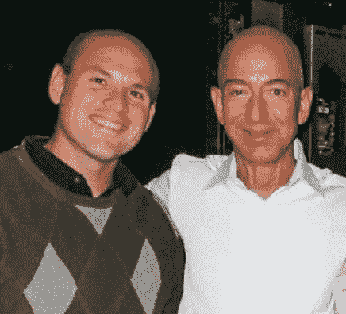
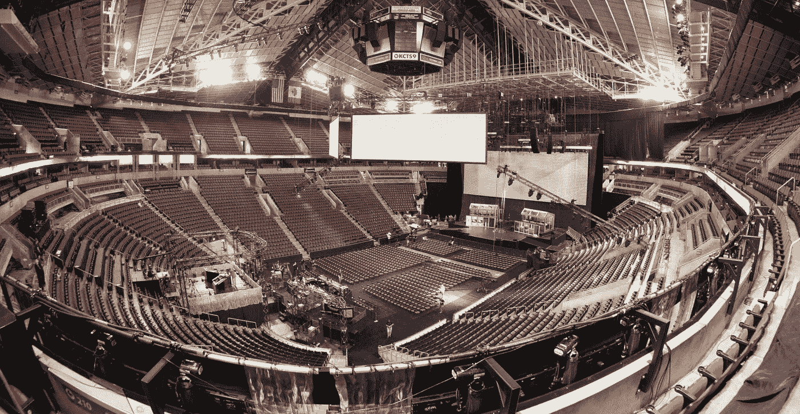
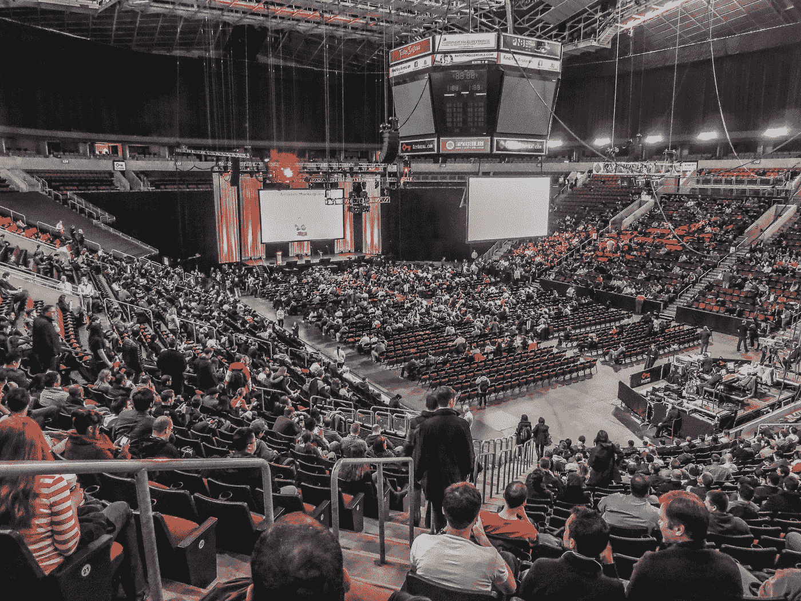
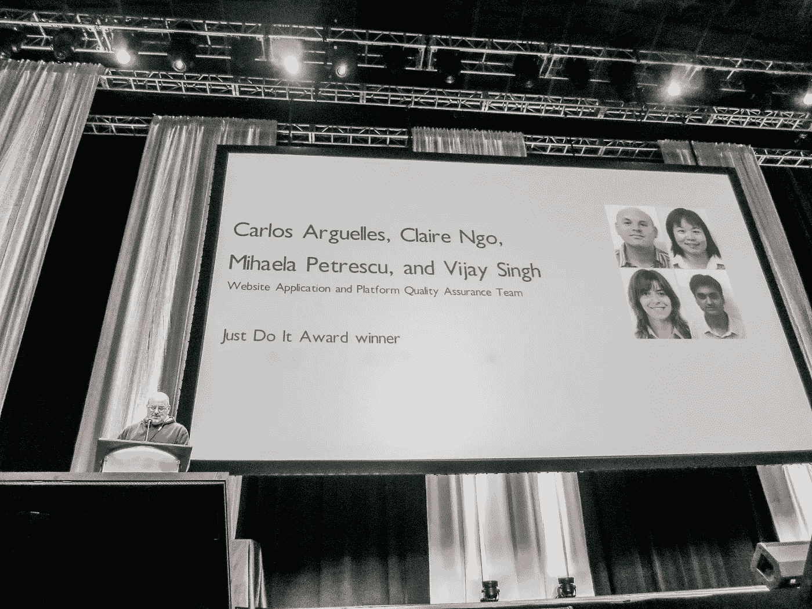
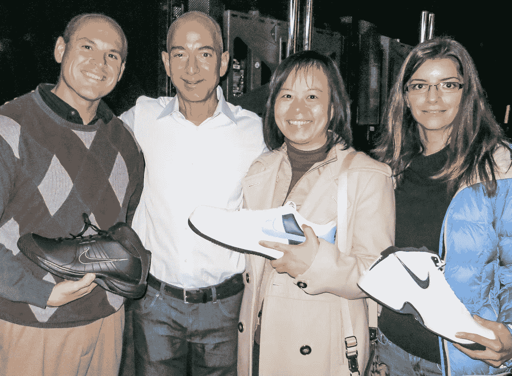
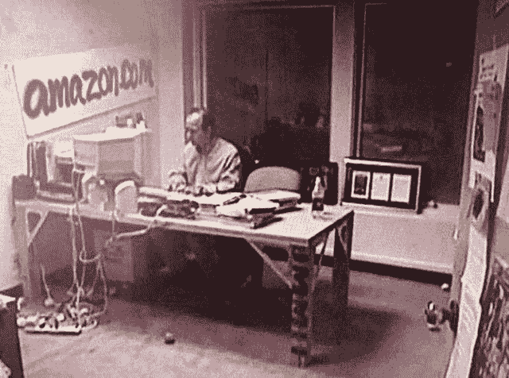
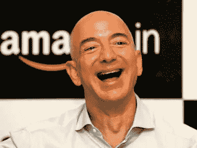
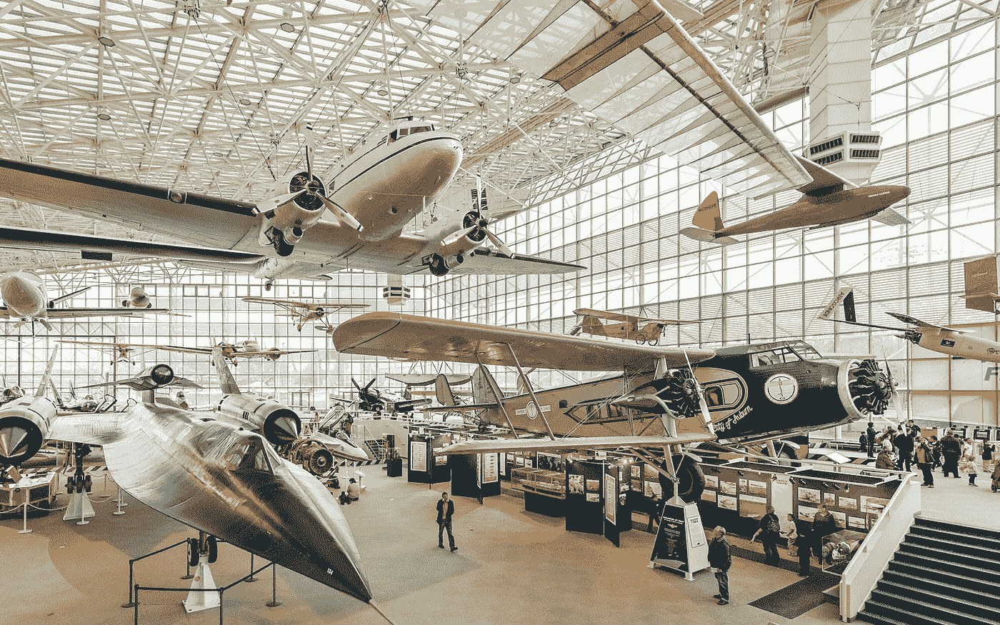

# 那天杰夫·贝索斯给了我一只巨大的鞋子

> 原文：<https://medium.com/geekculture/how-i-met-jeff-bezos-2013-347f6c33c183?source=collection_archive---------8----------------------->

## 另一次我遇见了杰夫

Jeff and I backstage circa 2013

今天，我职业生涯中最有影响力的人退休了，他在车库里建立了一个万亿美元的帝国，彻底改变了世界。我在亚马逊 11 年的转折点之一是我和杰夫一起去后台的那一天。在短短的 5 分钟里，我吸引了世界上最有权力的人之一的全部注意力。他脚踏实地，真诚地对我感兴趣。它激励我 [**努力工作，尽情玩乐，创造历史**](https://succeedfeed.com/jeff-bezos-quotes/) 。

我是亚马逊的首席工程师，在那里工作了 11 年多(2009 年至 2020 年)。在这段时间里，我一直把杰夫视为榜样。我离开了，但亚马逊把我塑造成了一个强有力的领导者和一个人。我之所以是专业的我，主要得益于我对亚马逊文化的接触。亚马逊在很多方面都是杰夫的写照。杰夫无处不在。

# 在后台见杰夫

大约在 2012 年，让忙碌的亚马逊开发人员编写合适的单元测试就像拔牙一样困难。我创建了一个工具，以一些新颖的方式测量代码覆盖率，这有助于突出单元测试中的差距，并在周末和晚上作为副业不懈地工作。不管出于什么原因，我的小工具像野火一样传播开来，它推动了围绕测试实践的公司文化的重大转变，让开发人员对提高他们的单元测试覆盖率感到非常兴奋。我们甚至申请了一项[很酷的专利](https://patents.justia.com/patent/10102106)(哦，它还连续两天让亚马逊的一个关键系统断电，但那是另一回事了……)

亚马逊有一个令人垂涎的内部奖项，名为**[**Just Do It Award**](https://www.google.com/search?q=amazon+just+do+it+award)**，**在西雅图 Key Arena 体育场公司会议期间颁发。杰夫·贝索斯每年都会挑选一两个员工，他们通过在“日常工作”之外创造一些有影响力的东西，来体现创新和行动偏好的核心价值观亚马逊是一家极其节俭的公司，这个奖项不是金钱，也不是一个精美的奖杯。这是一双 18 码的耐克鞋。不是两只鞋。只有一个。因为，你知道，耐克的广告语*“照做就是了”*。哈哈。亚马逊一直为自己的古怪和独特而自豪，所以在成千上万的亚马逊人面前从杰夫·贝索斯得到一只巨大的 18 码鞋是你能得到的最高荣誉。**

****

**Key Arena stadium, where we used to have the Amazon Company Meetings**

****

**2013 Amazon Company Meeting… stadium filling up!**

**2013 年，有人提名我获奖。事实上是杰夫选的。我很震惊。我看着其他人走上舞台，从杰夫手里接过鞋子，但我从未想过我真的会成为他们中的一员！更好的是，和我一起，我的三个朋友也贡献了他们的周末和夜晚来帮助我实现我的想法，他们也获得了荣誉。所以我要和我的伙伴们分享这一刻，他们接受了我的愿景，并帮助我把它变成了现实。**

**于是，克莱尔、[米哈埃拉](https://www.linkedin.com/in/mihaela-petrescu-20280080/)和我坐在体育场的前排，紧张地等待轮到我们，我们的[导演](https://www.linkedin.com/in/gargross/)在我们身边。遗憾的是，Vijay 在印度探亲，所以他错过了。偶尔，我会转身扫描这个巨大的体育场，一路上挤满了亚马逊人，我会感到有点兴奋。**

**我还一直在扫描我们旁边的一排最高级别的高管(亚马逊的“S-team”)，寻找杰夫。我能看到安迪·杰西、杰夫·威尔基、布赖恩·瓦伦丁和其他人，但看不到杰夫。他迟到是因为他要参加某种蓝色起源的发布会。我不停地看手表。但是没有杰夫。**

**我想他们完全希望杰夫能及时赶回来，但他没有，所以在最后一分钟，有人递给布莱恩·瓦伦丁一张小卡片，上面写着我们所做的事情，他们把他推上舞台，代替杰夫给我们颁奖。Brian 已经在微软担任了 20 年的高管，以发布多种版本的 Windows 而闻名，并在亚马逊工作了 8 年，领导电子商务平台。布莱恩是一个很好的人，但我认为他没有准备好这样做。他笨手笨脚地、费力地读着手写的抽认卡，完全把米哈伊尔的名字划掉了，然后开始划掉对我们这个小发明的描述。我记得听到布赖恩读抽认卡时想“不！！！那不是我们做的！不要！”但不管怎样，轮到我们上台了，于是我们就这样做了，我们微笑着，红着脸，和布莱恩握手，在成千上万的亚马逊人鼓掌面前拿着我们巨大的 18 码耐克，然后走下舞台。**

****

**Brian Valentine on stage announcing the Just Do It Award 2013!**

**当我们走下讲台，回到座位上时，我终于看到了杰夫·贝索斯本人，他正被护送到行政区。他差几分钟就错过了“就这么做”奖！我很沮丧。**

**公司会议持续了一会儿。比赛结束后，人们开始离开体育场。我们正准备离开，对平淡的经历感到相当沮丧，这时有人走过来说，“杰夫想见见你们，他在后台。**

****

**Backstage with Jeff Bezos and our ridiculous Size-18 Nike shoes**

**所以我们去了舞台区。杰夫在那里，穿着他平常穿的白衬衫和蓝色牛仔裤。他对我们微笑，非常热情。他感谢我们的小发明。他实际上知道我们做了什么，并问了一些非常有趣和深思熟虑的问题。我们是如此害羞和紧张，但他是如此脚踏实地，真正对我们在公司的道路感兴趣。他花了令人惊讶的长时间和我们聊天。他甚至开了几个玩笑。我知道他要跑题了，因为他的安保人员看起来对绕道有点恼火，并一直在核对时间，但他似乎并不介意。最后他不得不走了，所以他和我们握手，同时说“努力工作”。玩得开心。创造历史！”满脸笑容。**

**我不得不说，如果杰夫真的参加了递鞋仪式，我会拍到杰夫在舞台上给我递鞋的镜头。但也就这样了。我不会去后台和他聊上宝贵的几分钟，没有讲稿。所以，事情真的变得对我们非常好。**

**一件有趣的事情是这件事对我们的触动有多深。我们四个当时是初级工程师。[克莱尔](https://www.linkedin.com/in/claire-ngo-7b43521/)后来成为了一名高级经理。她已经在亚马逊工作了将近 14 年。[米哈埃拉](https://www.linkedin.com/in/mihaela-petrescu-20280080/)后来成为 AWS 的首席工程师，并在亚马逊工作了 12 年。 [Vijay](https://www.linkedin.com/in/vijay-p-singh-29248713/) 成为高级工程师，已经 13 年了。我成了 AWS 的首席工程师，在那里工作了 11 年多。在快速发展的软件行业中，这种任期很少见。我想知道那天对我们所有人的影响有多大。我知道，对我来说，这真的是我职业生涯的转折点。我为成为他公司的一员而感到自豪，我感到受到鼓舞，要努力工作，享受乐趣，并在此后的许多年里创造历史。**

***这里还有一些杰夫的轶事……***

# **杰夫参加新员工入职培训**

**我第一次(虚拟)接触杰夫是在 2009 年 4 月我上班的第一天。如今，亚马逊的新员工入职培训(NEO)是一项为期多天、组织有序的活动，通过训练营，你可以了解到用于开发、测试和部署软件等的内部工具。但在 2009 年，尼奥实际上是坐在一个会议室里，天花板很低，荧光灯嗡嗡作响，位于城镇破旧地区的一座破旧建筑里(毒品交易和刺杀就在外面发生)，看着一个 15 分钟的杰夫·贝索斯励志视频，被发给你的徽章和一台笔记本电脑，实际上被告知，“现在去工作吧！”这并不是最迷人的欢迎，而且来自曾经在微软的高档雷德蒙德有一个私人角落办公室，这绝对感觉像是一种退步。我忽略了这种糟糕的欢迎，因为我知道亚马逊将创造历史，我想成为其中的一部分。**

# **杰夫在公司会议上**

**我第二次接触杰夫是在公司会议上。每个季度，我们都会租下 KeyArena(西雅图的一个体育场)，让几千名亚马逊人在那里呆上一天，回顾一下那个季度发生的事情。回想我在微软任职的 11 年，我参加过很多微软公司的会议，所以我已经习惯了这些大型的公司聚会。但是亚马逊的版本与众不同。微软公司会议的亮点是史蒂夫·鲍尔默，他穿着花哨的西装站在那里，像一只愤怒的猴子一样比划着我们需要如何摧毁竞争。在 90 年代末，他会声嘶力竭地喊道:“我们必须摧毁网景！！！!"然后人群会变得疯狂。为了戏剧效果，他会停下来。“我们必须消灭孙！！!"人群会再次被激怒。史蒂夫是一个充满睾丸激素的表演者。从这些微软公司的会议中得到的信息是，有一个实体要被摧毁，我们要去做。带着这些期望，我参加了 2009 年我的第一次亚马逊公司会议，兴奋地听到我们必须摧毁谁。但令我惊讶的是，杰夫开始说话了，非常平静。不像史蒂夫，他穿着花哨昂贵的西装，他穿着普通的 t 恤，蓝色牛仔裤和网球鞋。与史蒂夫不同，他有一个非常脚本化，非常排练的关于史蒂夫的节目，杰夫没有脚本，自由地回答观众的问题，非常脚踏实地。不像史蒂夫，他的节目都是关于强烈的情感(是的，我看史蒂夫哭了很多次…)，杰夫是理性的，数据驱动的，客观的。他一次也没有提到“竞争”或摧毁任何人的需要。我很困惑。我想不出比史蒂夫·鲍尔默和杰夫·贝索斯更不同的两个人了。他谈到了客户，并为客户做正确的事情。*“与其关注竞争，不如坚持不懈地关注客户。如果你这样做了，那么你就不必担心竞争了。对我来说，为我的顾客建造令人敬畏的东西的想法比摧毁我周围的其他东西的想法更有吸引力和活力。***

****

**Imagine turning *this* into a 2-trillion dollar business!**

**多年来，我一直期待着听到杰夫在公司会议上发言。有几次，我甚至在比赛开始前一个小时赶到体育场，拿到了一个靠近前排的座位。我总是发现他脚踏实地，真诚。他是一个很棒的故事讲述者，经常会提起他在祖父的农场度过的[童年的趣闻轶事来推动某种观点。我发现大多数高管都很谨慎，照本宣科，缺乏灵感。但是杰夫不一样，实际上我*想要*为他工作。](https://www.inc.com/peter-economy/jeff-bezos-just-revealed-shocking-event-that-made-him-self-reliant-wildly-successful.html)**

# **杰夫在圣诞晚会上的笑声**

**杰夫的怪癖之一是他的笑声。“杰夫的笑？”你可能会对它的意义感到疑惑不解。是的，杰夫以他的大笑而闻名。你必须在 youtube 上搜索 [**【杰夫·贝佐斯的笑声】**](https://www.youtube.com/results?search_query=jeff%20bezos%20laugh) ，有几十个例子。来吧，用最大音量播放！我从未听过有人这样笑过。但这是杰夫，最自然，最自在的自己。**

****

**我的第一年(2009 年)，亚马逊租下了飞行博物馆(西雅图南部)作为他们的圣诞派对。我们是一个小得多的公司，所以我们可以轻松舒适地适应博物馆。当时我们大约有 3000 名工程师(到我 2020 年离职时，我们已经发展到 5 万名工程师)。我和妻子正在闲逛，享受一些开胃菜和葡萄酒，看着飞机，突然这种疯狂的笑声吓了我一跳。感觉就像有人把扩音器直接放进了我的耳垂。我转过身，吓了一跳。杰夫就在我旁边，和麦肯齐(他的妻子，直到最近)喝着酒，和一些高管聊着一些显然很有趣的事情。你不禁会想“这是怎么回事？”你第一次听到这种笑声，但后来有一些可爱和舒适的东西。这是解除武装。这是非常真实的。这是一个令人难以置信的强大的家伙，但穿着蓝色牛仔裤和衬衫，只是在你旁边喝饮料。我看上去一定有点害怕，因为有那么一秒钟我们进行了眼神交流，他只是微笑着友好地冲我点了一下头。**

****

**The Museum of Flight, where we had the Amazon Christmas Party back in the days**