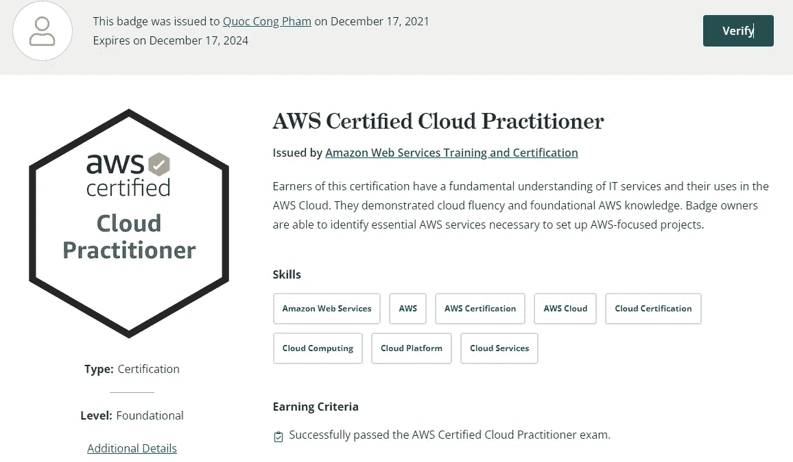

# 我如何在两周内通过 AWS 认证云从业者考试，你也可以！

> 原文：<https://medium.com/geekculture/how-i-passed-aws-certified-cloud-practitioner-exam-in-2-weeks-and-so-can-you-a968764bce0b?source=collection_archive---------4----------------------->

我是一名 web 开发人员，很久以来我一直渴望了解云计算技术。这是一个非常强大的工具，许多软件公司都在使用它，它也是招聘人员寻找的一个非常受欢迎的工作要求。作为我目前工作的一部分和我的求知欲，我想知道我如何深入这个新领域，我在哪里可以获得我的知识认证。我就是这样找到了这个帮助我获得 AWS 平台基础知识的亚马逊网络服务基础水平证书考试。如需了解更多关于该证书及其用途的信息，请访问[亚马逊网络服务官方网站](https://aws.amazon.com/certification/certified-cloud-practitioner/)。

因为我需要尽可能多的了解云计算，这样我就可以在我目前的工作中使用它，我挑战自己提前两周报名参加考试。浏览 AWS 官方网站的[考试指南](https://d1.awsstatic.com/training-and-certification/docs-cloud-practitioner/AWS-Certified-Cloud-Practitioner_Exam-Guide.pdf)，你需要在短时间内吸收大量信息。别担心，我也很担心，但是在网上找了一些资料并制定了计划之后。我能够在一周多一点的时间内完成学习阶段，然后专注于解决许多实践考试和修补学习差距。

我找到了一个可靠的 [*AWS 认证云从业者(CLF-C01)*](https://learn.acloud.guru/course/aws--certified-cloud-practitioner/overview) 关于云大师的课程，这是一个大约 10 小时的学习。它确实花了我 35 美元的订阅费，但是很多人都推荐它。此外，我在 Udemy 上花了大约 15 美元买了一套 6 道练习题。(我没有得到任何这些平台的赞助。这是我为应对这次考试而准备的实际学习材料)

**答:学习阶段(8 天)**

这个阶段我用的是云大师课程。我需要准备四个学习领域:

1.  云计算基础(1 小时学习，30 分钟复习)
2.  技术(5 小时学习，3 小时复习)
3.  安全性和合规性(2 小时学习，1 小时复习)
4.  定价、计费和治理(1 小时 30 分钟的学习)

我制定了如下计划。

第 1 天)完成云计算基础章节的学习(1 小时)

第 2 天)学习技术章节(1.5 小时)并复习云计算基础章节(0.5 小时)

第 3 天)学习技术章节(1.5 小时)并复习我昨天学到的技术知识(0.5 小时)

第 4 天)学习技术章节(2 小时)

第 5 天)复习技术章节(2 小时)

第 6 天)学习安全性和合规性章节(2 小时)以及定价、计费和治理章节(1 小时)

第 7 天)回顾安全性和法规遵从性章节(1 小时)并回顾计费和治理章节(30 分钟)

第 8 天)复习所有四章(3 小时)

正如你所看到的，我花了很多时间来复习，我总是在第二天复习，因为这有助于你刷新记忆，让它在你的脑海中停留更长时间。请根据你的需要定制这个计划。

此外，有这么多的服务，我需要在短时间内了解，对我来说，记住它们的最好方法是记住它们的标志符号或编造关于它们的故事。例如，AWS Lightsail 标志符号看起来像一艘快速行驶的船，

[AWS Lightsail logo](https://aws.amazon.com/lightsail/)

所以我想，如果我能把我的应用程序放在那里，它将帮助我快速启动它。或者，AWS Athena 徽标看起来像一个中间有一个聚焦桶的放大镜，

[AWS Athena logo](https://aws.amazon.com/athena/?whats-new-cards.sort-by=item.additionalFields.postDateTime&whats-new-cards.sort-order=desc)

所以它向我暗示这是用于分析(因为放大镜)数据的服务(有时人们用‘桶’这个词作为特定地区数据的同义词)。相信我，这种方法非常有效，如果你能把它与你知道的东西联系起来，尤其是与你需要知道和记忆的 20 多种 AWS 服务联系起来，它会帮助你更好地记忆。

**B .实践阶段(6 天)**

这是最重要的阶段。我在 Udemy 上购买了 [*一套 6 个练习题，也有云宗师课程的练习题。所以我试着每天解决 2 到 3 个考试。考试时间为 90 分钟，有 65 道选择题，我尝试在 60 分钟内解决每个模拟考试，并用最后 30 分钟来复习我的答案。我建议在完成模拟考试的过程中不要去寻找答案，这样你会习惯于没有帮助的考试环境，也可以看看你在模拟考试中的真实表现。完成每个模拟考试后，我会查找错误的问题，并将其保存到单独的笔记中，以便我可以查找相关的讲座，并在以后进行复习。从这个阶段的第一天到第五天我一直这样做。*](https://www.udemy.com/course/aws-certified-cloud-practitioner-practice-test/)

我通常不喜欢在考试前的最后一天死记硬背。因此，我只是重做了之前做模拟考试时我在笔记中保存的所有做错的问题，并奖励自己一顿温暖的大餐。

**做题小技巧:**

我只有一个在每次考试中都会用到的技巧:

> 在参加考试之前，我会告诉自己，我已经尽了最大的努力，如果这次考试不及格，我会重新学习，再试一次。

我知道这听起来有点奇怪，但它确实给了我信心，我已经尽了最大努力，所以我可以在考试时非常专注。就凭这一点，到目前为止，我没有一次考试不及格。

**结论:**

一旦你通过考试，你将获得一个在线徽章，你可以把它放在 Linkedln 上，给潜在雇主留下深刻印象。

Cong’s AWS certificate

因此，为了学习这门课程，我花了大约 50 美元购买在线资料。你可以减少 Udemy 考试集，在 Cloud Guru 上练习考试就可以了。

这只是一个知识认知而非经验的选择题。我仍然建议实际上从这些 AWS 服务中建立一些东西，因为这将是你工作或建立自己的企业所需的技能，而不是证书。

根据你的需要和情况，你可以随意调整这个计划。祝你好运！