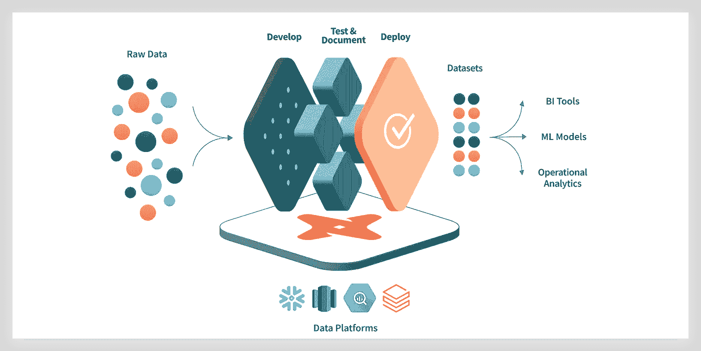
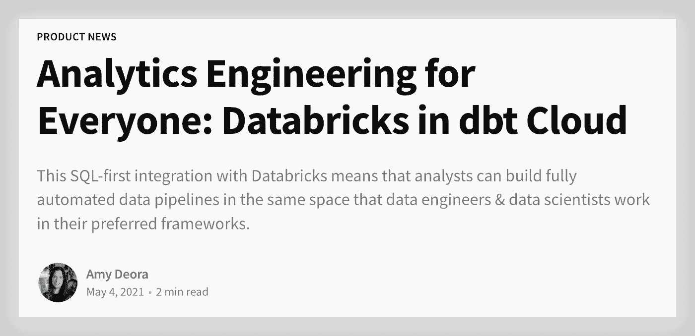
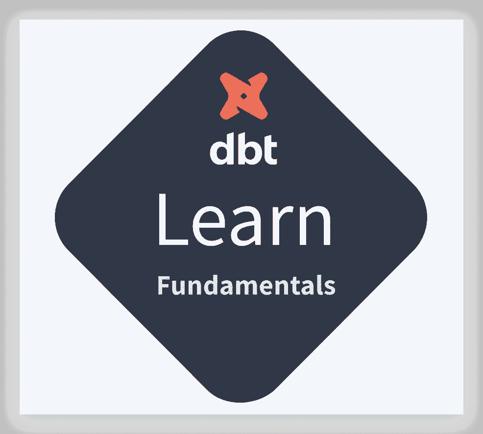

# 我如何通过 Databricks 的 dbt 基础认证

> 原文：<https://medium.com/geekculture/how-i-passed-the-dbt-certification-534ffb5e35b1?source=collection_archive---------4----------------------->

## TL；dr dbt 是 ELT 的一个开源项目。它使分析工程师能够通过以可重用的方式编写 SQL 来转换数据。本文介绍了我是如何通过 dbt 基础认证的，以及使用 Databricks 运行 dbt 培训课程需要了解的内容。

[**dbt 是 ELT**](https://blog.getdbt.com/what-exactly-is-dbt/) **中的“T”。**它不提取或加载数据，但它非常擅长转换已经加载到您的仓库中的数据。这种“加载后转换”架构被称为 ELT(提取、加载、转换)。

Image credit: dbt [https://www.getdbt.com/](https://www.getdbt.com/)

我获得了 dbt 认证，但让我们简单地说一下，如果你想做同样的事情，下面是重要的:

# dbt 基础培训

*   dbt 实验室提供在线 [dbt 基础培训](https://courses.getdbt.com/courses/fundamentals)课程。这是一门很好的课程，有优秀的演讲者。我喜欢参加那次培训。我说过它是免费的吗？
*   完成包括所有实验在内的课程的**预计时间**为 5 小时。我自己，在没有太多 dbt 知识的情况下，在一个半雨天的周六成功地做到了。这包括计算数据加载的时间(见下文)。看完这篇文章，你可能会更快！
*   要运行该课程，您需要一个 dbt 云帐户(设置在课程中描述)和一个 [Databricks 试用帐户](https://databricks.com/try-databricks)。两个账号都是免费的。
*   该课程是为**数据块、红移、雪花**等而设计的，但是在撰写本文时，并没有为数据块解释样本数据的加载。由于我大部分时间都在使用数据块(我有偏见，请看我的简历)，我对在教程中使用红移或雪花不感兴趣。
*   这是我用来将样本数据加载到数据块中的快速破解笔记本。代码仅为 SQL，并利用了[数据块自动加载器](https://docs.databricks.com/spark/latest/structured-streaming/auto-loader.html)。我把所有的样本数据都放在一个数据库里，你可能会喜欢一个更好的解决方案。

# 数据块用户的 dbt

*   这篇文章的目的是为您节省一些时间*,如果您想按照 dbt 培训大纲进行*。注意，对于在生产中使用带有数据块的 dbt，有更好的方法。你可能想从 [Databricks partner connect](https://databricks.com/blog/2021/12/06/deploying-dbt-on-databricks-just-got-even-simpler.html) 开始，也可以看看 [dbt 博客](https://blog.getdbt.com/analytics-engineering-for-everyone-databricks-in-dbt-cloud/)。
*   更新:查看 dbt 的[数据块文档。](https://docs.databricks.com/integrations/prep/dbt-cloud.html)

*   当然，dbt 对于任何数据工程师来说都是一项有趣的技能(请原谅，任何分析工程师:-)。如果您正在使用 Databricks，也请查看 [Delta Live Tables](https://databricks.com/product/delta-live-tables) ，它支持 SQL 和 Python、数据沿袭、运行时优化，并支持流，但消除了 dbt 所需的阿帕奇纪娜模板语言和 YAML 文件。请继续关注，因为 Databricks Ventures 与 dbt labs 合作。

# dbt 基础认证

## 困难

*   通过大多数 dbt 实验室后，通过证书是中等难度。考试迫使你再次浏览学习材料，并且在官方文件中查找一些资料。这很好。

## 证书允许的材料

*   有一些棘手的问题，但你可以使用任何材料。所以花时间做一些研究。很明显，重温课程材料会给你带来优势。

## 时间限制/重复

*   我记得没有时间限制。喜欢的话可以重考。因为我是一个懒惰的人，有很多问题，我建议第一次就把它做好(我在那个星期六也有其他计划)。

## 祝你好运！！！

我第一次尝试就通过了认证。祝你好运！！！

dbt Fundamental certification, Dr. Frank Munz

如果你喜欢这篇文章，请在媒体上关注我，并为它鼓掌。更多基于云的数据科学、数据工程、AI/ML 关注我[***Twitter***](https://twitter.com/frankmunz)***(或***[***LinkedIn***](https://www.linkedin.com/in/frankmunz/)***)。***