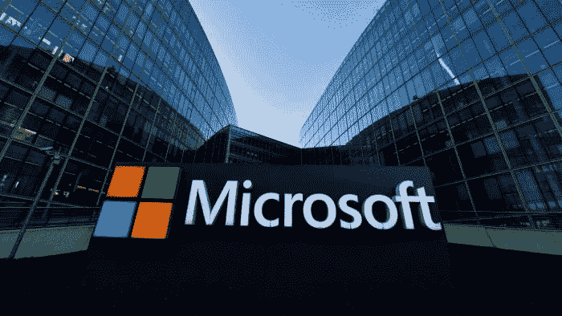

# 我是如何准备微软的面试并得到这个职位的

> 原文：<https://medium.com/geekculture/how-i-prepared-for-my-interview-with-microsoft-and-landed-the-role-fda7a8d1f93b?source=collection_archive---------5----------------------->

我在 2022 年 4 月 5 日写这篇文章。昨天，2022 年 4 月 4 日，是我在微软做软件工程师的第一天。太棒了！

众所周知，大型知名科技公司的面试过程漫长而艰难。查看我的文章[让我们来谈谈软件工程招聘流程](https://levelup.gitconnected.com/lets-talk-about-software-engineering-hiring-processes-364d973bd87e)如果你想了解一下为什么…