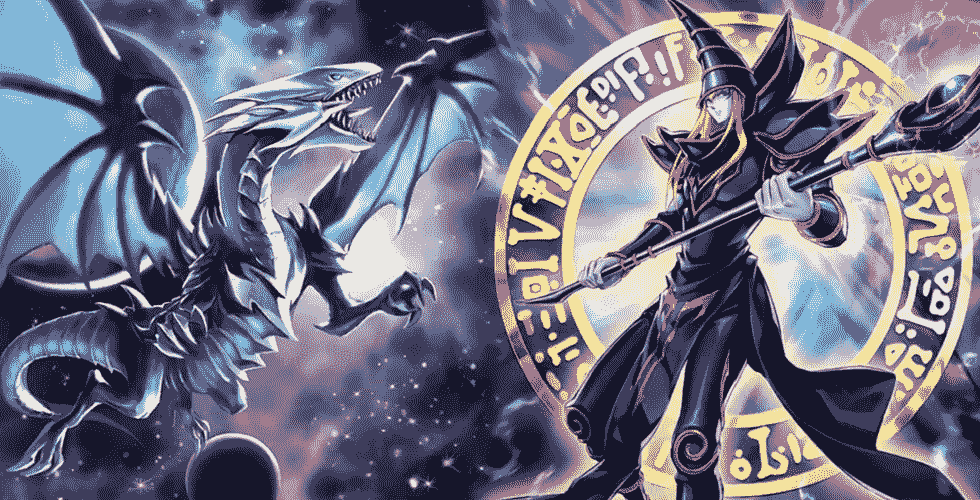
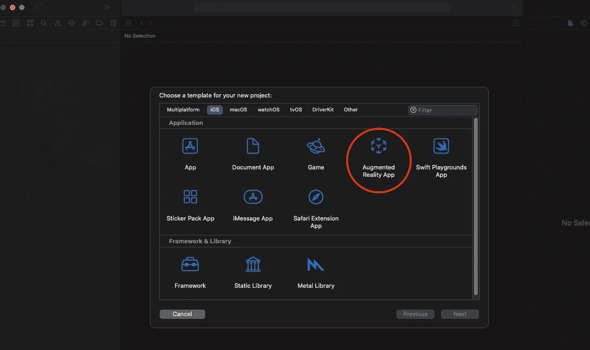
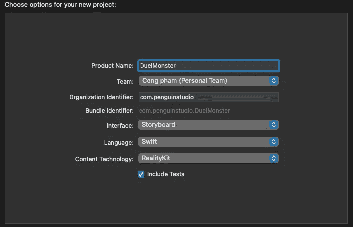
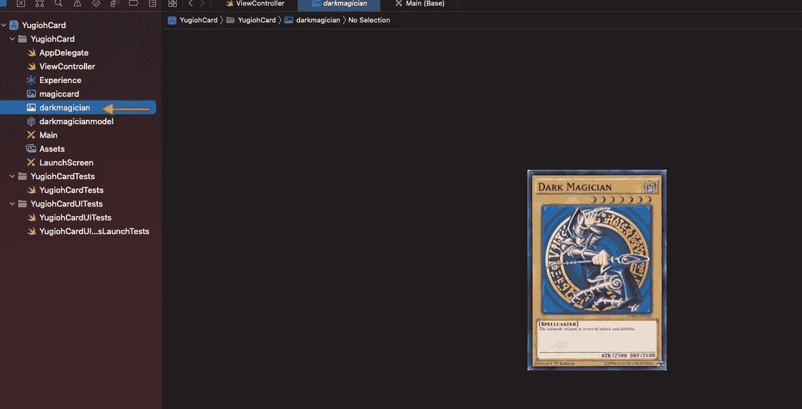
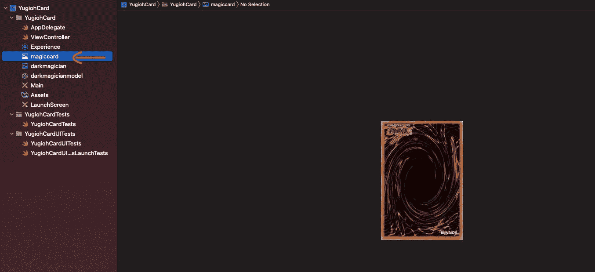
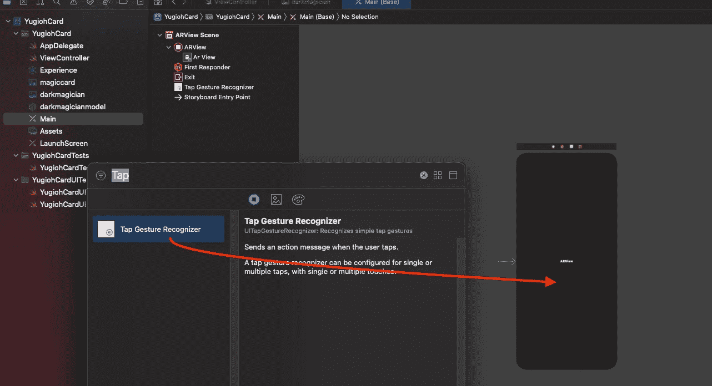
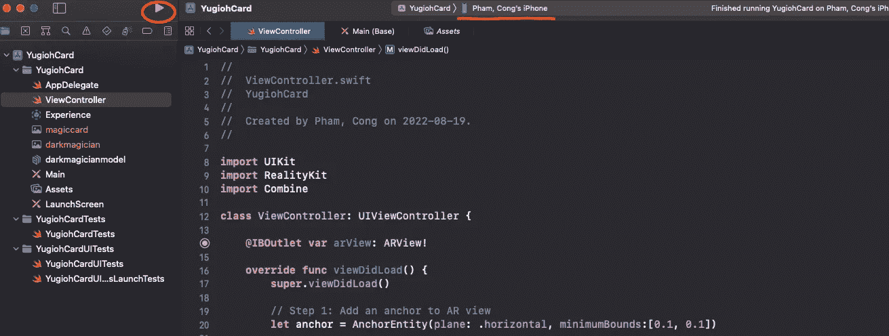
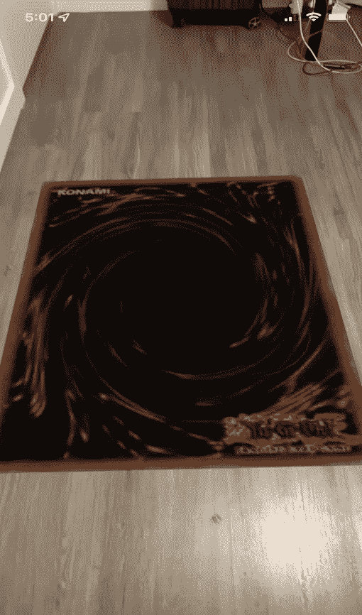
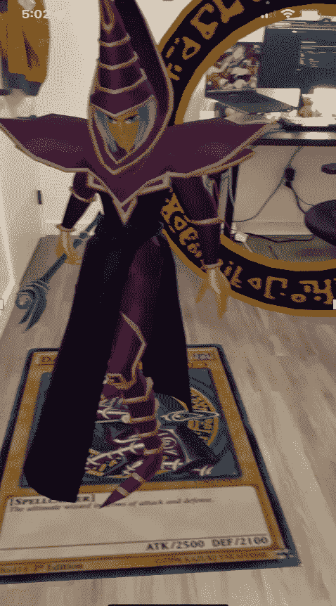

# 我如何重现身临其境的游戏王！使用增强现实的纸牌游戏

> 原文：<https://medium.com/geekculture/how-i-recreate-immersive-yu-gi-oh-card-game-using-augmented-reality-f7f570ff252e?source=collection_archive---------10----------------------->

image from the internet

游戏王。是由高桥和希创作的日本漫画和动画系列。该系列围绕着名为“决斗怪兽”的卡牌游戏展开，每个玩家都用卡片在一场幻想“怪兽”的模拟战斗中“决斗”对方。这是我最喜欢的漫画和动画系列之一，我觉得它与我的童年记忆紧密相连。作为一个孩子，我一直梦想着有一天我们可以让那些怪物真的跳出卡片，互相战斗。借助增强现实技术，我正在实现我的梦想！

我是这样做的。

**步骤 1)创建一个带有增强现实的 Xcode 项目**

我选择了增强现实应用程序作为新的项目模板。

然后，我选择了`Storyboard`作为我的主界面，`RealityKit`作为内容技术。

**步骤 2)下载卡片图像**

我总是团队黑暗魔术师，所以我从网上下载了我想要的卡片的正面和背面图像。然后，将其放置在项目文件夹中。

**步骤 3)购买 3D 黑暗魔术师模型**

我不是专业的 3D 建模艺术家，所以我从 [Sketchfab](https://sketchfab.com/3d-models/dark-magician-yugioh-d3cfb2f8d8f746e09dab156649defa5d) 购买了 3D 黑暗魔术师模型，然后把它放在我的项目文件夹中。我觉得让我童年的梦想成真是值得的。

**步骤 4)添加代码**

我在 ViewController.swift 文件中添加了以下代码。我注释了代码的每个部分是做什么的，所以很容易理解。

**步骤 5)在应用程序中添加点击手势**

这个点击手势意味着当用户点击卡片时，向上或向下翻转卡片。

在 Main.storyboard 中，我用`Command + Shift + L`打开手势搜索面板，搜索`Tap Gesture Recognizer`。一旦找到它，我就把它拖到屏幕中间的视图。

**步骤 6)构建项目**

然后，我开始使用 Play 按钮构建项目，并将 Macbook 连接到我的 iPhone。

**结果**

打开 App 时，卡片朝下。

当用户点击时，卡片面朝上，强大的黑暗魔术师出现了！

它看起来像什么的短视频。