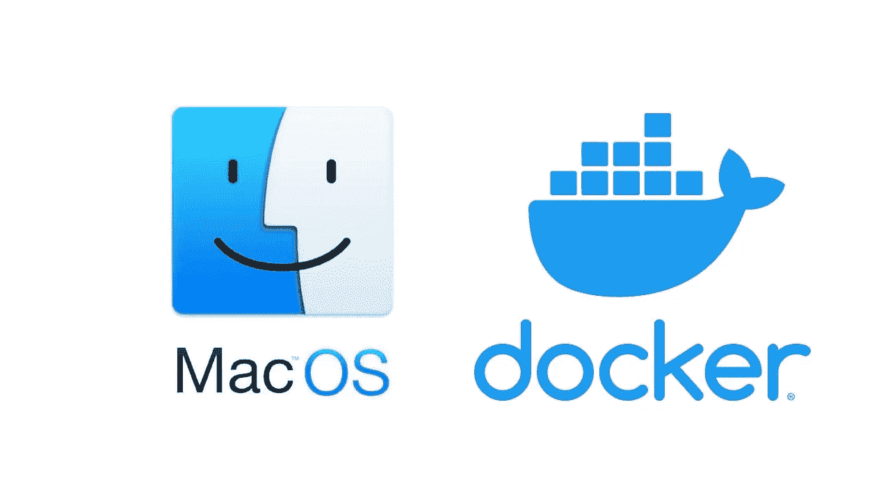
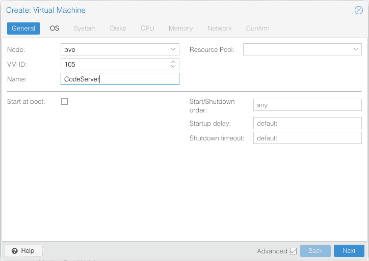
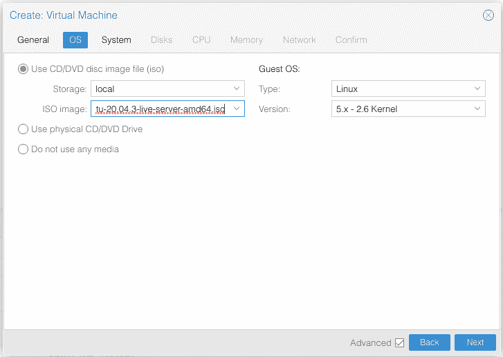
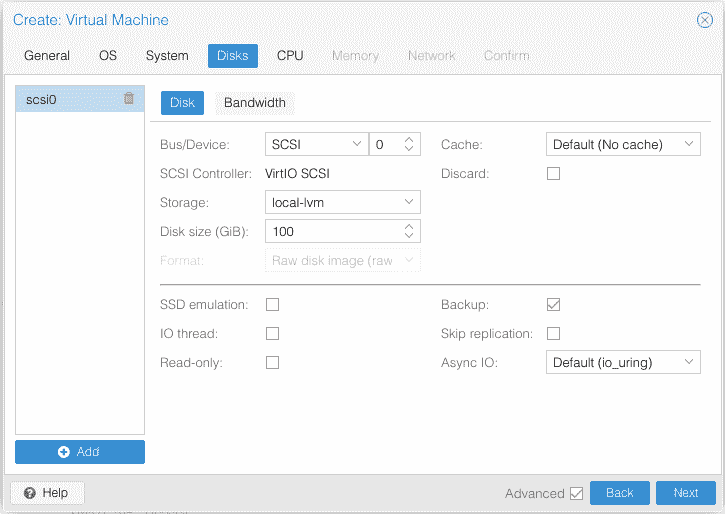
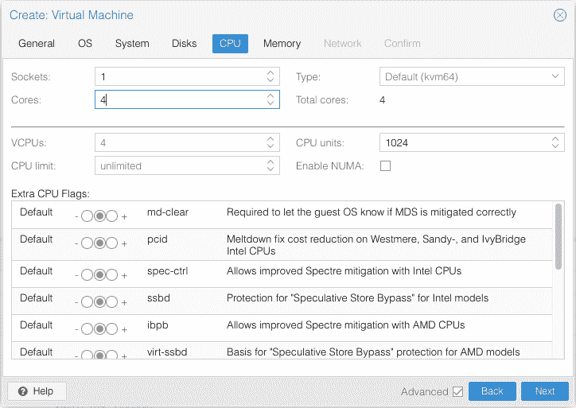
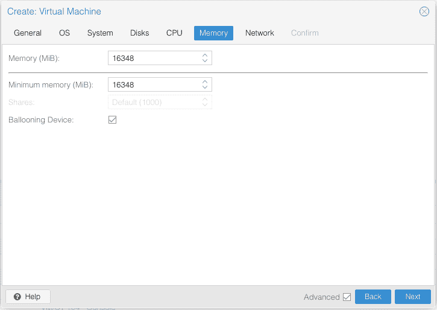
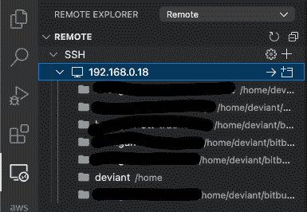

# 我如何保存我的 MacOS Docker 开发经验

> 原文：<https://medium.com/geekculture/how-i-saved-my-macos-docker-development-experience-6fce6a81a456?source=collection_archive---------5----------------------->

# 介绍

我敢肯定，你们大多数人都经历过 MacOS 上的 docker 缺乏光彩和令人沮丧的经历。如果不是，那么请让我知道你是如何生存了这么久。这并不是要抨击 MacOS，我喜欢整个 MacOS 开发人员的体验和环境，但它是一个大的，但当谈到 docker 时，它下降得如此之平，令人害怕。

诚然，你可以在 Macbook 上使用 docker，但是这非常慢，如果它不慢，我肯定是因为你正在做非常一维的事情，并且可能只使用已经从 docker hub 构建的 docker 映像。如果你是，那么它非常有用，你不应该有很多性能问题。

# 问题

当我在 Macbook 上构建新映像或使用 cli 工具(如 AWS Sam 或 AWS CoPilot)构建和安装映像时，或者当我需要构建生产映像以在 ECS 容器中托管时，我真的很难使用 docker。

我有 Macbook Pro M1 Pro 芯片 16GB 型号作为参考，所以它一点也不慢。我确实理解 docker 在 MacOs 和 Windows 上运行缓慢的原因，这归结为几个方面，但主要是 docker 在这些操作系统上的虚拟机中运行，而不是像在 Linux 上那样本机运行。

大多数问题可以通过在 CI/CD 管道中构建这些来解决。这里有几个问题，这是唯一的答案:

1.  这主要与本地开发流程和经验有关，而不是部署
2.  我需要在本地测试我的容器，并在某些情况下构建一个生产版本
3.  使用 AWS Sam 和 Copilot 进行本地测试也需要在本地进行构建
4.  CI/CD 需要资金来托管和运行构建和部署

最后一根稻草是试图为我们正在开发的 NextJS 应用程序构建生产映像，也是在星期五(我知道这是一个星期五，任何与生产环境有关的事情都很危险)。

docker 文件或我正在做的任何特别的东西都没有什么不寻常的，但是仍然建立这个图像花费了惊人的 33 分钟… **33 分钟**我不得不做了好几次，因为我在测试为什么只有一个生产错误而没有在开发中，这是一个愚蠢的原因，但这个愚蠢的原因花费了我 2 个多小时，因为实际构建映像需要**时间**。

这不是唯一需要花费时间的事情，AWS SAM 无服务器 api 构建一个非常简单的 api 需要 10 多分钟，不要让我开始使用 **sam local start-api** 在本地测试这些 API

AWS 副驾驶不是那么糟糕，但仍然需要一些时间。

但你明白我的意思，这只是一个可怕的经历，我们讨厌等待我们的机器赶上来的工程师。这会影响工作效率，尤其是当你需要做这些构建或者运行容器来解决一些 bug，并且需要重复构建你的容器的时候。

# 解决方案

如果你每天都使用容器，这个问题的解决是非常简单的。但是如果你爱 MacOS 呢？也许你和我一样太深入它的生态系统了？

嗯，有一个解决方案，这可能不会解决所有人的问题，但它在很大程度上解决了我的问题！我非常支持拥有一个家庭实验室。如果您像我一样需要性能，那么在 Linux 上运行 docker 绝对是正确的选择。

在走这条路之前，我也尝试了 docker 桌面的实验性特性。

您的 Homelab 不需要在本地，可以在云中，有几个选项，如 Github Codespaces，AWS 有类似的东西，或者可以尝试 Oracle 的免费层，它非常慷慨，我认为您可以获得 4 个内核和 24GB Ram，这是完美的！

然而，我的主要家庭实验室是一个 10 岁的 i7 32GB 内存和 1TB 固态硬盘，只是一个普通的桌面级规格，没有服务器级组件。

在我的 HomeLab 上，我做的事情有一点不同，它不只是安装在 Linux 上，虽然这很好。我安装了一个名为 Proxmox 的第 1 层管理程序(它是免费的，非常棒)

我的家庭实验室为我做了一大堆事情，我很可能会写一篇关于它的文章，以及它在未来所做的一切，因为它真的是一个工程师拥有的令人惊叹的工具。

在最后的 33 分钟里(我还是不得不说！)build 我迅速登录我的 Proxmox 仪表盘，创建了一个 Ubuntu 20.4 实例。

我给它分配了 4 个内核和 16GB 内存以及 100GB 硬盘空间，这将是我的远程代码服务器。

我设置了它，并确保安装了 OpenSSH 客户端，这非常重要！

一旦安装完毕，我就可以通过 SSH 进入机器了。我安装了 [VSCode 远程开发扩展](https://code.visualstudio.com/docs/remote/remote-overview)

安装后，您将能够通过 SSH 直接通过 VSCode 连接到您的虚拟机实例

然后，一切都与您在本地机器上的情况非常相似！它非常棒，最棒的是，讨厌的 MacOS Docker 问题已经成为过去！我的 33 分钟(呸！)构建时间减少到 4 分钟，这还包括下载一个新的节点 16-alpine 图像！这是一个巨大的进步！哦，这里的踢球者，我做了这整个设置在更少的时间，然后我的 33 分钟最终建立本地花了事实上，我开始了这一进程，因为它是建设。

就像我提到的，这个解决方案并不适合所有人，但是到目前为止，它对我来说非常有效！如果你有任何关于 MacOS docker 的建议，请告诉我，我知道这是我试过的性能最好的解决方案。