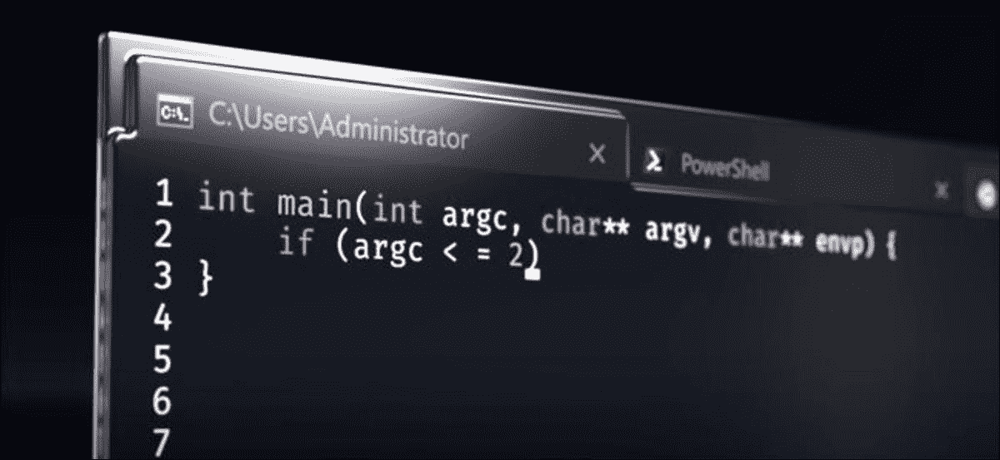

# 我如何使用 WSL2 在 Windows 中设置 Python 开发，以及为什么您也应该考虑

> 原文：<https://medium.com/geekculture/how-i-setup-for-python-development-in-windows-with-wsl2-and-why-you-should-consider-too-24187c9ed3a0?source=collection_archive---------4----------------------->

Image Credit: [Microsoft](https://www.youtube.com/watch?v=8gw0rXPMMPE)

## 作为新手学习 Windows 编程

当我第一次开始学习 Python 时，我是在 Windows 机器上开始的。我会盲目地遵循教程提供的安装说明(主要是通过 Anaconda ),而没有真正理解任何进程是如何在…