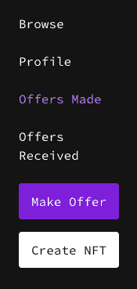
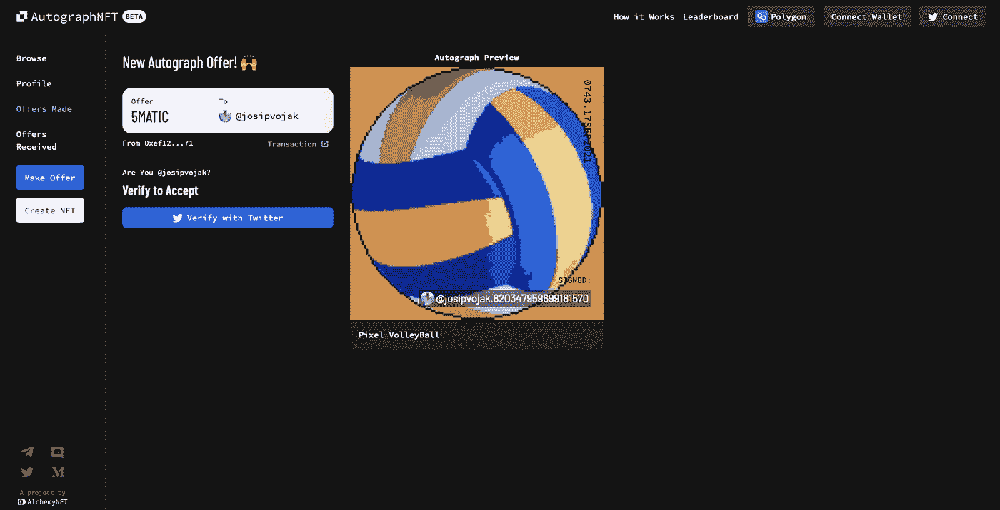
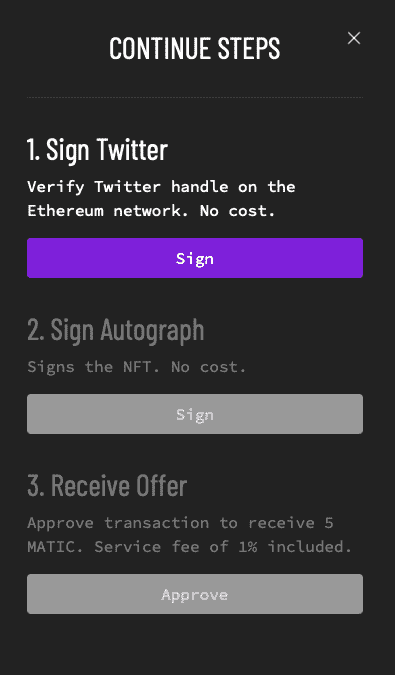
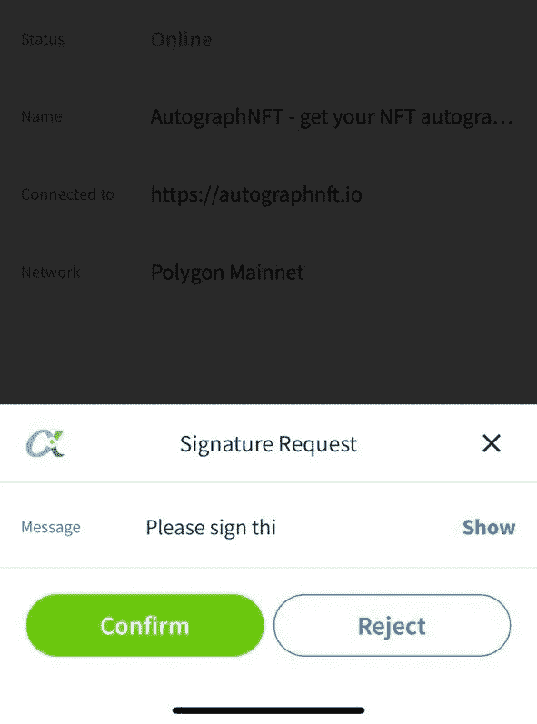
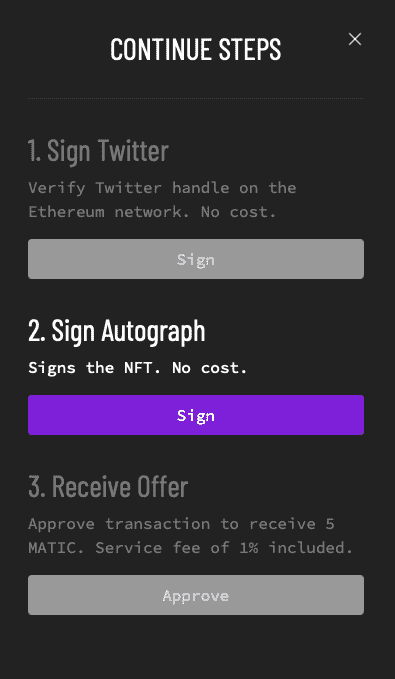
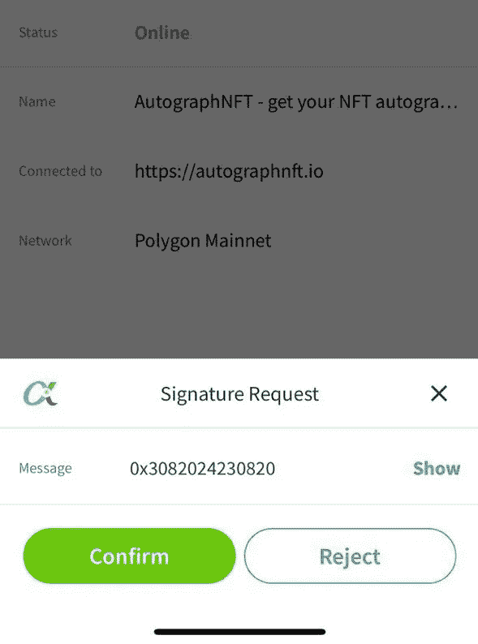
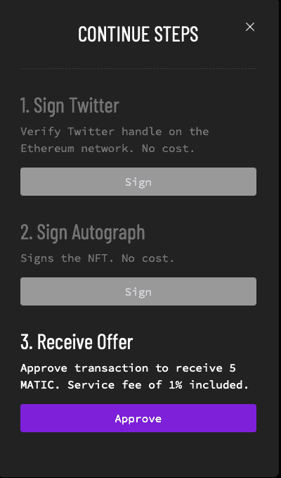
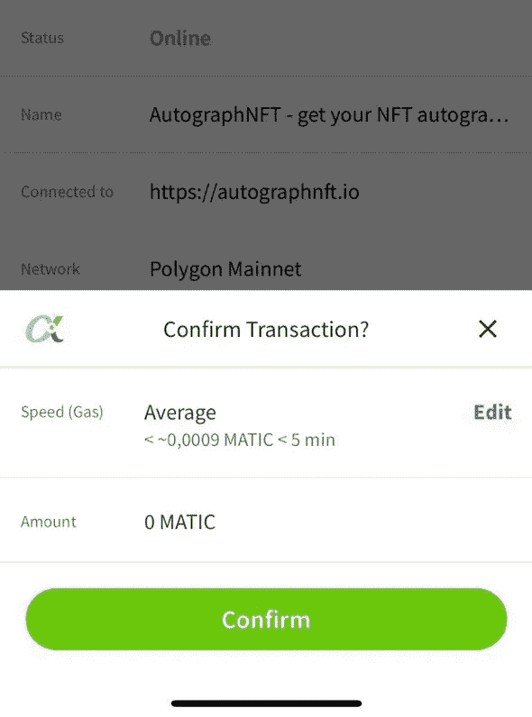
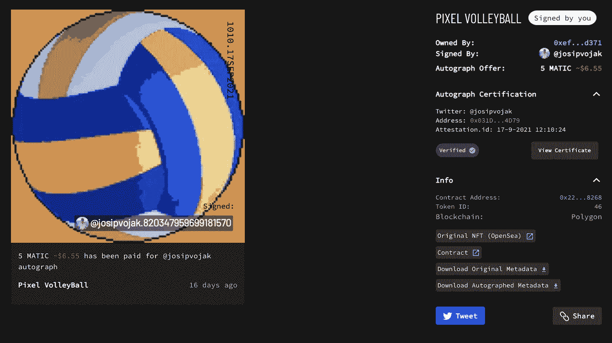

# 我如何签署我的第一个数字 NFT 签名。

> 原文：<https://medium.com/geekculture/how-i-signed-my-first-digital-nft-autograph-f6e8d5c093a6?source=collection_archive---------8----------------------->

我打排球已经有 18 年了。在过去的 5-6 年里，我一直是一名专业人士。从来没有人问我要签名，这是合理的，因为我打排球，这肯定不像足球，篮球，手球，棒球，曲棍球那样受欢迎。

但是，几周前，事情发生了变化。科技让我第一次可以签名。使用 **NFT 技术**(不可替代令牌)。

## 区块链上的数字签名

对于一个体育迷来说，体育界最受欢迎的事情之一就是**拥有一件你最喜欢的球员或俱乐部的球衣或收藏卡**。此外，如果玩家签署了它，它可能会大大增加收藏的价值。

如果你熟悉 NFT 的世界，你会知道最近一切都开始被符号化了——艺术、**、虚拟世界、收藏卡**等等。现在，我们有机会拥有一些对我们来说独特、有价值和特别的东西。

这个故事有了新的含义，因为我们有机会要求某人使用 **web2 标识符(如 Twitter)** 为我们签名。 [**AlchemyNFT**](https://alchemynft.io/) (该项目的主要投资者之一是[**Marc Cuban**](https://en.wikipedia.org/wiki/Mark_Cuban)——美国亿万富翁企业家、电视名人和 NBA 球队达拉斯小牛队的老板)已经通过其项目 **AutographNFT** 通过添加额外的属性从现有的 NFT 创建新的 NFT。

## **故事**

下面我将向你解释如何在你的电子签名上签名。

最近想出这个 AutographNFT 项目一看就没看懂。为什么有人会使用现有的 NFT，在使用旧 NFT 创建时发生了什么，为什么这很重要，在哪里获得或失去了价值，潜在的用例是什么(因为这是作为概念验证项目开始的)。

不久之后，我通过 Twitter 收到了第一个签名请求:

你可以在[https://autographnft.io/](https://autographnft.io/)找到一个页面，在那里你可以创建混合的 NFT，创建签名出价，并进行数字签名。

AutographNFT navigation bar

为了能够与市场和其他用户交互，您需要通过 **web2 标识符(通过 Twitter 登录)**进行连接。这让系统知道你是那个 Twitter 账户的所有者。

为了能够出售或购买一些混合的 NFT，你需要连接到一个钱包，如 **MetaMask** 。另一个选择是使用 **WalletConnect** 协议(通过二维码扫描或深度链接将分散的应用程序连接到移动钱包的开源协议)。

你可以在两个网络之间选择— **以太坊或者多边形**。

## 亲笔签名

我收到的第一个数字签名请求是这样的:

用户用排球的像素化版本**创建了一个 NFT。为了创造一个签名，现有的 NFT 必须包装在一个新的，重新混合(合成)的 NFT，包括数字签名。
为了接受报价，我必须通过 Twitter 进行验证(点击“用 Twitter 验证”)。经过验证后，我可以查看报价并创建签名。**

这个过程由**三个步骤**组成，其中你必须使用亲笔签名 NFT 平台，连同钱包。为了简单起见，我使用了一个 AlchemyNFT 钱包，名为 **AlphaWallet** ，它具有 WalletConnect 选项，这使得整个故事更加简单。

1.  **签署 Twitter**——你必须在线验证你的 Twitter 账号，这是免费的。
2.  **签名**——你同意并签名
3.  接受提议——我收到的提议是在现有的 NFT 上签一个名，价值 5 MATIC

点击步骤 1(登录 Twitter)后，如果您连接了 AlphaWallet(与 WalletConnect 连接)，您将在手机上收到通知:

通过单击确认，您可以确认请求。这将使您能够进入第 2 步——签名。

第二步是签名。您将在 AlphaWallet 中收到一条新消息:

单击“确认”，即表示您同意数字签名。这将启动最后一步——在您的钱包中接收报价。

在 AutographNFT 平台上点击“批准”后，您应该会再次在 AlphaWallet 中收到通知:

通过点击确认，您接受交易。

**祝贺你，你签下了你的第一个 NFT！**

## 事务数据

这里可以看到**NFT**原文：<https://opensea.io/assets/matic/0x000000000437b3CCE2530936156388Bff5578FC3/136>

**多边形网络契约**:
[https://polygonscan . com/address/0x 22222222291749 de 47895 c 0 a 9 b 17 E4 FCA 8268](https://polygonscan.com/address/0x222222222291749DE47895C0c0A9B17e4fcA8268)

**证书**(我亲笔签名的):
[https://autographnft.io/~matic/remix/46/cert/](https://autographnft.io/~matic/remix/46/cert/)

最后，所有的数据都集中在一个地方:

## 为什么这些都很重要？

**AutographNFT 提供了一个基于智能合约的底层架构，允许我们将现有的 NFT 包装成一个具有新功能的全新 NFT。**

它甚至允许我们将多个 NFT 打包成一个新的混音 NFT，或者将一个 NFT 打包成许多不同的混音 NFT。
AutographNFT 的想法是证明将原始 NFT 的元数据与 Twitter 身份的加密证明(称为标识符证明)相结合的概念。

## 公寓列表示例

让我们看看另一个例子——公寓列表。

说**每个 NFT** 代表**一个公寓**。你想在上面列出你的公寓，比如说 **Airbnb** 或者**Booking.com**。你可以将公寓的 NFT 打包成一个混合的 NFT，根据你的'*公寓所有权*'创建一个列表令牌，该令牌将在该时间段后过期。您还可以附加公用设施，如打开迷你酒吧、某些房间、热水...

另一方面，公寓有其所有者，因此我们可以将公寓 NFT 包装成混合 NFT，其中包含关于公寓所有权的元数据(即，谁当前拥有公寓、所有权百分比、房间、楼层等)。).

完成后，你可以打开混音的 NFT，访问锁定的原始 NFT，创建打包的混音的 NFT。在这个过程中，合成 NFT 会被烧掉。

这项技术提供了无数可以实现的新想法。

## 结论

将一个现有的 NFT 重新组合成一个新的合成 NFT 是一个**为一个已经符号化的物品提供额外效用和价值的好方法。摧毁一个合成的 NFT **会烧掉合成的 NFT 并解开原始的 NFT** 。想法是多种多样的，在不久的将来，看看技术将会带来什么，我们日常生活的哪些部分将会被符号化，这真的很棒。**