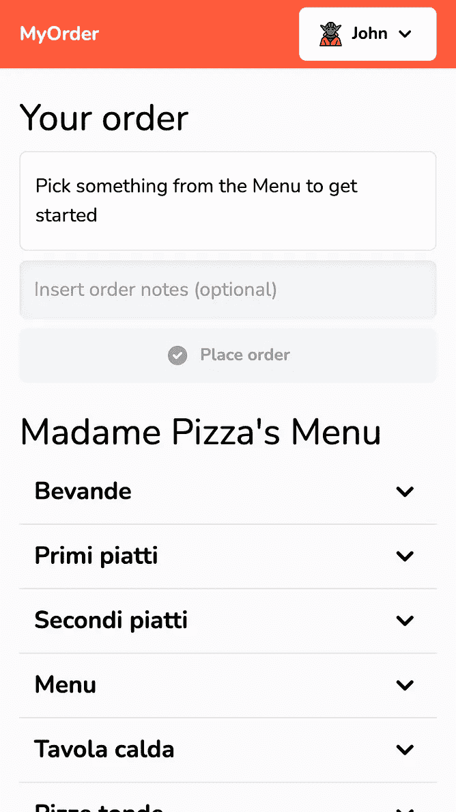
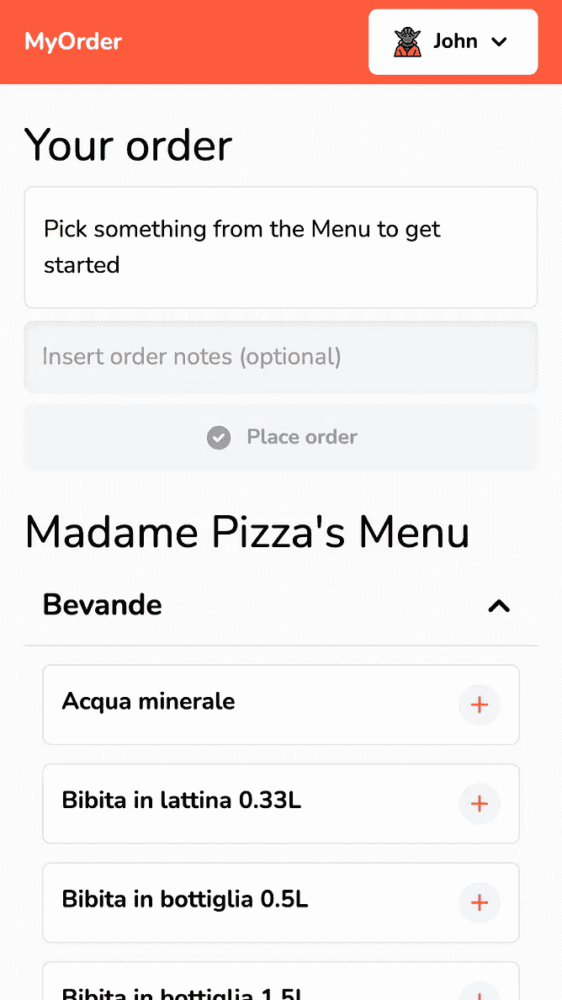
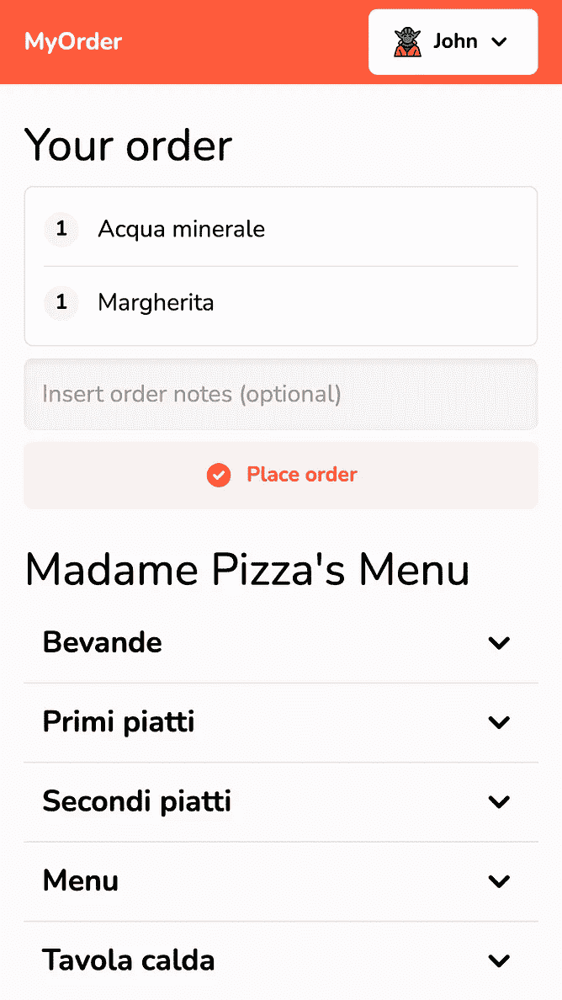
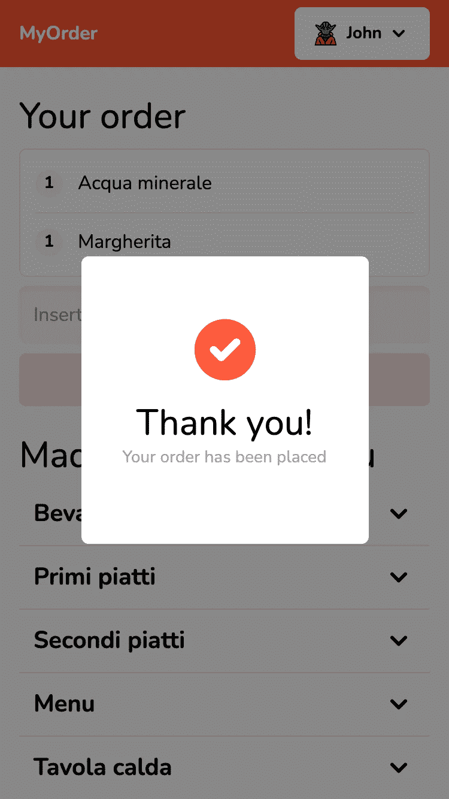
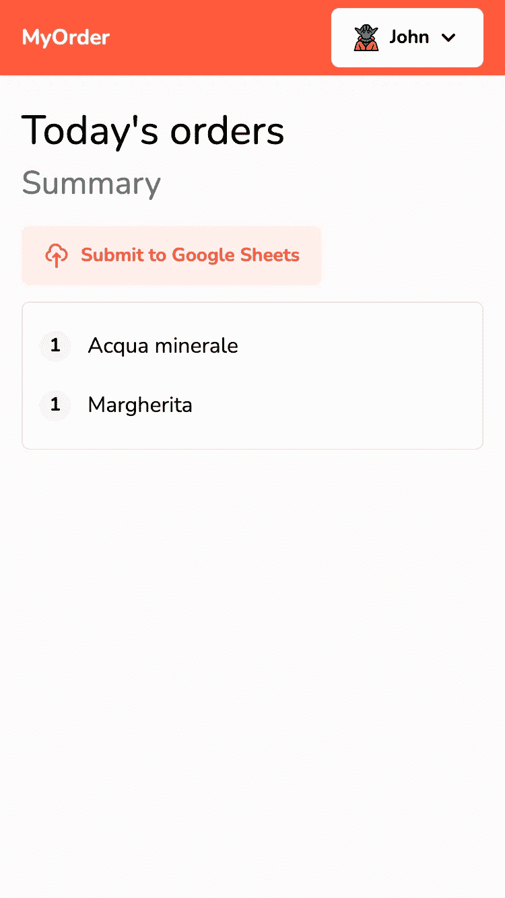
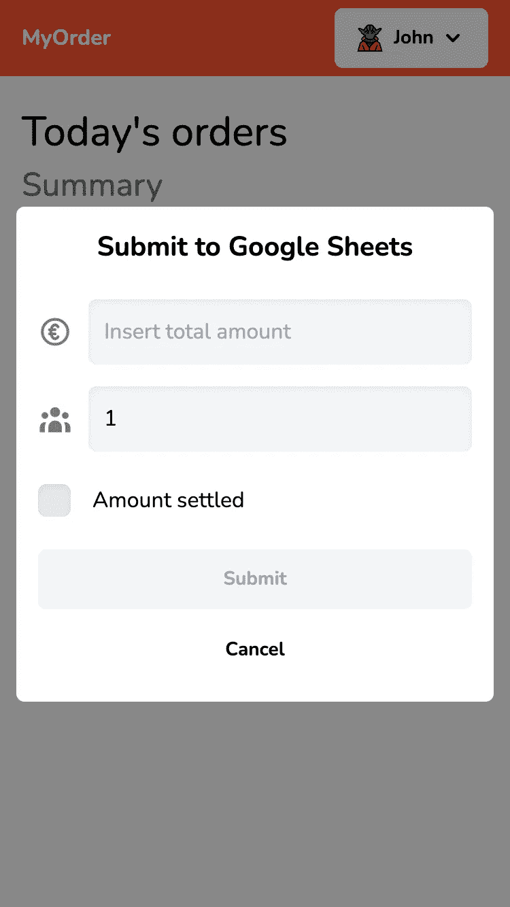
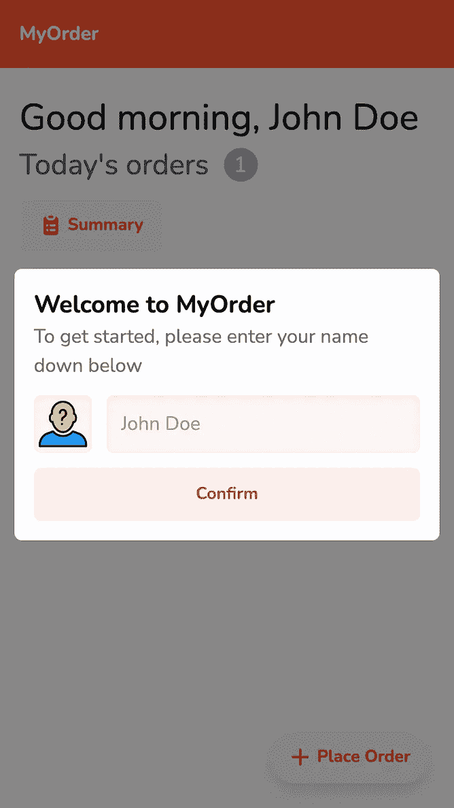
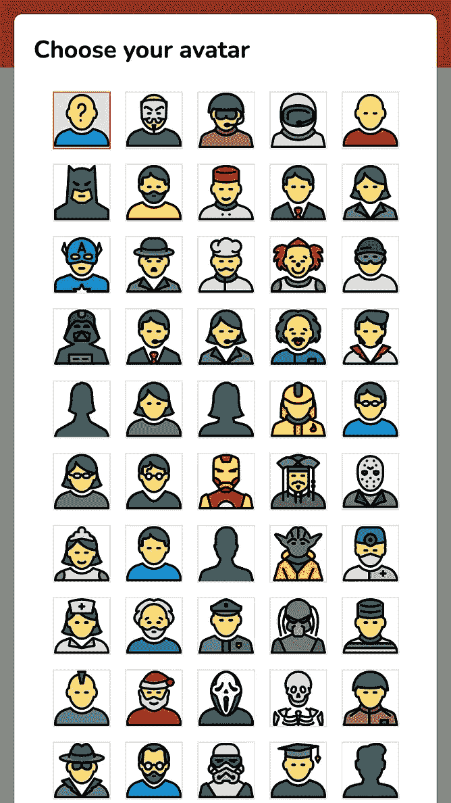
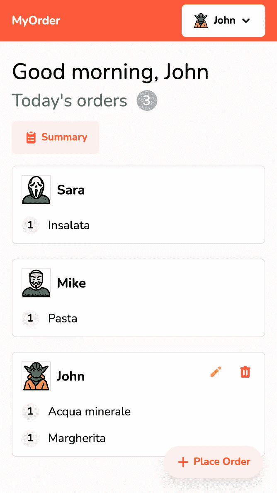

# 我如何为公司的午餐时间开发应用程序，以及我们为什么每天都使用它

> 原文：<https://medium.com/geekculture/how-i-took-control-of-my-companys-lunchtime-with-an-app-f6d70c31cb89?source=collection_archive---------0----------------------->

今天我觉得这是一个值得讲述的故事:我学到了一个新的、有趣的框架；在接下来的几个月里，这让我的生活变得更加轻松；同事们起初很开心，但后来都讨厌这个应用程序和我(稍后会有更多介绍)。但是，嘿，我们至今仍在使用它！

所以这就是我们公司的做法:每天午餐时间，我们起床(我们中的一些人确实在这上面花了些时间)然后去办公室附近的餐馆。老实说，这是我工作中最美好的一部分:你整天坐在那里，大部分时间都面对着你的显示器，同时试图让技术跟随你的愿望，所以难怪我们聚在一起，好好聊天是我期待做的事情。另外，食物相当不错。

那交易是什么？嗯，餐厅不写我们可能点的任何东西，所以这是我们的责任。通常有一个同事负责跟踪每一笔订单，然后在柜台付款。我不知道，我后来会成为那个人。你可以把它写下来，或者把它储存在你的大脑里，这完全取决于你。毫无疑问，对那个特定的人来说，这有点麻烦。但是事情需要这样吗？

## 现在来看应用程序

这就是 MyOrder 的用武之地(尽管它是一个非常简单的应用程序)，它是这样工作的:每一个点餐的人都会自动打开应用程序并将其添加到列表中，列出他们吃了什么。因为它 99.9%的时间都在移动设备上使用，所以它被设计为移动优先。

This is the page to add an order: Cart on the top, and Menu below (it’s in italian I know).

一旦你把所有东西都放进购物车，你只需点击下单按钮。或者，您也可以输入一些注释(例如，当您点了一种不同的食物并且需要指定它时，这就很方便了)。一旦被放置，你将被重定向到当天的订单，在那里你将在你的同事中欣赏刚刚发送的宏伟订单。

(left) A message confirms your order has been sent correctly. (right) The orders of the day.

然后，到了付款的时候，不管是谁负责，都有一份订单清单，按项目分组。另外:看到列表上方的橙色按钮了吗？它使您能够轻松更新我们的谷歌成本表。它只是为那天添加了一行。

(left) the summary view is ideal at the counter as it groups all orders’ items. (right) you are also able to report back the receipt total.

看看它做了什么？这项工作现在已经相当分散，并不都是一个人的事。这也使事情变得更加容易和快捷。当然，每个人都做一点点工作，那又怎样？你真的只做了你的小角色！

MyOrder 还让我们可以轻松应对为被困在办公室的同事带食物的情况。他们所要做的就是输入他们的订单，无论谁负责，都将能够在应用程序中看到它，并将其带给他们。轻松点。

另一方面，可靠地更新我们的成本表使我们能够了解一段时间内每个员工的平均午餐成本。

## 号外:头像！

正如我之前所说，这需要每个人的合作，即使你最多花 2 分钟输入订单。所以我想:如何让它变得更有趣一点？这就是化身进入场景的地方。非常感谢那些美妙图标的设计者，[这里](https://icon54.com/free-avatar-icons/)是你可以得到它们的地方。

You get to choose your own special avatar on login but you can change it any time from the dropdown on the top

## 把它包起来

对于那些对使用的堆栈感兴趣的人，这里是:前端是基于 Gatsby，Redux RTK，Tailwind 和 Typescript 构建的。数据库、主机和 API 由 Firebase 提供。

如果你想试用这款应用，可以看看[的演示](https://myorderdemo-80b12.web.app/)。

如果你也对代码感兴趣，你会在这里找到开源库。

好了，这就是所有的人！