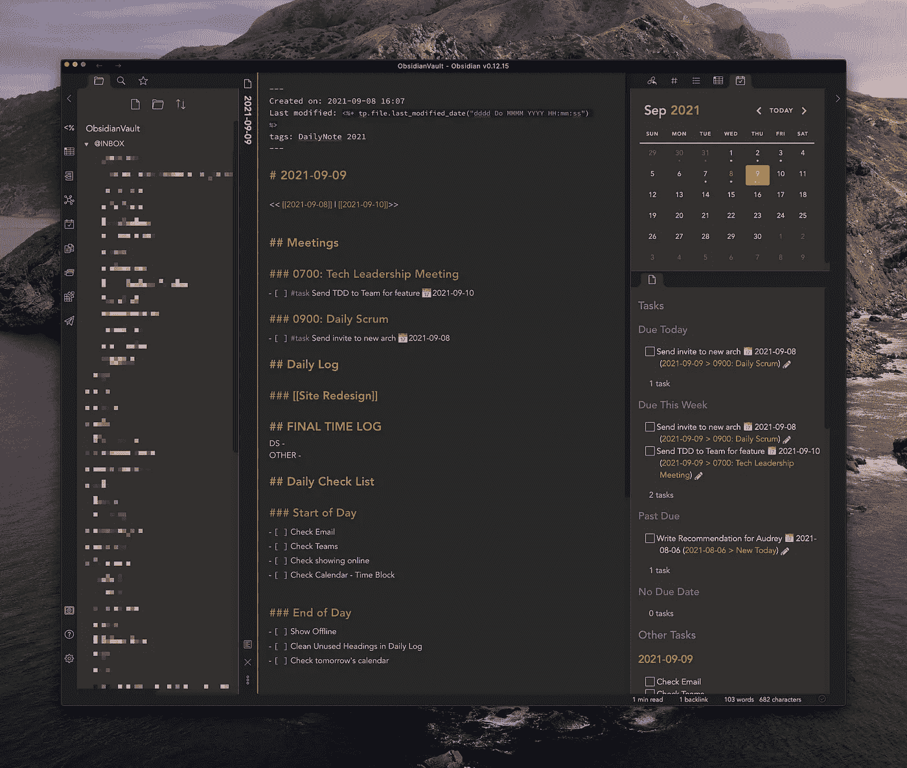

# 我如何在黑曜石中追踪我的任务

> 原文：<https://medium.com/geekculture/how-i-track-my-tasks-in-obsidian-47fd7ad80364?source=collection_archive---------0----------------------->

## 两个扩展，把黑曜石变成一个任务管理发电站

My Obsidian App with the Tasks Dashboard in the lower right

我每天都用黑曜石做各种工作笔记。我已经用了几个月了。在为自己创建一个可靠的系统时，我已经创建了一个处理所有工作任务的优秀流程。

# 一、黑曜石是什么？