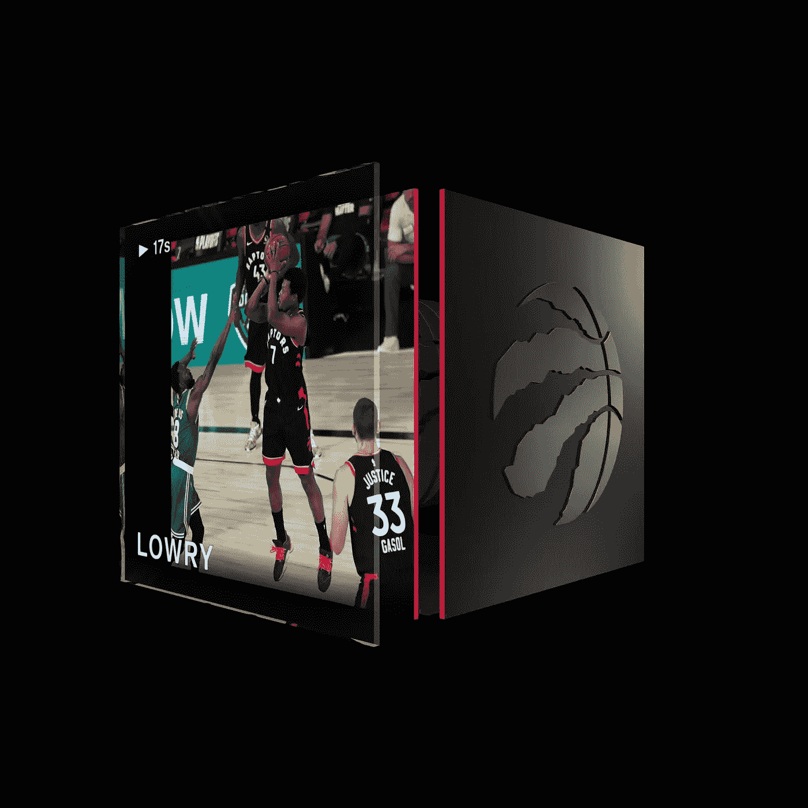
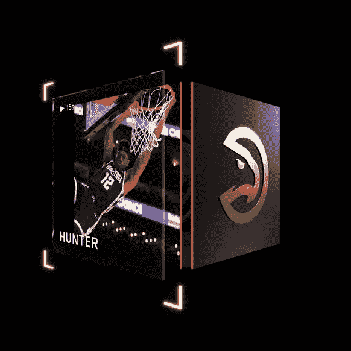
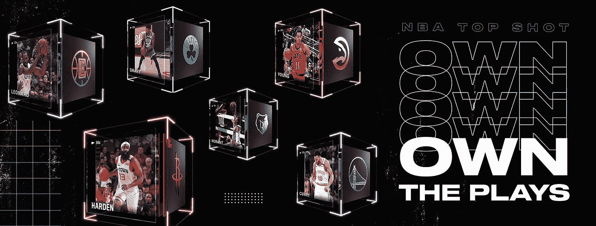

# 我如何在 NBA Top Shot 上通过 gif 交易将 27 美元变成 10，000 美元

> 原文：<https://medium.com/geekculture/how-i-turned-27-to-10-000-trading-gifs-on-nba-top-shot-2875db24312?source=collection_archive---------2----------------------->

## 不，我不是篮球卡片专家。不，我不会卖给你一门课程。

From $1 to $399

大约两个月前，我发现了一篇[的文章](https://www.wealthsimple.com/en-ca/magazine/blockchain-trading-cards)，关于某人如何在市场上以 2200 美元的价格出售一个独一无二的篮球时刻的视频剪辑，本质上是 NBA 的 gif。是什么让视频片段独一无二？它们的数量是有限的，一旦它们不再被“丢弃”在成套包装中，唯一能买到它们的地方就是二手市场。作为一个 NBA 和猛龙队的铁杆球迷，我去了 [NBA 顶级投篮](https://www.nbatopshot.com/)看看所有的炒作是怎么回事。在 2019-2020 东部决赛的第三场比赛中，我在肯巴·沃克身上抢到了一个凯尔·洛瑞后仰球，在勒布朗詹姆斯身上抢到了一个西亚卡姆盖帽，每个一美元。哦，我花了 25 美元买了一包保证包含一个“罕见”时刻的香烟。我打开它，发现 4 个常见的时刻一个罕见的德安德烈亨特扣篮。这是他去年新秀赛季的一个时刻，但看到它在市场上只卖 20 美元，没什么好兴奋的。我把那个时刻列为 400 美元的笑话，然后一个月都忘了。

Nothing to get too excited about

1 个月后，我收到一个通知，说我的时刻在市场上卖了 400 美元。我的嘴垂到了地板上。我迅速将这 400 美元投入市场，对市场的走向感到兴奋。又过了一个月，一些知名篮球运动员发了几十条推文，我的时刻总共不值 9767 美元。我花 1 美元买的那个劳里时刻？现在是 399 美元。锡卡姆街区怎么样了？$479.哦，还有那个让我不太兴奋的德·安德烈·亨特灌篮？$3,100.

# 总之:什么是 NBA 最佳投篮？

NBA Top Shot 是一个让球迷在区块链购买和交易官方许可的视频集锦的平台。你可以把它想象成加密货币遇上运动卡遇上 Ebay。这些所谓的“最佳投篮”是基于真实的 NBA 比赛动作(如扣篮、助攻和盖帽)的数字收藏品。但相似之处仅限于此:它们不仅仅是你需要在电脑上打开的数字文件。每张热门照片都有自己独特的序列号和独特的数字指纹——互联网上每笔交易的独特数据。这个指纹基本上就像一个高度复杂的条形码，用于每个顶部拍摄；这是加密的，所以你不能伪造。像加密货币一样，这些新的收藏品是一个更大的关于在互联网上轻松交易的文化运动的一部分。

这是类固醇运动卡交易的世界。除了在这种情况下，它们的有趣之处——以及它们的盈利之处——在于你可以在一个高度波动、投机性极强的区块链市场上，以比你支付的价格高出数千美元的价格买卖它们。由于这个市场依托于区块链，它允许通过一个分散的、不可信的网络进行即时和安全的交易，因此用户可以与他们的朋友或互联网上的任何人购买、出售和交易他们最喜欢的游戏集锦。这就免除了买卖交易卡的传统痛苦，例如必须处理运费、估价、高额费用和欺诈。

# 但那只是小画面。

NBA Top Shot 旨在为球迷带来一种全新的互动方式，与他们喜欢的球员和他们喜欢的球队互动。通过允许这些收藏品在世界上最安全和最值得信赖的点对点市场之一——区块链科技——上买卖和交易，NBA Top Shot 将体育卡交易带入了现代时代。区块链的意思是:

每笔交易都是透明的，全世界的任何人都可以看到。如果有人选择这样做，他们可以很容易地跟踪随着时间的推移，任何顶尖人物是如何转手的。

[@ILOVEMATTYICE](http://twitter.com/ILOVEMATTYICE) 最能说明问题:

> 想象一下，带着一顶帽子走来走去，告诉所有人这是布朗送给你的。有人会相信你吗？
> 
> 现在想象一下，拥有一辆布朗送给你的
> [@nba_topshot](http://twitter.com/nba_topshot)
> 。有人不相信你？请参考
> [@ flow _ 区块链](http://twitter.com/flow_blockchain)
> 交易。更好的是——给它一个徽章。

Still don’t get it? Let Terrence Ross break it down for you.

# 如何购买 Top Shots？

NBA 顶级投篮时刻下降包像运动鞋下降。包含普通时刻的套餐从 9 美元到 14 美元不等。像球鞋空投一样，在特定时间限量投放。也像运动鞋下降，它的超级困难得到你的手在一包给压倒性的需求。此外，一个购买和交易市场已经建立，以显示 NBA 球迷目前出售的所有热门镜头，通过点击“购买”，您可以购买该剪辑，并将其添加到您的数字视频剪辑库存中。每个 NBA 数字剪辑的价值完全由市场决定，每次购买都会从你的区块链钱包里拿出一张发票，显示你拥有所购买的特定剪辑。

# 我知道你在想什么。

这种 NBA 顶级投篮仅仅是一种时尚吗？价格会在不久的将来暴跌吗？

事实是——我不知道。我认为，随着时间的推移，系列 2 共同时刻的价值可能会逐渐下降，特别是随着新时刻的不断出现。我也怀疑以如此高的价格交易这些时刻的未来可行性。随着交易卡的二级市场如此之新，我想知道是否存在一个“临界点”，卖家会意识到他们的卡只值他们认为的一小部分。供求在这里很重要，但我认为更基本的东西在起作用。我们正在见证一个全新市场领域的诞生，在我看来，它将如何发展将非常有趣。