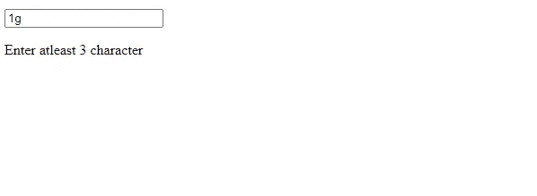
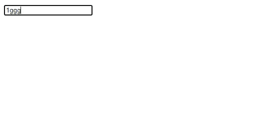
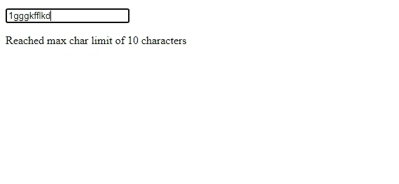

# Angular:我如何理解指令中的@HostBinding

> 原文：<https://medium.com/geekculture/how-i-understood-hostbinding-in-directives-34f4d64b6ec1?source=collection_archive---------3----------------------->

我一直认为@HostBinding 和 Renderer2 是在 Angular 中操纵 DOM 而不直接访问它的两种好方法。但是@HostBinding 在某些情况下做得更好，因为它保持了代码的整洁，可读性更好。

@HostBinding 可以操作 DOM 元素的属性、特性和类。

我想分享 3 个简单的例子，帮助我理解@HostBinding 是多么有用。

**一、切换课程**

您可能遇到过这样的场景，当事件 A 发生时，需要将类 C 添加到元素中，而当事件 B 发生时，需要删除相同的类 C。

```
<p **appTest**>Hello World</p>
```

上面只是一个带有一些文本的段落标签。我们已经对这个标签应用了一个**测试指令**。

下面是我们希望切换的类。这个类将在

标签周围添加一个红色的实心边框。

```
.box1 {
width: auto;
height: auto;
border: 1px solid red;
}
```

这就是我们想要实现的目标:

1.  最初 **box1** 类不应该应用于< p >标签。
2.  当鼠标悬停在

    标签上时，必须应用 **box1** 类。

3.  当鼠标离开

    标签时，必须移除 **box1** 类。

```
export class **TestDirective** {**@HostBinding('class.box1') toggle: boolean = false;**constructor() {}
**@HostListener(‘mouseleave’)
@HostListener(‘mouseover’)**onMouseOver() {
**this.toggle = !this.toggle;**
}
}
```

正如你在下面看到的，我们正在访问< p >标签上的 **box1** 类作为**‘class . box 1’。**

```
**@HostBinding('class.box1') toggle: boolean = false;**
```

**变量 toggle** 的值决定 **box1** 类是否将应用于< p >标签。因为它的初始值是假的，所以 **box1** 类不会应用于< p >标签。

这就完成了步骤 1。

当鼠标悬停在文本上时，必须添加类别，即**切换必须为真**，当鼠标离开文本时，必须移除类别，即**切换必须为假。**

因此，toggle 的值需要在真和假之间不断切换。下面这段代码实现了这一点。我们已经使用了 **@HostListener** 来监听 DOM 事件。每当有 **mouseover 或鼠标离开事件**时，就会调用 **onMouseOver()** 。在这个方法中，我们不断地在 true 和 false 之间切换 toggle 的值，以分别添加和删除类。

这就完成了步骤 2 和步骤 3。

```
**@HostListener(‘mouseleave’)
@HostListener(‘mouseover’)**onMouseOver() {
**this.toggle = !this.toggle;**
}
```

**二。在两个类之间切换并设置元素的样式**

在这个例子中，我们将尝试在两个类之间切换，并尝试设置元素的背景颜色。

```
<p **appTest2**>Good Morning</p>
```

这又是一个包含一些文本的段落标记。我们已经将 **Test2 指令**应用于这个< p >标签。

下面是我们想要切换的两个职业。 **span1** 类将把< p >标签的文本颜色改为红色，而 **span2** 类将把文本颜色改为黄色

```
.span1 {color: red;}.span2 {color: yellow;}
```

这就是我们想要实现的目标:

1.  标签最初会添加 **span1** 类，即文本颜色为红色。最初它的背景颜色必须是黄色。

2.  点击

    标签文本，必须删除 **span1** 类，并添加 **span2** 类。即文本的颜色必须是黄色。在随后的单击中，span1 和 span2 类必须保持切换。

3.  当鼠标悬停在

    标签上时，标签的背景颜色必须从最初的黄色变为绿色。

4.  当鼠标离开

    标签时，标签的背景颜色必须从绿色变为棕色。

```
export class **Test2Directive** {**@HostBinding(‘class.span1’) span1: boolean = true;
@HostBinding(‘class.span2’) span2: boolean = false;
@HostBinding(‘style.backgroundColor’) bgColor: string = ‘yellow’;**constructor() {}**@HostListener(‘click’)**
onClick() {
this.span1 = !this.span1;
this.span2 = !this.span2;
}**@HostListener(‘mouseover’)**
onMouseAction() {
this.bgColor = ‘green’;
}**@HostListener(‘mouseleave’)**
onMouseLeave() {
this.bgColor = ‘brown’;
}
}
```

这就是我们如何使用@HostBinding 访问两个类 span1、span2 和 style 属性的 backgroundColor 属性。

```
**@HostBinding(‘class.span1’) span1: boolean = true;
@HostBinding(‘class.span2’) span2: boolean = false;
@HostBinding(‘style.backgroundColor’) bgColor: string = ‘yellow’;**
```

由于**变量 span1 被设置为 true** ，这意味着 **span1** 类最初将被应用于< p >标签。

由于**变量 span2 被设置为 false** ，这意味着 **span2** 类不会应用于< p >标签。

**bgColor** 变量控制应用于< p >标签的背景颜色。它最初是黄色的。

这就完成了步骤 1。

```
**@HostListener(‘click’)**
onClick() {
this.span1 = !this.span1;
this.span2 = !this.span2;
}
```

点击

标签，我们要删除 span1 类**，即 span1 必须设置为假**，并添加 span2 类**，即 span2 必须设置为真**。在随后的再次点击中，这些类必须切换。正如你在上面看到的, **onClick()** 实现了这个目的。

这就完成了步骤 2。

```
**@HostListener(‘mouseover’)**
onMouseAction() {
this.bgColor = ‘green’;
}**@HostListener(‘mouseleave’)**
onMouseLeave() {
this.bgColor = ‘brown’;
}
```

在鼠标悬停和鼠标离开时，我们希望背景颜色切换。因为 **bgColor** 变量控制< p >标签的背景颜色。我们需要做的就是在事件发生时将这个变量设置为所需的颜色。

上面的方法 **onMouseAction()和 onMouseLeave()** 实现了这一点。

这就完成了步骤 3 和步骤 4。

**III。访问和更改 DOM 元素的属性。**

在这个例子中，我使用了一个标签，并通过@HostBinding 设置了它的 **maxlength** 和 **minlength** 属性。当<输入>标签值的长度小于设置的 minlength 或等于设置的 maxlength 时，我们将显示一条消息。

```
<input **appProp (action)=”handleAction($event)”** type=”text”
**[(ngModel)]=”boxData”**/><p>**{{ message }}**</p>
```

我们已经将 **PropDirective** 应用于<输入>标签。

**组件类:**

这个类非常简单明了。

```
public **boxData**: any = ‘’;
public **message**: string;**handleAction(evt) {**
this.message = evt;
}
```

现在让我们来看看指令。

```
export class **PropDirective** {**@Output(‘action’) action = new EventEmitter<any>();
@HostBinding(‘attr.maxlength’) max: number = 10;
@HostBinding(‘attr.minlength’) min: number = 3;**constructor() {}**@HostListener(‘keyup’, [‘$event.target.value’])**
onTyping(data: any) {if (data.length < this.min) {
**this.action.emit(`Enter atleast ${this.min} character`);**
} else if (data.length >= this.min && data.length < this.max) {
**this.action.emit(‘’);**
} else {
**this.action.emit(`Reached max char limit of ${this.max} characters`);**
}
}
}
```

这就是我们如何访问标签的 maxlength 和 minlength 属性。我们将它们分别设置为 10 和 3。

```
**@HostBinding(‘attr.maxlength’) max: number = 10;
@HostBinding(‘attr.minlength’) min: number = 3;**
```

**变量 max** 控制 maxlength 属性，**变量 min** 控制 minlength 属性。

当用户开始输入时， **keyup** 事件被触发，并且 **onTyping()** 被执行。

```
**@HostListener(‘keyup’, [‘$event.target.value’])**
onTyping(data: any) {if (data.length < this.min) {
**this.action.emit(`Enter atleast ${this.min} character`);**
} else if (data.length >= this.min && data.length < this.max) {
**this.action.emit(‘’);**
} else {
**this.action.emit(`Reached max char limit of ${this.max} characters`);**
}
}
```

这里我们首先检查标签值的长度是否小于**最小值，即 3。**如果是，我们向组件发出一个@Output 类型的事件，包含以下消息:

```
**this.action.emit(`Enter atleast ${this.min} character`);**
```



Data length less than 3 (min)

如果标签值的长度大于或等于**最小值即 3** 但小于**最大值即 10** ，我们向组件发回一个空字符串:

```
**this.action.emit(‘’);**
```



Data length is atleast 3(min) but less than 10(max). No message displayed

如果以上都不满足，则意味着标签值的长度已经达到了**的最大值，即 10。**在这种情况下，以下消息被发送回组件。

```
**this.action.emit(`Reached max char limit of ${this.max} characters`);**
```



Data length equals 10(max)

您可以在下面的链接中查看所有 3 个示例:

[](https://stackblitz.com/edit/angular-5qedwy?file=src/app/app.component.html) [## 角形(叉形)堆叠

### 编辑描述

stackblitz.com](https://stackblitz.com/edit/angular-5qedwy?file=src/app/app.component.html)