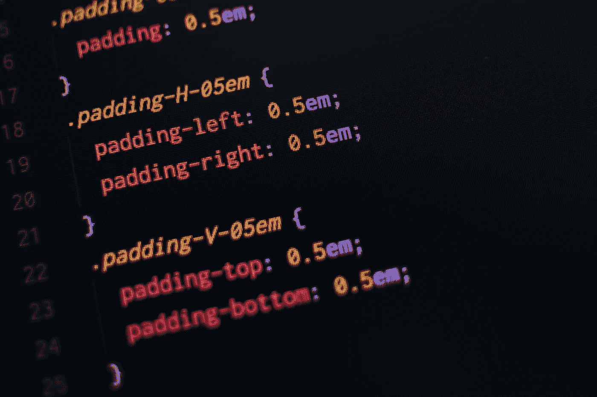

# 我如何在 Sass 中使用 Mixins

> 原文：<https://medium.com/geekculture/how-i-use-mixins-in-sass-cc490bdce662?source=collection_archive---------28----------------------->

## Sass 帮助我在 CSS 代码中添加了更多的功能。

Photo by [Pankaj Patel](https://unsplash.com/@pankajpatel?utm_source=unsplash&utm_medium=referral&utm_content=creditCopyText) on [Unsplash](https://unsplash.com/s/photos/css-processor?utm_source=unsplash&utm_medium=referral&utm_content=creditCopyText)

当我决定在我的[网站](https://www.sanjar.ca/)中引入黑暗模式时，我意识到在我的代码中，在很多情况下，我必须为同一个组件提供光明模式和黑暗模式。

我没有为浅色和深色模式样式复制相同的 CSS，而是利用 Sass mixins 来定义可以在整个样式表中重用的样式。

## 萨斯的混血儿

我在 mixin 中添加了一个参数来指定主题(暗模式或亮模式)，并在此基础上应用了相应的背景和字体颜色。

mixin 是用暗模式和亮模式主题的一般属性以及特定的主题属性定义的。然后每个主题风格都将 mixin 作为 CSS 主体的一部分。

light mode `blog-content`样式没有向 mixin 传递任何参数，因为默认情况下 mixin 采用了 light 模式。对于`blog-content-dark`,传入 mixin 的参数必须设置为`dark=true`,之后满足 mixin 中 if 语句的条件。

因此，通过选择 Sass 而不是常规 CSS，我的样式表可以引入更多的灵活性和功能。

## 在 React 中添加样式

为了使用上面的两种样式，我必须从 Sass 模块文件中导入它们，并将它们添加到 react 组件的`className`属性中，如下所示:

基于 React 应用程序中定义的任意主题状态，适当的主题被应用于博客内容。如果主题设置为 true，则应用类`blogContentDark`，反之亦然。CSS 类是从 scss 模块文件导入的。

这是我在应用程序中使用 mixins 的方式，到目前为止，我对 Sass 能做的惊人的事情了解得更多。请告诉我，对于我上面的用例，是否有更好的方法来使用 mixins 或 Sass。