# 我如何使用云开发工具包部署 AWS 云基础设施(初级)

> 原文：<https://medium.com/geekculture/how-i-used-cloud-development-kit-to-deploy-my-first-aws-infrastructure-beginner-level-9f00a527cc9a?source=collection_archive---------8----------------------->

image source ([https://aws.amazon.com/blogs/devops/developing-application-patterns-cdk/](https://aws.amazon.com/blogs/devops/developing-application-patterns-cdk/))

AWS 云开发工具包作为构建和管理 AWS 云资源的编程工具越来越受欢迎。

我开始学习并把 CDK 作为我工作的一部分。我学得越多，就越发现它非常有用，而且很容易使用。我们可以用我们首选的 IDE 中支持的流行编程语言之一(JavaScript、TypeScript、Python、Java、C#和 Go)编写 CDK 代码。因此，我们可以将 CDK 设计和组件共享给组织中的多个团队。此外，我发现识别项目中创建的所有 AWS 资源非常有用，因为它们可以被视为我们设计的 CDK 代码包中的组件。

下面是我如何使用 CDK 创建和管理 AWS 云基础设施的一步一步的过程。

**1。安装节点 j**

首先我安装了 [NodeJS](https://nodejs.org/en/) 。理想情况下，我们希望任何版本是 14 或更高。要在下载后检查节点版本，我们可以在您的终端中运行以下命令

> `**node --version**`

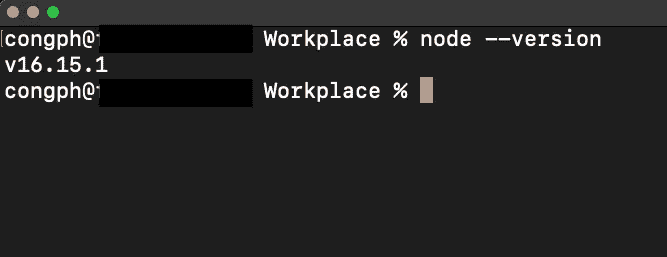

**2。创建项目目录**

在我的 Workplace 目录中，我创建了一个名为`hello-cdk`的新项目，并使用以下命令跳转到该项目中

> `***mkdir hello-cdk***`
> 
> `***cd hello-cdk***`

**3。安装 AWS CDK 工具包(AWS CDK CLI)**

[AWS CDK 工具包](https://www.npmjs.com/package/aws-cdk?activeTab=readme)是命令行界面(CLI ),用于处理应用程序，如列表、引导或部署云基础架构。在终端中运行以下命令进行下载

> `***npm install -g aws-cdk***`

**4。安装 AWS CLI 并设置您的 AWS 帐户**

AWS CLI 是访问 AWS 服务并创建从我们的笔记本电脑到我们的 AWS 帐户的接入点的工具；因此，当我们使用 AWS CDK CLI 部署云基础架构时，系统知道要部署到哪个帐户。

我使用 AWS 提供的以下链接安装了 AWS CLI

[https://docs . AWS . Amazon . com/CLI/latest/user guide/getting-started-install . html](https://docs.aws.amazon.com/cli/latest/userguide/getting-started-install.html)

安装完成后，我们需要使用 AWS 帐户中的访问密钥 Id 和秘密访问密钥在笔记本电脑中指定接入点。

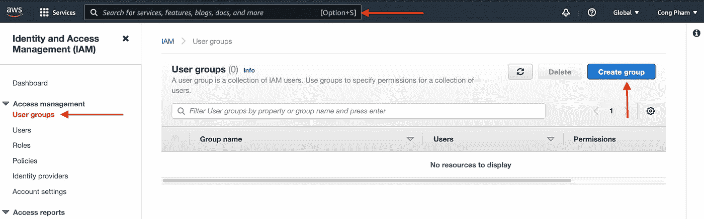

从我们的网络浏览器进入 AWS 控制台，搜索 IAM 控制台。然后选择`User Groups`并点击`Create group`按钮创建一个权限组。给我们的权限组一个名为`CloudAdmin`的，并将`AdministratorAccess`策略附加到该组。

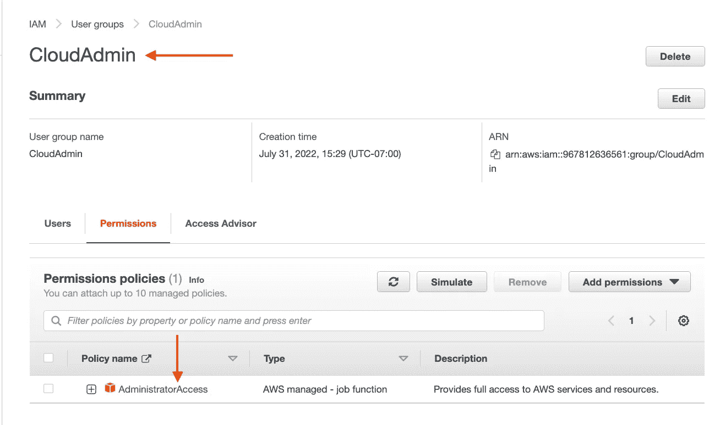

点击`User groups`正下方的`Users`选项卡，然后点击`Add users`按钮。我们可以给这个用户取任何名字，并选择`Access key — Programmatic access`选项。

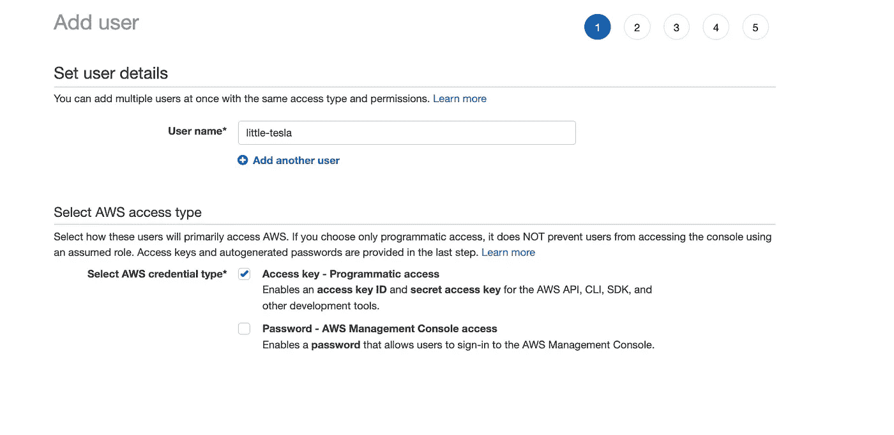

第 2 步是添加权限组，我们选择之前创建的`CloudAdmin`权限组。

我们可以跳过步骤 3，然后在步骤 4 中创建用户。完成后，`Access Key ID`和`Secret Access Key`在步骤 5 中可用，我们可以将其复制到`note`或`csv`中。

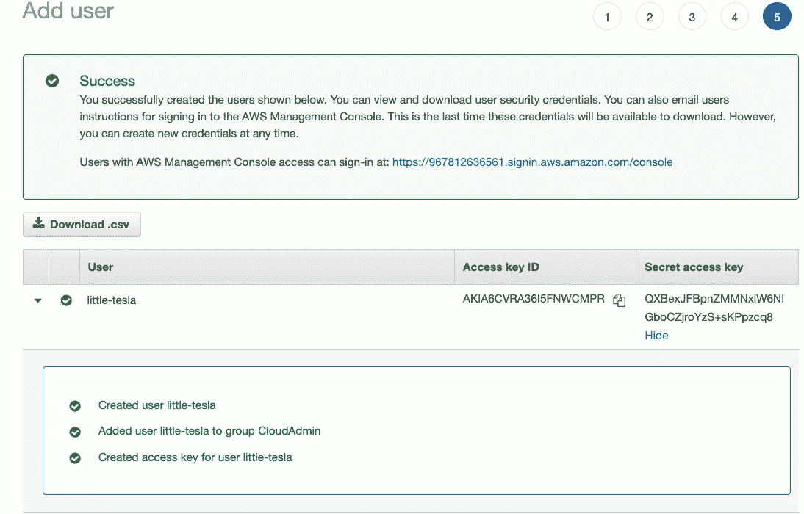

回到我们笔记本电脑中的终端，运行以下命令将我们的笔记本电脑连接到 AWS 帐户。

> `**aws configure**`

出现提示时，复制并粘贴`AWS Access Key Id`和`AWS Secret Access Key`。对于该区域，理想情况下，我们希望选择之前没有部署项目的区域。就我而言，我选择`us-west-1`。对于`Default output format`，我们可以把它留为`text`。

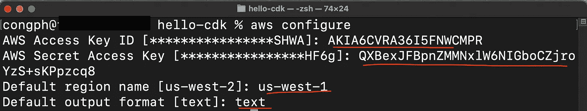

**5。用 Typescript** 初始化 CDK 应用程序

在终端的`hello-cdk`目录中，运行以下命令，用 Typescript 初始化 CDK 应用程序。

> `**cdk init app --language typescript**`

该命令创建一个 CDK 模板代码，其中包含项目运行和部署云基础设施所需的所有依赖项。

在首选 IDE 中打开项目文件夹时，项目结构应该如下所示。

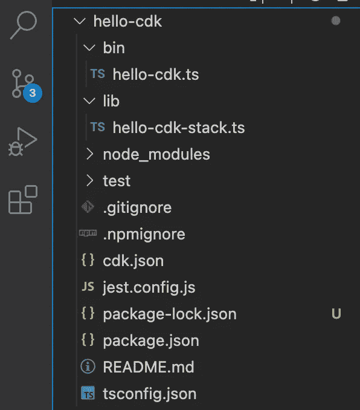

两个最重要的文件是`bin`和`lib`目录下的`hello-cdk.ts`和`hello-cdk-stack.ts`。

`hello-cdk.ts`初始化云应用程序，然后构建在`hello-cdk-stack.ts`中定义的云基础设施资源。因此，你可以定义尽可能多的`stack`类文件，每个`stack`拥有尽可能多的资源(比如亚马逊 S3、Lambda、迪纳摩、SQS 等等)。).

为了简单起见，我们保留了一个自动生成的栈`hello-cdk-stack.ts`，并将亚马逊 S3 资源添加到我们的栈中。

**6。将亚马逊 S3 资源添加到堆栈中**

在`hello-cdk-stack.ts`中，我们可以指定希望 CDK 提供的任何资源。我选择亚马逊 S3 水桶作为例子。首先，我们需要通过在文件顶部添加这一行来导入`Bucket`类和`Bucket’s`相关类。更多亚马逊 S3 桶类属性，可以访问其[网站](https://docs.aws.amazon.com/cdk/api/v1/docs/@aws-cdk_aws-s3.Bucket.html)。

> `**import { Bucket, BlockPublicAccess, BucketEncryption } from ‘aws-cdk-lib/aws-s3’;**`

然后，您可以在栈的`constructor`中创建 bucket 类，包含 bucket id、Bucket 名称及其所有属性。像我们的用户名一样，桶名和桶 id 必须是世界上唯一的。

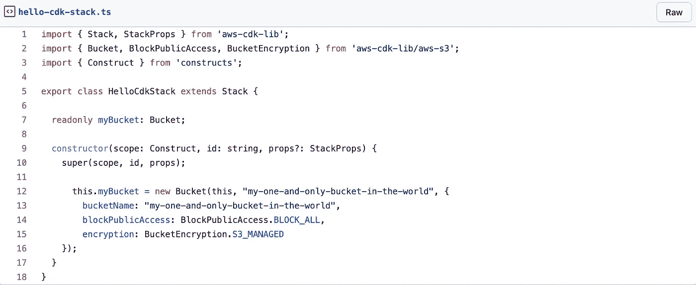

7。构建项目

要构建项目，只需在终端中运行`tsc`。

> `**tsc**`

一旦构建完成，在`bin`和`lib`目录中，我们可以看到我们的 typescript 文件已经被翻译成了 javascript 文件。

8。自举

将堆栈部署到我们的 AWS 帐户时，亚马逊 S3 桶(不是我们正在部署的桶)和其他容器必须可用。要了解更多关于引导的信息，你可以点击 AWS 的[链接。](https://docs.aws.amazon.com/cdk/v2/guide/bootstrapping.html)

要引导，请在您的终端中运行以下命令

> `**cdk bootstrap**`

你会看到在码头有一个装货区。

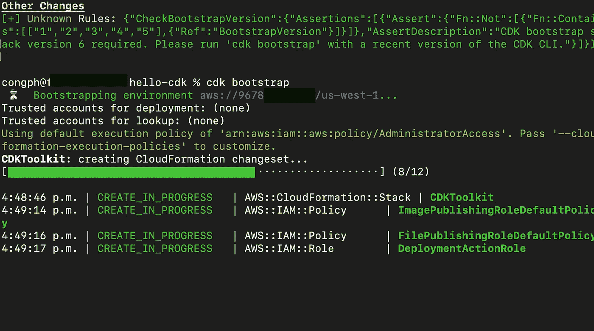

9。使用 CDK 部署您的首个 AWS 云基础设施

自举过程完成后，为了将堆栈部署到 AWS 帐户，我们在终端中运行以下命令

> `**cdk deploy**`

我们将看到进度条弹出，显示我们的应用程序正在部署过程中。

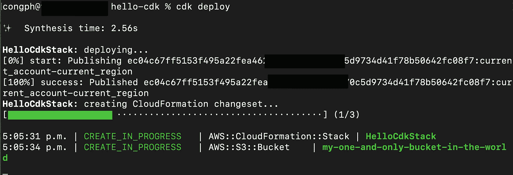

**10。验证 AWS 帐户中的部署堆栈。**

完成后，我们可以转到 AWS 控制台，访问`us-east-1`区域(`N.California`)中的 CloudFormation 模板，查看我们的堆栈是否成功创建。

`CDKToolKit`是在引导过程中创建的堆栈。

`HelloCdkStack`是定义了亚马逊 S3 资源的堆栈。

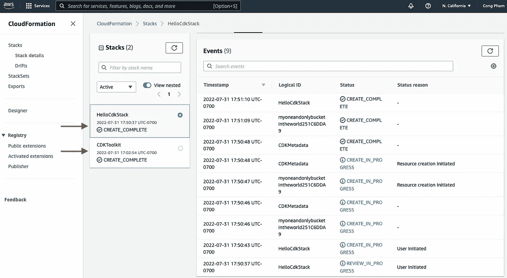

然后，我们可以前往亚马逊 S3，看到我们的桶已经创建。

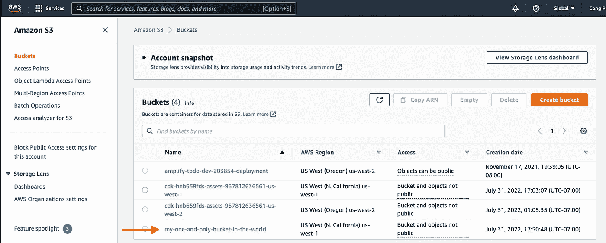

瞧啊。我们正式成为云工程师了！