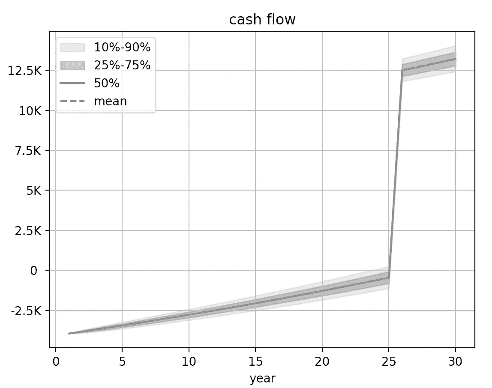
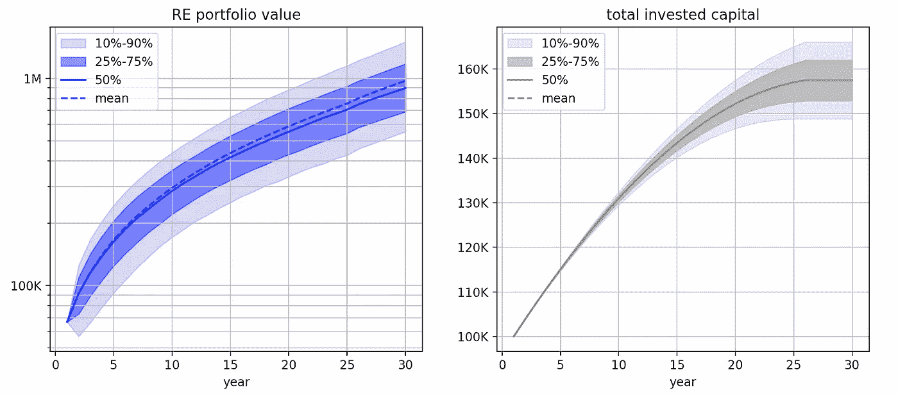
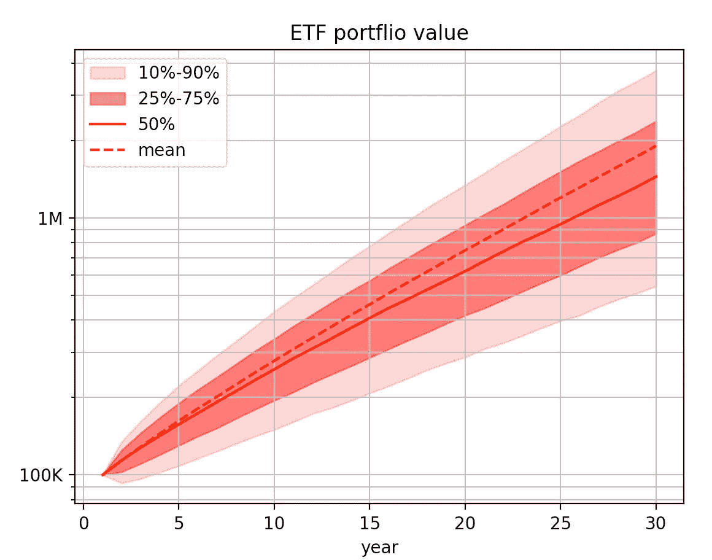
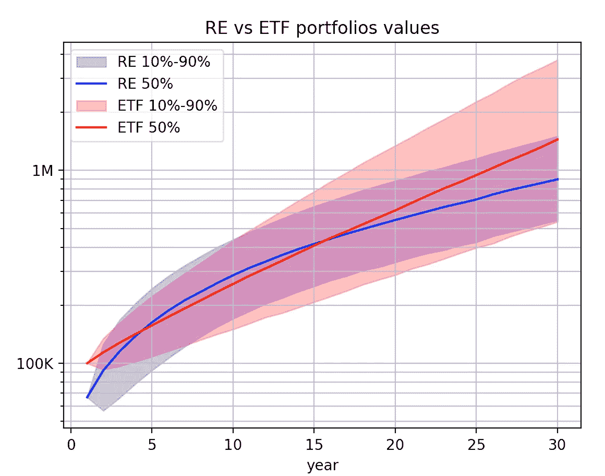
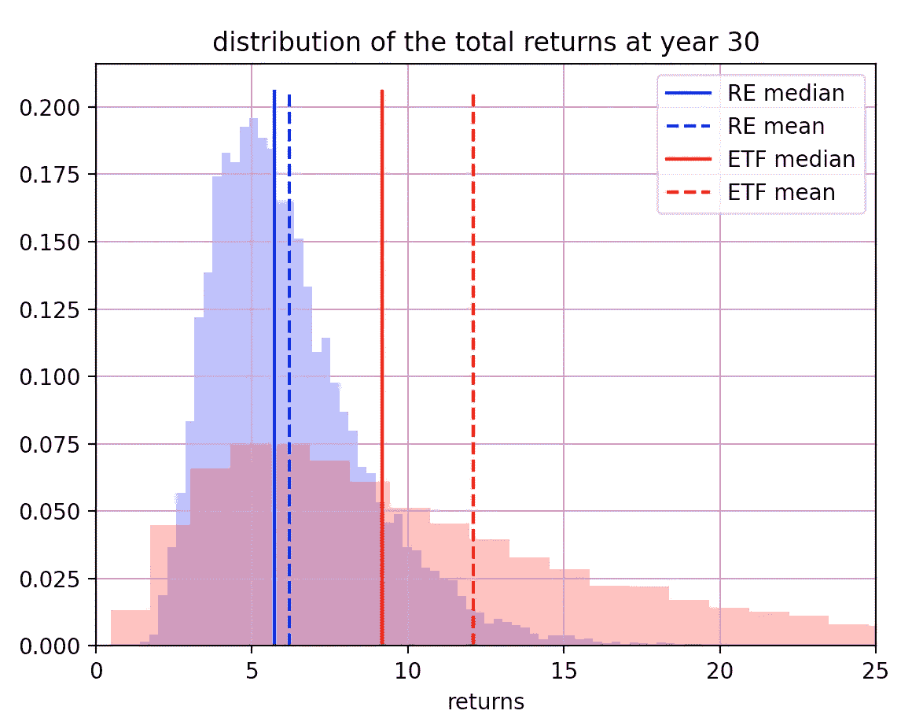
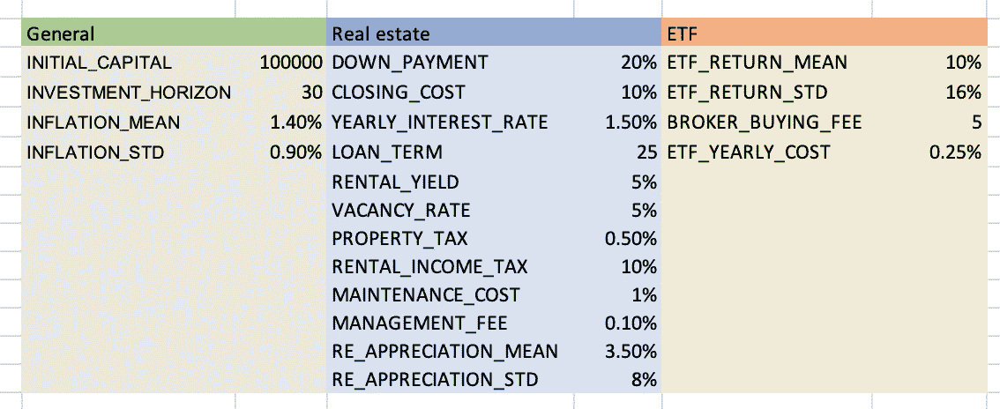

# 我如何利用数据科学来决定如何使用我的储蓄

> 原文：<https://medium.com/geekculture/how-i-used-data-science-to-decide-what-to-do-with-my-savings-9a7900b0f987?source=collection_archive---------9----------------------->

## 使用蒙特卡罗模拟比较房地产和交易所交易基金


Photo by [Julian Hochgesang](https://unsplash.com/@julianhochgesang?utm_source=medium&utm_medium=referral) on [Unsplash](https://unsplash.com?utm_source=medium&utm_medium=referral)

作为一个数据人，我觉得自己很幸运。数据科学家、ML 工程师或数据工程师薪酬通常处于高端。除了满足我们的基本需求之外，我们经常能够在月底存一点钱。因此问题来了，我们该如何处理这笔钱？

随着利率在过去几年处于历史低位，把你的钱存在储蓄账户上可能不是最好的主意。因此，许多人开始寻找回报更高的投资。交易所交易基金(或 ETF，把它想象成许多股票的组合)和房地产是两种受欢迎的资产类别。

然而，这两种资产具有非常不同的性质。****虽然房地产投资通常伴随着通过抵押贷款获得的巨大杠杆效应，但 ETF 的平均年回报率更高。****

**那么从财务角度来看，哪种投资最好呢？这不是一个无关紧要的问题。但是，嘿，我们毕竟是数据人，所以让我们使用数据和一点统计来解决这个问题。**

**在这篇文章中，我将使用蒙特卡罗模拟来比较再投资(比如购买一处房产出租)和 ETF 的长期回报。使用西欧的标准条件，蒙特卡洛模拟显示，ETF 在大约 72%的时间里击败了 3.3 倍杠杆再投资。**

**为了简单起见，我将在下面的讨论中集中讨论关键概念和结果。代码和相关技术文档可在 [Github](https://github.com/greghor/where-to-put-my-money) 上找到。**

***请注意，这篇文章不是财务建议，仅代表我自己的观点。另请注意，该模型依赖于过去的历史表现，不一定代表未来的结果。***

# **🎲为什么使用蒙特卡罗模拟？**

**根据定义，投资风险资产是不确定的。你的投资组合可能一年上涨，一年后下跌。虽然在某些情况下，只考虑平均回报来制定财务计划可能已经足够好了，但更好的做法是了解你的投资组合的合理价值范围。蒙特卡洛模拟是实现这一点的最佳选择，因为它依靠随机数来评估给定场景的可信度。**

**在本练习中，有 3 个重要的量可以建模为正态随机变量**

*   **人民币每年的升值**
*   **交易所交易基金的年回报率**
*   **通货膨胀**

**我们将进一步讨论这些量将如何影响以 100，00 0 英镑的初始资本和 1.4%的平均通货膨胀率开始的 30 年投资。下面是相应参数的快照。**

```
INITIAL_CAPITAL = 100_000
INVESTMENT_HORIZON = 30
INFLATION_MEAN = 1.4/100
INFLATION_STD = 0.9/100
```

# **🏠模拟房地产投资**

**购买房产出租时，人们一般不付现金。他们依靠抵押贷款。用银行贷款为房产融资最终归结为利用杠杆进行投资。**

**我们来举一个具体的例子。假设你想以 80%的抵押贷款购买一套 20 万英镑的公寓。您需要将剩余的 20%放在桌面上，即 40k。此外，通常还有结算费用(如公证费)。这可以轻松占到房产价值的 10%。最终，你将需要带来大约 30%的资本来获得财产。这相当于 3.3 的杠杆。**

**房产价值会随着时间的推移而变化，而且通常会升值。在过去的 20 年里，欧洲 Union⁴.的房地产市场每年增长约 3.5%由于估计的标准偏差在 8.5%左右，这一增长率可能会有很大变化。**

**为了简单起见，我们将使用参数的正态分布(3.5/100，8.5/100)对房地产年回报率进行建模。通过生成 10000 次随机游走，对资产价格演变进行蒙特卡罗模拟。图 1 显示了模拟的总结，**30 年后，中值和平均财产价值分别达到 830k 和 900k】。我们还发现，有大约 10%的机会拥有低于 48 万英镑或高于 140 万英镑的房产。****

****

**Figure 1 — Evolution of the property value. The value at year 1 is around 330k which corresponds to an initial invested capital of 100k and a leverage of 3.3\. Image by Author.**

**人们通常认为，首付后，你的租金收入将完全覆盖你的投资。这是一个常见的误解。大多数时候，你的租金收入可以支付你的抵押贷款。但也有很多附带成本，如物业维修费用，租赁税，财产税和出租空置。这些成本往往被忽视，最终会迫使你投入额外的资金。**

**现金流是房地产中的一个关键概念，用于评估在某个时间点，您的投资是在吸金(负现金流)还是在赚钱(正现金流)。**

**现金流就是收入(基本上是租金)和所有支出之间的差额。**

```
yearly_rent = (RENTAL_YIELD * initial_re_value) * (1 — VACANCY_RATE — RENTAL_INCOME_TAX)yearly_cost = (PROPERTY_TAX + MAINTENANCE_COST + MANAGEMENT_FEE) * initial_re_valueyearly_cash_flow = ((yearly_rent — yearly_cost)* (1 + inflation).cumprod()) — yearly_loan_repayments
```

**请注意，考虑通货膨胀是为了调整租金和年度成本的变化。**

```
DOWN_PAYMENT = 20/100
CLOSING_COST = 10/100
YEARLY_INTEREST_RATE = 1.5/100
LOAN_TERM = 25
YEARLY_RENT_PROFITABILITY = 5/100
VACANCY_RATE = 5/100
PROPERTY_TAX = 0.5/100
RENTAL_INCOME_TAX = 10/100
MAINTENANCE_COST = 1/100
MANAGEMENT_FEE = 0.1/100
```

**使用与西欧相关的模拟参数(如上所示)，我们发现**第 1 年**的现金流中值约为-4k(见图 2)。由于经通胀调整的租金增长快于成本，现金流缓慢增加，并在第 25 年抵押贷款完全偿还时突然跃升至约 12k 的正值**。****

****

**Figure 2 — Evolution of the yearly cash flow. Image by Author.**

**我们现在已经具备了展示我们房地产投资全球图景的所有要素。左图 3 显示了 RE 组合价值的演变。两个不同的组成部分有助于您的可再生能源产品组合的价值:**

*   **首先，你的财产升值了，我们显然要从中减去仍需支付给银行的资本。正因为如此，你的 RE 投资组合在最初几年实际上是负回报，房产升值还没有补偿成交成本。**
*   **第二部分来自正现金流的积累(为了简单起见，我们假设这笔钱只是暂时持有，而不是再投资)。**

****

**Figure 3 — Evolution of the RE portfolio (left) and total invested capital (right). Image by Author.**

**有趣的是，投资组合的最大价值远远来自于房产的升值。**多年累积的正现金流中值总计约 6.5 万英镑，仅占投资组合中值(~90 万英镑)**的 7%。**

**密切关注总投入资本的演变是很重要的(如右图 3 所示)。由于负现金流，总投入资本在第 30 年增加了超过 55 **%** 。基本描述性统计表明，RE 组合的回报率(即组合价值/总资本)分别有 75%、50%、25%的机会高于 4.3、5.7、7.4。**

# **📈模拟交易所交易基金**

**如果你能容忍我到这一步，谢谢你。好消息是，最困难的部分已经过去，ETF 的模拟实际上比 RE 简单得多😌。**

**为了比较苹果和苹果，我们只需要确保总投入资本完全相同。因此，我们将模拟一个投资组合，我们先投资 100，00 0 英镑，然后依次增加金额，以平衡 re 现金流的负部分。**

**请注意，我已经从投资金额中减去了经纪人的购买成本。实际上，如今许多在线经纪人提供非常低的费用(比如低于 5 欧元)。这也部分解释了为什么 ETF 如此受欢迎。**

**图 4 显示了 ETF 投资组合价值的演变，假设年度 ETF 回报正态分布于 parameters⁵ (0.10，0.16)。为了最好地反映现实，我从模拟回报中减去了 0.25%，以考虑 ETF 的运营成本(也称为 TER⁶).您可以看到**第 30 年**的中值约为 1.4M。有趣的是，**平均值约为 1.9 米**，远高于中值，因为它不知何故被大 values⁷.“推动”这个模型还预测，你的 ETF 投资组合有 10%的可能性会低于 53 万英镑或高于 380 万英镑。**

****

**Figure 4 — Evolution of the ETF portfolio value. Image by Author.**

## **🆚比较 RE 和 ETF**

**在图 5 中，我绘制了 re 和 ETF portfolio⁸.我们可以看到，尽管有初始的杠杆作用，RE 投资组合永远不会明显高于 ETF 投资组合。如果你在最初几年出售房产，你将无法从杠杆中充分受益，因为你仍需要偿还一大部分借款(在某种意义上，房产主要由银行所有)。15 年后，ETF 的较高预期回报变得比杠杆更强，RE 投资组合不再能够赶上。**

****

**Figure 5 — Comparing the evolution of the RE and ETF portfolios values. Image by Author.**

**让我们仔细看看第 30 年的回报。比较收益分布(即投资组合价值/投资资本，见图 6)显示， **ETF 在大约 72%的时间里击败了 re 收益中值**。进一步观察基本的描述性统计数据，我们可以看到 ETF 的中值回报率约为 9，而 RE 的中值回报率约为 5.7。如果我们比较平均水平，差距就更大了。ETF 的平均回报率约为 12，几乎是 RE 的两倍。**

**另一方面，可再生能源可以被视为风险较小。首先，RE 分布更窄，这意味着预期回报的不确定性更小。第二，对于再保险来说，赔钱的概率几乎为零(我们没有观察到任何回报率为< 1 at year 30) while it is around 0.2% for the ETF. That being said, more risk also means a higher probability of very large returns. And we can indeed estimate that the probability of returns > 20 的情况，对于 ETF 来说，赔钱的概率约为 15%，而对于再保险来说，赔钱的概率仅为 0.2%。**

****

**Figure 6 — Comparing the distributions of the total returns at year 30\. Image by Author.**

# **总结想法**

**在本文中，我使用了一个基于随机游走的简单模型来比较房地产和 ETF 的长期回报。在西欧的标准条件下，我已经证明，在中短期(< 15 years), and ultimately outperforms RE over the long term (> 15 年)内，ETF 的表现相当于 3.3 倍的杠杆 RE。**

**请记住，不同国家和不同类型的房地产市场条件可能会有很大的不同。例如，柏林在过去 15 年中的年升值幅度约为 8%，远高于欧洲的平均水平。因此，重要的是不要认为上述结果是理所当然的。您应该通过调整模拟的参数来适应这个框架，以反映您自己的情况。**代码可用** [**此处**](https://github.com/greghor/where-to-put-my-money) **，随意分叉回购，适应你的需求。****

**我希望你喜欢这篇文章！ [*如果你想知道我什么时候会进一步发布这个话题，请关注我的媒体*](https://medium.com/r?url=https%3A%2F%2Fgreghor.medium.com%2F) *。也可以用我的* [*附属链接*](https://greghor.medium.com/membership) *加入 Medium 来支持我的写作。***

## **参考**

**[1]为方便起见，此处总结了模拟中使用的参数**

****

**[2]众所周知，股票市场的每日收益不是正态分布的。但是在一年的时间框架内，假设正态分布似乎是可以的。参见[本](https://klementoninvesting.substack.com/p/the-distribution-of-stock-market)。**

**[3]使用欧盟统计局 2010 年至 2020 年的数据估算了通货膨胀参数。见[此处](https://ec.europa.eu/eurostat/web/products-datasets/-/tec00118)。**

**[4]使用欧盟统计局 2000 年至 2020 年的数据估算了房地产年增值率的参数。见[此处](https://ec.europa.eu/eurostat/databrowser/view/prc_hpi_q/default/table?lang=en)。**

**[5]使用 1980 年至 2018 年间的 S&P 数据估计了年度 ETF 回报的参数。数据可以在这里找到[。](https://datahub.io/core/s-and-p-500)**

**[6]此处提供了 TER 的定义[。](https://www.investopedia.com/terms/t/ter.asp)**

**[7]众所周知，如果收益是正态分布的，那么价格水平就是对数正态分布的，这解释了平均值和中间值之间的差异。详细解释见[此处](https://www.investopedia.com/articles/investing/102014/lognormal-and-normal-distribution.asp)。**

**[8]请注意，展示的投资组合价值不包括潜在的资本利得税。RE 和 ETF 的税率大体相同，但不同国家之间可能会有很大差异。欧洲经合组织国家的概况见。**