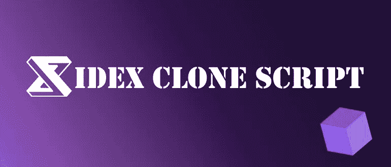
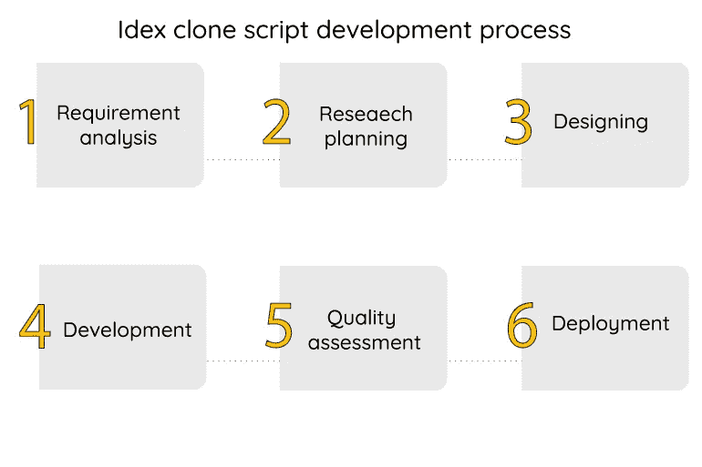
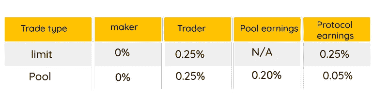
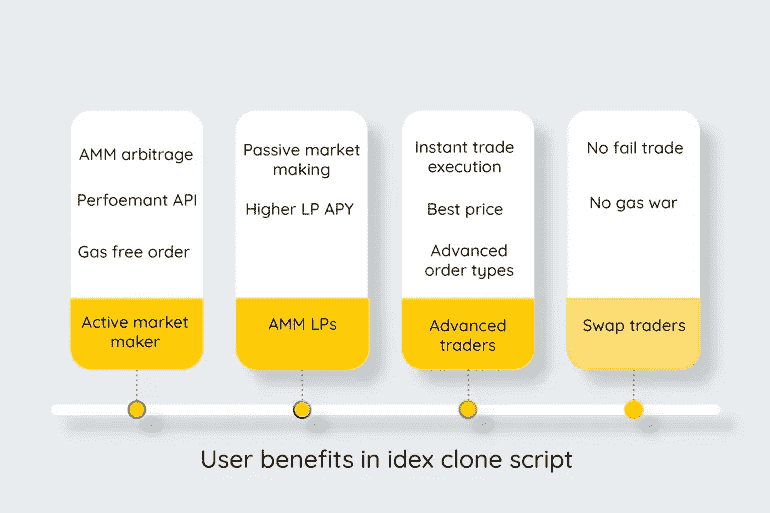

# Idex 克隆脚本如何有益？

> 原文：<https://medium.com/geekculture/how-idex-clone-script-is-beneficial-14b8aeb52e6f?source=collection_archive---------22----------------------->

分散式交易所更受交易者的欢迎，因为它对整个交易过程具有先进的私有性和呈现特征。因为不需要中央授权来进行交易，所以在 **dex 克隆脚本**中提供了高端安全性。Idex 克隆脚本是一个 dex 克隆平台，用户可以完全控制他们的资产，也可以完全匿名交易。

**Idex 克隆软件**是一个可信、快速、安全的分散交易平台，为您的企业带来被动收入。Clone idex 是完全可定制的，因此您可以添加任何功能特性来吸引更多用户使用您的平台。如果你是寻求在加密交易领域拓展业务的投资者之一，请通读全文，以获得关于 idex 克隆脚本如何有益的完整信息。

# **idex 克隆脚本概述**

Idex 是一个快速、分散的交易平台，支持加密交易。Idex 是一个用户友好的加密交换脚本，于 2017 年基于以太坊区块链推出。 [**Idex 克隆脚本**](https://radindev.com/idex-clone-script/) 是一个完全去中心化的交换平台的复制品。克隆 idex 可以根据您的业务需求进行定制。

Idex 不仅专注于分散原则，还拥有集中交易的速度，这就是为什么它被认为是最快的 dex 平台。换句话说，idex 克隆脚本是建立在支持实时交易的区块链网络上的分散交易所的高端安全性的组合。Idex 是一个 dex 脚本，提供高级的交易安全性，它是基于以太坊的，所以这些特性为任何 dex 平台带来了流行。

Idex 仅支持 ETH 和 ERC-20 令牌的交易。它由智能合约组成，能够管理令牌和访问私钥，从而在高度安全的环境中进行交易。根据 idex exchange 脚本的统计，平台上没有报告失败的交易。

# **为什么要创建 idex 这样的交易所？**

在 idex 交易平台上，用户可以参与下注，并赚取大约 50%的交易费用。参与者可以将代币转移到 idex 和 stake 的流动性池中。Idex 交易功能用于完成高端证券交易，同时执行最快的交易。Idex 克隆脚本是 idex 的副本，因此它可以操作相同的功能和高级特性。

Clone idex 可以通过向平台添加基本功能进行定制和升级。考虑您的业务需求，并相应地请求更多功能和可用选项。

Idex 克隆脚本是您业务发展的理想交流平台。你可以在市场中播种流动性，并开始扩展你的业务。idex clone 中 API 的集成可以让交易者进行有史以来最便宜、最容易的交易。Idex clone exchange 提供了一个易于使用的界面，任何人都可以通过该平台轻松进行交易。

# **idex 克隆平台的特点**

立桩标界

Rest API

高级内容管理系统

指纹扫描仪、人脸识别等安全选项

数据加密

双因素认证

原子交换

加密货币价格标签 API

KYC/反洗钱验证

订单簿

多重签名钱包

市价、止损和限价订单模式

多语言支持

图形显示的实时交易统计数据

pin 安全性

# **Idex 克隆脚本开发**

为企业开发 Idex 克隆会带来高额回报。通过 idex 克隆开发，您可以以一种有效的、即时的、无错误的方式加入分散式交换平台社区。随着对 dex clone 应用程序需求的增加，您也可以开发 idex clone 应用程序并面向公众部署，这样您就可以接触到更广泛的加密爱好者和交易者。

从 **idex 克隆脚本开发**流程开始，你需要分析市场和你的业务目标，以便沉浸于其需求、细分和应用愿景。然后制定一个具体的计划和策略，这样可以防止你的预算和时间浪费。记住要设计一个易于使用的界面，这样任何人都可以很容易地参与交易并加入你的平台。

要求一个经验丰富的专家 dex 克隆脚本提供者，可以操作类似的 idex 功能，没有错误。在向公众发布之前，请记住在 beta 测试网络中测试 exchange 克隆。在测试过程中，开发团队倾向于为交易者找出问题和即将出现的问题。在这个级别，你可以要求额外的功能，使整个交易过程更容易和更快。现在您可以部署您的 idex 克隆脚本了。

## **Idex 克隆软件开发流程**

# 【idex 克隆如何给企业带来好处？

定制的 exchange 开发:每个企业都需要独特的功能和操作系统，这些功能和操作系统可以在 dex clone 脚本上为他们量身定制。如果您的企业需要基本功能，可以向平台添加额外的功能。

高 ROI:创建一个像 idex 这样的 dex 克隆脚本可以成为被动收入来源。通过启动 idex 克隆脚本，您可以在多个方面为您的企业带来好处。它能提供一流的平台。因此，它可以产生高额收入作为回报。

# **创建 idex 克隆脚本的优势**

完全控制交易

快速交易

强大的安全性和隐私

免受数字威胁

个人钱包

用户身份保护

全球分散式服务器

# **idex 克隆中的费率**

当开始像 idex 克隆脚本这样的商业模式时，主要收入来自收取的费用。idex clone 平台上的每个活动都可以向您平台中的用户收取费用。以下是 idex 收取的一些主要费用，这些费用也可以部署在克隆 idex 脚本上。

**交易结算:**由收油人支付，根据当前气价和收油人收到的金额计算。

**流动性添加和移除**:流动性变化由交易引擎中的 idex 调度，并在必要时报销气费。费用根据最后一次缴纳的燃气费确定。

**提取:**它也是根据以前的天然气价格计算的，如交易结算，也是从提取到钱包的资产中扣除。

## **idex 脚本中的费率**

# **idex 克隆脚本的用户优势**

## 高级交易员

即时交易执行:idex clone exchange 的这一功能允许活跃用户继续交易，而无需等待之前的交易结算。即时交易执行意味着 idex 交易所可以立即平衡更新。

最佳价格:idex 中的性能价格引擎是您可以添加到 idex 克隆脚本开发中的一个重要特性。它可以实时执行订单，在定价方面比纯 AMM 有更好的表现。

高级订单类型:idex clone 平台中的用户可以通过订单类型原则针对流动性池进行交易，订单类型原则包括杀或补、止损和仅过账。

## 掉期交易商

不，失败的交易:在分散的交易平台上，每当交易无法完成时，汽油费就会被浪费掉，而且不会返还给交易者。交易者必须以更高的价格支付另一笔汽油费才能进行交易。但是 idex 克隆脚本中有效的一点是，报告的失败交易为 0。

关于 idex 脚本中的交易的一个重要事实是交易的即时确认，这导致两个基本结果:a)用户获得最便宜的价格和汽油费 b)没有领跑者和三明治攻击的机会。

没有汽油战:在 idex 克隆脚本中，用户不需要增加汽油费就可以完成交易。由于所有交易的派单按照执行的顺序结算，因此结果是一个公平的交易环境。

## AMM LPs

较高的 LP APY:流动性提供者收取更多的费用，因为频繁的套利机会导致交易量很高。

被动做市:用户可以很容易地为订单簿提供流动性池，却忘记存入自动做市。

## 活跃的做市商

AMM 套利:idex 克隆脚本自动做市商会在用户进行反向交易时更新价格。一旦其他交易所的价格发生变化，AMM 就会创造套利机会。

无汽油订单和订单:根据离线订单簿，取消或更换交易不考虑汽油费用。

Performant API: Idex 具有一个 API，可以将用户的策略移植到 Idex 交换脚本中，并且它符合最好的集中式交换平台。做市商可以随着市场的变动更新市场，而不需要额外的支出。

# 在 idex 克隆交换中，加密资产如何更安全？

不妥协:用户可以通过提供流动性赚取费用。idex 的交易者通过各种订单类型(包括止损和限价)进行零价差和流动性交易。

自由和安全:交易者可以在交易时完全控制自己的资金。idex 中的这一功能由 quantstamp 审计。

峰值性能: [**Idex**](https://idex.io/) 包含高级交易引擎，导致即时执行和高吞吐量。这一功能消除了交易失败的风险。

# **克隆 idex 支持哪些钱包？**

元掩码

JSON

分类帐

特雷佐

私人密钥

# **结论**

Idex 克隆脚本是一个现成的、去中心化的、具有高端安全特性的功能，并获得很高的投资回报率。Idex script 是一个去中心化的交换平台，自推出以来呈现了精彩的统计数据。idex 中没有报告失败的交易，所以我们假设它不会对重做交易收取额外的费用。 **Idex 克隆平台**是 Idex 交换平台的整个功能系统和操作特性的复制品。因此，作为一个投资者，如果你想在加密领域开创一个新的事业，你可以选择像 idex 克隆脚本这样的好方法。

我们在加密交换平台方面的专业知识以及在这方面的多年经验是一个即时解决方案，可帮助您的企业执行有效且无任何麻烦的加密领域产品。如果你需要我们在本文中遗漏的任何附加信息，你可以得到你想要的 **dex 克隆脚本**的免费演示。