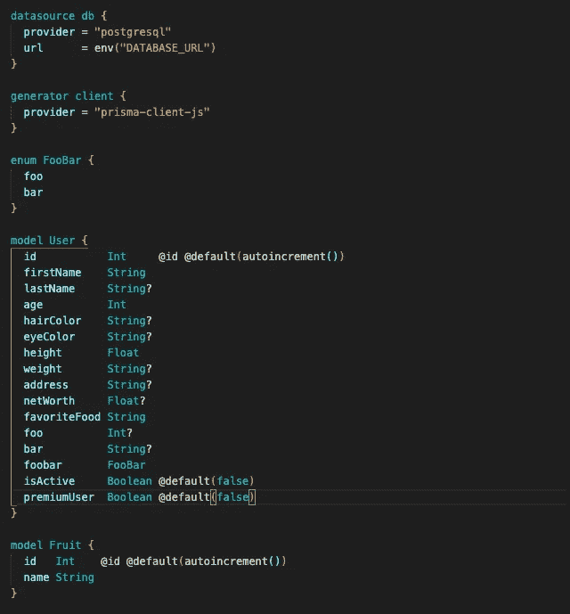
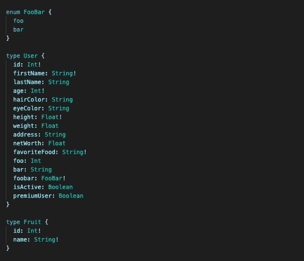
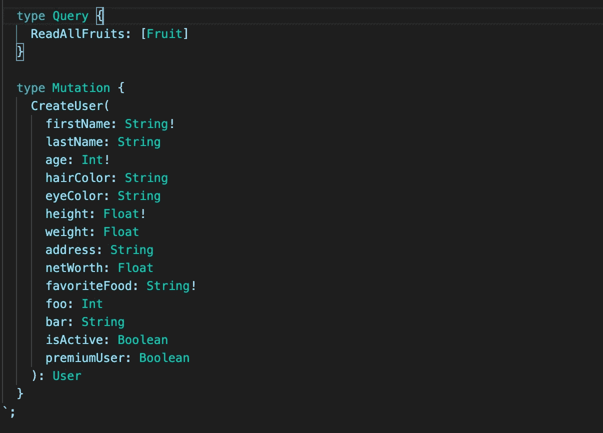
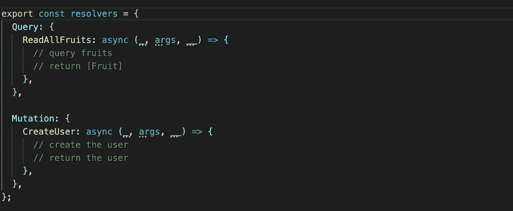
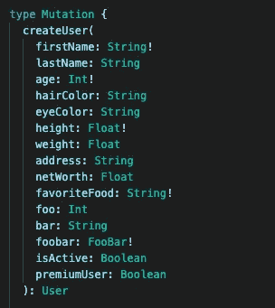
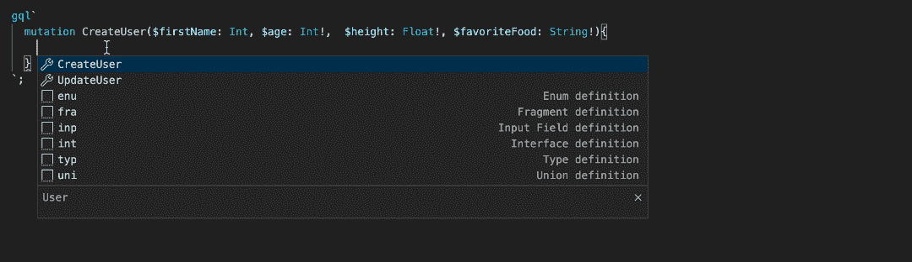
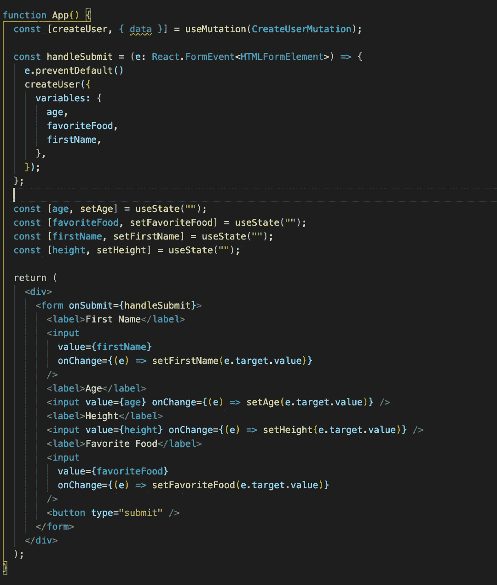
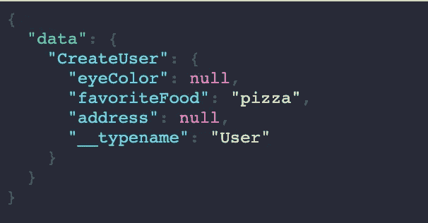
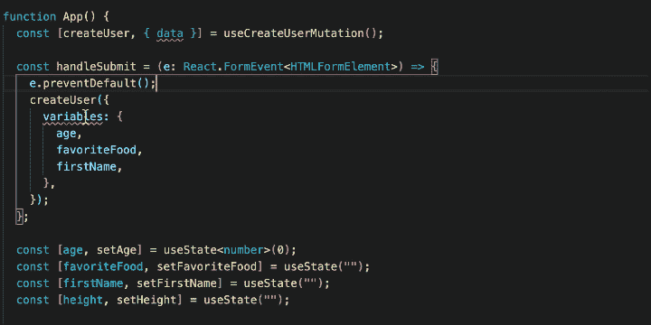

# 用 GraphQL 最大限度地发挥打字稿的功能

> 原文：<https://medium.com/geekculture/how-im-developing-my-full-stack-web-app-with-the-guards-up-62ae1a25cf3a?source=collection_archive---------10----------------------->


让我带你经历一次我现在认为是调试地狱的经历。我正在写一些 API 请求——也许我在 Postman 中测试过，也许没有。当我运行我的应用程序，用 API 调用测试功能时，你会对这部分感到惊讶；*不管用*。所以我将从前端打印/控制台. log 数据。也许我试图在错误的对象/方法上访问数据，或者我拼错了键名。也许它不是从 API 中发出来的。如果这些原因都不存在，URL 是否正确？Url 没问题，所以我回到我的服务器，我会

```
print(data.to.be.returned)
```

也许在那里，也许不在。你明白了。相当标准的调试。如果你有这样的经历，请继续阅读，看看 **Apollo(客户端和服务器)、GraphQL 代码生成器、Prisma 2.0 和 Typescript 能为你提供什么。**

之所以有这个标题，是因为我将在本文中使用的技术在防止错误方面是你的后盾。感觉就像打保龄球的时候有警卫在。很有可能，你做的任何碗都会碰到什么东西。有了这个堆栈，你写的任何代码都会多少达到目标。

要继续学习，您需要了解 React(钩子)、Typescript 和 GraphQL 语法。

我需要明确这篇文章是什么。这不是一个教程，你也不会跟着去理解它是如何工作的。然而，你可以在这里找到回购协议。我的目标是让你一窥这项技术的样子，并展示它带来的好处。因此，我将使用更多的截图和 gif，而不是代码片段。我将展示一些代码，并从较高的层面解释它的作用和它提供的好处。

如果你想要一步一步的教程，看看这篇文章:

[](https://kieron-mckenna.medium.com/how-to-setup-full-stack-apollo-gql-codegen-prisma-2-0-typescript-react-part-1-the-backend-e9eae9518dc9) [## 如何设置全栈 Apollo，GQL-CodeGen，Prisma 2.0，Typescript，React:第 1 部分—后端

### 如何设置 Apollo 服务器、Typescript、Prisma 2.0 和 GraphQL 代码生成器

kieron-mckenna.medium.com](https://kieron-mckenna.medium.com/how-to-setup-full-stack-apollo-gql-codegen-prisma-2-0-typescript-react-part-1-the-backend-e9eae9518dc9) 

如果你熟悉 Apollo 服务器和客户端，以及 Prisma，你可以浏览阅读材料，把注意力放在 gif 上。我制作的 gif 展示了这种堆栈的好处。如果你不熟悉，请仔细阅读，这样你就知道发生了什么。

[https://github . com/kieronjmckenna/type safe-Apollo-react-express/](https://github.com/kieronjmckenna/typesafe-apollo-react-express.git)

# 对于那些不熟悉 GraphQL 的人来说

其他每篇文章都是沿着“什么是 GraphQL，它会取代 REST 吗”的思路。如果你真的记不起来了，那就去看看 graphql.org。

# 对于那些不熟悉阿波罗的人

他们的网站比我解释得更好。点击查看[。他们有一些很棒的开源技术。我用的大多是 Apollo 客户端和 Apollo 服务器，刚开始学怎么用 Apollo Studio。Apollo Server 是设置 GraphQL 服务器的一种方式；集成到流行的节点框架中，如 Express 和 Koa。有更多的功能，但这是一个总体想法。Apollo Client 是一个前端的状态管理工具，我对它的推荐不够高。它还处理发送您的 API 调用，带来了一些额外的好处，这就是我今天要展示的。](https://www.apollographql.com/)

# **棱镜 2.0**

Prisma 2.0 是一个 JavaScript ORM。你可以在这里查看文件。以我个人的经验来看，和它一起工作是一种享受。具体来说，类型安全是惊人的。您将很难编写抛出错误的查询，因为智能感知是如此之好。

# GraphQL-CodeGen

GraphQL-Codegen 是一个开源项目，可以帮助您在开发 GraphQL 时避免重复，并在整个代码中提供类型安全。点击查看[。](https://graphql-code-generator.com/)

我认为这是足够的序言。我现在就开始展示技术。

# Apollo Server+graph QL-Codegen+Prisma 2.0:确保端点返回正确的数据

让我们从设置 ORM 开始。Prisma 很直观；这是定义模型的样子。它对扩展名为“”的文件使用自己的语法。prisma”。



Setting up models with Prisma 2.0

这建立了我们的模型。使用 Prisma CLI 和稍微多一点的设置，您就可以拥有一个正常工作的 ORM 了(同样，去查看他们的文档)。不过你只需要关注截图中的用户和水果型号就可以了。如果您熟悉 GraphQL，您会注意到这是一种类似的语法。现在我定义的模型并不是完全随意的。我想要一个有点复杂的模型(用户),我也想要一个单独的简单模型，除了没有名字的原因。然而，如果想到一个应用程序，其中你需要与水果有关的用户的大量信息会使本文更有趣，请随意。

我将简要说明如何用 Apollo Server 设置 GraphQL API。有两个主要的概念需要你去思考。TypeDefs(类型定义)和解析器。现在，我将讨论 TypeDefs，然后再回到解析器。

把 TypeDefs 想象成布局你的 API 的一切。您可以设置类型(如用户和水果)以及它们拥有的字段。您还可以对查询和变异(Q &M)进行布局。把这些看作是 GET、PUT、PATCH、POST 等的等价物。查询用于查询或获取数据。突变是为了突变或改变数据(抱歉，如果你已经熟悉这个)。您还需要明确 Q & M 返回数据、它们采用的参数以及它们的标量。每个问答都需要一个名字；将这些名称想象成 REST API 中的端点或 URL。我认为不言而喻，名字需要是唯一的。



Defining our GraphQL types. The GraphQL types are modeled after the Prisma models

上面我已经在 typeDefs 中精确复制了我们的 Prisma 模型以传递给 Apollo 服务器。



Defining queries and mutations for our GraphQL server

这里我为我们的模型设计了一些 CRUD 操作。这是非常标准的 GraphQL 语法，所以如果它看起来令人困惑，请做一点阅读。

转到解析器。解析器只是您编写的用来“解析”您的查询和变异的函数。在这个设置中，你可以在这里玩 Prisma 和你的模型，以及一些服务器端的东西，比如 auth。



How resolvers are structured

以上是解析器如何被传递到阿波罗服务器。这里有很多值得解构的地方。但是需要注意的是，我们在 typeDefs 中布置的每个 Q & M 都有一个返回所需数据的函数。现在，我一直在强调类型安全，这和这个有什么关系呢？正如我之前解释的，这些函数中的每一个都需要以某种形式返回数据，每一个都有正确的类型。如果没有，那你以后就头疼了。

您还会注意到每个解析器上的参数“args”。这是我们访问传递给查询或变异的数据的地方。例如，在 CreateUser 变体中创建一个用户，并使用参数 age 或 height。

显然，在上面的解析器中没有类型安全的外观。我们知道我们想在查询 ReadAllFruits 中返回一个水果列表，但是我们还没有给 Typescript 提供强制执行的信息。当我们试图做任何与我们在图表中定义的不匹配的事情时，GraphQL-Codegen 会让 VSCode 对我们大喊大叫。

让我先发制人，说我直接开始使用 Prisma ORM。阅读起来很简单，但我将快速解释一段代码。

```
const prisma = new PrismaClient()const fruits = await prisma.fruit.findMany()
```

所有代码都将连接到 Prisma，然后返回水果模型的所有对象。很简单。


Showing how GraphQL-Codegen prevents you from returning the wrong data to the GraphQL query

注意这条线

```
export const resolvers: Resolvers = {
```

“解析器”类型是由 GraphQL Code Gen 创建的。GraphQL Codegen 读取您的 GraphQL 端点，生成解析器类型，确保您返回正确的数据。

对于熟悉解析器和 Apollo 服务器的人来说，它还可以为您的上下文和父类型提供安全性和自动补全功能。我通常通过上下文传递我的 Prisma 客户机，使它成为一个方便的特性。

gif 的快速浏览。我们从解析器不返回任何内容开始。VSCode 告诉我们你需要返回一个水果的列表，而不是 void。然后，我返回 Prisma 查询的用户模型列表。VSCode 也不喜欢这样，因为用户字段与 Fruit 上的字段不匹配。一旦我返回一个水果列表，VSCode 就高兴了。

这里有一件重要的事情需要记住。回想一下定义 Prisma 模型和 GraphQL 类型。您会记得 GraphQL 类型本质上是 Prisma 模型的克隆。因此，当向解析器返回 Prisma 查询时，Prisma 模型的字段和类型都与生成的 GraphQL 类型匹配。接下来，我将展示拥有类型安全参数的好处。


Making sure that the arguments are valid as the data for the Prisma operation to create a user

一开始，VSCode 还在让我们知道不能返回 void 我们需要返回一个用户类型。如果你从未使用过 Prisma，它不会让你传递不正确的参数。所以在上面的 gif 中，如果参数与创建用户所需的数据不兼容，就会出现错误。但是正如我在上面所展示的，由于 GraphQL-Codegen，args 拥有了类型，并且匹配 Prisma 所知道的创建用户模型所需的类型。如果有一个参数不在被传递的用户模型上，或者您缺少一个必需的字段，VSCode 会让您知道。

这就是我要在后端介绍的全部内容。我们已经完成的是确保我们为我们的查询和变异返回正确的信息。我不能强调这对我的发展有多快。我们现在去前台吧。

# Apollo VSCode 扩展:确保我们的 API 调用没有错误

Apollo 有一个 VSCode 扩展，可以帮助开发 Apollo 服务器和 Apollo 客户机。它有很多功能，但我将介绍它在我们编写 GraphQL 查询时带来的自动完成/智能感知(我不确定智能感知是否是正确的词，但我说的是当您 Ctrl + Space 时出现的建议)。

所以让我们以 CreateUser 突变为例。



The (GraphQL) CreateUser mutation

有许多参数要传入，它们都需要有正确的类型和必需的(！)标志，当您在前端编写查询时。通常情况下，您需要自己进行这种验证。我过去更喜欢的方法是在 React 应用程序中连接它，按 go，然后挖掘不可避免的错误消息。Apollo 的 VSCode 扩展提供了一个更好的方法。



Utilizing the Apollo VSCode extension to get auto-complete and error detection when writing queries on the frontend

通过告诉扩展 GraphQL 端点的位置，您看到的自动完成是可能的。然后，它收集所有这些信息，并确保您得到的一切都是正确的。

浏览 gif 图片。首先，我得到一个可用突变的列表。一旦我选择 CreateUser，它就会写出包含所有必需参数的变异。从那里，我将参数传递给突变，并继续获取所有返回给我的可用字段。一旦所有语法都正确，VSCode 就让我知道参数 firstName 的类型错误。

在这一节中，我们已经确保您编写的查询与您的服务器匹配。这有助于防止您在开发时遇到更多的典型错误。

# Apollo-Client + GraphQL CodeGen:在从 API 发送和接收数据时提供完全的类型安全

因此，您已经编写了 GraphQL 查询，并且它与服务器完全匹配。由于 GraphQL-Codegen 和后端提供的类型安全，您也非常有信心数据会被返回。

现在是时候写一些 React 代码了。请查看下面这个漂亮、功能丰富的网站。



Wikipedia level styling. A basic example of a form and Apollo Client. This is without GraphQL-Codegen.

我假设您理解 JSX、状态和表单逻辑。但是如果你从来没有用过阿波罗，那么这个

```
const [createUser, { data }] = useMutation(CreateUserMutation);
```

可能看起来有些奇怪。

这段代码是你如何用阿波罗客户端发射一个变种。解构列表中的第一项是要调用的函数，它发送 API 请求。“数据”是可以访问从变异返回的用户数据的地方。您还会注意到，我们将状态从表单传递给 createUser 函数，以便将其发送给服务器。把这想象成向“localhost:4000/API/createUser”发送一个 Axios 请求。

现在，什么会出错呢？忘记传入所有必需的数据是很常见的，尤其是在有很多参数的情况下，CreateUser 变异就是这种情况。事实上，在那个截图中，我忘记了传递 height 参数，如果我按下 submit 按钮，就会抛出一个错误。发送请求后的“数据”看起来像这样



information returned from the CreateUser mutation. Screenshot from the Apollo Chrome extension

但是如果你没有在 GraphiQL 中测试过，你就不会知道。也许你试着打电话

```
data.eyeColor
```

这将抛出一个错误，因为 data.eyeColor 不存在。你需要

```
data.CreateUser.eyeColor
```

GraphQL-Codegen 提供了一个解决方案，既能传递正确的参数，又能无需猜测地读取返回的数据。



Developing with GraphQL-Codegen and Apollo Client

您会注意到组件第一行的变化。GraphQL 生成一个定制的钩子，专门用于名为“useCreateUserMutation”的 CreateUser 变异。如果你看 gif，你会注意到它发现了我忘记传递高度的事实，然后当我传递它时，它有不正确的字符串类型，所以 VSCode 仍然对我大喊大叫。一旦参数是正确的，我将访问将返回的数据，我得到一些非常好的自动完成。

还有比 GraphQL-Codegen 更多的内容，但这是我将介绍的全部内容。就像我之前说的，去看看文件！

这部分到此结束。现在，您可以更加确信，您的 React 代码不会遇到错误。

# 在警戒状态下发展

这就是我想在保证阿波罗型安全方面所涵盖的一切。我们从服务器开始，以确保我们希望从 GraphQL 查询中返回的数据确实存在，并且具有正确的形状/形式。我们继续前进，确保我们编写的查询与服务器匹配，而不必在 GraphiQL 中测试。最后，我们使用 GraphQL-Codegen 在 React 代码的自动完成和更好的错误检测方面给自己一点帮助。

我希望我(出于某种原因)决定作为这篇文章基础的保龄球比喻是有意义的。使用这些工具会使犯错误变得更加困难，就像你去打保龄球时要提高警惕一样。我真的很喜欢用这个堆栈进行开发；它消除了如此多的调试和错误处理。我想起了一句名言“一盎司的预防抵得上一磅的治疗”。我不得不在谷歌上搜索这句话。很明显，是本·富兰克林写的。

> “一盎司的错误预防抵得上一磅的调试”
> 
> -本·富兰克林(受人尊敬的程序员)

因此，如果您对这个设置感兴趣，首先一定要熟悉 Apollo 客户机和服务器。

这个实时流对我学习 Apollo Client 有很大帮助，主要是因为它帮助我了解了 Apollo Client 的使用情况以及如何使用它进行开发。

我还强调，我介绍的 Apollo 客户机和 Apollo 服务器的惟一特性是进行 GraphQL API 调用。Apollo 客户端是一个令人惊叹的状态管理工具，Apollo 服务器还有更多功能。

Prisma 和 GraphQL-Codegen 的设置都非常直观，有很棒的 CLI。

您可以在这里找到本示例的代码:

[](https://github.com/kieronjmckenna/typesafe-apollo-react-express.git) [## kieronjmckenna/typesafe-阿波罗-反应-快递

### 知识库来展示保持 API 调用完全类型安全的能力。从阿波罗服务器中的解析器到…

github.com](https://github.com/kieronjmckenna/typesafe-apollo-react-express.git) 

如果你想要一步一步的教程，这里有我的文章:

[](https://kieron-mckenna.medium.com/how-to-setup-full-stack-apollo-gql-codegen-prisma-2-0-typescript-react-part-1-the-backend-e9eae9518dc9) [## 如何设置全栈 Apollo，GQL-CodeGen，Prisma 2.0，Typescript，React:第 1 部分—后端

### 如何设置 Apollo 服务器、Typescript、Prisma 2.0 和 GraphQL 代码生成器

kieron-mckenna.medium.com](https://kieron-mckenna.medium.com/how-to-setup-full-stack-apollo-gql-codegen-prisma-2-0-typescript-react-part-1-the-backend-e9eae9518dc9) 

希望您从这篇文章中有所收获。谢谢你阅读它。