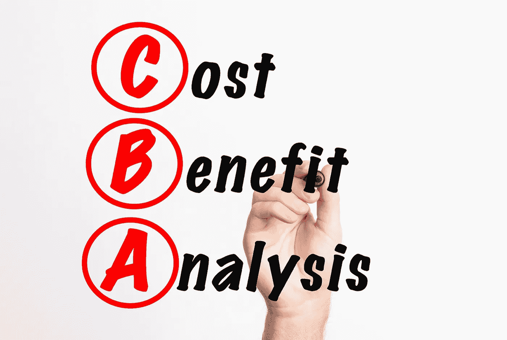

# 成本效益分析有多准确？

> 原文：<https://medium.com/geekculture/how-in-accurate-is-cost-benefit-analysis-b240bb4736c6?source=collection_archive---------9----------------------->

## 你能相信公共投资的成本收益评估吗？这篇文章给出了明确的答案:不会！

作者:Bent Flyvbjerg 和 Dirk W. Bester

本文是三篇系列文章中的第一篇。第二个是 [*这里*](/geekculture/the-cost-benefit-fallacy-7241089d64d8) *，第三个是* [*这里*](https://bentflyvbjerg.medium.com/four-steps-to-better-cost-benefit-analysis-bd62c9ea55e1) *。每篇文章都可以独立阅读，但按顺序阅读就形成了一个整体。*

Photo by [Jernej Furman](https://www.flickr.com/photos/91261194@N06/)