# 索引在 NebulaGraph 数据库中如何工作

> 原文：<https://medium.com/geekculture/how-indexing-works-in-nebulagraph-database-e26b96e9d054?source=collection_archive---------7----------------------->

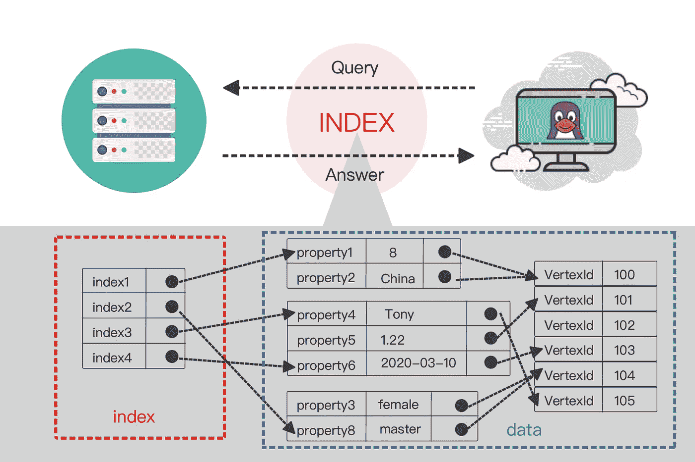

# 为什么图形数据库中需要索引

索引是数据库系统中不可缺少的功能。图形数据库也不例外。

索引实际上是数据库管理系统中的一种排序数据结构。不同的数据库系统采用不同的排序结构。

流行的索引类型包括:

*   b 树索引
*   b+-树索引
*   b *-树索引
*   散列索引
*   位图索引
*   倒排索引

它们每个都使用自己的[排序算法](https://en.wikipedia.org/wiki/Sorting_algorithm)。

数据库索引允许从数据库中高效地检索数据。尽管查询性能有所提高，但索引还是有一些缺点:

*   创建和维护索引需要时间，这随数据集的大小而变化。
*   索引需要额外的物理存储空间。
*   插入、删除和更新数据需要更多的时间，因为索引也需要同步维护。

考虑到以上情况， **NebulaGraph** 现在支持对属性进行更有效的检索。

这篇文章详细介绍了**星云图**的设计。

# 理解星云图索引的核心概念

下面是我们在帖子中使用的常用**星云图**索引术语列表。

*   **标签**:与属性列表相关联的标签。每个顶点可以关联多个**标签**。标签由 TagID 标识。可以把 tag 看作 SQL 中的一个节点表。
*   **Edge** :类似于 tag，edge type 是 Edge 上的一组属性。你可以把 edge 类型看作是 SQL 中的一个 edge 表。
*   **属性**:标签或边缘上的名称-值对。其数据类型由标签或边类型决定。
*   **分区**:是**星云图**的最小逻辑存储单元。一个 StorageEngine 可以包含多个分区。分区分为领导者和跟随者。我们使用[筏](https://www.google.com/url?sa=t&rct=j&q=&esrc=s&source=web&cd=1&cad=rja&uact=8&ved=2ahUKEwjI9IOixZPoAhWFF6YKHf-FCXAQFjAAegQIAxAB&url=https%3A%2F%2Fraft.github.io%2F&usg=AOvVaw0gbPkPuRwWu0Kd74PJmOzK)来保证领导者和跟随者之间的数据一致性。
*   **图形空间**:特定图形的物理隔离空间。一个图中的标签和边类型独立于另一个图中的标签和边类型。一个**星云图**簇可以有多个图形空间。
*   **索引**:本帖中的索引特指~ ~ ~ ~标签或者边缘类型属性的索引。其数据类型取决于标签或边类型。
*   **TagIndex** :为标签创建的索引。您可以为同一个标签创建多个索引。交叉标记复合索引尚未得到支持。
*   **EdgeIndex** :为边缘类型创建的索引。同样，您可以为相同的边类型创建多个索引。交叉边缘型综合指数尚待支持。
*   **扫描策略**:扫描索引的策略。通常，有多种方法来扫描索引以执行一个查询语句，但是扫描策略本身可以决定最终使用哪种方法。
*   **优化器**:优化查询条件，比如对 _where_ clause 的表达式树的子表达式节点进行排序、拆分、合并等操作。用来获得更高的查询效率。

# 在图形数据库中建立索引需要什么

在 NebulaGraph 中，或者更一般地说，在图形数据库中，有两种典型的查询数据的方法:

1.  一种是从顶点开始，沿着特定的边类型检索它的(N 跳)邻居。
2.  另一个是检索包含指定属性值的顶点或边。

在后一种情况下，需要高性能扫描来获取边或顶点以及属性值。

为了提高属性值的查询效率，我们实现了对 NebulaGraph 的索引。通过对边或顶点的属性值进行排序，用户可以快速定位某个属性，避免全扫描。

下面是我们发现在图形数据库中建立索引所需的内容:

*   支持标签和边缘类型属性的索引。
*   支持索引扫描策略的分析和生成。
*   支持索引管理，如创建索引、重建索引、显示索引等。

# 索引是如何存储在 NebulaGraph 中的

下图是索引在 NebulaGraph 中的存储方式。索引是 NebulaGraph 存储服务的一部分，因此我们将它们放在其[存储架构](https://nebula-graph.io/posts/nebula-graph-storage-engine-overview/)的大画面中。

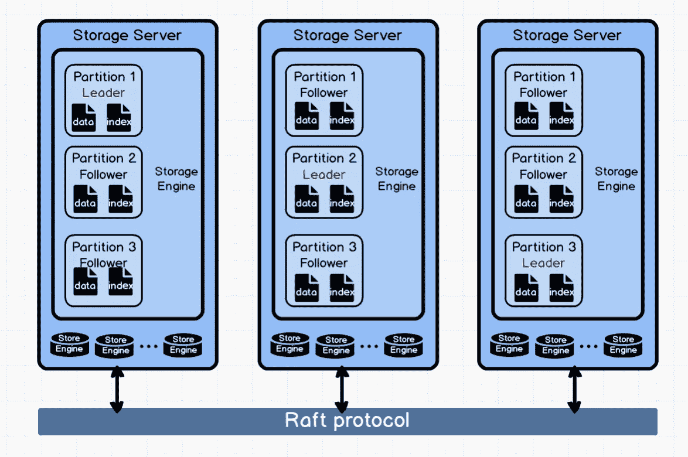

从上图可以看出，每个存储服务器可以包含多个存储引擎，每个存储引擎可以包含多个分区。

不同的分区通过 Raft 协议同步。每个分区都包含数据和索引。**同一个顶点或边的数据和索引会存储在同一个分区中。**

# 索引逻辑故障

# 存储结构:数据与索引

在 NebulaGraph 中，索引以及顶点和边的(原始)数据存储在一起。为了更好地描述索引的存储结构，我们将比较索引和原始数据的结构。

## 顶点的存储结构

顶点的数据结构

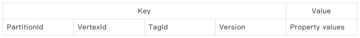

顶点的索引结构

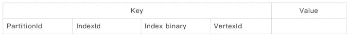

顶点的索引结构如上表所示，下面是字段的详细说明:

**PartitionId** :我们将顶点的数据和索引放在同一个分区中，因为:

1.  在扫描索引时，可以通过索引键快速获取同一分区中的顶点数据，从而可以轻松获取该顶点的任何属性值，即使该属性不属于该索引。
2.  目前，边是通过散列其起始顶点的 Id 来存储的，这意味着每个输出边的位置由其起始顶点 ID 来确定。如果一个顶点及其输出边存储在同一个分区中，索引扫描可以快速定位该顶点的所有输出边。

**IndexId** :索引的标识。可以通过 indexId 获取指定索引的元数据，例如，索引关联的 TagId，索引所在列的信息。

**索引二进制**:索引的核心存储结构。它是所有与索引相关的列的值的字节编码。详细结构将在[索引二进制](https://www.nebula-graph.io/posts/how-indexing-works-in-nebula-graph#index-binary)部分解释。

**VertexId** :顶点的标识符。在实际使用中，由于版本不同，一个顶点可能有多行数据。但是，索引没有版本。**索引总是映射到最新版本的标签**。

我们用一个例子来解释一下存储结构。

假设:

*   分区 Id 为 100
*   标签 Id 是标签 _1 和标签 _2
*   tag_1 包含三个属性:col_t1_1、col_t1_2 和 col_t1_3
*   tag_2 包含两个属性:col_t2_1 和 col_t2_2。

现在让我们创建一个索引:

*   i1 = tag_1 (col_t1_1，col_t1_2)，这里我们假设 i1 的 ID 为 1。
*   i2 = tag_2(col_t2_1，col_t2_2)，这里我们假设 i2 的 ID 为 2。

我们可以看到，虽然列 col_t1_3 包含在 tag_1 中，但是在创建索引时并没有使用它。**这是因为您可以基于 NebulaGraph** 中的一列或多列创建标记索引。

插入顶点

```
// VertexId = hash("v_t1_1"), assume id is 50
```

```
INSERT VERTEX tag_1(col_t1_1, col_t1_2, col_t1_3), tag_2(col_t2_1, col_t2_2) \
   VALUES hash("v_t1_1"):("v_t1_1", "v_t1_2", "v_t1_3", "v_t2_1", "v_t2_2");
```

我们可以看到，VertexId 是指定 Id 的散列值。如果对应于标识符的值已经是 int64，那么就不需要散列或执行将值转换为 int64 的操作。

顶点数据结构:

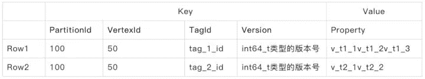

顶点索引结构:

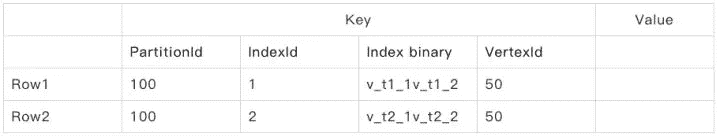

注意:在索引中，row 与 key 一样是索引的唯一标识符。

## 边缘的存储结构

边索引的结构类似于顶点索引的结构。

请注意，为了索引键的唯一性，我们使用了许多数据元素，如 VertexId、SrcVertexId 和 Rank 来生成它们。这就是为什么索引中没有标记或边类型 ID。

我们使用顶点或边 ID 来告诉特定的标签或边类型 ID。

边的数据结构

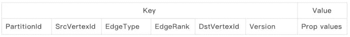

边的索引结构

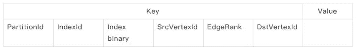

# 索引二进制

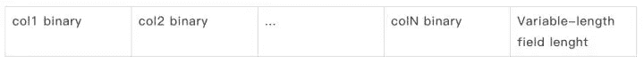

索引二进制是索引的核心字段。在索引二进制中，有两种类型的字段，即固定长度字段和可变长度字段。Int、double 和 bool 类型是固定长度字段，string 类型是可变长度字段。

由于**索引二进制编码所有的索引列并存储在一起，为了准确定位变长字段** , **NebulaGraph** 在索引二进制末尾用 int32 记录变长字段的长度。

例如:假设索引 binary index1 由 int 列 c1、string 列 c2 和另一个 string 列 c3 组成:

```
index1 (c1:int, c2:string, c3:string)
```

假设 index1 有一行，其中 c1、c2、c3 的值分别为 23、“abc”、“here”，则 index1 存储如下:

*   长度= sizeof("abc") = 3
*   length = sizeof("here") = 4

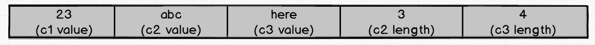

因此，这一行的值是 23 ABC 这里 34。

我们在本节开始时提到，索引二进制包含`Variable-length field length`字段。那是为了什么？这里有一个例子:

现在假设有另一个二进制索引 index2。它由字符串列 c1、c2 和 c3 组成。

```
index2 (c1:string, c2:string, c3:string)
```

假设我们现在有 c1、c2 和 c3 的两组值:

*   第 1 行:(“ab”、“ab”、“ab”)
*   第 2 行:(" aba "，" ba "，" b ")

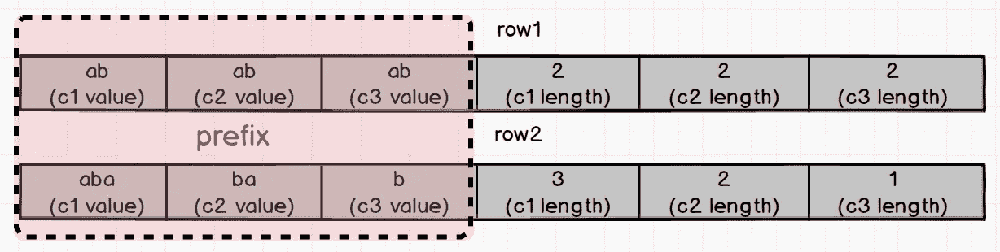

我们可以看到这两行的前缀是相同的。如何区分两行索引二进制的键？答案是`Variable-length field length`。

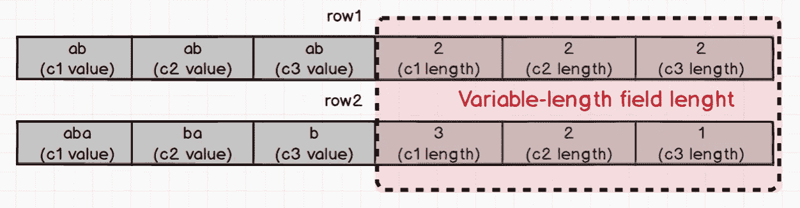

如果您的查询条件是其中 c1 == "ab "，则 c1 的长度直接从订单的可变长度字段长度中读取。基于长度，提取行 1 和行 2 中 c1 的值，分别为“ab”和“aba”。通过这种方式，我们可以准确地确定只有 row1 中的“ab”符合 where 子句。

# 对索引的操作

## 索引写入

在标记/边缘的一列或多列被索引之后，如果涉及标记/边缘写或更新操作，则相应的索引必须与新数据一起被修改。下面将简要介绍存储层中索引写操作的处理逻辑:

**插入**

当插入顶点/边时，insertProcessor 首先确定插入的数据是否包含标签/边索引的相同属性。如果没有关联的属性列索引，则生成新版本，并将数据放入存储引擎；如果这样的属性列索引已经存在，则数据和索引以原子方式写入。

**NebulaGraph** 然后评估在当前顶点/边中是否有稳定的属性值。如果是，则在原子操作中删除过时的值。

**删除**

删除顶点/边时，deleteProcessor 会删除数据和索引(如果存在)，删除过程中还需要原子操作。

**更新**

更新顶点/边包括删除旧索引和插入新索引。为了保证数据的一致性，需要原子操作。而对于普通数据来说，更新只是一个插入操作，可以用最新版本的数据覆盖旧版本的数据。

## 索引扫描

我们在**星云图**中使用`LOOKUP`语句进行索引扫描。`LOOKUP`语句使用属性值作为判断，过滤所有满足条件的顶点/边。`LOOKUP`声明也支持`WHERE`和`YIELD`条款。

## 查找技巧

如[数据存储结构](https://www.nebula-graph.io/posts/how-indexing-works-in-nebula-graph#data-storage-structure)中所介绍的，索引列按索引创建顺序排序。

例如，假设有一个标签(col1，col2 ),让我们为它创建各种索引:

*   标签上的索引 1(列 1)
*   标签上的索引 2(列 2)
*   标签上的索引 3(列 1，列 2)
*   标签上的索引 4(列 2，列 1)

我们可以为 col1 和 col2 创建多个索引，但是在扫描索引时，上述四个索引返回的结果可以完全不同。索引优化器决定使用哪个索引并生成最佳执行策略。

基于上述指数:

```
lookup on tag where tag.col1 == 1 # The optimal index is index1
lookup on tag where tag.col2 == 2 # The optimal index is index2
lookup on tag where tag.col1 > 1 and tag.col2 == 1
# Both index3 and index4 are valid while index1 and index2 invalid
```

在上面的第三个例子中，index3 和 index4 都是有效的，但是优化器必须选择其中一个。根据优化规则，由于 tag.col2 == 1 是一个**等价条件**，因此 tag.col2 效率更高，所以优化器选择 index4 作为最优索引。

# 实际中的星云图索引

如果您对查询语言语法有任何疑问，请在我们的[论坛](https://discuss.nebula-graph.io/)上提交问题。

# 创建索引

```
(user@127.0.0.1:6999) [(none)]> CREATE SPACE my_space(partition_num=3, replica_factor=1);
(user@127.0.0.1:6999) [(none)]> USE my_space;
-- create a graph vertex tag
(user@127.0.0.1:6999) [my_space]> CREATE TAG lookup_tag_1(col1 string, col2 string, col3 string);
-- create index for col1, col2, col3
(user@127.0.0.1:6999) [my_space]> CREATE TAG INDEX t_index_1 ON lookup_tag_1(col1, col2, col3);
```

# 下降指数

```
-- drop index
(user@127.0.0.1:6999) [my_space]> drop TAG INDEX t_index_1;
Execution succeeded (Time spent: 4.147/5.192 ms)
```

# 重建索引

与大多数数据库一样，您可以加载大量没有任何索引的记录(顶点和边)，并在加载后离线重建索引，以提高批加载性能。 **NebulaGraph** 使用以下命令再次强制存储重建索引。可以想象，这个重建是一个繁重的 IO 操作，我们建议你不要在联机服务时进行(至少你的系统负载很低)。

```
REBUILD {TAG | EDGE} INDEX <index_name> [OFFLINE]
```

# 对查找使用索引

```
-- insert a graph vertex 200, it has three properties ("col1_200", "col2_200", "col3_200"
(user@127.0.0.1:6999) [my_space]> INSERT VERTEX lookup_tag_1(col1, col2, col3) VALUES 200:("col1_200", "col2_200", "col3_200"),  201:("col1_201", "col2_201", "col3_201"), 202:("col1_202", "col2_202", "col3_202");
-- search the vertex by the property
(user@127.0.0.1:6999) [my_space]> LOOKUP ON lookup_tag_1 WHERE lookup_tag_1.col1 == "col1_200";
============
| VertexID |
============
| 200      |
------------
-- find the vertex with its properties.
(user@127.0.0.1:6999) [my_space]> LOOKUP ON lookup_tag_1 WHERE lookup_tag_1.col1 == "col1_200" \
YIELD lookup_tag_1.col1, lookup_tag_1.col2, lookup_tag_1.col3;
========================================================================
| VertexID | lookup_tag_1.col1 | lookup_tag_1.col2 | lookup_tag_1.col3 |
========================================================================
| 200      | col1_200          | col2_200          | col3_200          |
------------------------------------------------------------------------
```

这就带来了索引贴的结尾。如果您有任何建议或要求，请在 [GitHub](https://github.com/vesoft-inc/nebula) 上向我们提出问题，或者在我们的[论坛](https://discuss.nebula-graph.io/)上给我们反馈。

# 你可能也会喜欢

1.  【NebulaGraph 如何用 TTL 自动清理陈旧数据
2.  [存储平衡和数据迁移](https://nebula-graph.io/posts/nebula-graph-storage-banlancing-data-migration/)
3.  [星云图中的快照介绍](https://nebula-graph.io/posts/nebula-graph-snapshot-introduction/)