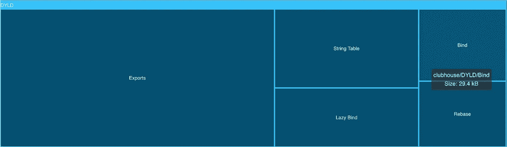
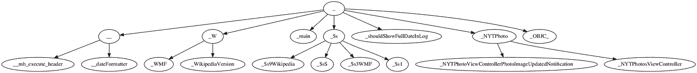

# iOS 15 如何让你的应用启动更快

> 原文：<https://medium.com/geekculture/how-ios-15-makes-your-app-launch-faster-51cf0aa6c520?source=collection_archive---------0----------------------->


## 在 [Emerge Tools 博客](https://www.emergetools.com/blog/posts/iOS15LaunchTime)上阅读这篇文章的完整版本

WWDC21 最吸引人的功能被深埋在 Xcode 13 发行说明中:

> 所有以 macOS 12 或 iOS 15 或更高版本为部署目标构建的程序和`dylibs`现在都使用链接修正格式。这使用不同的加载命令和链接编辑数据，不能在旧版本的操作系统上运行或加载。

没有任何文档或会议来了解关于这一变化的更多信息，但我们可以对其进行逆向工程，以了解苹果在新操作系统上有什么不同，以及它是否会对您的应用程序有所帮助。首先，介绍一下控制应用程序启动的程序的背景。

## 见见戴尔

动态链接器(dyld)是每个应用程序的入口点。它负责让您的代码准备好运行，因此对 dyld 的任何改进都会导致应用程序启动时间的缩短。在调用 main、运行静态初始化器或设置 Objective-C 运行时之前，dyld 执行修正。这些操作包括 rebase 和 bind 操作，它们修改 app 二进制文件中的指针，以包含在运行时有效的地址。要查看它们的样子，您可以使用`dyldinfo`命令行工具。

```
% xcrun dyldinfo -rebase -bind Snapchat.app/Snapchat
rebase information (from compressed dyld info):
segment section          address     type
__DATA  __got            0x10748C0C8  pointer
...
bind information:
segment section address     type    addend dylib        symbol
__DATA  __const 0x107595A70 pointer 0      libswiftCore _$sSHMp
```

这意味着地址`0x10748C0C8`位于`__DATA/__got`中，需要移动一个常数值(称为滑动)。而地址`0x107595A70`在`__DATA/__const`中，并且应该指向在`libswiftCore.dylib`中找到的 has able[1]的协议描述符

dyld 使用`LC_DYLD_INFO` load 命令和`[dyld_info_command](https://developer.apple.com/documentation/kernel/dyld_info_command)` struct 来确定二进制中 rebases、binds 和[导出符号](https://github.com/qyang-nj/llios/blob/main/exported_symbol/README.md) [2]的位置和大小。[涌现](https://emergetools.com)(免责声明:我是创始人😬)，解析这些数据，让您直观地看到它们对二进制文件大小的影响，并建议链接器标志使它们变小:



## 新的格式

当我第一次上传一个为 iOS 15 构建的应用程序到 [Emerge](https://emergetools.com) 时，没有 dyld 修复的可视化。这是因为`LC_DYLD_INFO_ONLY`加载命令丢失，它已被`LC_DYLD_CHAINED_FIXUPS`和`LC_DYLD_EXPORTS_TRIE`取代。

```
% otool -l iOS14Example.app/iOS14Example | grep LC_DYLD
      cmd LC_DYLD_INFO_ONLY% otool -l iOS15Example.app/iOS15Example | grep LC_DYLD
      cmd LC_DYLD_CHAINED_FIXUPS
      cmd LC_DYLD_EXPORTS_TRIE
```

导出的数据与之前完全相同，是一个 trie，其中每个节点代表一个符号名的一部分。



Portion of the exports trie for Wikipedia

iOS 15 中唯一的变化是数据现在被一个包含第一个节点偏移量的`[linkedit_data_command](https://developer.apple.com/documentation/kernel/linkedit_data_command)`引用。为了验证这一点，我编写了一个简短的 Swift 应用程序来解析 iOS 15 二进制文件并打印每个符号:

## 链接

真正的变化在`LC_DYLD_CHAINED_FIXUPS`。在 iOS 15 之前，rebases、bind 和 lazy binds 各自存储在一个单独的表中。现在它们已经被组合成链，指针指向包含在这个新的 load 命令中的链的起点…

## 在 [Emerge Tools 博客](https://www.emergetools.com/blog/posts/iOS15LaunchTime)上阅读这篇文章的完整版本