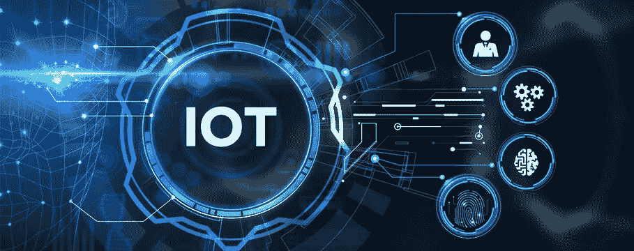
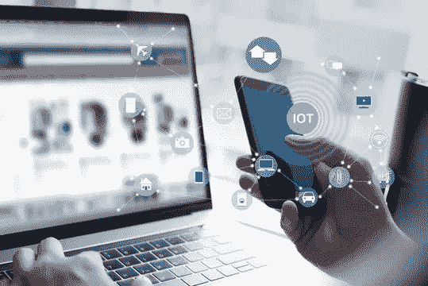

# 物联网如何变革应用开发行业

> 原文：<https://medium.com/geekculture/how-iot-has-revolutionised-app-development-industry-2a069ca4e589?source=collection_archive---------10----------------------->

随着与众不同的先进技术的出现，移动应用程序开发领域持续经历着许多创新和根本性的变革。[物联网](https://en.wikipedia.org/wiki/Internet_of_things)是当今变革应用开发行业的技术之一。

因此，移动应用开发和物联网相辅相成，形成了一个完美的联盟。这些技术和谐共存，在提高业务效率和用户体验的同时，确保机器和人类之间的顺畅交互。

全球物联网市场正在快速增长，预计到 2028 年将达到 18，547.6 亿美元，而 2022 年为 3，813 亿美元，这一增长对于移动应用来说绝对是一个扩大其在物联网中的存在的机会。

在本文中，让我们了解一下物联网是如何带来变化的，以及在转向物联网移动应用程序开发之前需要考虑什么。

# **让我们看看，什么是物联网？**

物联网(IoT)通过将互联网连接、计算机和分析带到物理和数字世界，允许它们相互作用和协同工作。通过实现日常任务的自动化和简化，企业可以在许多方面受益。虽然物联网自 20 世纪 90 年代就已经存在，但最近的一些技术发展使它变得更加有用。

随着物联网每年的迅猛发展，各种组织都在利用其带来的巨大商业利益。

一组整合了来自众多物联网设备的数据的服务和程序构成了一个物联网应用。为了做出明智的决定，使用机器学习或[人工智能(AI)](https://www.techtarget.com/searchenterpriseai/definition/AI-Artificial-Intelligence) 来分析这些数据。这些决定被返回到物联网设备，物联网设备智能地响应输入。

物联网为组织提供了进入发现新机会的高级分析的权利。例如，在积累顾客行为事实的帮助下，组织可以创建引人注目的集中营销和营销活动。

对数字和物理基础设施的持续监控可以优化性能、提高效率并降低安全风险。为了自动安排系统升级，从现场监视器收集的信息可以与硬件和固件版本信息配对。

# **物联网移动应用**

移动应用已经成为人类与智能系统交互的中心界面。例如，你可以在不离开沙发的情况下用他的智能咖啡机煮咖啡，或者直接查看商店里智能冰箱里剩下的东西。但是他的 [*物联网概念的移动应用*](https://www.europeanbusinessreview.com/mobile-iot-based-applications-and-its-impact-on-the-end-user/) 已经不仅仅渗透到 B2C 细分市场。

许多天然气管网已经配备了控制传感器，对于工程师来说，只有一个控制点是不够的。无论您身在何处，要获得更新的数据并与系统交互，您都需要他的移动应用程序。

# **物联网如何惠及移动应用开发？**

全球已经有数百万台物联网设备。随着互联网连接成为家庭、工厂和企业中使用的设备的标准特征，这一数字只会增加。

随着物联网和移动应用程序开发的集成，您可以在世界任何地方通过智能手机上的按钮访问连接的物理对象。[物联网应用开发公司](https://colaninfotech.com/iot-development-company/?utm_source=blog&utm_medium=medium&utm_campaign=deepika)可以使支持物联网的移动应用随着物联网平台的高级功能和用户网络使用的增加而扩展。

**集中式应用** —物联网在市场上有多种服务可能性和机会，重点是为最终用户提供一个管理多种设备的集中式平台。

**混合应用**——如今，大多数人都在寻找改善互动的解决方案。移动应用程序开发公司开始开发具有现代技术 UI/UX 和高级代码的混合应用程序。

**高端安全** —物联网提供了数量空前的入口点，这些入口点可能会对应用安全构成重大威胁，使网络犯罪分子更容易滥用数据。重点开发安全可靠的移动物联网应用非常重要。

# **物联网在移动应用开发中的范围**

物联网提供了新的应用可能性，通过与各种互联网连接设备进行交互，使消费者的生活变得更加简单和容易。我们在大多数行业中看到许多实时物联网应用。其中一些可以命名为医疗保健、农业、能源、设施管理等。

事实上，在克服了许多发展挑战后，物联网开始积极影响我们日常生活的许多方面。未来，企业将依赖物联网支持的移动应用。他的现有物联网服务与人工智能合作的例子，如谷歌人工智能、Siri 和 Alexa，显示了人工智能移动物联网应用的未来潜力。物联网为混合移动应用的开发人员提供了高级代码功能的优势，这些功能支持跨平台的大量代码重用。

随着对物联网解决方案的需求变得独特和复杂，对具有简单定制选项的响应性应用的需求也在增加。因此，现代企业正在整合更强大的定制能力和功能，为客户提供更多选择。

# **物联网移动应用的未来**

物联网正在对企业创新产生重大影响。所以物联网带来了更多创新公司的崛起。移动应用是公司扩展其物联网优势的最佳媒介。

据统计，2030 年将有约 254.4 亿台物联网设备。物联网开发未来的、功能丰富的移动应用，帮助您在新兴竞争中保持领先。此外，物联网技术为企业移动应用提供了简单的个性化选项。

物联网对定制移动应用解决方案更有价值，因为这项技术可以影响不同行业的每个领域。这项技术可以满足任何行业的业务需求，定制的移动应用程序可以充分利用它。

# **总结**

简而言之，它被证明是为彻底改变[移动应用程序开发流程](https://colaninfotech.com/services/mobile-app-development-company/?utm_source=blog&utm_medium=medium&utm_campaign=deepika)而创建的。移动应用可以利用物联网来提高复杂业务流程的效率和生产力。

此外，移动应用在物联网实施中发挥着至关重要的作用。随着联网设备的普及和增长，物联网和移动应用之间的关系正在改善。未来几年，物联网和移动应用可能会蓬勃发展并走向成熟。物联网继续为移动应用开发行业带来重大变化。