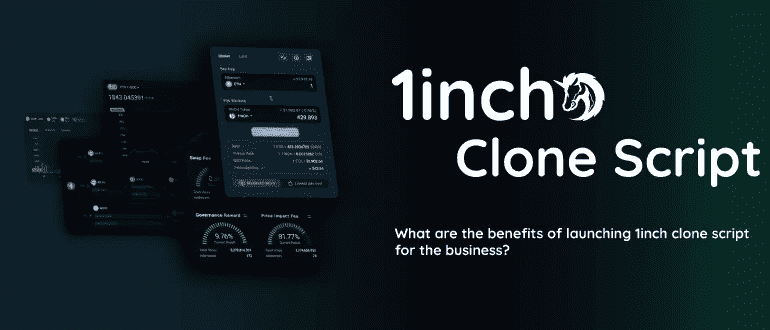
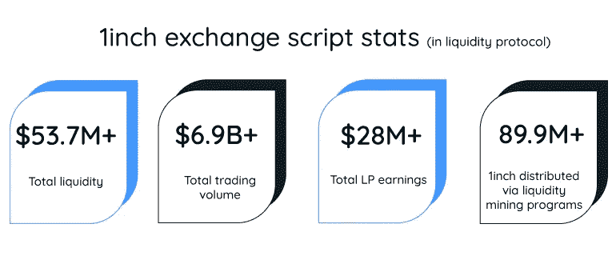
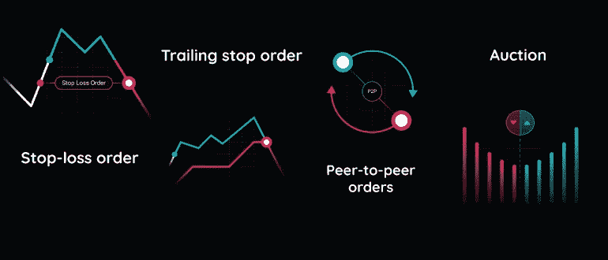
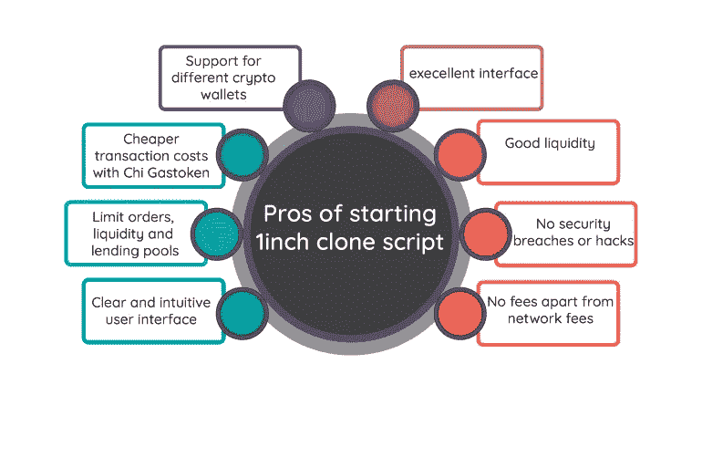

# 1 英寸克隆脚本有什么好处？

> 原文：<https://medium.com/geekculture/how-is-1inch-clone-script-beneficial-dbad5a8289b4?source=collection_archive---------9----------------------->

启动像 1inch 克隆脚本这样的 dex 克隆脚本对您的用户来说是一个开放的 defi 网关。通过创建 1inch exchange 克隆脚本，您可以构建一个 dex 聚合器来探索几个收入来源和交易机会。

与 1inch clone platforms 类似的 Dex clone 脚本经过了多重测试，并包含高端安全选项和高级功能，这些功能与 1inch.io exchange platform 的功能相同。换句话说，1 英寸克隆是一个著名的、高性能的分散式 exchange 的精确复制品。

通读全文，了解我们的克隆 1 英寸平台的详细故障。

# **1 英寸克隆脚本简介**

1 英寸是一步到位的分散式金融交易所。它由 309 个流动性来源组成，由分散的流动性提供者授权。据报道，在 1inch 交换脚本中，用户可以将加密与高级功能和功能生态系统进行交换，这是一个非常棒的统计数据。投资者可以通过克隆一个分散的交易脚本来获得访问 Defi 平台的即时解决方案，而[**1 英寸克隆脚本**](https://radindev.com/1inch-clone-script/) 是一个流行的解决方案。

1inch exchange 克隆脚本是 1inch 脚本功能和交易生态系统的精确镜像。Dex 克隆脚本可以相应地完全定制。搜索、分析和规划您的业务战略，并开始使用克隆脚本交换平台专门化您的加密业务需求。1inch clone exchange 是创建 dex 克隆脚本的一步式解决方案，可为您的业务带来好处。

# **1 inch 克隆脚本的特性**

降低风险

高流动性

%100 权力下放

本机令牌的集成

通过燃气费进行交换

完全审计

完全可定制

超安全 API

不需要中央授权

# **为什么选择 1inch exchange 克隆脚本？**

用户数量增加

更好的定价

Chi token 优化燃气费

Moonpay 支持以太坊购买

探路者算法交换

选择性交换

截止日期目标

最佳滑动

# **如何创建 1inch exchange 克隆脚本？**

1inch clone script 是一个现成的分散式 exchange 平台，可以根据您的业务需求轻松部署。在创建一个 dex 克隆脚本时，首先要有一个清晰且令人兴奋的策略。制定一个你认为可以取得巨大进步的计划。记得搜索和分析你要进入的市场。

找出当前发布的 dex 克隆脚本中出现的错误，这样你就可以要求一个改进的无故障运行的脚本。为了更好地进行交易，雇佣一个开发团队，为你的企业开发一流的交易平台。易于使用和简单的界面提供了更好的用户体验，这并不难。

# **1 英寸克隆脚本开发**

使用克隆脚本来扩展您在加密领域的业务，是加入创收者的正确方法。因此，如果您计划启动一个像流行的分散式交易所那样的 dex 克隆脚本，那么按照您的意愿克隆一个是最好的解决方案。

1inch exchange script 是一个 dex 平台，可以根据您的业务在克隆脚本上进行定制。1inch clone script 是一个定制的、完全分散且透明的 exchange 平台，可运行高端安全功能。操作订单协议可以完全复制到您的 1inch exchange 克隆脚本中。在本文的其余部分，您可以了解 1inch 原则的所有细节，以及它们如何让您的企业受益。

## **1 英寸克隆开发流程**

1inch exchange 克隆脚本开发是 1inch 集成的 API、安全功能和重复功能的过程。在 1inch 克隆脚本开发中，1inch 的相同特性和功能在新的克隆交换平台上进行开发和部署。克隆 1inch exchange 脚本不是一个持久的过程。

使用 scratch 创建 exchange 平台可能需要长达六个月的时间，但使用白标克隆脚本可以让您在几天内启动 dex 克隆脚本。下面是开发 1inch exchange 克隆平台的过程。

API 集成

加密钱包集成

智能合同开发

流动性池整合

添加附属功能

测试并解决错误

Mainnet 启动

# **为什么选择 1 英寸克隆脚本？**

## 最佳互换利率和条件

可用流动性总量的最大值:交换的流动性池越深，交换代币就越容易。在 1inch clone script 等分散式交易所平台中，流动性提供者是自动化做市商，支持代币交易和自动化市场，1inch clone 是基于区块链联邦理工学院的完全分散式交易所，可通过智能合约进行交易。

基于以太坊的 1inch 克隆授权为交易创造了更好、更安全的条件。它可以支持多链，因此它可以建立一个广泛的交易社区网络。

## 高端安全原则

隐私和安全是分散金融的基本问题，以防止数字资产和令牌被黑客攻击。分散交易平台中的用户需要在交易时完全控制他们的代币。对 1 英寸克隆脚本进行的审核级别很高，这证明了 1 英寸交换脚本考虑了不同的高度安全的协议。

## 大量的总可用流动性

一旦流动性池更深，1 英寸交易所克隆平台的主要流动性提供者是 AMM，即自动做市商，交换 1 英寸交易所克隆脚本将变得容易得多。1inch 与包括自动做市商和私人做市商在内的两种做市商都有关联。clone 1inch 的这两个重要流动性提供者确保用户获得市场上最近的最佳掉期价格。1inch 聚合了 250 多种流动性来源，这些来源可以不断增加其数量。

## 高级模式下的简单交换

定期的可用性改进降低了新手进入分散式金融领域的门槛，并为有经验的用户简化了整个交易过程。例如，对于更有经验的用户来说，经典模式是活动的，这使得预设路线可用并且还具有高级特征。

对于有经验的用户，提供了类似 OTC 或选择最大回报的高级设置，跟踪价格图表的变化，并查看订单列表。新人可以通过简单的交易模式进行交易。

## 功能的多功能性和可访问性

1inch 为使用相同操作系统的 iOS 和 android 提供网络应用和移动应用的交换。因此，将资产安全存放并转移到非保管型 1 英寸钱夹中是可行的。1inch clone 脚本的用户可以通过内置的 web 3.0 浏览器访问任何分散式财务应用程序。1 英寸克隆应用程序中的设计设置通过提供购买、销售和存储等选项，使用户受益。

# **1 inch clone 的核心有益协议有哪些？**

## **聚合协议**

通过 1inch exchange 克隆脚本中的聚合协议，您可以将一笔交易拆分为几笔分散的交易，以找到最佳费率。它还可以为流动性提供不同的交易所。该协议在 1inch exchange 上的主要部分是 1inch v4 智能合约，它可以对交易的执行进行运行时验证。

聚合协议可以保证你的 1inch 克隆脚本中整个交易过程的安全性。即使当用户与不安全的流动性来源互动时，他们也可以完全控制自己的资金。Pathfinder 是运行在聚合协议上的一个原则。它可以找到最佳交易价格的最佳路径。它可以运营超过 10 个区块链网络，因此可以将燃气费降低 60%。

## **限价委托协议**

1inch 克隆脚本交换平台拥有最灵活和创新的限制顺序。

不收费:因为不收费，所以在汽油费方面产生了有效的结果。

动态定价:动态定价功能对于拍卖来说是一个非常有效的功能。这个功能可以找到交易的最佳价格。

多链:1 英寸交换脚本支持多链，因此这使得交易可以在多个链上进行，包括以太坊，多边形，创，币安链等。

条件订单:为了获得最大的交易收益，用户可以为他们的订单执行设置特定的条件。

额外的 RFQ 支持:RFQ 是一种简短的询价形式，使人们能够购买特定数量的加密货币。

## **流动性池协议**

用户可以参加 1inch 克隆脚本中的流动性提供计划，并获得 1inch 代币。因此，通过开发 1 英寸的精确流动性协议，您的用户可以通过提供流动性来制造 1 英寸令牌。这些协议通过向池提供流动性来实现从您的加密资产中获利。流动性提供者从锁定在池中的资产中获得回报，还能获得额外收益的农业回报。

因此，参与流动性挖掘需要参与者加入 1inch 支持的资金池计划之一，并获得 1inch token。

# **1 英寸克隆脚本的用例**

各种实现工作基于平台中出现的不同条件。根据销售模式和交易者的期望，相关的订单功能运行。

## P2p 订单

P2p 功能优化了单个用户之间不安全和不信任的交换。通过点对点功能，用户可以找到交易对手来交换一定数量的代币。

## 止损订单

当价格达到用户设定的点时，止损订单将根据 1inch exchange 克隆脚本中的条件订单功能执行。一旦达到限价，未平仓订单将被平仓以避免更多损失。

## 追踪止损单

在基于条件订单特征的跟踪止损单功能中，用户确定固定价格作为止损价格，并在其上附加跟踪金额标签。如果市场价格上涨，尾随数量也会增加。

## 拍卖

1 可以通过动态定价功能开发和部署 inch clone 脚本，该功能可用于授权拍卖。交易者可以使用 1 英寸限价单协议参与 maker DAO 拍卖。

# **1 英寸克隆平台的主要优势**

不可取消的智能合约

没有违反安全规定

简单的导航界面

提供高流动性

令牌的东方阅读

没有额外的交易费用

存在本机/治理令牌

全面的资产控制

众多令牌集成

# **1 英寸克隆的优点**

# **1 inch clone 支持哪些平台？**

去交换

UniswapV2

牛

平衡器

班科尔

凯伯

清酒交换

Lua 互换

UniswapV1

sushiswap

# **结论**

[**1 英寸**](https://app.1inch.io/) 是爆炸式增长的加密领域中的一项创新，包含寻找最佳交易脚本以实现高交易量、高市值和高流动性的初学者。1inch clone script 是一个增强的 dex clone script，可从不同方面为您的业务带来好处。1inch exchange 克隆软件在各个方面扩大了机会，旨在吸引广泛的密码爱好者和交易者。

那么，你是一个正在寻求开展加密货币业务的投资者吗？1inch exchange 克隆脚本是进入分散金融社区的一个值得大肆宣传的入口，可将您的业务引向被动收入来源。