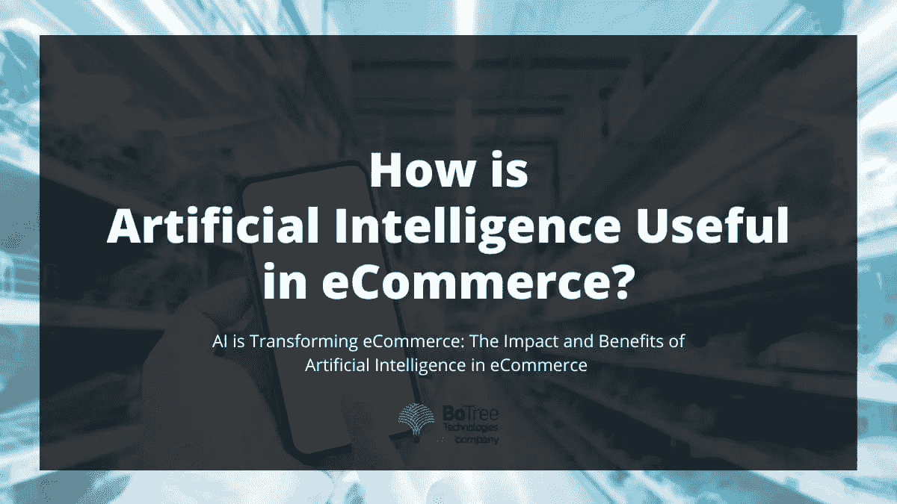

# 人工智能如何在电子商务中发挥作用？

> 原文：<https://medium.com/geekculture/how-is-artificial-intelligence-useful-in-ecommerce-8e2fe4cd08b5?source=collection_archive---------21----------------------->

人工智能正迅速成为一种无孔不入的技术。它已经在不同的领域证明了它的有效性，并且在不同的领域变得必要。

[人工智能解决方案](https://www.botreetechnologies.com/artificial-intelligence-solutions)也在帮助在线零售商更好地交付和优化客户体验。全球电子商务销售额预计将在 2022 年达到巨大的[5.5 万亿美元](https://www.shopify.com/blog/global-ecommerce-sales#:~:text=Global%20ecommerce%20sales%20are%20expected,increasingly%20lucrative%20option%20for%20businesses.)。不断增长的在线零售业将人工智能用于聊天机器人等服务，以更好地服务客户。

[电子商务中的人工智能本质上是分析和预测客户的实际需求。电子商务品牌正在使用新的人工智能技术来预测消费者的需求，甚至在他们意识到这些需求之前。这有助于他们获得更多的市场份额并击败竞争对手。](https://www.botreetechnologies.com/case-studies/swadesh)

一家致力于开发人工智能集成应用的[可信软件开发公司](https://www.botreetechnologies.com/) 可以帮助全球[电子商务公司](https://botreetechnologies.medium.com/10-ecommerce-website-development-companies-that-lead-the-industry-in-2022-59bf99b5fe2a)超越平凡。利用收集的业务和客户数据，品牌可以做出更好的商业决策，并更准确地预测未来。

预计网上销售将在这块蛋糕中占有更大的份额。据信，到 2025 年，这一数字将超过 7.3 万亿美元，就像一把热刀子切黄油一样。因此，让我们仔细看看人工智能是如何推动电子商务向前发展的。

> **阅读更多:** [**面向商业的人工智能服务的未来**](https://www.botreetechnologies.com/blog/future-of-artificial-intelligence-services-for-business/)

# 电子商务中的人工智能正在改变零售业

人工智能的实现具有不可思议的能力，以更加无缝、快速和有组织的方式驱动业务功能。

为了理解人工智能在电子商务中的影响，有必要理解人工智能的组成部分。

人工智能包括数据挖掘、自然语言处理和机器学习。

*   **数据挖掘:**指收集当前和历史数据，以做出更明智的决策。
*   **自然语言:**它的 processes 特性侧重于人机交互和计算机如何解释自然语言。
*   **机器学习:**它涉及使用算法来应用经验。

# 什么是电子商务中的人工智能？

全球电子商务公司使用支持人工智能的数字助理来提供[聊天机器人服务](https://www.botreetechnologies.com/chatbot-development)，分析客户评论，并为在线购物者提供个性化服务。因此，他们有助于提供出色的客户服务。

# 人工智能在电子商务中有什么好处？

AI 可以帮助商业组织准确预测消费者需求，并高效地进行目标营销活动。它有助于提高客户保留率，实现无缝后台自动化，并提高销售流程的效率。

# 什么是深度学习？

它是机器学习的一个分支。它涉及分层算法，以获得对数据更广泛的理解。这种分析有助于组织做出更好的商业决策。

> **阅读更多:** [**人工智能 vs 机器学习 vs 深度学习**](https://www.botreetechnologies.com/blog/artificial-intelligence-vs-machine-learning-vs-deep-learning-difference/)

# 什么是人工智能在电子商务中的应用？

面向电子商务行业的人工智能解决方案已经影响了 B2C 和 B2B 市场的传统买卖方式。此外，预测性人工智能解决方案有助于对定期买家的研究。

电子商务中的人工智能个性化帮助[公司](https://botreetechnologies.medium.com/top-10-ai-companies-promoting-transformation-in-the-tech-962f1d676cbd)分析忠诚客户的购买模式，并向他们发送个性化报价或基于 ML 的替代商品推荐。

1.  **聊天机器人和虚拟助手:**

*   他们为客户提供全天候支持。聊天机器人等电子商务人工智能工具正在实现更好的客户在线购物体验。
*   支持人工智能的数字助理提供了 NLP 等功能，可以解释基于语音的消费者交互。它有助于通过洞察了解消费者的需求。

**2。产品推荐:**

*   电子商务行业的人工智能有助于向客户推荐相关产品。
*   在电子商务大数据分析的帮助下，公司可以从过去的客户购买行为中学习。利用这些知识，公司可以向每个消费者做出准确的产品推荐。

**3。库存管理:**

*   一家[值得信赖的企业软件开发公司](https://www.botreetechnologies.com/enterprise-software-development-company)支持人工智能的库存管理公司，如 BoTree Technologies，可以帮助您开发和使用定制的支持人工智能的库存管理系统。
*   这种管理工具可以帮助您的企业管理其库存水平。它是根据前几年的销售趋势、预期的需求变化和对供应相关问题的预测来进行的。
*   人工智能也在人工智能机器人的帮助下实现有效的[仓库管理](https://www.botreetechnologies.com/blog/supply-chain-management-software-reduce-supply-chain-risks/)，人工智能机器人可以 24X7 工作，不像人类。

**4。价格优化**:

*   电子商务中的人工智能和机器学习在产品的动态定价策略中发挥着重要作用。通过访问正确的数据，人工智能工具可以预测何时应该设定什么价格，以及可以提供什么折扣。
*   自我学习算法可以扫描大量数据和不同的定价方案，以建议当前市场最相关的价格。

**5。销售和需求预测**:

*   电子商务行业的人工智能有助于预测产品和服务的销售和需求。
*   一致的客户分析有助于监控和应对消费者需求的变化。这些信息可用于价格优化和目标营销。

> **阅读更多:** [**Python 对于电子商务开发:为什么有意义？**](https://www.botreetechnologies.com/blog/python-for-ecommerce-development-why-does-it-make-sense/)

# 人工智能在电子商务中有什么好处？

[网购中的人工智能](https://www.botreetechnologies.com/blog/how-can-ecommerce-help-retail-businesses/)潜力巨大。许多大公司，如亚马逊，利用人工智能和人工智能来改善个性化的产品选择和客户体验。

人工智能的集成是如此无缝，以至于 63%的人甚至没有意识到他们正在使用基于人工智能的界面。你甚至可以在没有注意到的情况下，为你的在线商务网站部署人工智能。

现在让我们仔细看看人工智能对你的电子商务业务的优势。

1.  **有针对性的营销和广告:**

*   个性化帮助企业从竞争对手中脱颖而出。此外，在聊天机器人和虚拟助手的帮助下，个性化信息和一对一对话对消费者产生了重大影响。
*   由一家[企业软件开发公司](https://www.botreetechnologies.com/blog/types-of-enterprise-software-for-companies/)设计的 AI 和 ML 解决方案可以查看消费者过去购买行为的数据池。然后，解决方案分析数据，以了解消费者的购买历史模式。然后，这些信息可用于通过准备个性化营销信息和报价向潜在客户进行再营销。

**2。自动化:**

*   自动化的最终目标是至少在常规活动中减少人工干预。这有助于减少出错的机会，并允许专业人员利用他们的创造力来构思可以改善业务的新想法。
*   自动化可能包括任何类似 BoTree Technologies 的物流人工智能解决方案，可以[自动化库存管理](https://www.botreetechnologies.com/case-studies/inventory-management-system)和实时跟踪在途供应商品。

**3。智能搜索:**

*   “搜索化”在业内是一个相对较新的术语。这是搜索和销售的结合。这里的搜索是指使用搜索面板来查找特定的产品。
*   在搜索栏中，搜索特定产品的消费者比橱窗购物者更有可能购买它们。因此，网上买家必须能够准确找到他们正在寻找的东西。
*   “搜索和定位”包括导航、自动完成、推荐产品列表等等。此外，[电子商务平台](https://www.botreetechnologies.com/blog/the-secret-behind-powerful-vintage-ecommerce-platform/)通过行为数据分析，使用图像注释提供个性化、用户友好且有价值的搜索体验。

> **阅读更多:** [**商家为什么要投资 AI 服务？**](https://www.botreetechnologies.com/blog/ai-services-for-business-investment/)

## 结论

在过去，人工智能技术可能看起来很笨重。然而，今天，电子商务中的人工智能已经成为改善客户体验的关键。它有助于提高转换率和简化业务流程。

人工智能在电子商务中的应用有助于你在竞争中保持领先。这带来了新的销售，并从老客户那里重复销售。

任何电子商务成功背后的核心理念是客户体验。因此，如果你正在寻找方法来增强你网站上的[客户体验](https://www.botreetechnologies.com/blog/ai-solutions-for-next-level-customer-experience/)，要知道人工智能解决方案正在改变电子商务行业。

BoTree Technologies 是一家领先的软件开发公司。我们专门为电子商务开发创新的人工智能应用程序。

**和我们一起开始你的下一个项目吧！** [**今天免费咨询**](https://www.botreetechnologies.com/contact) 。

*原载于 2022 年 9 月 9 日*[*https://www.botreetechnologies.com*](https://www.botreetechnologies.com/blog/ai-in-ecommerce/)*。*