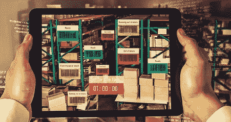

# 条形码技术在库存控制中是如何使用的？

> 原文：<https://medium.com/geekculture/how-is-barcode-technology-used-in-stock-control-dce02c894ab7?source=collection_archive---------15----------------------->

有效的库存控制对企业至关重要。它有助于避免仓库内的库存过多、短缺或其他代价高昂的问题，同时简化流程并改进预测。条形码技术在确保强大的库存控制方面发挥着至关重要的作用。

# 了解库存控制

库存控制，或称存货控制，包括保持适当的库存数量，使企业能够满足顾客的需求，避免延误，同时保持最低的库存成本。

任何经营实物产品的企业都需要库存来销售。库存控制有助于确保公司始终有足够的库存供客户使用，因为它平衡了购买和储存库存的成本。这个过程说起来容易做起来难。业务控制之外的多种因素可能会使库存控制变得更加复杂。

# 库存有哪些不同类型？

基本上，有四种类型的库存。下面列出了这些。

*   原材料:任何将你的存货转化为成品或产品的材料都被称为原材料。
*   在制品(WIP):顾名思义，任何正在处理的存货或库存都称为在制品。
*   成品:准备出售的库存项目是一种成品。
*   维护、维修和大修(MRO)货物:MRO 库存包括帮助组装或制造成品的项目，而不是单独出售的项目。

# 库存控制系统是如何工作的？

当你知道你有什么类型的存货时，存货控制就变得容易了。就库存或存货控制系统而言，它是一种技术解决方案，可以自动化多个手动流程，以通过供应链成功跟踪和管理公司的货物。条形码识别是一项关键技术，可增强库存跟踪和管理，从而形成强大的库存控制系统。选择一个良好的基于条形码的库存控制解决方案将进一步强化这一过程。

# 2 种库存控制系统

组织用于生产或在市场上销售给客户的任何成品或原材料都被称为库存或存货。库存控制系统可以分为两种类型，永续盘存制和定期盘存制。

*   永续盘存制:顾名思义，它永久或连续地跟踪库存余额，同时在产品售出或收到时自动更新。
*   定期盘存制:与永续盘存制相反，定期盘存制利用不定期的实物盘点来跟踪销售商品的成本和衡量存货水平。

# 条形码技术如何用于库存控制

对于依赖实物产品的企业来说，库存控制可能是盈亏之间的决定性因素。如果操作得当，它可以帮助提高每次销售的盈利能力，同时降低成本。借助条形码技术，企业可以自动化库存控制中繁琐的手动流程，从而提高效率和准确性。

基于条形码的库存管理系统为每个库存项目分配一个条形码。当每件物品通过仓库流程时，使用[条形码扫描仪](https://demo.dynamsoft.com/barcode-reader/)对其条形码标签进行扫描。

在整个库存控制过程中，条形码可以多种方式使用，例如:

*   挑选订单
*   进行库存盘点
*   接受订单
*   仓库转移

# 在库存控制中使用条形码技术的好处

条形码在不同行业变得无处不在的一个主要原因是，它们有助于建立一个标准来识别供应链中的相同产品或项目。例如，在开发产品时，制造商可以为其分配 UPC 或唯一的产品代码条形码标签，以便快速识别产品。制造商、消费者、经销商、零售商等。，可以使用相同的 UPC 访问准确的信息。

自动化是一个关键因素，它可以减少对手动任务的依赖，并消除物品在整个供应链中实时记录数据的错误。

以下是在库存控制中使用条形码技术的主要好处。

*   更高的准确性:条形码库存系统可确保库存盘点的准确性，因为它最大限度地减少了收货时对人工输入产品信息的依赖，同时降低了出错的几率。
*   提高效率:手动数据输入既耗时又容易出错。条形码库存控制减少了手动输入产品信息和纠正错误所花费的时间。因此，提高了效率。
*   实时数据:每当员工扫描产品上的条形码时，公司的业务管理系统或 ERP(企业资源规划)解决方案中的库存和销售数据都会快速更新。
*   降低成本:条形码技术具有成本效益。与其他现代技术解决方案相比，实施条形码库存控制系统的前期投资较低。随着移动设备变得越来越普遍，企业可以避免在专用设备上投资，从而节省大量资金。

# 在库存跟踪系统中使用条形码的 3 个最佳实践

库存跟踪对许多企业来说至关重要。虽然这对某些行业(如零售业)来说肯定更为重要，但其他行业也能从中受益。如果你正在考虑在你的业务中实现一个库存跟踪系统，这里有一些基本的考虑。

首先，与相关的利益相关者坐下来，找出哪些特性是重要的。不要倒着干；找到一个系统，然后想出如何应用它的特性。相反，找出你的问题和你想如何解决它们。然后，确保你审查的供应商能够专门解决这些问题。您还需要确定是否需要集成到现有系统或新系统中。

复杂的条形码读取软件将提供数十种方法来提高条形码识别的准确性。

# 条形码库存系统:库存专业人员面临的共同挑战

尽管条形码技术在许多方面有利于库存专业人员，但薄弱的条形码库存系统会带来一些挑战。常见的列举如下。

*   处理速度慢:速度慢的条形码扫描仪和手动数据输入一样好。导致效率低下，产生挫败感。
*   缺乏对多平台的支持:条形码扫描仪应用程序可能无法与无人机、自动导引车(AGV)或移动机器人一起工作，仓库经常使用这些设备来进行有效的库存跟踪。大多数条形码扫描解决方案提供商不支持多种平台和设备。
*   难以集成:将条形码扫描功能集成到不同的设备和平台需要时间和精力。普通的条形码扫描解决方案可能需要几个月的开发时间才能发挥作用。
*   无法扫描难以识别的条形码:在处理数以千计的商品时，条形码标签很有可能因为多种原因而损坏。弱条形码读取器无法扫描破损、不完整、有角度、起皱、微小或有标记的条形码，这给库存专业人员带来了另一个挑战。
*   在具有挑战性的环境中读取条形码的困难:弱条形码扫描器的另一个问题是它们不能在具有挑战性的环境中工作，例如弱光、阴影和强光。
*   不支持批量扫描:库存专业人员每天扫描数千个条形码标签。一次扫描一个条形码会影响生产率。普通条码扫描仪不支持批量扫描。

# Dynamsoft 条形码阅读器 SDK 如何解决这些问题？

Dynamsoft 条形码阅读器是一款企业级[条形码扫描 SDK](https://www.dynamsoft.com/barcode-reader/overview/) ，允许您在 web、移动或桌面应用程序中集成强大的条形码读取功能。提供数百种 API 来满足您最具体的使用情况，您可以轻松地为您的企业构建一个强大的条形码库存控制系统。

以下是它如何解决库存专业人员在弱条码扫描解决方案中面临的主要挑战。

*   速度惊人的条形码扫描仪:Dynamsoft 条形码阅读器 SDK 速度极快，它可以在短短 60 秒内扫描 500 多个条形码！更不用说，它可以比业界第二好的产品多读取 34.9%的条形码。
*   支持多种平台:从 web 应用程序到移动、桌面、服务器和嵌入式应用程序，Dynamsoft 条形码阅读器 SDK 可在所有平台上实施。无论您是使用智能手机还是无人机进行强大的库存跟踪，您都可以通过这款条形码扫描仪解决方案轻松完成。
*   只需几行代码即可实现快速集成:使用 Dynamsoft 条码阅读器 SDK，只需几行条码即可为不同设备和平台构建强大的库存跟踪条码扫描解决方案。
*   能够快速扫描最坚硬的条形码:撕裂的、有角度的、密集的或微小的——这款条形码扫描仪 SDK 可以读取所有这些[坚硬的条形码](https://www.dynamsoft.com/barcode-dataset/)。
*   在挑战性环境中的出色性能:眩光、阴影或弱光可能是其他普通条形码扫描仪的问题，但不是 Dynamsoft 条形码扫描仪 SDK 的问题。
*   用于仓库条形码扫描的批量扫描模块:使用 dynam soft Panorama(dynam soft 条形码阅读器的增强模块),库存专业人员可以在充分利用其能力时实现真正的 100%条形码扫描成功率。

# 试用 Dynamsoft 条形码阅读器 SDK

正在为您的库存管理系统寻找一款商业级条形码阅读器 SDK 吗？试用 Dynamsoft 条形码阅读器 SDK。它在您开发的每一步都提供了出色的功能和技术支持，让您获得流畅的部署体验。

尝试[在线演示](https://demo.dynamsoft.com/barcode-reader/)进行快速回顾。

[下载 30 天免费试用](https://www.dynamsoft.com/barcode-reader/downloads/)详细分析。

如果您有任何问题，请随时联系我们。

*原载于 2022 年 11 月 30 日 https://www.dynamsoft.com**[*。*](https://www.dynamsoft.com/blog/inventory/use-barcode-technology-in-stock-control/)*