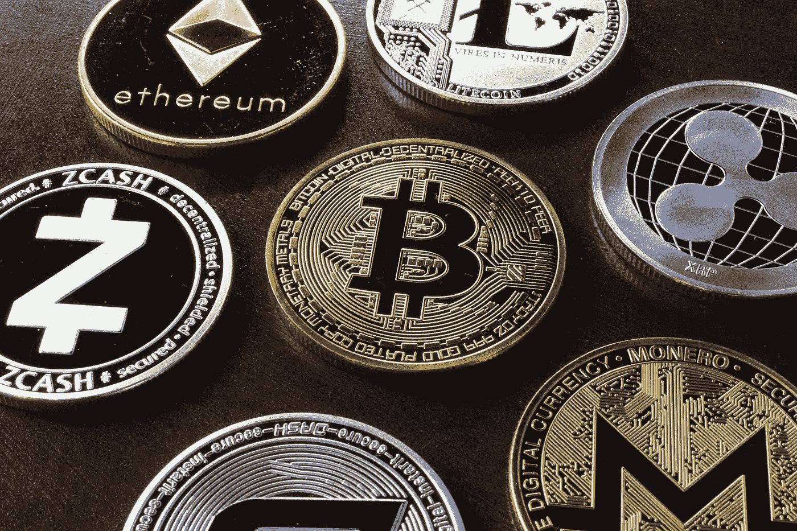

# 加密价格是如何确定的

> 原文：<https://medium.com/geekculture/how-is-crypto-price-determined-cb75662e43e4?source=collection_archive---------27----------------------->

随着加密技术的价值上升，很难准确判断市场内部发生了什么。加密价格是不断变化的，在任何给定的时刻都有如此多的不同因素影响价值，所以总是需要对事情以某种方式发生的原因做出解释。幸运的是，我们把这篇文章放在一起，包含了你需要知道的关于加密价格是如何确定的一切！

我将讨论影响加密价格的所有关键方面，并提供这些特定主题的详细说明。我们还提供了对影响加密价格的因素的重要见解，因此您可以更好地了解如何利用这些信息。

值得注意的是，crypto 的价格价值是由许多不同的因素决定的，而不仅仅受一个因素的影响。虽然看起来市场波动应该是主要原因，但事实并非如此。市场波动只影响加密资产的短期价值，而不影响其长期价值。

影响加密货币价格的主要因素有三个:

1.  对网络服务或产品的需求(需求)

2.网络的供给(supply)

3.与供给相比，对加密资产的需求

## 需求是如何受到影响的？

对特定加密资产的需求是决定其价值的重要因素。这种需求会受到几种不同方式的影响，包括以下方式:

被投资的地理区域的人口。被投资受众的投资金额。网络服务或产品产生的收入金额(关键值)。投资者对其投资(风险)的预期收益或损失百分比。

## 供应是如何受到影响的？

供应也可以在决定加密资产的价格价值方面发挥作用——尽管它没有需求那么大。供应会受到以下两种方式的影响:

流通中的加密资产的总量

市场上待售的加密资产的数量

# 需求与供给是如何受到影响的？

需求和供给可以通过几种不同的方式影响价格价值。以下只是几个例子:如果需求高于供给，那么价值就会增加。如果供给高于需求，那么价值就会降低。如果需求与供给保持在大致相同的水平，那么价格-价值就不会有太大的变动。

任何给定加密货币的价格和价值也受到投机和长期持有(霍德林)的影响。投机取决于围绕特定加密货币的市场情绪，以及媒体或行业领导者对它的看法。投机还取决于交易者对给定加密资产未来价值的看法。这可以受到新闻的影响，比如政府规定，疯狂的价格波动等。交易者利用这一点，操纵价格以获得短期利润(往往适得其反)。

# 投资者如何赚钱？

投资者在投资加密货币时，可以通过几种不同的方式赚钱。投资者可以通过三种主要方式赚钱，包括:通过 BlockFi (blockfi.com)等平台将其硬币借给借款人来赚取利息。通过交易机器人赚取硬币利息。购买硬币并长期持有。

# 加密资产如何影响加密资产的价格价值？

需求不足并不是影响加密资产价格的唯一因素。供给和需求也会受到以下因素的影响:
比特币、莱特币等正在发生的事情。？以太坊、NEO、TRON 等其他加密货币正在发生什么？？有关于加密资产的消息吗？加密的前景如何？
政府法规发生了什么变化？

在给定的一年中，有多少密码被创建或发布？有多少人退出了市场？每枚硬币的价格是多少(除了其他货币)？未来几天，有哪些短期趋势可能会影响加密货币的价值？币安、比特币基地等关键价值交易市场正在发生什么？(抛开其他货币)？

# 加密价格是如何确定的:结论

有许多不同的因素影响任何给定加密资产的价格。加密资产的价格价值是不断变化的，因此了解它如何上升或下降是很重要的。理解这些因素对你的交易来说是一笔巨大的财富，不管你是想获利还是仅仅理解这些价格是如何决定的！

如果你觉得我的内容很有趣，请随时关注我在 [Patreon](https://www.patreon.com/arsenkay) 的每周分析和访问我的加密组合。