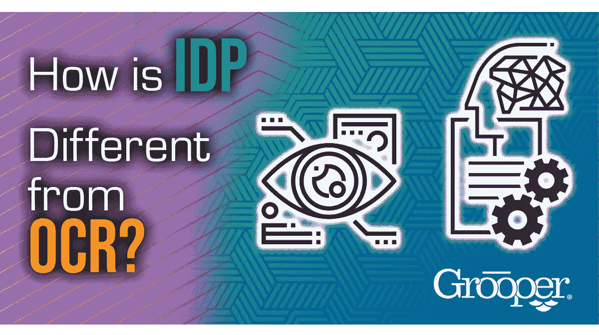

# IDP 和 OCR 有什么不同？

> 原文：<https://medium.com/geekculture/how-is-idp-different-than-ocr-bdabc66d9321?source=collection_archive---------39----------------------->

智能文档处理(IDP)经常与光学字符识别(OCR)混淆，因为它们都旨在实现相同的总体目标:机器阅读。

IDP 不同于 OCR，因为它是一个结合了[多种工具和技术](https://blog.bisok.com/general-technology/what-is-intelligent-document-processing)来处理数据的软件平台。OCR 是一种将像素转换为字符的工具，它本身的有效性很小。

所有的 IDP 系统都依靠 [OCR 技术](https://www.bisok.com/grooper-data-capture-method-features/multi-pass-ocr/)将像素转化为它们所代表的字符。这项技术被称为“OCR 引擎”,因为它总是更大成果的一部分。你的车需要发动机，但发动机不是车。

IDP 平台将使用任意数量的 OCR 引擎来实现期望的结果。例如，一些引擎是可训练的，而其他引擎在某些字体或手写方面表现更好。

# 最终，IDP 解决方案包括以下所需的技术:

1.  提高 OCR 引擎的性能
2.  处理 OCR 结果以提高准确性
3.  做出关于数据的决策
4.  查找并提取特定信息
5.  将数据与其他系统集成

以上都不是 OCR 单独提供的，没有它什么都不可能。所以你明白为什么 OCR 和 IDP 经常被混淆或者被归为一类了。

# IDP 就像一个拥有多条装配线的工厂，所有这些装配线最终都会生产出最终产品。

OCR 只是众多流水线中的一个。

# 了解 IDP 和 OCR 的强大功能

如果没有 OCR，IDP 解决方案就不会存在，因为许多信息仍然被锁定在通过电子邮件发送、打印或扫描的传统文档中。人们通常认为文档被扫描后，软件很容易“阅读”，但这是完全不正确的，因为 OCR 本身并不十分准确。

只有使用 IDP 软件才能获得高度准确的 OCR 结果，因为所有其他技术都用于提高准确性。如果你认为这是一个鸡和蛋的难题，你是对的！

# 两者都是取得最佳成功的必要条件

没有 OCR，IDP 就不会存在，OCR 本身对文档的数据集成影响不大。OCR 的早期使用使得全文文档搜索更加强大，但是数据质量不够好，不能用于几乎没有误差的核心业务流程。

OCR 通常很难区分看起来相似的字符。[如果我们需要相信数据是准确的，这些“小”错误就会累积成大问题。此外，OCR 无法填充某些数据类型的空白，如日期或其他可能以多种格式输入的字段。](https://www.bisok.com/how-to-get-better-ocr-accuracy/)

IDP 让 OCR 尽可能准确，然后使用机器学习、自然语言处理和其他技术处理 OCR 输出，从文本中创建可操作的信息。

*最初发表于*[*【https://blog.bisok.com】*](https://blog.bisok.com/general-technology/how-is-idp-different-than-ocr)*。*