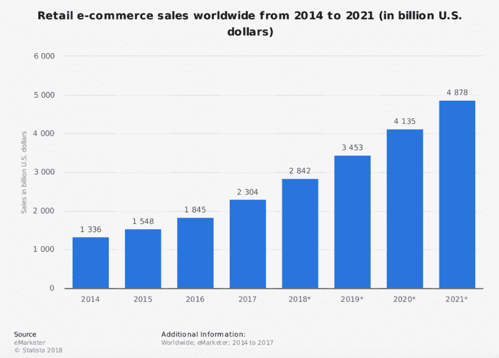
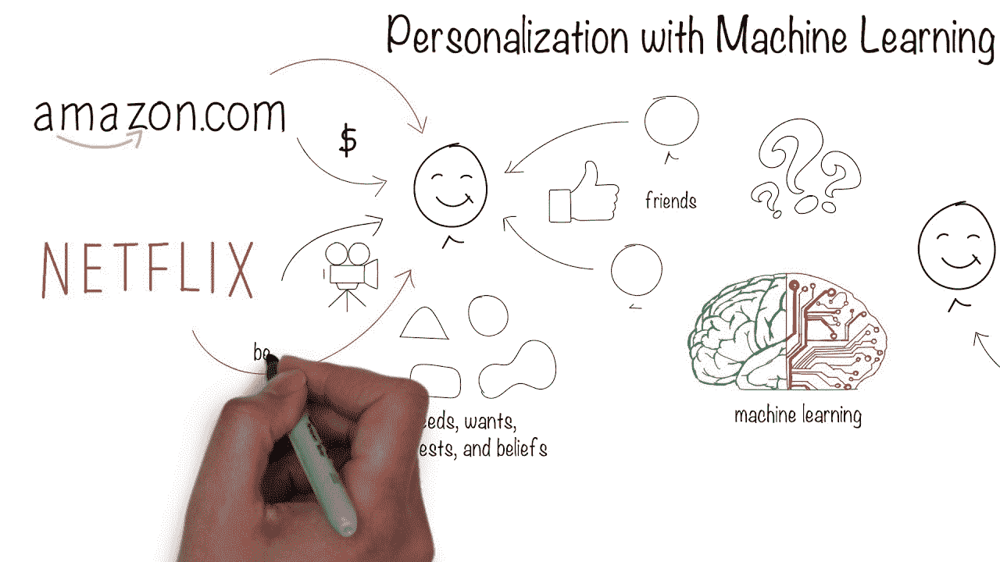
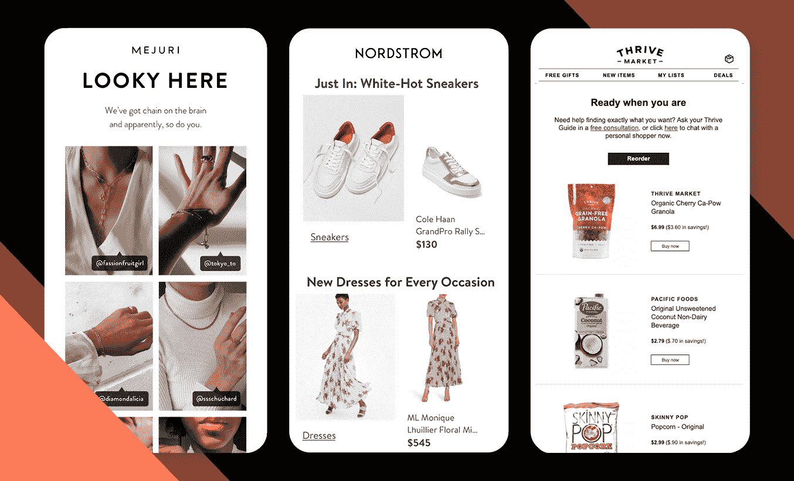
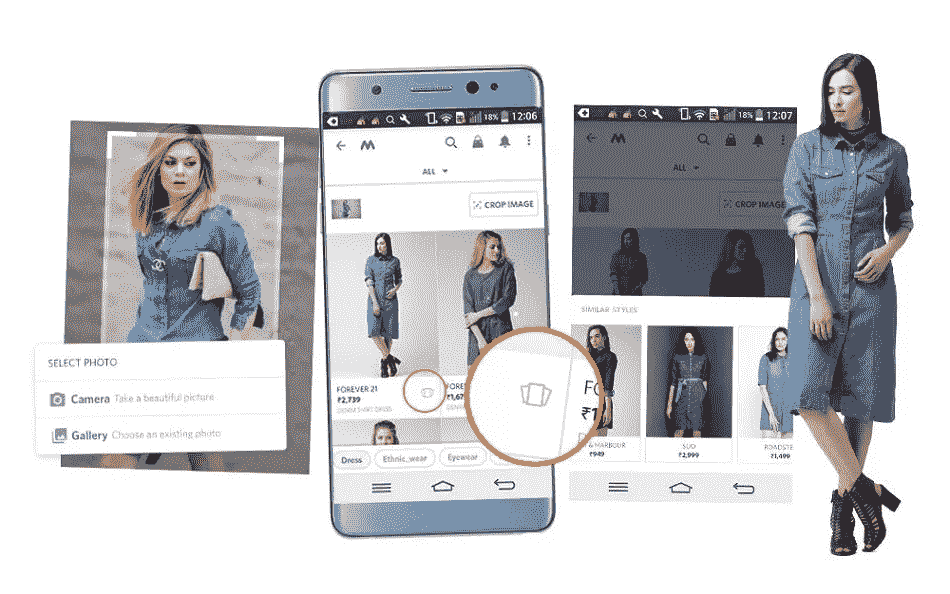
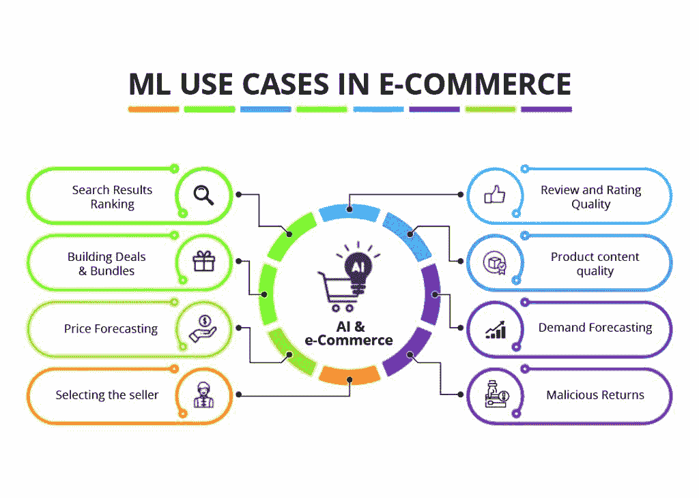
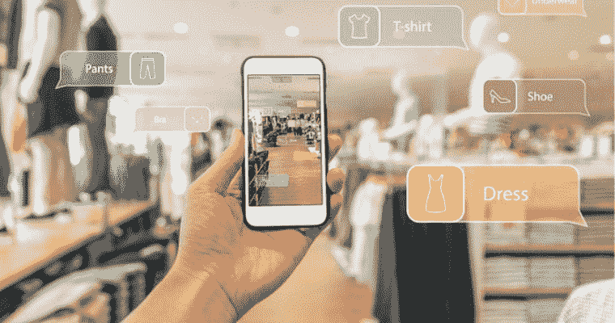

# 机器学习是如何革新网购体验的？

> 原文：<https://medium.com/geekculture/how-is-machine-learning-revolutionizing-online-shopping-experience-b41b43bcedb1?source=collection_archive---------9----------------------->

[Image source](https://www.mastermarketing-valencia.com/marketing-digital/blog/machine-learning-ecommerce/)

机器学习为网络搜索、图像识别、自动驾驶汽车和自然语言处理领域的许多最有效的解决方案提供了支持。

现在，它正在改变企业的经营方式，使它们能够以前所未有的速度更准确地预测客户的需求。

[Image source](https://dzone.com/articles/artificial-intelligence-in-e-commerce-benefits-sta)

亚马逊是一家在电子商务中利用机器学习的公司，它为你的模块提供建议，根据你在该网站上的购买历史，建议你可能想要购买的商品。

此外，其他品牌如 REI、沃尔玛和 Zappos 也实现了类似的功能。

**机器学习在电子商务中的意义**

每个电子商务企业都希望他们的客户再次回来购买，如果不是现在，那么在一个月内。每一次购买都是一次了解顾客在寻找什么，他们可能想要什么，以及他们为什么做出具体购买决定的机会。

通过电子商务中的机器学习，你可以分析你的客户在一段时间内购买了什么，以建立他们作为个人的档案，而不仅仅是作为具有一般特征的购物者。比如，买冬天外套的人也买沙滩巾吗？

这正是可以从分析电子商务大数据中获得的一种洞察力。如果顾客买了酒杯但没有买酒，那就是有价值的信息；没有电子商务中的机器学习，就没有办法知道。

数据分析为我们提供了对每位顾客的独特视角，根据之前购买的商品提出更好的建议。它还允许更多的个性化，所以买家觉得我们确实了解他们。

仅此一项就能带来更高的销售额；它鼓励回头客信任我们的品牌并建立积极的联系。

为了发挥 AI & ML 的最大潜力，请确保 [**雇佣在电子商务开发方面有丰富经验的机器学习开发者**](https://www.valuecoders.com/hire-developers/hire-machine-learning-experts?utm_source=Medium%28ML%29&utm_medium=ANU_B11&utm_id=MachineLearning) 。

**机器学习如何重塑客户体验？**

众所周知，电子商务正在蓬勃发展。在线购物的增长没有放缓的迹象，分析师预测到 2022 年复合年增长率在 5-8%之间。

如果你想在今天的市场上发大财，你必须找到新的方法来吸引客户并保持他们的忠诚度。一种改善客户体验的方法(CX)涉及使用机器学习(ML)。

***ML 算法使我们能够达到以前无法达到的个性化水平。***

此外，客户互动可以根据个人偏好和行为进行定制，这有助于减少客户流失，提高销售转化率。

让我们看看今天 ML 是如何通过人工智能个性化来增强 CX 的。

**个性化:**

个性化是提高参与度和增加转化率的最有力的工具之一。通过收集用户浏览历史、与我们的网站或移动应用程序的交互、电子邮件、社交媒体帐户等数据。

此外，ML 算法可以准确预测我们下一步可能购买的商品。

通过在网站上或应用程序中为每个用户显示个性化推荐，我们能够向他们提供他们感兴趣的产品&从而使他们更有可能重复访问。

[Image source](https://www.youtube.com/watch?v=iZko_YquwjU)

这项功能也可以作为交叉销售策略的一部分，在用户已经看过的产品的基础上，向用户展示替代或补充产品。

亚马逊通过将传统的交叉销售和个性化推荐整合到他们的产品页面中，取得了巨大的成功，增加了参与度，减少了弃车。

总之，每一个**人工智能开发公司**都收到大量咨询&需求，要求将人工智能&注入电子商务解决方案。你也必须考虑它，以提高您的电子商务销售。

**机器学习在电子商务中是如何工作的？**

购物习惯很少会彻底改变。需要一项新技术来影响人们的日常习惯。机器学习技术正在改变电子商务，并可能帮助你在零售销售中大获全胜。

以下是它是什么，以及它如何改变你的未来变得更好或更坏。

首先，让我们看看一些关于在线零售商的最新统计数据:

-> 72%的美国企业在线销售产品的年收入达到或超过 100 万美元。

-> 44%在网上搜索产品的美国消费者会购买产品。

- >74%的企业使用社交媒体营销。

-> 90%的智能手机用户每天都会访问脸书。

-> 46%的 Twitter daily 80%的 Pinterest daily 当看到他们喜欢的图片产品时，购买的可能性增加 11 倍。

-> 80%的人在网上购物时放弃了购物车。

这些是惊人的数字！！

有了这些数字，公司投入大量资金想方设法让顾客向他们购买就合情合理了。机器学习与所有这些有什么联系？

如果零售商希望影响他们的客户群，他们需要数据。凭借当今先进的统计数据，机器学习可以被公司用来预测人类行为，并有望推动购买。

**产品推荐**

零售商正在使用机器学习算法向客户推荐产品，并提高其电子商务网站的转化率。

消费者信任在线零售商，因为他们可以看到其他像他们一样的人购买了什么，特别是当涉及到电子产品或珠宝等高价商品时。

但是当进行大宗购买时，消费者希望确保他们购买的东西质量好，并得到以前买家的好评。一个算法没有这些担心。

[Image source](https://www.sailthru.com/marketing-blog/recommendation-algorithms-guide/)

如果你给出库存中每种产品的算法数据点，以及开心和不开心的客户的反馈，它可以在这些数据点中找到模式，提供建议。

如果你想到亚马逊根据你的购物历史向你推荐产品，或者网飞根据你看的电视节目向你推荐电视节目，所有这些建议都是由一种算法做出的。

如果你**聘请机器学习专家，**你也可以让你的电子商务解决方案具备如此强大的功能，这将自动扩大你的销售范围。

**图像识别的使用**

使用机器学习来改善在线购物意味着消费者可以获得更好的体验，零售商可以预测购买行为。

本文将探讨图像识别在当今电子商务中的应用，以及如何有效地利用它来改变多渠道的购物体验。

电子商务的发展带来了一个主要挑战:

*   为顾客提供越来越多的产品选择，这使得购物者很难决定他们想要什么。
*   数以百万计的产品唾手可得，很容易让他们感到不知所措。

为了解决这些问题，正在部署图像识别技术，为购物者提供更多个性化选择。

[Image source](https://scholarlyoa.com/image-recognition-in-e-commerce/)

这使得电子零售商能够根据过去的偏好定制产品，同时也为品牌和制造商提供了与消费者直接沟通的新方式。

为此，他们利用数字标牌或基于社交媒体或网站(如谷歌图片搜索)照片的定制弹出广告。

**跟踪客户搜索&通知**

未来就在眼前，它伴随着很多变化。由于我们有一个人工智能助手，像 Siri 或 Alexa，它们可以告诉我们所有我们需要知道的事情。这听起来很棒，但是在某个时候，你已经买完了所有的东西，现在你在找事情做。

当然，这些人工智能也可以帮助我们，并为我们提供一些有趣的选择。

这也有助于让我们的生活更轻松，因为我们少了一件需要担心的事情。只要坐下来享受生活，知道我们的人工智能会照顾一切。

说到电子商务，电子商务中的机器学习是什么意思？大多数人一想到网购就不会想到 AI；然而，现在情况变化很快。

当谈到机器学习及其对电子商务的影响时，不仅你的体验变得更好、更智能，而且公司也开始以不同的方式使用他们的数据。

***得益于机器学习算法，营销人员能够比以往任何时候都更加了解客户！！***

机器学习实现了智能预测，使公司能够通过为每个客户提供个性化建议来提高销售额。

因此，客户会收到更符合其需求和偏好的产品，从而改善每位客户的整体体验以及产品推荐。

你可以通过咨询专家 [**AI 开发公司**](https://www.valuecoders.com/ai-ml-development-services-company?utm_source=Medium%28AI%2FML%29&utm_medium=ANU_B11&utm_id=AI%2FML) 在电子商务应用程序开发方面拥有丰富的专业知识&来获得更多的见解。

[Image source](https://www.pinterest.com/pin/740138519988907764/)

**处理大量客户数据&来自推荐系统的洞察力**

许多网站和应用程序都使用推荐系统。例如，如果你在网上浏览服装。

这些系统会根据你之前看过的东西，根据是否有其他人也买过裙子，来预测你可能感兴趣的东西。

或者！即使是基于过去的购买行为和你的脸书赞或以前的谷歌搜索数据。

尽管它们并不完美(它们推荐了一些真正随机的东西)，但它们帮助我们更快更容易地做出决定。推荐引擎越好，我们就越少考虑我们的选择——这是一件好事。让

亚马逊推荐书籍；让网飞推荐电影。它可能会节省你的时间、精力和精力！你可以通过在他们的网站上留下诚实的评论来感谢他们。也可能不是。

尽管已经证明，无论零售商的产品或价格如何，顾客都会对与他们有过良好体验的零售商留下积极的评价。

所以，利用自动推荐——只是不要告诉任何人你自己没有发现令人惊讶的东西！

记住:用户几乎总是高估了收集到的关于他们的数据量，所以在使用这类程序时也要记住这一点。

机器学习将有助于整理这些数据，并提供对客户行为的深刻见解，从而帮助企业获得更多利润。如果实施正确，它真的可以物超所值！

我看到的第一个最常见的机器学习用例是当我们在谷歌搜索栏中键入查询或向 Siri/Cortana/Alexa 询问与网页/内容/文档相关的内容时，改善搜索结果。

随着时间的推移，积累了大量的数据来改进未来的请求。当算法必须区分各种类型的信息，并且只向你提供你所需要的信息时，机器学习就发挥作用了。

[Image source](https://www.retailcustomerexperience.com/blogs/why-the-in-store-shopping-experience-is-irreplaceabl/)

**量身定制的购物体验**

我们目前正处于电子商务发展的时期，零售比以往任何时候都更加重要。随着我们的设备能够实时收集和发送大量数据，商店需要变得聪明，如果他们想让我们从他们那里购买的话。

他们可以做到这一点的一种方法是采用人工智能(AI)技术，特别是机器学习(ML)，为客户提供量身定制的独特购物体验。

这个智能组织将部署人工智能进行销售预测、库存管理、趋势分析，以及针对营销活动和忠诚度计划的预测分析。

这将需要一个能够处理所有三种 ML 的 AI 平台:通过历史数据进行训练的监督 ML；用于聚类的无监督 ML；以及强化学习，允许机器从与人或其他机器的交互中学习。

这也需要先进的神经网络。简而言之，所有这些技术的结合可以使电子商务解决方案更好。但是，你需要从一个顶级的[**AI 开发公司**](https://www.valuecoders.com/ai-ml-development-services-company?utm_source=Medium%28AI%2FML%29&utm_medium=ANU_B11&utm_id=AI%2FML) **那里获得协助。**

**包装**

很明显，机器学习给电子商务领域带来了革命性的变化。通过使用机器学习算法，零售商现在可以跟踪客户的行为和偏好。

这有助于他们为顾客提供更好的购物体验。此外，图像识别通过提供相关产品推荐，在增强客户体验方面发挥着重要作用。

机器学习在电子商务中有如此多的优势，难怪这项技术在在线零售商中越来越受欢迎。

人工智能和机器学习正在改变电子商务的格局，带来革命性的购物体验。这有助于企业更好地了解他们的客户，并提供更个性化的体验，让顾客再次光顾。

你尝试过在你的电子商务业务中使用机器学习吗？如果没有，现在是时候开始了！联系一家拥有卓越创新历史的顶级人工智能开发公司。